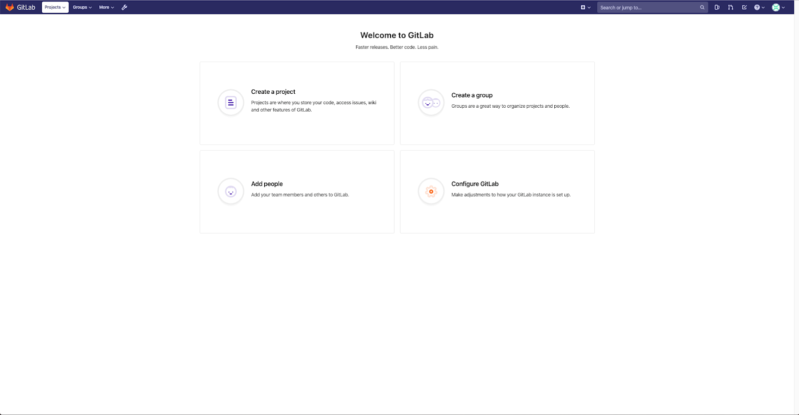
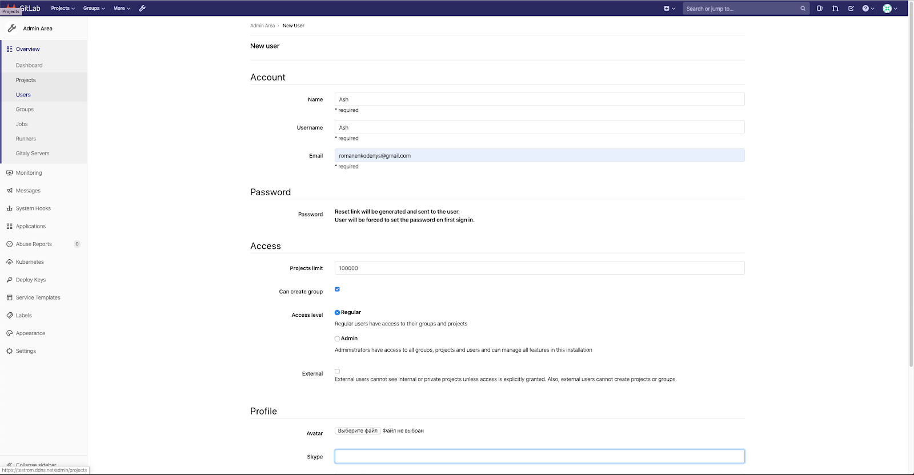
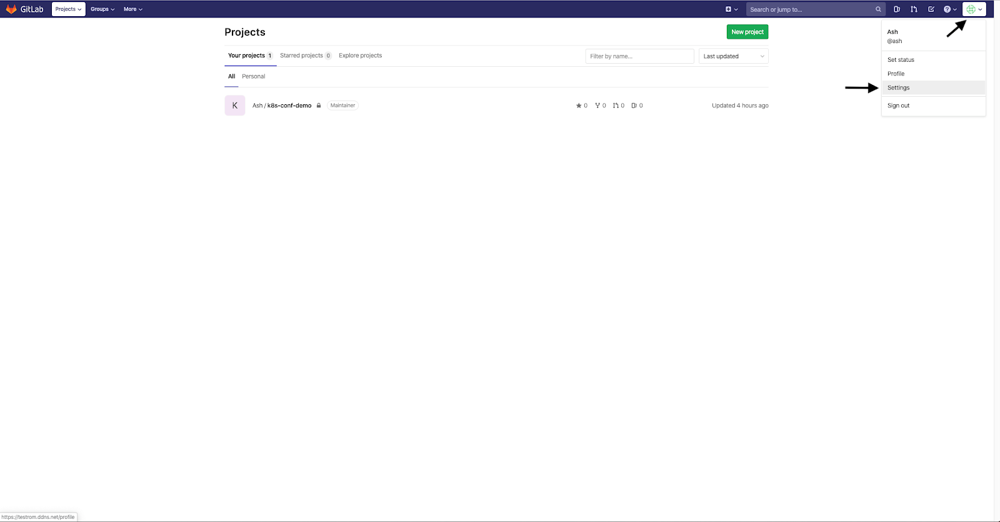
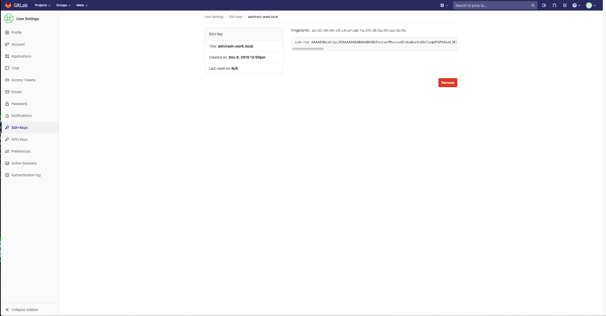

In this article, we will look at how to install and configure Gitlab.

After that you can:

- [Install and configure Harbor](/en/additionals/cases/cases-gitlab/case-harbor);
- [Configure application auto-deployment to Kubernetes cluster](/en/additionals/cases/cases-gitlab/case-k8s-app).

## Gitlab installation

Before installing Gitlab, [install and configure Docker](/en/additionals/cases/cases-docker-ce/docker-ce-u18).

To install Gitlab:

1. Assign a DNS name to the server that will be used to access Git in one of the following ways:

- If you have a domain for this, add your server to it.
- If you do not have a free domain, use, for example, the [NoIP](https://www.noip.com/) service, which provides dynamic DNS. To do this, register on the server, select a name and install the client on the server (read more [in the article of the NoIP service developer](https://www.noip.com/support/knowledgebase/installing-the-linux-dynamic-update-client/)).

2. Create a file `/root/docker-compose.yml` and add the following to it:

```
version: '3.7'
services:
gitlab:
container_name: gitlab
image: 'gitlab/gitlab-ce:latest'
restart: always
hostname: '<SERVER_DNS_NAME>'
environment:
GITLAB_OMNIBUS_CONFIG: |
external_url 'https://<SERVER_DNS_NAME>'
# Add any other gitlab.rb configuration here, each on its own line
ports:
- '80:80'
- '443:443'
- '22:22'
volumes:
- '/opt/gitlab/config:/etc/gitlab'
- '/opt/gitlab/logs:/var/log/gitlab'
- '/opt/gitlab/data:/var/opt/gitlab'

gitlab-runner:
container_name: gitlab-runner
image: gitlab/gitlab-runner:latest
restart: always
volumes:
- '/opt/gitlab-runner/data:/home/gitlab_ci_multi_runner/data'
- '/opt/gitlab-runner/config:/etc/gitlab-runner'
- '/var/run/docker.sock:/var/run/docker.sock:rw'
environment:
- CI_SERVER_URL=https://<SERVER_DNS_NAME>/ci
```

This file launches two images: for gitlab and for gitlab-runner (this is the build pipeline).

Please note that the container must be accessible from the external network on port 22, otherwise you will have to specify a non-standard port when accessing with the git command. Therefore, transfer the system ssh to a different port. To do this, open the file `/etc/ssh/sshd_config` and find the line:

```
#Port 22
```

If the line is commented out, uncomment it and change the port number, for example:

```
Port 35242
```

Restart sshd:

```
root@ubuntu-std3-2-4-40gb:/etc/ssh# service sshd restart
```

Make sure the service is listening on the new port:

```
root@ubuntu-std3-2-4-40gb:/etc/ssh# netstat -tulpn | grep 35242
tcp 0 0 0.0.0.0:35242 0.0.0.0:\* LISTEN 3625/sshd
tcp6 0 0 :::35242 3625/sshd
```

Log in to the new port. If you can't connect, check your Firewall settings.

3. Create the necessary directories for persistent storage gitlab:

```
root@ubuntu-std3-2-4-40gb:~# mkdir /opt/gitlab
root@ubuntu-std3-2-4-40gb:~# mkdir /opt/gitlab/config
root@ubuntu-std3-2-4-40gb:~# mkdir /opt/gitlab/logs
root@ubuntu-std3-2-4-40gb:~# mkdir /opt/gitlab/data
root@ubuntu-std3-2-4-40gb:~# mkdir /opt/gitlab-runner
root@ubuntu-std3-2-4-40gb:~# mkdir /opt/gitlab-runner/config
root@ubuntu-std3-2-4-40gb:~# mkdir /opt/gitlab-runner/data
```

4. Run docker-compose:

```
root@ubuntu-std3-2-4-40gb:~# docker-compose up -d
Creating network "root_default" with the default driver
Pulling gitlab (gitlab/gitlab-ce:latest)...
latest: Pulling from gitlab/gitlab-ce
976a760c94fc: Pull complete
c58992f3c37b: Pull complete
0ca0e5e7f12e: Pull complete
f2a274cc00ca: Pull complete
163f3071a3f8: Pull complete
d96d45e9c9e7: Pull complete
9a0f4e25d3a3: Pull complete
19aad3ea2a1d: Pull complete
fcafd8209320: Pull complete
3a4ea7fd547c: Pull complete
Digest: sha256:f5cb34c4d6bca26734dbce8889863d32c4ce0df02079b8c50bc4ac1dd89b53f4
Status: Downloaded newer image for gitlab/gitlab-ce:latest
Pulling gitlab-runner (gitlab/gitlab-runner:latest)...
latest: Pulling from gitlab/gitlab-runner
7ddbc47eeb70: Pull complete
c1bbdc448b72: Pull complete
8c3b70e39044: Pull complete
45d437916d57: Pull complete
59a312699ead: Pull complete
6562c5999ae2: Pull complete
368e9065e920: Pull complete
b92ce2befcc8: Pull complete
420f91b9ac4d: Pull complete
Digest: sha256:c40748978103959590474b81b72d58f0c240f010b4c229181aaf3132efdf4bd1
Status: Downloaded newer image for gitlab/gitlab-runner:latest
Creating gitlab-runner ... done
Creating gitlab ... done
```
The startup takes about 5 minutes, then the service is available via HTTP. Check the startup status:

```
root@ubuntu-std3-2-4-40gb:~# docker ps
Container IMage Command Creed Status Ports Names
bb20bc6cb7d5 . . . gitlab/gitlab-ce:latest . . . "/assets/wrapper" . ->443/tcp gitlab
a2209bb357e7 . . gitlab/gitlab-runner:latest . "/usr/bin/dumb-init ..." 10 minutes ago . Up 10 minutes . . . . . . git lab runner
```

## Set up Gitlab

1. Installing Gitlab generates self-signed certificates for HTTPS. Let's not use them, let's switch to LetsEncrypt certificates. To do this, open the file `/opt/gitlab/config/gitlab.rb` and change the following parameters to the specified form:

```
################################################### ################################
# Let's Encrypt integration
################################################### ################################
letsencrypt['enable'] = true
# letsencrypt['contact_emails'] = [] # This should be an array of email addresses to add as contacts
# letsencrypt['group'] = 'root'
# letsencrypt['key_size'] = 2048
# letsencrypt['owner'] = 'root'
# letsencrypt['wwwroot'] = '/var/opt/gitlab/nginx/www'
# See http://docs.gitlab.com/omnibus/settings/ssl.html#automatic-renewal for more on these settings
letsencrypt['auto_renew'] = true
letsencrypt['auto_renew_hour'] = 0
letsencrypt['auto_renew_minute'] = 15 # Should be a number or cron expression, if specified.
letsencrypt['auto_renew_day_of_month'] = "\*/7"

```

As a result, the use of LetsEncrypt will be allowed and certificate renewals will be checked once a week at 00:15.

2. Go to Docker and start reissuing certificates:

```
root@ubuntu-std3-2-4-40gb:~# docker exec -it gitlab bash
root@testrom:/# gitlab-ctl reconfigure
```

<info>

**Note**

At the time of writing, the LetsEncrypt certificate issuance mechanism was not working correctly due to changes in the LetsEncrypt API (for details, see cases [38255](https://gitlab.com/gitlab-org/gitlab/issues/38255) and [4900](https gitlab.com/gitlab-org/omnibus-gitlab/issues/4900)). To solve this problem, in the `/opt/gitlab/embedded/cookbooks/letsencrypt/resources/certificate.rb` file, comment out the `acme_certificate 'staging' do [...] end` section.

</info>

3. In the browser, in the search bar, enter the name of the Gitlab server and create an administrator (root) password:

****

Then login:



4. Go to the administrator zone and choose to create a new user:

****

5. Enter user parameters:



6. You will receive an email, follow the link and enter your password. Then log in as the new user.

## Project creation

To set up CI/CD, take the project from [Workshop How to Run Your Application on Kubernetes](https://www.youtube.com/watch?v=rBzgGmuBgo0).

Fork [repository](https://github.com/ssfilatov/k8s-conf-demo) to local Gitlab, then set up deployment and delivery for it.

For this:

1. Click Create a project:


2. Select Import Project, Repo by URL:


3. Enter the repository name, source repository URL, project slug and create a project:


4. After a while, the project will be imported:


5. Create an ssh key to access the repository via Git. To do this, on your workstation in the console, do the following:

```
ash-work:~ ssh-keygen -t rsa -f ~/.ssh/myrepo
Generating public/private rsa key pair.
Enter passphrase (empty for no passphrase):
Enter the same passphrase again:
Your identification has been saved in /Users/ash/.ssh/myrepo.
Your public key has been saved in /Users/ash/.ssh/myrepo.pub.
The key fingerprint is:
SHA256:icv9wRrYB9PqRH9/imp4F8VpL1RPkCENu4OIybDKJH0 ash@ash-work.local
The key's randomart image is:
+---[RSA 2048]----+
| ooo+ |
| oo o|
| . ..+.|
| . + + + . .\* .|
|. o E = S o o+ . |
| + o . \* \* ... .|
| o + \*.= .. . |
| o.=oo.o .|
| oooo. oo |
+----[SHA256]-----+
```

6. In your home directory in the .ssh folder, a pair of myrepo keys will be created: public and private. Upload the public key to Gitlab. For this:
1. Go to the Gitlab web interface, click on the icon in the upper right corner, and select Settings:

    ****

    2. Select SSH Keys:

    ****

    3. In the input field, paste the contents of the `myrepo.pub` file and click Add key:

    ****

    As a result, the key will be added:

    

Now with the private key you can access the repository. To make things easier, add the following section to `~/.ssh/config`:

```
host <SERVER_DNS_NAME>
HostName <SERVER_DNS_NAME>
IdentityFile ~/.ssh/myrepo
user git
```

Clone the repository locally:

```
ash-work:git git clone git@<SERVER_DNS_NAME>:ash/k8s-conf-demo.git

Cloning into "k8s-conf-demo"...

remote: Enumerating objects: 23, done.

remote: Counting objects: 100% (23/23), done.

remote: Compressing objects: 100% (23/23), done.

remote: Total 23 (delta 3), reused 0 (delta 0)

Object Receipt: 100% (23/23), 6.33 KiB | 6.33 MiB/s, done.

Change detection: 100% (3/3), done.
```

Now [install and configure the Harbor repository](/en/additionals/cases/cases-gitlab/case-harbor), which will contain the collected images.
