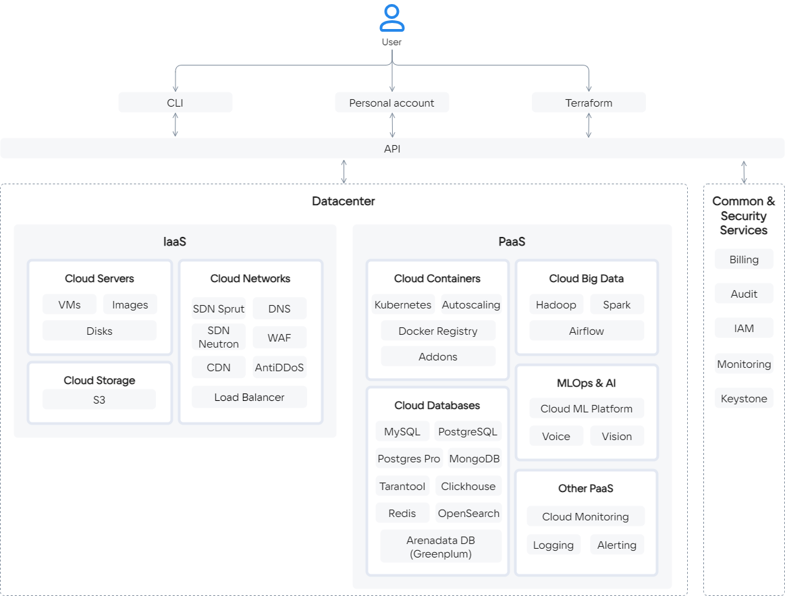

Virtualization, monitoring, container, and data storage services can be deployed in VK Cloud. The architecture is based on four groups of services:

- IaaS services are built on the basis of [OpenStack](https://www.openstack.org/software/) and components of its own design. Manage dynamic resource allocation, scaling, and fault tolerance. Hosted in the same cloud data center with PaaS services.

  

    
List of IaaS services

  
  - [Cloud Servers](/en/base/iaas) (IaaS Compute) — provides virtual machines with the ability to allocate public IP and unlimited traffic of 1 GBit/s (also [available](/en/ml/gpu) virtual machines with NVIDIA GPU). Responsible for virtualization and resource integration, uses the KVM hypervisor.
  - [Cloud Storage](/en/base/s3) (IaaS Storage) — provides S3-compatible object storage. The workload on the storage is distributed among all storage nodes. You can deploy a storage with a custom architecture.
  - [Cloud Networks](/en/networks/vnet) (IaaS Network) — provides network interaction within the selected [project](/en/base/account/concepts/projects) using SDN (Software Defined Network) technology. It operates on the basis of OpenStack Neutron and on the basis of proprietary software — Sprut. Includes components:

    - [DNS](/en/networks/dns) — supports public and private DNS, which provides name resolution for VK Cloud platform services.
    - [CDN](/en/networks/cdn) — organizes the transfer of content from your servers to users with minimal delay.
    - [Load Balancer](/en/networks/vnet/concepts/load-balancer) — distributes the load on the infrastructure, providing fault tolerance and flexible scaling of applications.
    - AntiDDoS — filters traffic coming to VK Cloud resources deployed in the project to block DDoS attacks.
    - WAF (Web Application Firewall) — configures incoming and outgoing traffic filtering rules to detect and block network attacks.

  

- PaaS services include open source solutions (Kubernetes) and solutions from technology partners. Built-in monitoring of VK Cloud services and individual entities is supported.

  

    
List of PaaS services

  
  - [Cloud Containers](/en/base/k8s) — allows you to create and manage Kubernetes clusters in which you can run services and applications.
  - [Cloud Databases](/en/dbs/dbaas) — provides scalable DBMS: MySQL, PostgreSQL, Postgres Pro, ClickHouse, MongoDB, Redis, Tarantool, OpenSearch, Arenadata DB based on Greenplum.
  - [Cloud Big Data](/en/bigdata/hortonworks) — used for big data analysis based on Arenadata Hadoop, supports scaling.
  - [Cloud Streams](/en/bigdata/cloud-streams) — provides Arenadata Streaming-based clusters for processing streaming data.
  - [Cloud ML Platform](/en/ml/mlplatform) — supports services for a full ML development cycle.
  - [Cloud Voice](/en/ml/cloud-voice) — provides a REST API for speech recognition and synthesis based on machine learning.
  - [Vision](/ru/ml/vision) — provides a REST API for face and object recognition based on machine learning.
  - [Cloud Alerting](/en/manage/alerting) —  configures notifications about changes in key metrics of VK Cloud services.
  - [Cloud Logging](/en/manage/logging) — aggregates and analyzes service logs in VK Cloud.
  - Monitoring — provides monitoring of metrics specific to PaaS services, for example, analytics on K8s container feeds, PostgreSQL DBMS transaction statistics.
  - Additional services:

    - [1C:Ready workplace](/en/additionals/special/1cgrm) — provides resources and software for the deployment of 1C services: Accounting, Salary and Personnel Management, Management of our company.
    - [Marketplace](/ru/additionals/mp) — allows you to quickly deploy web development and administration environments based on virtual machines.

  

- Common&Security-services ensure the safe operation of users and support a role model when using VK Cloud resources.

  

    
List of Common&Security Services

  - [Billing](/en/additionals/billing) — keeps records of resource usage and expense control, generates financial reports, provides interaction with payment systems when paying for services.
  - Audit — generates an audit log of user actions in VK Cloud.
  - IAM — manages authentication and authorization of users and services in conjunction with Keystone.
  - [Cloud Monitoring](/en/manage/monitoring) — provides monitoring of cloud services and user applications.
  - Keystone — provides API client authentication, service discovery, and distributed multi-tenant authorization.
  
  

VK Cloud provides [technical support](/en/additionals/start/support/support-info) for its services. Partner solutions (for example, AntiDDoS, WAF) are supported jointly with a partner.

The general scheme of VK Cloud components and services is shown below.

Cloud services are managed using the API. Users interact with the API through one or more [tools](/en/manage/tools-for-using-services):

- VK Cloud personal account;
- OpenStack CLI;
- Terraform with a separate provider.

## Fault tolerance

Physical fault tolerance is implemented by placing VK Cloud in two Tier III reliability level data centers in the Russian Federation. With this placement, it is guaranteed to maintain the SLA of data centers of more than 98% with a total [SLA](../support/sla/) of 99.95%.

Network fault tolerance is provided by communication of data centers with routes with a bandwidth of 200 GB/sec. Communication of each server with backbone providers goes through two independent channels, through two routers.

Logical fault tolerance is implemented using availability zones, which are combined into [regions](/en/base/account/concepts/regions).

<info>

The status of the availability zones, services and infrastructure of VK Cloud can be checked on the [services page status page](https://status.mcs.mail.ru).

</info>

### Availability zones

Each availability zone has one or more data processing centers (data centers) where cloud infrastructure objects are physically located. In VK Cloud, the availability zone corresponds to a separate Tier III data center. VK Cloud provides availability zones:

- `GZ1`: includes a data center [Goznak](https://tech.goznak.ru/dc-goznak-moscow);

  The address of the data center: Moscow, Mira avenue, 105, building 6.

- `MS1`: includes a data center [DataLine NORD4](https://www.dtln.ru/tsod-nord);

  The address of the data center: Moscow, Korovinskoe highway, 41.

  In the availability zone `MS1`, the VK Cloud infrastructure is [protected](https://mcs.mail.ru/cloud-platform/certificates/) in accordance with the Federal Law of the Russian Federation “On Personal Data” No. 152-FZ.

- `QAZ`: includes a data center [QazCloud](https://qazcloud.kz/).

  The address of the data center: Republic of Kazakhstan, Akmola region, Kosshy, Republic str. 1.

Each data center is equipped with independent power supply and cooling systems.

The availability zones `GZ1` and `MS1` are connected using a redundant dedicated high-bandwidth and low-latency fiber network for high data transfer rates between zones.

## Security

VK Cloud security is ensured by constant monitoring of VK Cloud services, conducting external audits. VK Cloud participates in the security audit program [HackerOne](https://www.hackerone.com). Infrastructure [certified](https://mcs.mail.ru/cloud-platform/certificates/) FSTEC of Russia for working with personal data.

For more information, see the section [Platform security](../it-security/).

## Migration to VK Cloud

VK Cloud supports migration using [third-party software](/en/additionals/migration) or [platform tools](/en/additionals/migration/migrate-hystax). The transfer of virtual resources is cheaper due to the implementation of services based on OSS (Open Source Solutions).
