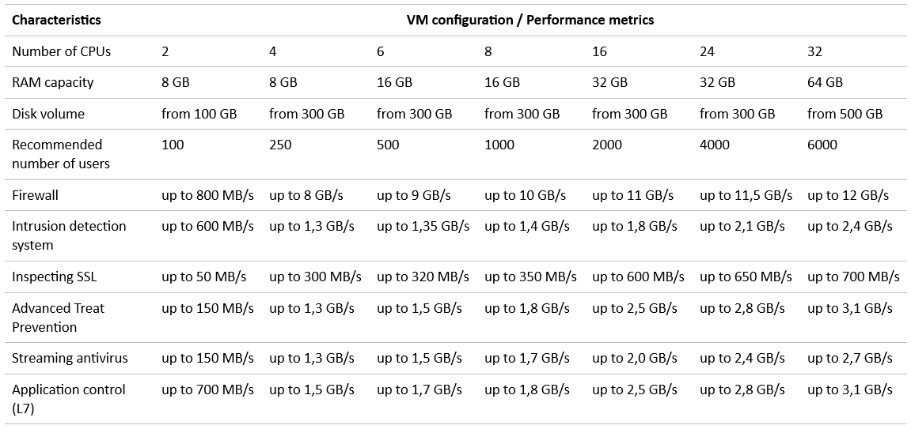

You can configure a firewall to protect your infrastructure from network attacks using the [UserGate NGFW](https://msk.cloud.vk.com/app/services/marketplace/v2/apps/service/e27c25f9-49db-4ba7-9789-6395b96b39c9/latest/info/) service. Its features:

- protection against attacks;
- traffic management;
- users authentication;
- blocking malicious content when browsing external Internet resources.

    
Recommended server specifications for the service

To create a VM that has more than 24 CPUs, contact [technical support](/en/contacts).

This instruction will help you deploy the UserGate NGFW service on a VM in VK Cloud, connect to the UserGate NGFW console and add a new network through the service console.

By using the UserGate NGFW service, you agree to the license agreements of [Marketplace](/en/additionals/start/legal/marketplace) and [UserGate](https://www.usergate.com/usergate-eula).

<warn>

UserGate NGFW is provided according to the BYOL (Bring Your Own License) model: purchase a [license](https://www.usergate.com/purchase) yourself to use the service.

</warn>

## Preparatory steps

1. [Register](/en/additionals/start/account-registration) at VK Cloud.
1. [Create](/en/networks/vnet/operations/manage-net#creating_a_network) a network with the Internet access, if one has not already been created.
1. In the [settings of the subnet](/en/networks/vnet/operations/manage-net#editing_a_subnet) where the VM with the deployed service will be located, disable the **Private DNS** option.
1. [Deploy](../../service-management/pr-instance-add/) the UserGate NGFW service:

   - Select the previously created network with Internet access and subnet.
   - Choose other parameters at your discretion.

   After the installation is complete, you will receive a one-time link to your login and password by email. Write them down. The service will be deployed at an address like `https://<external IP address of the VM>:8001` (the UserGate console).

1. (Optional) Configure an intermediate server (jump host) for the service VM to increase operational security.

## 1. Add a network to the service

<info>

By default, UserGate NGFW is created with a single network to connect to the MGMT port.

</info>

1. Go to the UserGate console directly via the IP of the virtual machine or through the intermediate server.
1. At the language selection step, specify **English**.
1. At the time zone selection step, specify **Europe/Moscow**.
1. Read and accept the terms of the [license agreement](https://www.usergate.com/usergate-eula).
1. At the step of installing the first node, specify the login and password received after deploying the service.
1. Click the **Start** button.

   The UserGate console dashboard will open.

1. Go to **Settings** → **Network** → **Interfaces**. Make sure that there is one network adapter in the **Current node** group (the network selected during the service deployment stage).
1. [Go to](https://msk.cloud.vk.com/app/en/) your personal account at VK Cloud.
1. Go to **Cloud Servers** → **Virtual**.
1. Open the page of the service VM (usually `<identifier>usergate`) by clicking on its name in the list.
1. Go to the **Networks** tab.
1. [Connect](/en/base/iaas/instructions/vm/vm-add-net#connecting_the_network_to_the_vm) the required network to the VM.
1. Reboot the VM [using VK Cloud](/en/base/iaas/instructions/vm/vm-manage#starting_stopping_reboot_the_vm) or via the [UserGate console](https://support.usergate.com/docs/version/7.x/usergate-7/422-server-operations).

## 2. Check for the added network

1. Go to the UserGate console directly via the IP of the virtual machine or through the intermediate server.
1. Go to **Settings** → **Network** → **Interfaces**.
1. Make sure that the new network adapter has appeared in the **Current node** group. It will be inactive.

For advanced service configuration, use the official [UserGate NGFW](https://support.usergate.com/docs/version/7.x/usergate-7) manual.

<info>

Recommendations for working with the service:

- When configuring the network interface, use static addressing: the IP address must match the address assigned to the VM port. You can see the address on the **Networks** tab of the VM page.
- If you are connecting to the [external network](/en/networks/vnet/concepts/net-types#external_network), manually configure the IP addresses in the UserGate console. Use the network details from the section **Cloud networks** → **Networks**.

</info>

## Delete unused resources

The running service infrastructure consumes computing resources. If you no longer need it:

- [Delete](../../service-management/pr-instance-manage#deleting_a_service_instance) the UserGate NGFW service instance.
- [Delete](/en/networks/vnet/operations/manage-net#deleting_a_network) the network used for the service.
- [Delete](/en/networks/vnet/operations/manage-floating-ip#removing_floating_ip_address_from_the_project) the floating IP address created during service deployment.
