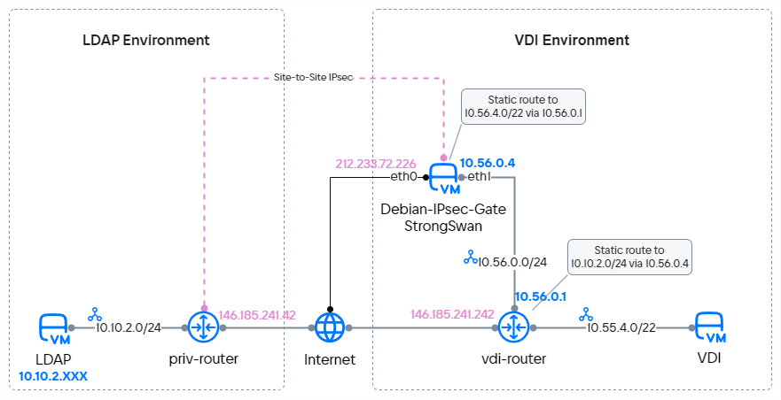

To organize a VPN tunnel based on VK Cloud, you need to specify one or more existing subnets located behind the router.
This does not allow you to configure a VPN connection for VDI, since subnets for VDI are created dynamically in a predefined address space. For successful integration with a VDI environment, a VPN tunnel can be organized using a dedicated VPN server based on an IaaS VM (virtual machine). This will allow you to organize secure connectivity up to the CIDR specified in the VDI settings.

To show how to configure a secure connection with virtual desktops:

- A VPN tunnel will be created between the LDAP environment and the VDI environment in VK Cloud.
- On the LDAP side, the built-in VK Cloud VPN service will be used as a VPN solution. In a real-life scenario, you can use any hardware or software with the ability to create a VPN connection using IPsec Site-2-Site technology.
- On the VDI side, a VM based on Debian 11 OS and additional strongSwan packages will be used as a VPN solution.
- A transit network will be created that will connect the Debian 11-based VPN gateway to the platform router, behind which VDI networks will be formed.
- To simulate VDI, a network with a VM will be added. The VM will ping the LDAP server to check network connectivity.

## Preparation steps

1. Make sure the OpenStack client is [installed](/en/tools-for-using-services/cli/openstack-cli#1_install_the_openstack_client) and [authenticate](/en/tools-for-using-services/cli/openstack-cli#3_complete_authentication) in the project.

1. Create an LDAP environment:

    1. Select or [create](/en/networks/vnet/service-management/net#creating_a_network) a virtual network with the Internet access in VK Cloud. Use an existing router with a connection to an external network or [create](/en/networks/vnet/service-management/router#adding_a_router) a new one.

        Write down the following:

        - The subnet IP address.
        - The router name and IP address.

    1. Create a [virtual machine](/en/base/iaas/service-management/vm/vm-create) running Windows Server 2019 on the selected network.

         Write down the name and IP address of the VM.

1. Create a VDI environment:

    1. In VK Cloud, select or [create](/en/networks/vnet/service-management/net#creating_a_network) a virtual network with the Internet access, which will serve as a transit network. Use an existing router with a connection to an external network or [create](/en/networks/vnet/service-management/router#adding_a_router) a new one.

        Write down the following:

        - The subnet IP address.
        - The router name and IP address.

    1. Pre-allocate a CIDR for the network simulating VDI. CIDR will be used to configure the VDI environment.

        Write down the subnet IP address (CIDR).

1. [Create a virtual machine](/en/base/iaas/service-management/vm/vm-create) connected to the external network `ext-net`. This will allow you to avoid using a floating IP address during further configuration.

    The VM parameters:

    - OS: Debian 11;
    - Recommended VM type: `STD3-2-4`.

    Write down the subnet name and IP address.

1. Update the OS on the Debian VM:

    1. [Connect](/en/base/iaas/service-management/vm/vm-connect/vm-connect-nix) to the `Debian-IPsec-Gate` virtual machine via SSH and get root user rights (`sudo bash` command).

    1. Update the OS before further setup:

        ```bash
        apt update && apt upgrade -y
        ```

    1. Reboot the VM using the `reboot` command.

1. Make sure that you have collected all the information necessary for further work.

    The following data is used in the case:

    - AD/LDAP environment:

        - Subnet IP address: `10.10.2.0/24`;
        - Router name and IP address: `priv-router`, `146.185.241.42`;
        - AD/LDAP server name and IP address: `LDAP`, `10.10.2.14`.

    - VDI environment:

        - Subnet IP address: `10.56.0.0/24`;
        - Subnet IP address for VDI (CIDR): `10.55.4.0/22`;
        - Router name and IP address: `vdi-router`, `146.185.241.242`.

    - Name and IP address of the virtual machine on the external network: `Debian-IPsec-Gate`, `212.233.72.226`.

Scheme of preliminary preparation of networks:


## 1. Set up a VPN tunnel on the AD/LDAP side

In your personal account [create a VPN](/en/networks/vnet/service-management/vpn) with the following parameters:

1. At the “IKE Configuration” step, specify the algorithms for the primary IPsec connection:

    - **IKE-policy**:	`New IKE-policy`;
    - **Policy name**:	`d11-gate-ike`;
    - **Key lifetime**: `28800`;
    - **Authorization algorithm**:	`sha256`;
    - **Encryption algorithm**:	`aes-256`;
    - **IKE version**: `v2`;
    - **Diffie-Hellman group**: `group14`.

1. At the “Configure IPsec” step, specify algorithms to protect payload traffic between nodes:

    - **IPsec Policy**:	`New IPsec-policy`;
    - **Policy name**:	`d11-gate-ike`;
    - **Key lifetime**: `28800`;
    - **Authorization algorithm**:	`sha256`;
    - **Encryption algorithm**:	`aes-256`;
    - **IKE version**: `v2`;
    - **Diffie-Hellman group**: `group14`.

1. At the “Creating Endpoint Groups” step, specify the networks the traffic between which will be protected by VPN:

    - **Router**: `priv-router`;
    - **Local Endpoint**: `New endpoint group`;
    - **Name**:	`d11-tunnel-local-acl`;
    - **Subnets**: `priv_subnet_demo (10.10.2.0/24)`;
    - **Remote Endpoint**: `New endpoint group`;
    - **Group name**: `d11-tunnel-remote-acl`;
    - **Subnet address**: `10.55.4.0/22`.

1. At the “Configure a tunnel” step, specify the address of the remote gateway with which the IPsec connection will be established and the pre-shared key (PSK):

    - **Settings**: `Advanced`;
    - **Tunnel name**: `d11-ipsec-tun`;
    - **Peer IP**: `212.233.72.226`;
    - **Pre-sared key (PSK)**: click the **Generate** button or enter the key;
    - **Peer ID**: `212.233.72.226`;
    - **Initiator state**:	`bi-directional`;
    - **When a peer is unavailable**: `restart`;
    - **Peer unreachable detection interval**: 15 seconds;
    - **Time to detect peer unavailability**: 60 seconds.

## 2. Connect an additional network interface to the Debian VM

To configure a VPN tunnel on the side of the VDI environment, add an extra network interface for the Debian server to the `vdi-transit-vsubnet` subnet and assign the `10.56.0.4` address to it:

1. In [your personal account](https://cloud.vk.com/app/en/) go to the **Cloud computing** section → **Virtual machines**.
1. Select the `Debian-IPsec-Gate` VM and go to the **Networks** tab.
1. Click the **Add connection** button.
1. Specify the following connection settings:

    - **Name**: `vdi-transit`;
    - **Network for connect**:	`vdi-transit-vsubnet`;
    - **DNS-имя**:	`debian-ipsec-gate`;
    - **Set IP-address**: turn on the option;
    - **IP address**:	`10.56.0.4`;
    - **Firewall settings**: clear all the rules.
1. Click the **Save** button.

## 3. Configure an additional network interface in a Debian VM

1. [Connect](/en/base/iaas/service-management/vm/vm-connect/vm-connect-nix) to the `Debian-IPsec-Gate` virtual machine via SSH and get root user rights (`sudo bash` command) .
1. Create the `eth1` file using the command:

    ```bash
    vim /etc/network/interfaces.d/eth1
    ```

1. Add the following to the created file:

    ```bash
    auto eth1
    iface eth1 inet static
    address 10.56.0.4/24
    mtu 1500
    post-up ip route add 10.55.4.0/22 via 10.56.0.1 || true
    pre-down ip route del 10.55.4.0/22 via 10.56.0.1 || true
    ```

    <info>

    The `post-up` и `pre-down` commands automate the route management to the future VDI network when connecting and disconnecting the `eth1` interface.

    </info>

1. Run the command to apply the new network settings:

    ```bash
    systemctl restart networking
    ```

1. Check that the `eth1` interface is configured correctly:

   ```bash
   ip a | grep 10.56
   ```

   The interface is configured correctly if the response is returned:

   ```bash
   inet 10.56.0.4/24 brd 10.56.0.7 scope global eth1
   ```
1. Check that the route to the `10.55.4.0/22` network is configured correctly:

   ```bash
   ip r | grep 10.55
   ```

   The route to the future VDI network is correct and is added automatically if the response is returned:

   ```bash
   10.55.4.0/22 via 10.56.0.1 dev eth1
   ```

## 4. Disable Port Security on the port towards the transit network

Disable IP Source Guard on the VPN gateway port so it can forward any traffic:

1. Open a new terminal session and run the command:

    ```bash
    openstack port list --server Debian-IPsec-Gate
    ```

    The response will return a list of `Debian-IPsec-Gate` ports. Find the port facing the transit network:

    ```bash
    +--------------------------------------+-------------+-------------------+-------------------------------------------------------------------------------+--------+
    | ID                                   | Name        | MAC Address       | Fixed IP Addresses                                                            | Status |
    +--------------------------------------+-------------+-------------------+-------------------------------------------------------------------------------+--------+
    | 4d75dafe-d562-462a-afe9-31ede945a196 |             | fa:16:3e:34:e1:3a | ip_address='212.233.72.226', subnet_id='9ec13002-fb52-4e00-ac69-84d86a75d807' | ACTIVE |
    | f00c7678-47c0-4d88-9be2-b5592de9112f | vdi-transit | fa:16:3e:fe:e2:26 | ip_address='10.56.0.4', subnet_id='2f50371c-4e91-4f05-aff1-33bef1388fdf'      | ACTIVE |
    +--------------------------------------+-------------+-------------------+-------------------------------------------------------------------------------+--------+
    ```

1. Turn off Port Security:

    ```bash
    openstack port set --disable-port-security f00c7678-47c0-4d88-9be2-b5592de9112f
    ```

## 5. Enable packet forwarding to the VM

Enable IP Forwarding so that the virtual machine can route traffic from the transit network to the VPN tunnel:

1. Open a terminal session with the connected `Debian-IPsec-Gate` VM.

1. Run the command:

    ```bash
    echo 'net.ipv4.ip_forward = 1' | sudo tee -a /etc/sysctl.conf
    ```

1. Run the command to apply the settings without rebooting the OS:

    ```bash
    sysctl -p
    ```

1. Check that the settings are applied:

    ```bash
    cat /proc/sys/net/ipv4/ip_forward
    ```

    If the response returns `1`, packet forwarding is enabled.

## 6. Install packages to configure a VPN tunnel on the Debian VM side

1. Run the command:

    ```bash
    apt install vim strongswan strongswan-swanctl iptables iptables-persistent netfilter-persistent conntrack bmon -y
    ```

    The `iptables-persistent` package will be used to write the configuration of the active `iptables` rules to a file and load a list of rules for processing traffic when the OS is restarted.

1. Enable automatic launch of the `strongswan` and `netfilter` services:

    ```bash
    systemctl enable strongswan-starter
    systemctl start strongswan-starter
    systemctl enable netfilter-persistent
    ```

## 7. Add IPsec configuration and automate its launch

1. Create a `swanctl` configuration file to configure the VPN connection:

    ```bash
    vim /etc/swanctl/conf.d/vkcloud.conf
    ```

1. Add the following content to the `swanctl` file:

    ```bash
    connections {
        vkcloud-ikev2 {
            remote_addrs = 146.185.241.42
            local_addrs = 212.233.72.226
            version = 2
            proposals = aes256-sha256-modp2048
            dpd_delay = 15s
            dpd_timeout = 60
            rekey_time = 28800s
            local-1 {
                auth = psk
                id = 212.233.72.226
            }
            remote-1 {
                auth = psk
                id = 146.185.241.42
            }
            children {
                vkcloud-sa {
                    mode = tunnel
                    local_ts = 10.55.4.0/22
                    remote_ts = 10.10.2.0/24
                    esp_proposals = aes256-sha256-modp2048
                    dpd_action = restart
                    rekey_time = 14400s
                    start_action = start
                }
            }
        }
    }
    secrets {
        ike-vkcloud {
            id = 146.185.241.42
            secret = <PSK_Secret>
        }
    }
    ```

    Here `<PSK_Secret>` is the pre-shared key (PSK) created earlier.

1. Automate the launch of a VPN connection when the OS is rebooted:

    1. Run the command:

        ```bash
        vim /etc/strongswan.d/charon.conf
        ```

    1. Find the line `# Section containing a list of scripts` and add the `swanctl` configuration command to it:

        ```bash
        start-scripts {
            swanctl = /usr/sbin/swanctl --load-all
        }
        ```

## 8. Start IPsec and check the status of the VPN tunnel

1. Run the command to apply the new configuration settings and start the VPN connection:

    ```bash
    swanctl --load-all
    ```

1. Check the loading of the VPN connection configuration:

    ```bash
    swanctl --list-conns
    ```

    Expected response:

    ```bash
    vkcloud-ikev2: IKEv2, no reauthentication, rekeying every 28800s, dpd delay 15s
    local:  212.233.72.226
    remote: 146.185.241.42
    local pre-shared key authentication:
        id: 212.233.72.226
    remote pre-shared key authentication:
        id: 146.185.241.42
    vkcloud-sa: TUNNEL, rekeying every 14400s, dpd action is restart
        local:  10.55.4.0/22
        remote: 10.10.2.0/24
    ```

1. Check the IKE/SA tunnel settings:

    ```bash
    swanctl --list-sas
    ```

    Expected response:

    ```bash
    vkcloud-ikev2: #1, ESTABLISHED, IKEv2, e462fc2edaae6649_i* e9f38c18ddd4f0ef_r
    local  '212.233.72.226' @ 212.233.72.226[4500]
    remote '146.185.241.42' @ 146.185.241.42[4500]
    AES_CBC-256/HMAC_SHA2_256_128/PRF_HMAC_SHA2_256/MODP_2048
    established 3053s ago, rekeying in 23290s, reauth in 22543s
    vkcloud-sa: #1, reqid 1, INSTALLED, TUNNEL, ESP:AES_CBC-256/HMAC_SHA2_256_128
        installed 3053s ago, rekeying in 10951s, expires in 12787s
        in  ca12c3fa,      0 bytes,     0 packets
        out cce2ec61,      0 bytes,     0 packets
        local  10.55.4.0/22
        remote 10.10.2.0/24
    ```

## 9. Set up iptables rules

To ensure traffic passes correctly through the VPN tunnel, add a number of settings to the `iptables` chains:

1. For correct working of IPsec VPN tunnel, create a rule to exclude targeted traffic (from Source to Destination). Place the rule in the NAT Postrouting chain before the rule that imposes PAT translation when sending traffic to the Internet.

    Add the rule to the NAT table:

    ```bash
    iptables -t nat -A POSTROUTING -s 10.55.4.0/22 -d 10.10.2.0/24 -j ACCEPT
    ```

1. To prevent data packet fragmentation, optimize TCP MSS. To do this, add rules to the FORWARD chains. The MSS (Maximum Segment Size) value is selected based on the individual characteristics of each tunnel and the Internet connection.

    Add the rules to the MANGLE table:

    ```bash
    iptables -t mangle -A FORWARD -s 10.10.2.0/24 -d 10.55.4.0/22 -p tcp -m tcp --tcp-flags SYN,RST SYN -m tcpmss --mss 1321:65495 -j TCPMSS --set-mss 1320
    iptables -t mangle -A FORWARD -s 10.55.4.0/22 -d 10.10.2.0/24 -p tcp -m tcp --tcp-flags SYN,RST SYN -m tcpmss --mss 1321:65495 -j TCPMSS --set-mss 1320
    ```

1. Save settings:

    ```bash
    service netfilter-persistent save
    ```

## 10. Configure a static route from a VDI environment to AD/LDAP

1. In [your personal account](https://cloud.vk.com/app/en/) go to the **Virtual networks** section → **Routers**.
1. Select the `vdi-router` router and go to the **Static routes** tab.
1. Click the **Add static route** button.
1. Specify the route parameters:

    - **Destination network (CIDR)**: `10.10.2.0/24`;
    - **Intermediate node (Next HOP)**: `10.56.0.4`.

    <info>

    The Next HOP IP is the IP address of the internal network interface with a connection to the transit network of the VM running Debian 11.

    </info>

1. Click the **Add route** button.

## 11. Check if VDI is able to connect to LDAP

1. [Create](/en/networks/vnet/service-management/net#creating_a_network) a virtual network with CIDR `10.55.4.0/22` and router `vdi-router`. This network simulates a VDI network and is needed to test the network connection. When you deploy VDI, this network is created automatically.

1. Create a test [virtual machine](/en/base/iaas/service-management/vm/vm-create) on the `10.55.4.0/22` network and connect to it via SSH.

1. Ping the LDAP server:

    ```bash
    ping 10.10.2.14
    ```

    IP address must respond.

Scheme of the built interaction between networks and machines within networks:



## Delete unused resources

If you no longer need the created resources, delete them:

1. [Delete](/en/base/iaas/service-management/vm/vm-manage#deleting_a_vm) the virtual machines.
1. [Delete](/en/networks/vnet/service-management/vpn#removing_a_vpn_tunnel) the VPN tunnel.
1. [Delete](/en/networks/vnet/service-management/router#removing_the_router) the routers.
1. Delete the [subnet](/en/networks/vnet/service-management/net#deleting_a_subnet) and the [network](/en/networks/vnet/service-management/net#deleting_a_network) in which the VM is located.
