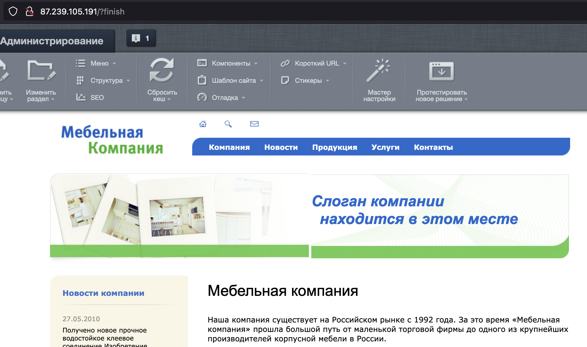

[1C-Bitrix: Site Management](https://www.1c-bitrix.ru/products/cms/) is a professional Internet resource management system with which you can create and maintain information portals, online stores and corporate websites.

This instruction will help you deploy 1C-Bitrix: Site management of the latest version in the Ubuntu 22.04 operating system in VK Cloud, as well as configure a DNS record for domain name access. MySQL 8.0 Single configuration is used as a DBMS.

## Preparatory steps

1. [Register](/en/intro/start/account-registration) at VK Cloud.
1. [Create](/en/networks/vnet/service-management/net#creating_network) `network1` network with internet access and a subnet with the address `10.0.0.0/24`.
1. [Create VM](/en/computing/iaas/service-management/vm/vm-create):

   - name: `Ubuntu_22_04_Bitrix`;
   - operating system: Ubuntu 22.04;
   - network: `network1` with subnet `10.0.0.0/24`;
   - assign a public IP address. The example will use `87.239.105.191`;
   - security groups (firewall settings): `default`, `ssh+www`.

1. [Create DB instance](/en/dbs/dbaas/service-management/create):

   - name: `MySQL-1111`;
   - DBMS: MySQL 8.0;
   - configuration type: Single;
   - network: `network1`;
   - DB name: `MySQL-1111`;
   - DB username: `user`;
   - DB password: `AN0r25e0ae4d626p`;

   In the example, the internal IP of the created instance: `10.0.0.7`.

1. [Create](/en/networks/dns/publicdns#creating_a_zone) DNS zone.

   <warn>

   Make sure that the DNS zone is delegated successfully and the NS records are configured correctly: the zone must have the status **NS records are configured correctly**.

   </warn>

1. [Create](/en/networks/dns/publicdns#adding_resource_records) an record in the selected zone:

   - record type: `A`;
   - name: for example, `site-bitrix.example.vk.cloud`;
   - IP address: external VM address `87.239.105.191`.

1. (Optional) Check the name resolution to the IP address using the command `nslookup site-bitrix.example.vk.cloud`. Output upon successful operation:

   ```bash
   Non-authoritative answer:
   Name:   site-bitrix.example.vk.cloud
   Address: 87.239.105.191
   ```

## 2. Install Bitrix on VM

1. [Connect](/en/computing/iaas/service-management/vm/vm-connect/vm-connect-nix) to the `Ubuntu_22_04_Bitrix` VM.
1. Update the packages to the current version and reboot the VM using the commands:

   ```bash
   sudo dnf update -y
   sudo apt upgrade -y
   sudo systemctl reboot
   ```

1. Install the necessary packages for CMS Bitrix:

   ```bash
   sudo apt install apache2 apache2-utils libapache2-mod-php php8.1 php8.1-cli php8.1-curl php8.1-fpm php8.1-gd php8.1-intl php8.1-mbstring php8.1-mysql php8.1-opcache php8.1-readline php8.1-soap php8.1-xml php8.1-xmlrpc php8.1-zip php-gd -y
   ```

1. Find the file `/etc/php/8.1/apache2/php.ini`, uncomment and change the parameters in it:

   ```txt
   short_open_tag = On

   opcache.revalidate_freq = 0

   date.timezone = Europe/Moscow
   ```

1. Find the file `/etc/apache2/sites-available/000-default.conf` and add a fragment to it after `DocumentRoot /var/www/html` block:

   ```txt
   <Directory /var/www/html>
     AllowOverride All
   </Directory>
   ```

1. Check the web server configuration for syntax errors:

   ```bash
   apachectl configtest
   ```

   If the check is successful, a message like `Syntax OK` will appear.

1. Restart the web server with the command:

   ```bash
   sudo systemctl restart apache2
   ```

1. Download the CMS Bitrix repository of the “Start” edition from the official website and unpack it to the web server:

   ```bash
   cd ~
   wget https://www.1c-bitrix.ru/download/start_encode.tar.gz
   sudo rm -rf /var/www/html/*
   sudo tar xzf start_encode.tar.gz -C /var/www/html/
   sudo chown -R www-data:www-data /var/www/html/
   ```

1. In the browser, enter the VM's public address (in the current instructions, this is `site-bitrix.example.vk.cloud`).
1. In the Installation wizard, start the CMS installation process.
1. At the “License Agreement” step, accept the terms of the CMS Bitrix license agreement.
1. At the “Registration” step [register](https://dev.1c-bitrix.ru/learning/course/index.php?COURSE_ID=32&LESSON_ID=2043&LESSON_PATH=3903.4862.4888.4538.2043) the product.
1. At the “Preliminary check” step, make sure that all the parameters correspond to the required ones (highlighted in green).
1. At the “Creating a database” step, specify `MySQL-1111`  parameters:

   - **Host**: `10.0.0.7`.
   - **DB user**: `Existing`.
   - **DB username**: `user`.
   - **DB password**: `AN0r25e0ae4d626p`.
   - **Database**: `Existing`.
   - **Database name**: `MySQL-1111`.

1. At the “Product Installation” step, wait for the product to be installed, it may take some time.
1. In the [window that appears](https://dev.1c-bitrix.ru/learning/course/index.php?COURSE_ID=32&LESSON_ID=2059&LESSON_PATH=3903.4862.4888.4538.2059) specify the administrator credentials.

## 3. Check the functionality of Bitrix

After [specifying the administrator credentials](https://dev.1c-bitrix.ru/learning/course/index.php?COURSE_ID=32&LESSON_ID=2059&LESSON_PATH=3903.4862.4888.4538.2059) click the **Go to website**. The CMS Bitrix home page opens.



## Delete unused resources

Deployed virtual resources are charged. If you don't need them anymore:

- [Delete](/en/computing/iaas/service-management/vm/vm-manage#delete_vm) `Ubuntu_22_04_Bitrix` VM.
- [Delete](/en/dbs/dbaas/service-management/delete) `MySQL-1111` instance.
- If necessary, [delete](/en/networks/vnet/service-management/floating-ip#removing_floating_ip_address_from_the_project) `87.239.105.191` floating IP address.
- [Delete](/en/networks/dns/publicdns#deleting_resource_records) `site-bitrix.example.vk.cloud` DNS record.
