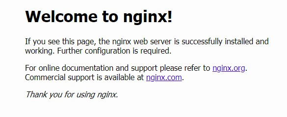
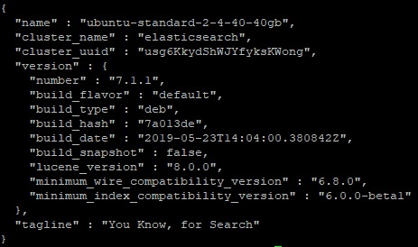

This article describes the installation of the ELK stack on a Linux operating system — Ubuntu 18.04.

The ELK stack is a powerful set of tools for efficiently solving a wide range of data collection, storage and analysis tasks:

- Elasticsearch is a full text search solution built on top of Apache Lucene with added convenience.
- Logstash is a utility for collecting, filtering and then redirecting to the final data storage. This mechanism provides a real-time pipeline. It can take data from multiple sources and convert it into JSON documents.
- Kibana is an application that allows you to take and search data from Elasticsearch and build visual graphs.

## Requirements

- Operating system Ubuntu version 18.04.
- Installed Nginx web server.
- Installed Java virtual machine.
- User with access to the **sudo** command.

## Installing the Nginx web server

Compared to the Apache web server, the Nginx web server uses fewer resources to host large, high-traffic sites. Thanks to the Nginx architecture, you can easily scale up to hundreds of thousands of concurrent connections.

To install and perform the initial configuration of the Nginx web server:

1. Open a terminal window.
1. Update the package indexes by running the command:

   ```console
   sudo apt update
   ```

1. Install the Nginx web server by running the command:

   ```console
   sudo apt install nginx -y
   ```

1. To test the operation of the web server, launch a web browser and enter the IP address of the web server in the address bar.

   If the installation is successful, the following web server page will open:

   ****

## Installing the Java Virtual Machine

The ELK stack requires a Java virtual machine to run. To install JVM:

1. Open a terminal window.
1. Install the JVM software package by running the command:

   ```console
   sudo apt install default-jre -y
   ```

   This will install the Java Runtime Environment (JRE) package.

1. Install the JDK software package, which includes the Java compiler, standard Java class libraries, examples, documentation, and various utilities. To do this, run the command:

   ```console
   sudo apt install default-jdk -y
   ```

## Installing and configuring Elasticsearch

To install and perform the initial configuration of Elasticsearch:

1. To check the current version of Elasticsearch, go to: [https://www.elastic.co/downloads/elasticsearch](https://www.elastic.co/downloads/elasticsearch).

1. Open a terminal window.

1. Import the GPG Elasticsearch public key, which is used to protect Elastic packages, by running the command:

   ```console
   sudo wget -qO - https://artifacts.elastic.co/GPG-KEY-elasticsearch | sudo apt key add
   ```

1. Add the Elastic packages to the sources.list.d system repositories directory by running the command:

   ```console
   sudo echo "deb https://artifacts.elastic.co/packages/7.x/apt stable main" | sudo tee -a /etc/apt/sources.list.d/elastic-7.x.list
   ```

1. Update the package indexes by running the command:

   ```console
   sudo apt update
   ```

1. Install Elasticsearch by running the command:

   ```console
   sudo apt install elasticsearch
   ```

1. Make changes to the `elasticsearch.yml` configuration file. For this:

   1. Open this file for editing by running the command:

      ```console
      sudo nano /etc/elasticsearch/elasticsearch.
      ```

   1. Find the line:

      ```yaml
      #network.host: 192.168.0.1
      ```

      Replace it with the line:

         ```yaml
         network.host: localhost
         ```

         {note:info}

         **Note**

         To search within a file, use the keyboard shortcut CTRL+W.

         {/note}

         After editing the `.yml` config file, make sure it doesn't have extra spaces and/or indents!

   1. Save your changes using the keyboard shortcut CTRL+O and finish editing using the keyboard shortcut CTRL+X.

1. Start the Elasticsearch service by running the command:

   ```console
   sudo systemctl start elasticsearch
   ```

1. Check the startup status of the Elasticsearch service by running the command:

   ```console
   sudo systemctl status elasticsearch
   ```

1. If an error is displayed:

   ****

   Do the following:

      1. Open the file containing the Java virtual machine settings by running the command:

         ```console
         sudo nano /etc/elasticsearch/jvm.options
         ```

      1. Find the parameters that define the minimum and maximum amount of RAM for Java:

         

         {note:info}

         **Note**

         Details about Xms and Xmx parameters [read here](https://docs.oracle.com/cd/E15523_01/web.1111/e13814/jvm_tuning.htm#PERFM161). For machines with low RAM, we recommend limiting the amount of memory used by the JVM.

         {/note}

      1. Specify the required values ​​in the `-Xms1g` and `-Xmx1g` parameters. For example, for an operating system with 1 GB of RAM, you can specify:

         ```txt
         -Xms128m
         -Xmx128m
         ```

      1. Save your changes using the CTRL+O key combination and finish editing using the CTRL+X key combination.
      1. Start the Elasticsearch service and check the status. If there are no errors, the following will be displayed:

         ****

1. To start the Elasticsearch service automatically when the operating system is restarted, run the command:

   ```console
   sudo systemctl enable elasticsearch
   ```

1. To test access to the Elasticsearch service, send an HTTP request by running the command:

   ```console
   curl -X GET localhost:9200
   ```

   If the installation of Elasticsearch was successful, the following information will be displayed:

      ****

## Installing and configuring Kibana

To install and perform the initial configuration of Kibana, do the following:

1. Make sure you have successfully installed Elasticsearch.
1. Open a terminal window.
1. Install Kibana by running the command:

   ```console
   sudo apt install kibana
   ```

1. Start Kibana by running the command:

   ```console
   sudo systemctl start kibana
   ```

1. To start the Kibana service automatically when the operating system is restarted, run the command:

   ```console
   sudo systemctl enable kibana
   ```

1. To check the status of Kibana, run the command:

   ```console
   sudo systemctl status kibana
   ```

1. Make changes to the `kibana.yml` configuration file. For this:

   1. Open this file by running the command:

      ```console
      sudo nano /etc/kibana/kibana.yml
      ```

   1. Find the line:

      ```yaml
      #server.port: 5601
      ```

      And replace it with the line:

         ```yaml
         server.port: 5601
         ```

   1. Find the line

      ```yaml
      #server.host: "localhost"
      ```

      And replace it with the line:

         ```yaml
         server.host: "localhost"
         ```

   1. Find the line:

      ```yaml
      #elasticsearch.hosts: ["http://localhost:9200"]
      ```

      And replace it with the line:

         ```yaml
         elasticsearch.hosts: ["http://localhost:9200"]
         ```

   1. Save changes using CTRL+O and finish editing using CTRL+X

1. Create an administrator account to access the Kibana web interface. To do this, run the command:

   ```console
   echo "mcskibadmin:\`openssl passwd -apr1\`" | sudo tee -a /etc/nginx/htpasswd.users
   ```

   where `mcskibadmin` is the login of the administrator account, `htpasswd.users` is the file where credentials are stored.

   Then enter the password.

1. Create a file with a virtual site for the Nginx web server by running the command:

   ```console
   sudo nano /etc/nginx/sites-available/elk
   ```

1. Add the following information to this file:

   ```console
   server {
   listen 80;
   
   server_name <web server external IP address>;
   
   auth_basic "Restricted Access";
   auth_basic_user_file /etc/nginx/htpasswd.users;
   
   location / {
   proxy_pass http://localhost:5601;
   proxy_http_version 1.1;
   proxy_set_header Upgrade $http_upgrade;
   proxy_set_header Connection 'upgrade';
   proxy_set_header Host $host;
   proxy_cache_bypass $http_upgrade;
   }
   }
   ```

   Save your changes using the keyboard shortcut CTRL+O and finish editing using the keyboard shortcut CTRL+X.

1. Activate the new Nginx configuration by running the command:

   ```console
   sudo ln -s /etc/nginx/sites-available/elk /etc/nginx/sites-enabled/
   ```

1. Restart Kibana by running the command:

   ```console
   sudo systemctl restart kibana
   ```

1. Restart the Nginx web server by running the command:

   ```console
   sudo systemctl restart nginx
   ```

1. Make sure that the syntax of the nginx configuration file does not contain errors by running the command:

   ```console
   sudo nginx -t
   ```

## Installing and configuring Logstash

To install and perform the initial setup of Logstash:

1. Install Logstash by running the command:

   ```console
   sudo apt install logstash
   ```

1. Create and configure a configuration file containing rules for receiving information from beats agents. For this:

   {note:info}

   **Note**

   The following is one of the possible settings. For more information [read here](https://www.elastic.co/guide/en/logstash/7.2/logstash-config-for-filebeat-modules.html#parsing-system).

   {/note}

   1. Create the file `02-beats-input.conf` by running the command:

      ```console
      sudo nano /etc/logstash/conf.d/02-beats-input.conf
      ```

   1. Add the following lines to this file:

      ```log
      input {
      beat {
      port => 5044
      }
      }
      ```

   1. Save your changes using the CTRL+O key combination and finish editing using the CTRL+X key combination.

1. Create and configure the `30-elasticsearch-output.conf` configuration file containing the rules for storing beats in Elasticsearch information. For this:

   1. Create the `30-elasticsearch-output.conf` file by running the command:

      ```console
      sudo nano /etc/logstash/conf.d/30-elasticsearch-output.conf
      ```

   1. Add the following lines to this file:

      ```log
      output {
      elasticsearch {
      hosts => ["localhost:9200"]
      sniffing => true
      manage_template => false
      template_overwrite => true
      index => "%{[@metadata][beat]}-%{+YYYY.MM.dd}"
      document_type => "%{[@metadata][type]}"
      }
      }
      ```

   1. Save your changes using the CTRL+O key combination and finish editing using the CTRL+X key combination.

1. Create a file containing rules for filtering and structuring incoming data. For this:

   1. Create the file `10-system-filter.conf` by running the command:

      ```console
      sudo nano /etc/logstash/conf.d/10-logstash-filter.conf
      ```

   1. In the file that opens, place the following lines:

      ```log
      input { stdin { } }
      filter {
      grok {
         match => { "message" => "%{COMBINEDAPACHELOG}" }
      }
      date {
         match => [ "timestamp" , "dd/MMM/yyyy:HH:mm:ss Z" ]
      }
      }
      output {
      elasticsearch { hosts => ["localhost:9200"] }
      stdout { codec => rubydebug }
      }
      ```

   1. Save your changes using the CTRL+O key combination and finish editing using the CTRL+X key combination.

1. Check the Logstash configuration by running the command:
      ```console
      sudo -u logstash /usr/share/logstash/bin/logstash --path.settings /etc/logstash -t
      ```

1. Start Logstash by running the command:

   ```console
   sudo systemctl start logstash
   ```

1. To start the Logstash service automatically when the operating system is rebooted, run the command:

   ```console
   sudo systemctl enable logstash
   ```

## Installing and configuring Filebeat

Filebeat allows you to collect data (beats) from various sources and transfer them to Logstash or Elasticsearch on Linux-like systems.

To install Filebeat:

1. Open a terminal.

1. Install Filebeat by running the command:

   ```console
   sudo apt install filebeat
   ```

1. Set up the `filebeat.yml` configuration file. For this:

   1. Open this file:

      ```console
      sudo nano /etc/filebeat/filebeat.yml
      ```

   1. Prevent Filebeat from sending data directly to Elasticsearch. To do this, find the lines:

      ```yaml
      output.elasticsearch:
      # Array of hosts to connect to.
      hosts: ["localhost:9200"]
      ```

      And replace them with the lines:

         ```yaml
         #output.elasticsearch:
         # Array of hosts to connect to.
         #hosts: ["localhost:9200"]
         ```

   1. Tell the Filebeat service to use Logstash as a log collector. To do this, find the lines:

      ```yaml
      #output.logstash:
      # The Logstash hosts
      #hosts: ["localhost:5044"]
      ```

      And replace them with the lines:

         ```yaml
         output.logstash:
         # The Logstash hosts
         hosts: ["localhost:5044"]
         ```

         Save your changes using the CTRL+O key combination and finish editing using the CTRL+X key combination.

1. Enable the Logstash module. To do this, run the command:

   ```console
   sudo sudo filebeat modules enable logstash
   ```

   {note:info}

   **Note**

   Learn more about filebeat modules [read here](https://www.elastic.co/guide/en/beats/filebeat/6.4/filebeat-module-system.html).

   {/note}

1. To view the included modules, run the command:

   ```console
   sudo filebeat modules list
   ```

1. Download the Elasticsearch index template by running the command:

   ```console
   sudo filebeat setup --template -E output.logstash.enabled=false -E 'output.elasticsearch.hosts=["localhost:9200"]'
   ```

   {note:info}

   **Note**

   Elasticsearch indexes are a collection of documents that have similar characteristics. They are identified by names that are used to refer to indexes when performing various index operations. The index template is loaded automatically when new indexes are created.

   {/note}

1. Dashboards allow you to visualize the Filebeat data sent to Kibana. To enable the dashboard, run the command:

   ```console
   sudo filebeat setup -e -E output.logstash.enabled=false -E output.elasticsearch.hosts=['localhost:9200'] -E setup.kibana.host=localhost:5601
   ```

1. Start Filebeat by running the command:

   ```console
   sudo systemctl start filebeat
   ```

1. To start the filebeat service automatically when the operating system is rebooted, run the command:

   ```console
   sudo systemctl enable filebeat
   ```

1. To verify that Elasticsearch is receiving data, query the Filebeat index with the command:

   ```console
   curl -XGET 'http://localhost:9200/filebeat-\*/_search?pretty'
   ```

The installation of the ELK stack is complete.

In the address bar of your web browser, enter the IP address of your Elastic server. Use your administrator credentials to sign in. After successful authorization, you will be redirected to the Kibana main page.
