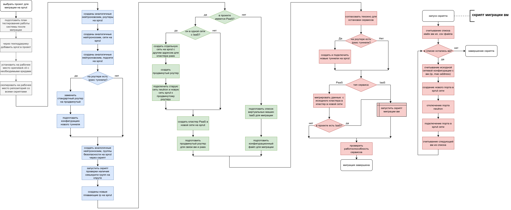

{include(/en/_includes/_translated_by_ai_en.md)}

## Why migration is needed

To improve the reliability and availability of the cloud network infrastructure, it is recommended to migrate projects to [Sprut](/en/networks/vnet/concepts/sdn#vnet-sdn-sprut) — VK Cloud's in-house SDN that ensures stable operation of networks and network functions on top of these networks at large scales.

SDN Sprut was developed to expand the capabilities of [SDN Neutron](/en/networks/vnet/concepts/sdn#vnet-sdn-neutron), which was used previously. SDN Neutron is effective when working with small networks, but has limitations when working with large networks (thousands and tens of thousands of ports). Since SDN is the foundation of all virtual networks and services, these limitations significantly affected the stability, scalability, and development of both user projects and the entire platform.

SDN Sprut is fully compatible with Openstack Neutron API and has a number of advantages compared to SDN Neutron:

- scales more easily and is suitable for networks of any size;
- allows free integration with VK Cloud services and third-party services;
- has higher performance;
- has services unavailable in SDN Neutron;
- is independent of OpenStack.

Currently, Sprut is the primary SDN for all new projects, but legacy projects use SDN Neutron. You can migrate your projects to SDN Sprut on your own. In the management console, you can [find out which SDN your project is connected to](/en/tools-for-using-services/account/instructions/project-settings/manage#sdn_view).

{note:warn}
Support for SDN Neutron will be discontinued by the end of 2025. After that, SDN Neutron users may face security issues and lack of updates.
{/note}

You can migrate your projects to SDN Sprut on your own.

Functional benefits of migration:

- [Advanced router](/en/networks/vnet/how-to-guides/advanced-router) with BGP dynamic routing support for building fault-tolerant routing schemes.
- [Cloud Direct Connect](https://cloud.vk.com/direct-connect) — dedicated connections between a company's local network and VK Cloud.
- [Shared networks](/en/networks/vnet/concepts/net-types#shared_net) for combining projects within the same region.
- Decentralized DHCP service for improved fault tolerance.
- Isolated traffic between different projects within PaaS services.
- Decentralized and fault-tolerant [private DNS service](/en/networks/dns/private-dns) inside the cloud.

Non-functional benefits of migration:
- REST API and other integration mechanisms with platform services or third-party services.
- Performance improvement of up to 34% compared to SDN Neutron.
- Reduced API and UI response time.
- Readiness for horizontal scaling of SDN components.
- Automatic recovery of network entities.
- Improved fault tolerance through real-time system event response.
- Ability to automatically configure and monitor the network infrastructure.

## {heading(Migration sequence)[id=migration_sequence]}

The diagram below shows the sequence of steps for migrating to SDN Sprut:

{params[noBorder=true]}

All steps are divided into four stages:

1. Preparation and analysis of the current infrastructure.
2. [Network infrastructure migration](../iaas) (IaaS).
3. [Platform services migration](../paas) (PaaS).
4. Post-migration testing and optimization.

## {heading(Which services can be migrated)[id=services_to_migrate]}

[cols="1,2,1", options="header"]
|===
|Service
|Migration possibility
|Description

|Network
| 
.6+|[Network infrastructure migration](../iaas)

|Router
| 

|Floating IP address
|Floating IP address cannot be transferred, a new one needs to be created in SDN Sprut and bound to the VM

|Virtual machine
| 

|Security group
| 

|VPN (IPsec)
| 

|Load balancer
| 
.4+|Platform services migration

|File storage (NFS)
|In development

|Database
|In development

|Kubernetes
|In development
|===

## {heading(Migration tools)[id=migration_instruments]}

You can migrate your project to SDN Sprut on your own using the following tools:

- Terraform: the easiest migration method, but requires a larger maintenance window (the time when the service will be unavailable).
- Management console and Openstack CLI: requires more time for migration preparation, but a smaller maintenance window.

The following scripts are used during project migration:

[cols="1,3", options="header"]
|===
|Script
|Description

|[copy-router-and-networks.sh](https://github.com/vk-cs/neutron-2-sprut/blob/guide_v3/copy-router-and-networks.sh)
|The script copies router configurations and their connected networks and subnets from SDN Neutron and creates similar ones in SDN Sprut

|[copy-ipsec.sh](https://github.com/vk-cs/neutron-2-sprut/blob/guide_v3/copy-ipsec.sh)
|The script copies IPsec tunnel configurations from SDN Neutron and creates similar ones in SDN Sprut

|[copy-loadbalancer.sh](https://github.com/vk-cs/neutron-2-sprut/blob/guide_v3/copy-loadbalancer.sh)
|The script copies load balancer configurations from SDN Neutron and creates similar ones in SDN Sprut

|[copy-security-group.sh](https://github.com/vk-cs/neutron-2-sprut/blob/guide_v3/copy-security-group.sh)
|The script copies security groups from SDN Neutron and creates similar ones in SDN Sprut, adding `-sprut` to their names

|[check-if-all-sprut-sg-present.sh](https://github.com/vk-cs/neutron-2-sprut/blob/guide_v3/check-if-all-sprut-sg-present.sh)
|The script checks which security groups are assigned to each VM being copied in SDN Neutron, then checks for the presence of groups with the same name and the `-sprut` suffix. The `default`, `all`, `ssh+www` groups are ignored, as they are basic for both SDNs

|[migrator.sh](https://github.com/vk-cs/neutron-2-sprut/blob/guide_v3/migrator.sh)
|The script switches the VM network interface from SDN Neutron to SDN Sprut. Switching can be done with or without preserving the MAC or IP address of the port. The VM must be active before running the script

|[migrator-multiple.sh](https://github.com/vk-cs/neutron-2-sprut/blob/guide_v3/migrator-multiple.sh)
|The script switches network interfaces of multiple VMs from SDN Neutron to SDN Sprut. The VMs must be active and have only one network interface each

|[modify-terraform-state.sh](https://github.com/vk-cs/neutron-2-sprut/blob/guide_v3/modify-terraform-state.sh)
|The script modifies the state of each VM in the `terraform.tfstate` file when migrating via Terraform
|===