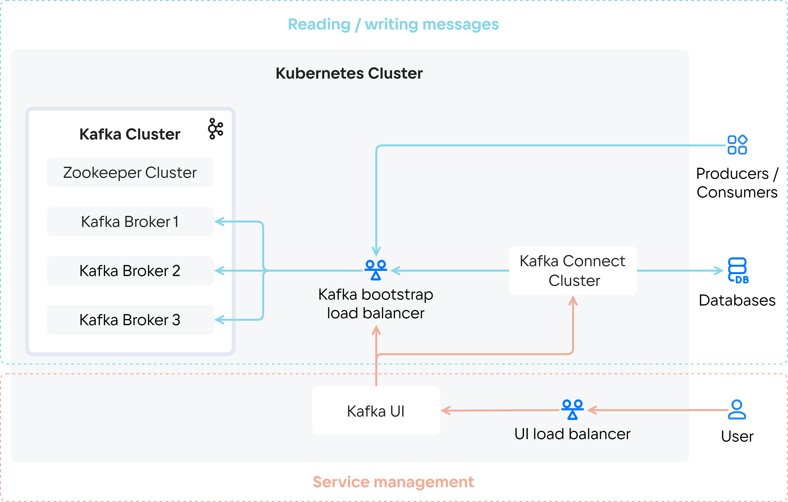

The Cloud Kafka cluster consists of several Zookeeper clusters and several [brokers](https://kafka.apache.org/documentation/#intro_concepts_and_terms) (Kafka Broker). The number of Zookeeper and Kafka Broker instances depends on the selected fault tolerance mode. To improve cluster performance, you can manually increase the number of brokers.

The service operates on the “publish/subscribe” principle: producers publish messages to topics, and consumers poll the service to receive new messages. To work with suppliers and consumers, a connection must be configured via [load balancer](/en/networks/balancing/concepts/load-balancer) bootstrap (Kafka bootstrap load balancer). The load balancer provides fault-tolerant connection between suppliers and consumers.

A [Kafka Connect](https://kafka.apache.org/documentation/#connect) can be created for a Cloud Kafka cluster is a data streaming tool between Apache Kafka and other systems. The Cloud Kafka service supports connectors:

- [JDBC](https://github.com/Aiven-Open/jdbc-connector-for-apache-kafka),
- [S3](https://github.com/Aiven-Open/s3-connector-for-apache-kafka),
- [Debezium](https://github.com/debezium/debezium/),
- [ClickHouse](https://github.com/ClickHouse/clickhouse-kafka-connect).

The [Kafka UI](https://docs.kafka-ui.provectus.io/overview/readme) tool is also deployed to work with the cluster. Its main functions are:

- view the list of Apache Kafka cluster topics and messages in them;
- launch connectors and monitor their operation in Kafka Connect;
- track the availability of brokers.
