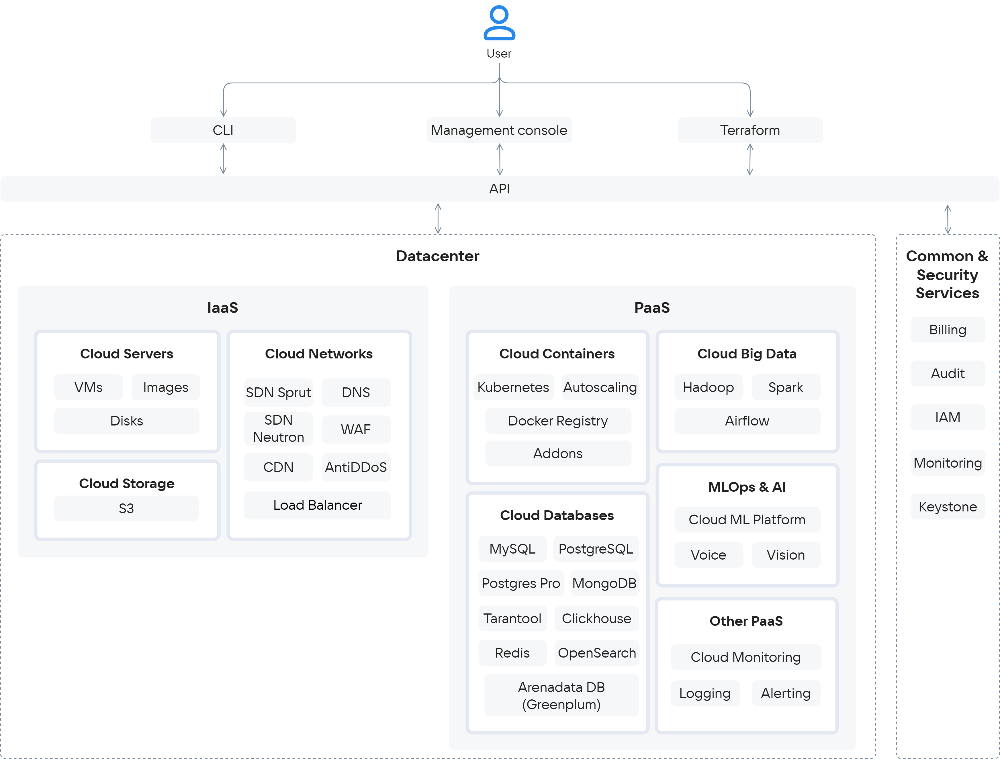

 VK Cloud is a cloud platform that provides network access to computing resources (virtual machines, databases, storage and other services) on a "pay as you go" basis: the fee is charged only for the resources consumed.

Users rent virtual resources hosted in [data centres](../../../start/concepts/architecture#az) VK instead of maintaining their own physical servers. This minimises management costs and allows the user to interact with VK Cloud technical support on various issues.

## Deployment models

VK Cloud offers the following deployment models:

- **Public Cloud** is a multi-tenant platform with shared resources (servers, storage, networks). Each client's data is isolated. VK Cloud manages the infrastructure, including data centre maintenance, hardware procurement, fault tolerance and network management. Advantages: scalability, pay-as-you-go pricing, access to new technologies.

- **Private Cloud** is a type of cloud platform where resources are allocated to a single client. It eliminates the sharing of physical and virtual resources. Deployed on owned or leased infrastructure with full client control. Benefits: data isolation and control, enhanced security.

 Feature | Public Cloud | Private Cloud |
|---|---|---|
| Deployment | Rapid | Requires planning |
| Responsibility | Shared | Full (client) |
| Resources | Scalable | Limited |
| Cost | Cost per use | Subscription fee |
| Start-up speed | High | Low |
| Investment | Minimal | High |
| Scaling | Simple | Complicated |
 
## Cloud service delivery models

Virtualization, monitoring, container and data storage services can be deployed in VK Cloud. The architecture is based on four groups of services:

- **Infrastructure as a Service (IaaS)**. IaaS services are based on [OpenStack](https://www.openstack.org/software) and proprietary components. They manage dynamic resource allocation, scaling, fault tolerance. Hosted in the same cloud data centre as PaaS services. IaaS provides basic components: virtual servers, network, data storage, access to dedicated hardware. 

   

    
List of IaaS services

  - [Cloud Servers](/en/computing/iaas) — provides virtual machines with the ability to allocate public IPs and unlimited traffic of 1 GBit/s (NVIDIA GPU virtual machines are also available). It is responsible for virtualization and resource integration and uses KVM hypervisor.
  - [Cloud Storage](/en/storage/s3) — provides S3-compatible object storage. The storage workload is shared across all storage nodes. You can deploy storage with a customizable architecture.
  - [Cloud Networks](/en/networks/vnet) — provides networking within the selected [project](/en/tools-for-using-services/account/concepts/projects) using SDN (Software Defined Network) technology. It is built on OpenStack Neutron and custom-developed software — Sprut. The service includes the following components:

    - [DNS](/en/networks/dns) — supports public and private DNS, providing name resolution for the services of the VK Cloud platform.
    - [CDN](/en/networks/cdn) — organizes content transfer from your servers to users with minimal delay.
    - [Load Balancer](/en/networks/balancing/concepts/load-balancer) — distributes the load on the infrastructure, providing fault tolerance and flexible scaling of applications.
    - [AntiDDoS](/ru/security/firewall-and-protection-ddos#antiddos "change-lang") — filters traffic coming to VK Cloud resources deployed in the project to block DDoS attacks.
    - [WAF](/ru/security/firewall-and-protection-ddos#waf "change-lang") (Web Application Firewall) — configures rules for filtering incoming and outgoing traffic to detect and block network attacks.

  

- **Platform as a Service (PaaS)**. Includes open source solutions (Kubernetes) and solutions of technology partners. Built-in monitoring of VK Cloud services and individual entities is supported. The PaaS model is built on top of IaaS. It does not require management of the underlying infrastructure, including hardware and operating systems, and allows you to devote all your efforts to application development and management.  

  

    
List of PaaS services

  - [Cloud Containers](/en/kubernetes/k8s) — allows you to create and manage Kubernetes clusters where you can run services and applications. 
  - [Cloud Databases](/en/dbs/dbaas) — provides scalable DBMSs: MySQL, PostgreSQL, Postgres Pro, ClickHouse, MongoDB, Redis, Tarantool, OpenSearch, Arenadata DB powered by Greenplum.
  - [Cloud Big Data](/en/data-processing/bigdata) — used for analyzing big data based on Arenadata Hadoop, supports scaling. 
  - [Cloud Spark](/en/ml/spark-to-k8s) — supports distributed batch and stream data processing, machine learning and analytics.
  - [Cloud ML Platform](/en/ml/mlplatform) — supports services for full-cycle ML development.
  - [Cloud Voice](/en/ml/cloud-voice) — provides REST API for speech recognition and synthesis based on machine learning.
  - [Vision](/en/ml/vision) — provides REST API for face and object recognition based on machine learning. 
  - [Cloud Alerting](/en/monitoring-services/alerting) — configures notifications about changes in key metrics of VK Cloud services.
  - [Cloud Logging](/en/monitoring-services/logging) — aggregates and analyzes logs of services in VK Cloud. 
  - [Cloud Monitoring](/en/monitoring-services/monitoring) — provides monitoring of metrics specific to PaaS services, such as analytics on K8s-container pods, and statistics of PostgreSQL DBMS transactions.
  - [Cloud Desktop](/en/computing/cloud-desktops/concepts/about) — managed virtual desktops accessible from anywhere in the world
  - [Cloud Kafka](/en/data-processing/kafka/concepts/about) — provides real-time data exchange between different modules of IT systems.
  - [Cloud Flink](/en/data-processing/flink/concepts/about) — stream processing and data transfer from sources to target systems.
  - [Cloud Trino](/en/data-processing/trino/concepts/about) — SQL engine for processing big data from remote sources.
  - [Marketplace](/en/applications-and-services/marketplace) — allows rapid deployment of web development and administration environments based on virtual machines. Includes such applications as OpenVPN, VK Testers, Redash, Grafana, Milvus, Nexus, Joomla, WordPress and others.

  

- **Software as a Service (SaaS)**. Off-the-shelf software available by subscription over the internet. Does not require infrastructure or platform management. An example of a SaaS service in VK Cloud is [1C:Ready Workplace](/en/applications-and-services/1cgrm). The service provides resources and software for deployment of 1C services: "Accounting", "Salary and Personnel Management".

- **Common&Security services** provide a secure user experience and support a role model when using VK Cloud resources.

  

    
List of Common&Security services

  - [Billing](/en/intro/billing) — keeps records of resource usage and cost control, generates financial reports, provides interaction with payment systems when paying for services.
  - [Audit](/en/monitoring-services/event-log) — generates an audit log of user actions in VK Cloud.
  - IAM — manages authentication and authorization of users and services in conjunction with Keystone.
  - Monitoring — provides monitoring of cloud services and user applications.
  - Keystone — provides API-based client authentication, service discovery and distributed multitenant authorization.

  

The general scheme of VK Cloud components and services is shown below.

{params[noBorder=true]}

## Ways to manage VK Cloud services

Cloud services are managed using an API. Users interact with the API through one or more [tools](/en/tools-for-using-services):

  - VK Cloud management console;
  - OpenStack CLI;
  - Terraform with a separate provider.

VK Cloud provides [technical support](/en/intro/start/support/support-info) for it's services. Partner solutions (e.g. AntiDDoS, WAF) are supported together with the partner.

## Fault tolerance

Physical fault tolerance is implemented by placing VK Cloud in three Tier III reliability level data centers in the Russian Federation. With this placement, it is guaranteed to maintain the SLA of data centers of more than 98% with a total [SLA](/en/intro/start/support/sla) of 99.95%.

Network fault tolerance is provided by communication of data centers with routes with a bandwidth of 200 GB/sec. Communication of each server with backbone providers goes through two independent channels, through two routers.

Logical fault tolerance is implemented using availability zones, which are combined into [regions](/en/tools-for-using-services/account/concepts/regions).

<info>

The status of the availability zones, services and infrastructure of VK Cloud can be checked on the [services page status page](https://status.msk.cloud.vk.com).

</info>

### {heading(Availability zones)[id=az]}

Each availability zone has one or more data processing centers (data centers) where cloud infrastructure objects are physically located. In VK Cloud, the availability zone corresponds to a separate Tier III data center. VK Cloud provides availability zones:

[cols="1,1,2,3", options="header"]
|===
| Region
| Accessibility zone
| Data centre
| Data centre address

.3+|Moscow
|`GZ1`
|[Goznak](https://tech.goznak.ru/dc-goznak-moscow)
|Moscow, Mira avenue, 105, building 6.

|`MS1`
|DataLine NORD4
|Moscow, Korovinskoe highway, 41

|`ME1`
|Medvedkovo Rostelecom Data Centre.
|Moscow, Chermyanskaya st., 4

|Kazakhstan
|`QAZ`
|[QazCloud](https://qazcloud.kz)
|Republic of Kazakhstan, Akmola region, Kosshy, Republic str. 1

|===

Each data center is equipped with independent power supply and cooling systems.

Availability zones within a region are connected using a redundant dedicated high-bandwidth and low-latency fiber network for high data transfer rates between zones.

The infrastructure of availability zones MS1 and GZ1 of the Moscow VK Cloud region is [protected](https://cloud.vk.com/cloud-platform/certificates/) in accordance with the Federal Law of the Russian Federation “On Personal Data” No. 152-FZ.

## Security

VK Cloud security is ensured by constant monitoring of VK Cloud services, conducting external audits. VK Cloud participates in the security audit program [HackerOne](https://www.hackerone.com). Infrastructure [certified](https://cloud.vk.com/cloud-platform/certificates/) FSTEC of Russia for working with personal data.

For more information, see the section [Platform security](/en/intro/it-security).

## Migration to VK Cloud

VK Cloud supports migration using [third-party software](../../../migration) or [platform tools](../../../migration/migrate-hystax-mr). The transfer of virtual resources is cheaper due to the implementation of services based on OSS (Open Source Solutions).