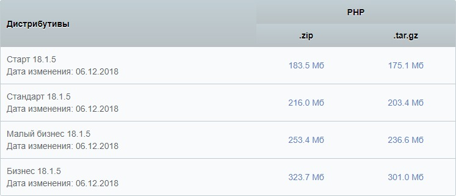
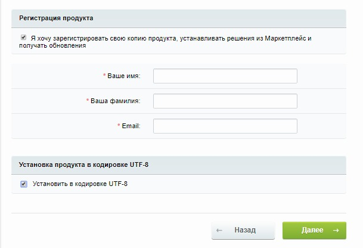
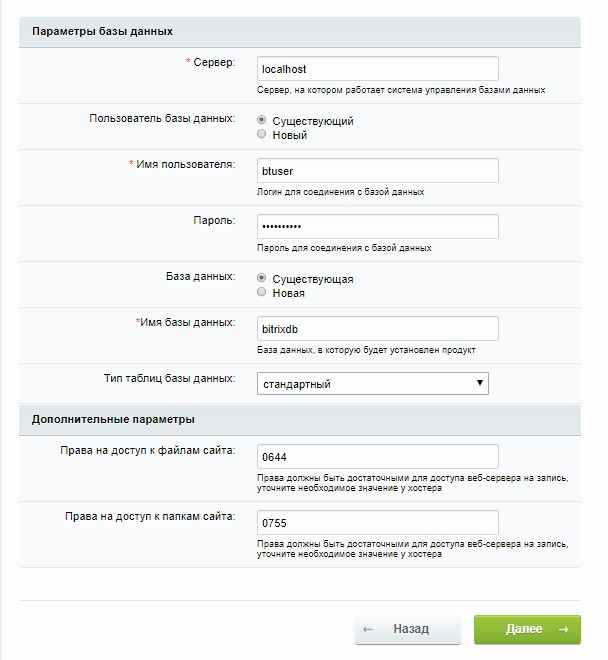
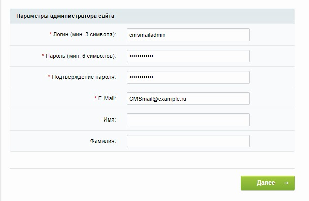

1C-Bitrix: Site Management is a professional Internet resource management system that can be used to create and maintain information portals, online stores and corporate websites.

## Requirements

- Operating system Ubuntu version 16.04.
- A user with access to the sudo command.
- Installed LAMP stack.

If you don't already have the LAMP stack installed:

- You can get a ready-made LAMP stack in the cloud [as a configured virtual machine](https://mcs.mail.ru/app/services/marketplace/) on Ubuntu 18.04 and install [1C-Bitrix: Site Management on it]( https://mcs.mail.ru/help/1c-bitrix-linux/bitrix-ubuntu-18). When registering, you get a free bonus account, which is enough to test the server for several days.
- You can install the LAMP stack yourself. To learn how to install a LAMP stack on Ubuntu 16.04, see the article [Installing a LAMP stack on an Ubuntu operating system](https://mcs.mail.ru/help/lamp-on-linux/lamp-ubuntu-16).

## Preparation for installation of 1C-Bitrix: Site management

1. Go to the site [download 1C Bitrix distribution](https://www.1c-bitrix.ru/download/cms.php) and select the required distribution (for example, Standard):

    

1. Open a terminal window.
1. Install additional PHP packages by running the command:

    ```
    sudo apt-get install php-common php-mbstring php-xmlrpc -y
    ```

1. Change to your home directory by running the command:

    ```
    cd ~
    ```

1. Create a temporary directory tempBT by running the command:

    ```
    mkdir tempBT
    ```

1. Change to the tempBT directory by running the command:

    ```
    cd ~/tempBT
    ```

1. Download the archive corresponding to the selected distribution by running the command:

    ```
    wget https://www.1c-bitrix.ru/download/standard_encode.tar.gz
    ```

1. Unzip the archive to the /var/www/html directory by running the command:

    ```
    sudo tar xzvf standard_encode.tar.gz -C /var/www/html
    ```1. Remove the tempBT temporary directory by running the command:

    ```
    sudo rm -Rf ~/tempBT
    ```

1. Change the owner of directories and files in the root directory of the web server using the command:

    ```
    sudo chown -R username:www-data /var/www/html
    where username is the sudo username, www-data is the group name
    For example: sudo chown -R www-data:www-data /var/www/html
    ```

    <warn>

    **Attention**

    To avoid Apache web server errors, use the default username www-data and the default group name www-data when running scripts.

    </warn>

1. If you need to grant access to the files of the web server root directory to another user, include this user in the www-data group using the command:

    ```
    sudo usermod -a -G www-data username
    For example: sudo usermod -a -G www-data btuser
    ```

1. Set the permissions for files and folders in the root directory using the command:

    ```
    sudo chmod -R 775 /var/www/html
    ```

1. In the php.ini file, change the values ​​of the parameters responsible for the correct operation of 1C-Bitrix: Site Management.

    <info>

    **Note**

    To quickly search for parameters in a file, use the keyboard shortcut CTRL+W.

    </info>

    For this:
    1. Open the php.ini file for editing by running the command:

        ```
        sudo nano /etc/php/7.0/apache2/php.ini
        ```

    1. Set the short_open_tag parameter to On:

        ```
        short_open_tag = On
        ```

    1. Set the mbstring.func_overload parameter to 2:

        ```
        mbstring.func_overload = 2
        ```

    1. Set the opcache.revalidate_freq parameter to 0:

        ```
        opcache.revalidate_freq=0
        ```

    1. Set the date.timezone parameter to Europe/Moscow:

        ```
        date.timezone = Europe/Moscow
        ```

    1. In line:

        ```
        ;mbstring.func_overload = 2
        ```

        remove the semicolon:

        ```
        mbstring.func_overload = 2
        ```1. Save your changes using the keyboard shortcut CTRL+O and finish editing using the keyboard shortcut CTRL+X.

1. Create the bitrix.conf configuration file by running the command:

    ```
    sudo nano /etc/apache2/sites-available/bitrix.conf
    ```

    Add the following lines to this file:

    ```
    <VirtualHost\*:80>
    DocumentRoot /var/www/html/
    ServerName <your web server's external IP address>
    <Directory /var/www/html/>
    Options +FollowSymlinks
    AllowOverride All
    Require all granted
    </Directory>
    ErrorLog ${APACHE_LOG_DIR}/bitrix_error.log
    CustomLog ${APACHE_LOG_DIR}/bitrix_access.log combined
    </VirtualHost>
    ```

    Save your changes using the keyboard shortcut CTRL+O and finish editing using the keyboard shortcut CTRL+X.

1. Disable the default site 000-default.conf by running the command:

    ```
    sudo a2dissite 000-default.conf
    ```

1. Connect a new virtual host by running the command:

    ```
    sudo a2ensite bitrix.conf
    ```

1. Enable the Apache rewrite module by running the command:

    ```
    sudo a2enmod rewrite
    ```

1. Restart the Apache web server by running the command:

    ```
    sudo systemctl reload apache2
    ```

## MySQL database setup

To get started with 1C-Bitrix: Site Management, you need to create and configure a dedicated MySQL database. For this:

1. Open a terminal window.
1. To switch to the MySQL shell, run the command:

    ```
    sudo mysql -u root -p
    ```

    <warn>

    Use the root account authentication, which is specific to the MySQL database.

    </warn>

1. Create a new database for 1C-Bitrix: Site Management using the command:

    ```
    CREATE DATABASE database_name;
    For example: CREATE DATABASE bitrixdb;
    ```

    <warn>

    **Attention**

    All MySQL commands must be followed by a semicolon.

    </warn>

1. Create a user with full access rights to the created database and assign a password to it using the command:

    ```
    CREATE USER имя_пользователя@localhost IDENTIFIED BY 'пароль';
    Например: CREATE USER btuser@localhost IDENTIFIED BY 'mypassword';
    ```

1.  Предоставьте пользователю привилегии, необходимые для создания и изменения таблиц базы данных, выполнив команду:

    ```
    GRANT ALL PRIVILEGES ON  имя_базы.\* TO имя_пользователя@localhost;
    Например: GRANT ALL PRIVILEGES ON bitrixdb.\* TO btuser@localhost;
    ```

1.  Актуализируйте предоставление привилегий к таблицам базы данных, выполнив команду:

    ```
    FLUSH PRIVILEGES;
    ```

1.  Выйдите из оболочки MySQL, выполнив команду:

    ```
    exit
    ```

## Установка 1С-Битрикс: Управление сайтом

Для установки 1С-Битрикс: Управление сайтом в адресной строке веб-браузера введите:

```
http://<внешний IP-адрес вашего веб-сервера>
```

В результате будет запущен мастер установки, следуйте его указаниям:

1.  Ознакомьтесь с вводной информацией и нажмите кнопку «Далее».
2.  Ознакомьтесь с лицензионным соглашением и нажмите кнопку «Далее».
3.  При необходимости укажите данные для регистрации своей копии продукта. Затем установите флажок «Установить в кодировке UTF-8» и нажмите кнопку «Далее».

    

4.  Убедитесь, что все поля с элементом «Текущее значение» выделены зеленым, и нажмите кнопку «Далее».
5.  Укажите параметры базы данных.

    

    Используйте имя пользователя базы данных, пароль и имя базы данных, которые вы указали при настройке БД MySQL. Другим параметрам рекомендуется оставить значения по умолчанию. Затем нажмите кнопку «Далее» и дождитесь завершения установки.

6.  Укажите параметры для создания учетной записи администратора и нажмите кнопку «Далее».

    

7.  Выберите типовое решение для конфигурации (например, 1С-Битрикс: Персональный сайт) и нажмите кнопку «Далее».

В результате вы перейдете к индивидуальной настройке выбранного шаблона. Выберите решение, которое вы хотите использовать для вашего сайта, введите название и имя владельца сайта. Затем нажмите кнопку «Установить».

Будет запущена установка выбранного шаблона. По завершении установки нажмите кнопку «Перейти на сайт».
