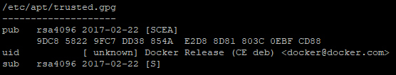
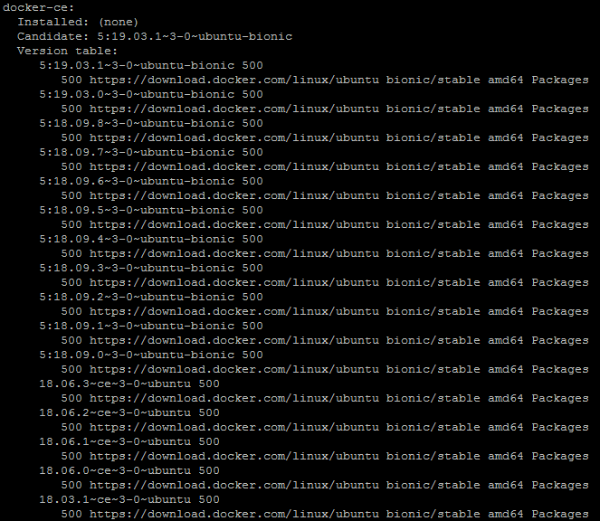
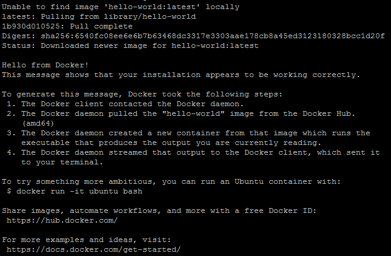
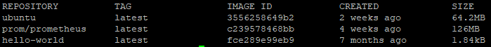
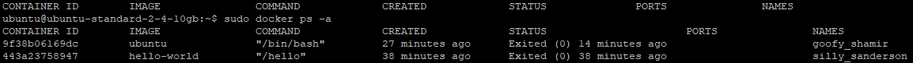

Docker CE (Community Edition) is a platform for quickly building, debugging and deploying applications. Docker CE allows you to quickly deploy applications in any environment by packaging software into configurable containers.

Containers include everything you need to run an application (libraries, system tools, code, and runtime) and allow applications to run in processes with resource isolation. They are similar to virtual machines, but are more portable, less resource intensive, and more dependent on the operating system of the host machine.

**How ​​to save time installing Docker CE**

You can get Docker CE already installed on Ubuntu 18.04 as a pre-configured VK Cloud virtual machine. Upon registration, you get a free bonus account, which is enough to test the application for several days.

**[**[connect Docker CE machine](https://mcs.mail.ru/app/services/marketplace/)**]**

To learn more about Docker CE in the app store, go to [Help Center](https://mcs.mail.ru/help/quick-start/docker-ce).

**Requirements**

- Operating system Ubuntu version 18.04.
- A user with access to the sudo command.

## Install Docker CE

To install Docker CE:

1. Open a terminal window.
2. Update the package indexes by running the command:

```
sudo apt update
```

3. Install additional software packages that allow the apt installer to use packages over secure HTTPS by running the command:

```
sudo apt install apt-transport-https ca-certificates curl software-properties-common -y
```

4. Install the trusted GPG key of the Docker repository by running the command:

```
curl -fsSL https://download.docker.com/linux/ubuntu/gpg | sudo apt key add -
```

5. Make sure the key is loaded by running the command:

```
apt key list
```

This will result in a list similar to the following:

****

6. Add the official Docker repository to the APT system repositories directory by running the command:

```
sudo add-apt-repository "deb [arch=amd64] https://download.docker.com/linux/ubuntu bionic stable"
```

7. Update the package indexes by running the command:

```
sudo apt update
```

8. Verify that the Docker repository is connected as the Docker CE installation source by running the command:

```
apt-cache policy docker-ce
```

As a result, something like this will be displayed:

****

9. Install Docker CE by running the command:

```
sudo apt install docker-ce -y
```

10. To start Docker CE automatically when the operating system starts, run the command:

```
sudo systemctl enable docker
```

11. Check the operation of Docker CE by running the command:

```
sudo systemctl status docker --no-pager -l
```

As a result, something like this will be displayed:

****

## Using Docker CE**Note**

Docker CE command line syntax consists of a key (command) and options (options):

```
docker [OPTIONS] COMMAND
```

For an example using Docker CE:

1. Open a terminal window.
2. To view help information on the Docker CE command line syntax, run the command:

```
docker --help
```

3. To view the current information about Docker CE, run the command:

```
sudo dockerinfo
```

## Working with Docker CE images

Containers are run from Docker images. By default, Docker gets images from Docker Hub, which is an image registry.

For an example of working with Docker CE images:

1. Open a terminal window.
2. Check the availability of images on Docker Hub and the ability to download them by running the command:

```
sudo docker run hello world
```

As a result, something like this will be displayed:

****

**Note**

Let's take a look at the Ubuntu OS image example below, as it is more functional to demonstrate.

3. To view the available Ubuntu OS images in Docker Hub, run the command:

```
sudo docker search ubuntu
```

As a result, a list of all images with names matching the search conditions is returned:

****

4. Download the Ubuntu OS image by running the command:

```
sudo docker pull ubuntu
```

As a result, something like this will be displayed:

****

5. To view downloaded images, run the command:

```
sudo docker images
```

As a result, something like this will be displayed:

****

## Run the docker image

The docker run command includes two commands:

```
docker-pull
docker start
```

For more information, use the commands:

```
docker run --help and docker start --help
```

To run the docker image:

1. Open a terminal window.
2. As an example, run the Ubuntu docker image by running the command:

```
sudo docker run -it ubuntu
```

As a result, a container is created from the docker image and this container is launched. You will be able to get started with a container shell. In this case, the command line will look something like this:

```
root@f1d4ef1c3e97:/# where f1d4ef1c3e97 is the Ubuntu container ID
```

**Note**

The -t switch assigns a pseudo-TTY attached to the container's STDIN. Often this switch is used with the -i option (for example, if you need to connect to a shell (bash) inside a docker container to perform some action).

3. Update the package indexes by running the command:

```
apt update
```

4. For example, install the JavaScript runtime - Node.js by running the command:

```
apt install nodejs -y
```

5. Check the status and version of the installed Node.js package by running the command:

```
node -v
```

6. To exit the command shell, run the command:

```
exit
```

## Docker CE container management

For the Docker CE container management example:

1. Open a terminal window.
2. To view all containers, run the command:

```
sudo docker ps -a
```

As a result, something like this will be displayed:

****

3. To view only active containers, run the command:

```
sudo docker ps
```

4. Run the command to start the container:

```
sudo docker start <CONTAINER ID>
```

For example, the command to start an Ubuntu container is:

```
sudo docker start 9f38b06169dc
```

5. To stop the container, run the command:

```
sudo docker stop <CONTAINER ID>
```

6. To remove the container, run the command:

```
sudo docker rm <CONTAINER ID>
```

**Feedback**

Any problems or questions? [Write to us, we will be happy to help you](https://mcs.mail.ru/help/contact-us).
