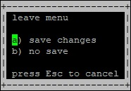
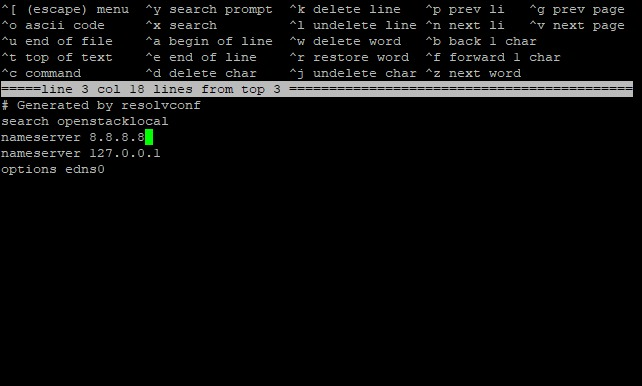
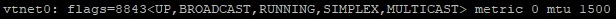
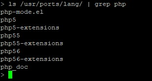
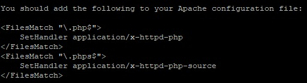
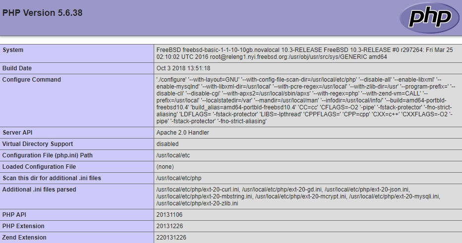

This article describes the installation of the FAMP stack on a Unix operating system - FreeBSD 10.3.

The FAMP stack includes the FreeBSD operating system, the Apache web server, the MySQL database management system (mariadb), and a server-side scripting language for handling PHP dynamic content. All this is necessary to support dynamic sites and web applications.

## Requirements

- Operating system FreeBSD version 10.3.
- A user with access to the sudo command.

## Preparing to install the FAMP stack

Before installing the FAMP stack:

1. Open the `resolv.conf` file for editing by running the command:

   ```
   sudo ee /etc/resolv.conf
   ```

1. In the resolv.conf file, do the following:

   1. Add the line `nameserver <IP address of your DNS server>`;

      <warn>

      **Attention**

      If you are using a virtual machine provided by the [VK CS](https://mcs.mail.ru/) cloud service, simply remove the `#` character in the `nameserver 8.8.8.8` line.

      </warn>

   1. Leave the line `nameserver 127.0.0.1` unchanged;
   1. Save your changes by doing the following:
      1. Open the menu using the keyboard shortcut `CTRL+[`;
      1. Select **a** from the menu, then select **a** again;

         ****

         

   As a result, the contents of the `resolv.conf` file should look something like this:

   ****

1. Specify the correct value for the mtu parameter for the network interface. For this:

   <info>

   **Note**

   To find out the correct mtu value, contact your ISP

   </info>

   1. Run the command:

      ```
      ifconfig
      ```

   1. For the desired network interface, find the `mtu <value>` parameter, for example:

      ****

   1. Specify a new mtu value by running the command:

      ```
      sudo ifconfig <network interface name> mtu <value> up
      ```

      <info>

      **Note**

      If you are using a virtual machine provided by the cloud service [VK CS](https://mcs.mail.ru/), run the command:

      ```
      sudo ifconfig vtnet0 mtu 1400 up
      ```

      </info>

   1. To check the changes made, use the command:

      ```
      ping cms.mail.ru
      ```

   Verify that the request exchange is successful. Then abort the command using the keyboard shortcut CTRL+C.

1. To display the packages available for upgrade and the files that will be changed during the upgrade, run the command:

   ```
   sudo freebsd-update fetch .
   ```

1. Start the update process by running the command:

   ```
   sudo freebsd-update install
   ```

## Installing and configuring the Apache web server

To install and perform initial configuration of the Apache web server:

1. Check the available versions of Apache by running the command:

   ```
   ls /usr/ports/www/ | grep apache
   ```

1. Select the version of Apache (for example, **apache24**) and start the installation by running the command:

   ```
   sudo pkg install apache24
   ```

   <warn>

   **Attention**

   When installing the Apache server, the pkg installer package may need to be updated. Answer `Y` to update.

   </warn>

1. To start the Apache service automatically when the operating system is restarted, run the command:

   ```
   sudo sysrc apache24_enable="yes"
   ```

1. Start the Apache server by running the command:

   ```
   sudo service apache24 start
   ```

1. To test Apache in the address bar of a web browser, type:

   ```
   <web server external IP address>/index.html
   ```

If the installation of the Apache web server was successful, the web server page will load containing the line:

   

## Install MySQL DBMS (mariadb)

The `mariadb` installation, which is a fork of the MySQL DBMS, is considered as the database. To install and configure `mariadb`:

1. Open a terminal window.

1. Check the available versions of `mariadb` by running the command:

   ```
   pkg search -o mariadb
   ```

   

1. Select the version of `mariadb` (for example, **mariadb103**) and start the installation by running the command:

   ```
   sudo pkg install mariadb103-server mariadb103-client
   ```

1. To start the `mariadb` service automatically when the operating system is rebooted, run the command:

   ```
   sudo sysrc mysql_enable="yes"
   ```

1. Start `mariadb` by running the command:

   ```
   sudo service mysql-server start
   ```

1. To change the `mariadb` server configuration, use the command:

   ```
   sudo mysql_secure_installation
   ```

   This command runs the mariadb database server hardening script. To set up security:

   1. Specify a password for the root account.

      <warn>

      **Attention**

      It is recommended that you provide a strong password that is at least 8 characters long and includes at least one uppercase letter, one lowercase letter, one number, and one special character.

      </warn>

      The root user in this case refers exclusively to the MySQL DBMS and is not a CentOS OS account.

   1. If necessary, remove the anonymous accounts that are created during the installation of the maridb DBMS:
      - Answer `Y` to remove anonymous accounts.
      - Answer `N` if deleting anonymous accounts is not required.

      These accounts are for database testing purposes only and can be deleted in most cases.

   1. If necessary, prohibit the provision of remote access to MySQL DBMS databases for the root account:
      - Answer `Y` to disable remote access.
      - Answer `N` to allow remote access.

   1. If necessary, delete the test database (Test):
      - Answer `Y` to remove the base Test.
      - Answer `N` if you don't want to remove the Test base.

      This database is created during installation of the MySQL DBMS server and is intended for testing purposes. Removing the Test database does not affect the operation of the system.

   1. In response to a request to make changes to the MySQL DBMS and reload table access privileges:
      - Answer `Y` to make changes and reboot.
      - Answer `N` if changes and reboot are not required.

## Install PHP

To install PHP:

1. Open a terminal window.
1. Check available PHP versions by running the command:

   ```
   ls /usr/ports/lang/ | grep php
   ```

   

1. To display all available PHP utilities, use the command:

   ```
   pkg search -o php
   ```

1. Install PHP and additional utilities by running the command:

   ```
   sudo pkg install php56 mod_php56 php56-mbstring php56-mcrypt php56-zlib php56-curl php56-gd php56-json php56-mysqli
   ```

   When the installation is complete, help information will be displayed containing the configuration of the Apache server, for example:

   ****

1. Create a `php.conf` file by running the command:```
   sudo ee /usr/local/etc/apache24/Includes/php.conf
   ```

1. Add the following lines to the `php.conf` file:

   ```
   <IfModule dir_module>
   DirectoryIndex index.php index.html
   <FilesMatch "\.php$">
   SetHandler application/x-httpd-php
   </FilesMatch>
   <FilesMatch "\.phps$">
   SetHandler application/x-httpd-php-source
   </FilesMatch>
   </IfModule>
   ```

   Save your changes.

1. Restart the Apache web server by running the command:

   ```
   sudo service apache24 restart
   ```

1. Make sure the Apache web server renders PHP scripts correctly. For this:

   1. Create the `info.php` file by running the command:

      ```
      sudo ee /usr/local/www/apache24/data/info.php

      ```

   1. In the `info.php` file put the following text:

      ```
      <?php
      phpinfo();
      ?>
      ```

   1. Save your changes and finish editing;

   1. In the address bar of the browser, add the line to the web server address:

      ```
      /info.php
      ```

      As a result, the following page should be displayed:

      ****

   <warn>

   **Attention**

   For security purposes, after checking the system, it is recommended to delete the `info.php` file by running the command:

   ```
   sudo rm /usr/local/www/apache24/data/info.php

   ```

   </warn>
