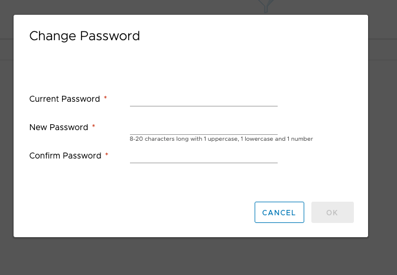
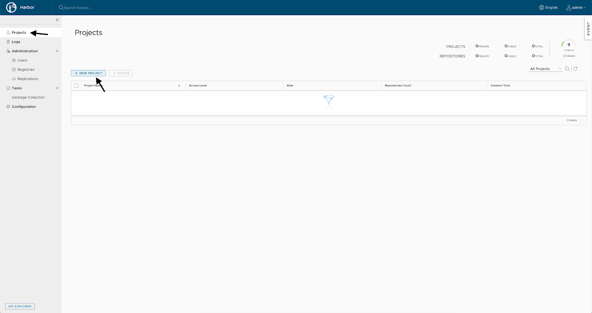

In this article, we will look at how to install and configure Harbor repository repositories. After that, you can [configure application auto-deployment to a Kubernetes cluster](https://mcs.mail.ru/help/gitlab-ci-cd/k8s-autodeploy).

## Installing the Harbor repository repository

Before installing Harbor:

1. [Install and configure Docker](https://mcs.mail.ru/help/gitlab-ci-cd/docker-installation).
2. [Install and configure Gitlab](https://mcs.mail.ru/help/gitlab-ci-cd/gitlab-installation).

Harbor is installed as a Docker image using the online installer.

To install the Harbor repositories:

1. Download the online installer script and unzip it:

```
root@ubuntu-standard-2-4-40gb:~# wget https://github.com/goharbor/harbor/releases/download/v1.9.3/harbor-online-installer-v1.9.3.tgz
root@ubuntu-standard-2-4-40gb:~# tar -zxvf harbor-online-installer-v1.9.3.tgz
```

2. In the resulting harbor folder, configure the `harbor.yml` file:

```
hostname: <SERVER_DNS_NAME>
http:
    # port for http, default is 80. If https enabled, this port will redirect to https port
    port: 8080
# https related config
    https:
# # https port for harbor, default is 443
    port: 8443
# # The path of cert and key files for nginx
    certificate: /opt/gitlab/config/ssl/<SERVER_DNS_NAME>.crt
    private_key: /opt/gitlab/config/ssl/<SERVER_DNS_NAME>.key
# The default data volume
data_volume: /opt/harbor
```

And:

- The hostname is the same as the Gitlab name because the deployment is done on the server that hosts Gitlab.
- Non-standard HTTP and HTTPS ports are used, as the standard ones are used by the Gitlab web interface.
- Uses the LetsEncrypt certificate and key that was created when you set up Gitlab.

3. Run the `install.sh` script:

```
root@ubuntu-standard-2-4-40gb:~/harbor# ./install.sh

[Step 0]: checking installation environment ...
Note: docker version: 19.03.5
Note: docker-compose version: 1.25.0

[Step 1]: preparing environment ...
[Step 2]: starting Harbor ...
Creating harbor-log ... done
Creating registryctl ... done
Creating redis ... done
Creating harbor-db ... done
Creating harbor portal ... done
Creating registry ... done
Creating harbor-core ... done
Creating nginx ... done
Creating harbor-jobservice ... done

✔ ----Harbor has been installed and started successfully.----
```

Harbor launched.

## Setting up the repository repository Harbor

1. Log in to Harbor.

Since we are using non-standard ports, the URL will look like this:

```
https://<SERVER_DNS_NAME>:8443
```

The default login is `admin`. The primary password is set in the `harbor.yml` file (default is `Harbor12345`).

****

2. Change the password for the admin user. To do this, click on admin in the upper right corner and select Change Password:

****

3. Specify the current and new passwords:

****

4. Create a user under which Gitlab will work with Harbor. To do this, select Users on the left:


5. Specify the data of the new user:


<warn>

**Attention**

Remember the password entered for the user, it will be required for integration with Gitlab.

</warn>

6. Create a new project that will contain the built images from Gitlab. To do this, select Projects on the left:



7. Enter the details of the new project:


8. Add a user to the project:

****

9. Specify a name and role for the user:


Now [set up auto-deployment of the application to the Kubernetes cluster](https://mcs.mail.ru/help/gitlab-ci-cd/k8s-autodeploy).

## Feedback

Any problems or questions? [Write to us, we will be happy to help you](https://mcs.mail.ru/help/contact-us).
