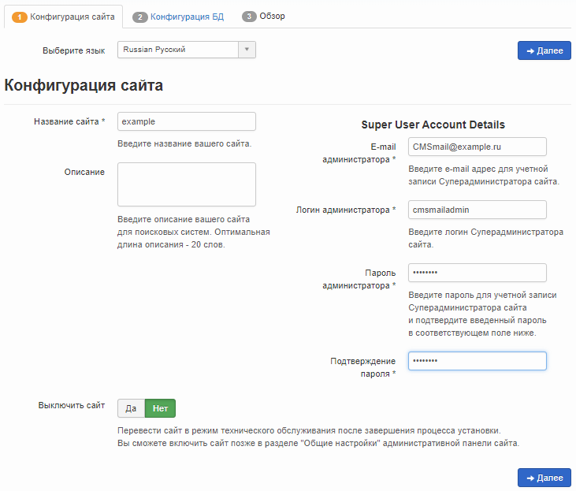
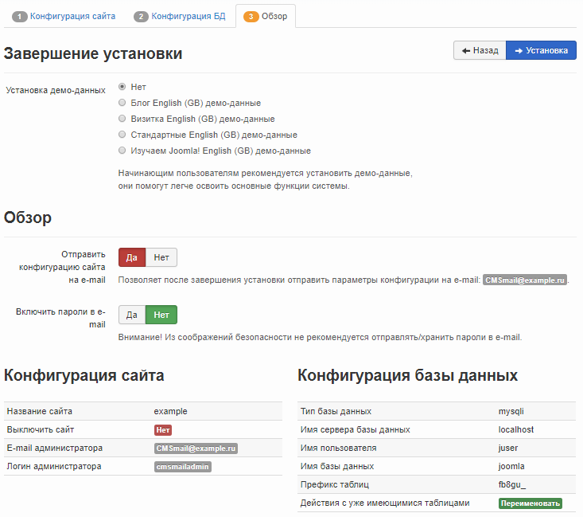

Joomla! is a content management system (CMS) written in PHP and JavaScript and using the MySQL DBMS as a database storage. Joomla! offers native bootstrap, multilingual environment, many different extension modules, as well as high security. Joomla! distributed under the GNU/GPL license and can be used free of charge.

## Requirements

- Operating system Ubuntu version 18.04.
- A user with access to the sudo command.
- Installed LAMP stack.

If you don't already have the LAMP stack installed:

- You can get a ready-made LAMP stack in the cloud [as a configured virtual machine](https://mcs.mail.ru/app/services/marketplace/) on Ubuntu 18.04. When registering, you get a free bonus account, which is enough to test the server for several days.
- You can install the LAMP stack yourself. For information on how to install the LAMP stack on Ubuntu 18.04, [read here](/en/additionals/cases/cases-lamp/lamp-u18).

## MySQL database setup

To get started with Joomla!, you need to create and set up a dedicated MySQL database. For this:

1. Open a terminal window.
2. To switch to the MySQL shell, run the command:

```
sudo mysql -u root -p
```

Use root authentication, which is exclusive to MySQL.

3. Create a database for Joomla! using the command:

```
CREATE DATABASE database_name;
```

For example:

```
CREATE DATABASE joomla;
```

<warn>

**Attention**

All MySQL commands must be followed by a semicolon.

</warn>

4. Create a user with full access rights to the created database and assign a password to it using the command:

```
CREATE USER username@localhost IDENTIFIED BY 'password';
```

For example:

```
CREATE USER [juser@localhost](mailto:juser@localhost) IDENTIFIED BY 'mypassword';
```

5. Grant the user the necessary privileges to create and modify database tables by running the command:

```
GRANT ALL PRIVILEGES ON dbasename.\* TO username@localhost;
```

For example:

```
GRANT ALL PRIVILEGES ON joomla.\* TO [juser@localhost](mailto:juser@localhost);
```

6. Update the granting of privileges to database tables by running the command:

```
FLUSH PRIVILEGES;
```

7. Exit the MySQL shell by running the command:

```
exit
```

## Preparing to install Joomla!

Before installing Joomla!:

1. Go to [website](https://github.com/joomla/joomla-cms/releases) and note the latest Joomla! version number:


2. Open a terminal window.
3. Change to your home directory by running the command:

```
cd ~
```

3. Create a temporary directory `tempJL` by running the command:

```
mkdir tempJL
```

4. Change to the created directory by running the command:

```
cd ~/tempJL
```

5. Download the latest version of Joomla! by running the command:

```
wget https://github.com/joomla/joomla-cms/releases/download/<version number>/Joomla_<version number>-Stable-Full_Package.tar.gz
```

For example:

```
wget https://github.com/joomla/joomla-cms/releases/download/3.9.3/Joomla_3.9.3-Stable-Full_Package.tar.gz
```

6. Create the `Joomla` folder by running the command:

```
sudo mkdir /var/www/html/joomla
```

7. Unpack and move the files from the current directory to the `/var/www/html/Joomla` directory by running the command:

```
sudo tar -xvzf Joomla_<version number>-Stable-Full_Package.tar.gz -C /var/www/html/joomla
```

For example:

```
sudo tar -xvzf Joomla_3.9.3-Stable-Full_Package.tar.gz -C /var/www/html/joomla
```

8. Remove the temporary directory `tempJL` by running the command:

```
rm -Rf ~/tempJL
```

9. Change the owner of directories and files in the root directory of the web server using the command:

```
sudo chown -R username:www-data /var/www/html/
```

where `username` is the sudo username, `www-data` is the group name
For example:

```
sudo chown -R www-data:www-data /var/www/html/joomla/
```

<info>

**Note**

To avoid Apache web server errors, use the default username www-data and the default group name www-data when running scripts.

</info>

10. If you need to grant access to the files of the web server root directory to another user, include this user in the www-data group using the command:

```
sudo usermod -a -G www-data username
```

For example:

```
sudo usermod -a -G www-data wuser
```

11. Set the permissions for files and folders by running the command:

```
sudo chmod -R 755 /var/www
```

12. To configure Joomla!, create a `joomla.conf` configuration file in the `/etc/apache2/sites-available/` directory by running the command:

```
sudo nano /etc/apache2/sites-available/joomla.conf
```

13. Add the following lines to the created file:

```
<VirtualHost\*:80>
DirectoryIndex index.php
DocumentRoot /var/www/html/joomla
ServerName <your web server's external IP address>
<Directory /var/www/html/joomla>
</Directory>
ErrorLog /var/log/apache2/joomla-error_log
CustomLog /var/log/apache2/joomla-access_log common
</VirtualHost>
```

Save your changes using the keyboard shortcut CTRL+O and finish editing using the keyboard shortcut CTRL+X.

14. Disable the default site `000-default.conf` using the command:

```
sudo a2dissite 000-default.conf
```

15. Connect the new virtual host using the command:

```
sudo a2ensite joomla
```

16. Restart the Apache web server by running the command:

```
sudo systemctl reload apache2
```

## Installing Joomla!

To install Joomla! in the address bar of the web browser, enter the external IP address of the web server. This will launch the Joomla! installation wizard, follow its instructions:

1. On the **Site Configuration** page, specify the site name, administrator account information, and click the **Next** button:

****

2. On the **Database Configuration** page, specify the database settings and click the **Next** button:

<info>

**Note**

In the database settings, enter the database username, password, and database name that you chose when setting up the MySQL database.

</info>

****

3. On the last page, check the selected Joomla! options, email them if necessary, and click the **Install** button:



4. When Joomla! will be installed, a page with the relevant information will be displayed:


5. To complete the installation, click the **Remove Installation Directory** button.
6. To go to the main page of your site, click the **Site** button:

****
