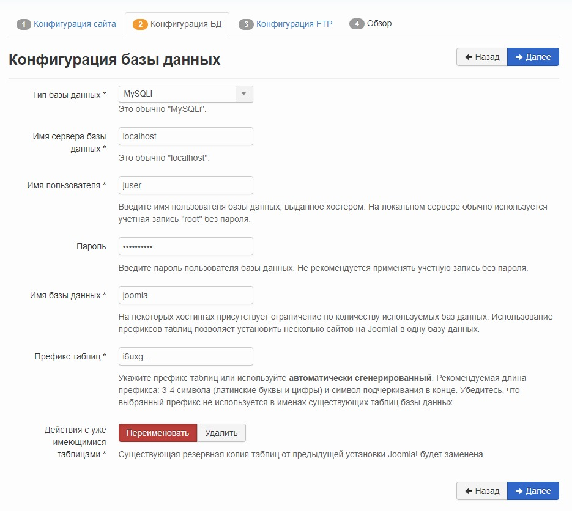
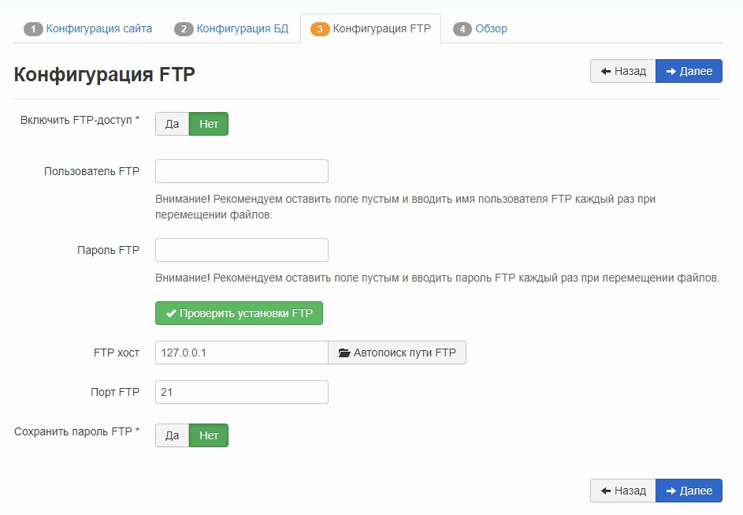
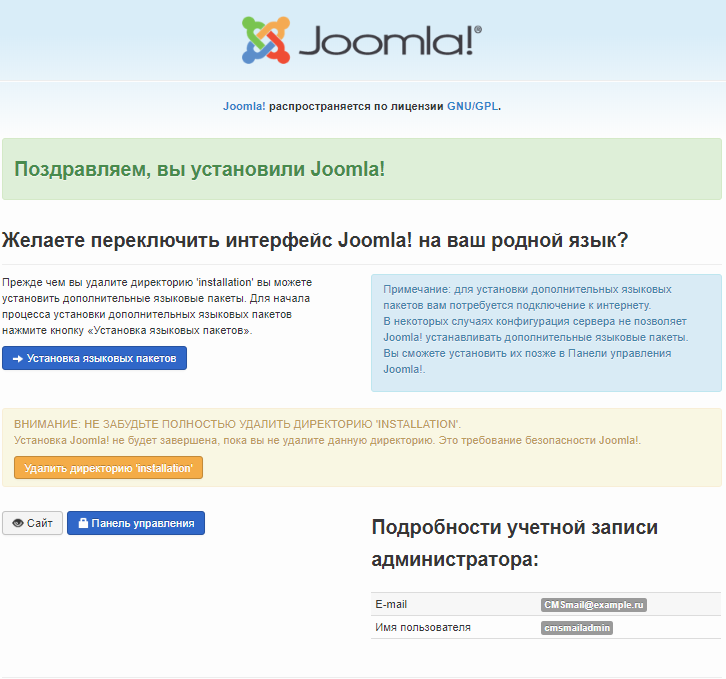

Joomla! is a content management system (CMS) written in PHP and JavaScript and using the MySQL DBMS as a database storage. Joomla! offers native bootstrap, multilingual environment, many different extension modules, as well as high security. Joomla! distributed under the GNU/GPL license and can be used free of charge.

## Requirements

- Operating system CentOS version 7.5.
- A user with access to the sudo command.
- Installed LAMP stack.

If you don't already have the LAMP stack installed:

- You can get a ready-made LAMP stack in the cloud [as a configured virtual machine](https://mcs.mail.ru/app/services/marketplace/) on Ubuntu 18.04 and [install Joomla! on it](https://mcs.mail.ru/help/joomla-on-linux/joomla-ubuntu-18). When registering, you get a free bonus account, which is enough to test the server for several days.
- You can install the LAMP stack yourself. For information on how to install the LAMP stack on CentOS 7.5, [read here](https://mcs.mail.ru/help/lamp-on-linux/lamp-centos-7-5).

## MySQL database setup

To get started with Joomla!, you need to create and set up a dedicated MySQL database. For this:

1. Open a terminal window.
2. To switch to the MySQL shell, run the command:

```
sudo mysql -u root -p
```

Use root authentication, which is exclusive to MySQL.

3. Create a database for Joomla! using the command:

```
CREATE DATABASE database_name;
```

For example:

```
CREATE DATABASE joomla;
```

<warn>

**Attention**

Each MySQL DBMS command must be followed by a semicolon.

</warn>

4. Create a user with full access rights to the created database and assign a password to it using the command:

```
CREATE USER username@localhost IDENTIFIED BY 'password';
```

For example:

```
CREATE USER [juser@localhost](mailto:juser@localhost) IDENTIFIED BY 'mypassword';
```

5. Grant the user the necessary privileges to create and modify database tables by running the command:

```
GRANT ALL PRIVILEGES ON dbasename.\* TO username@localhost;
```

For example:

```
GRANT ALL PRIVILEGES ON joomla.\* TO [juser@localhost](mailto:juser@localhost);
```

6. Update the granting of privileges to database tables by running the command:

```
FLUSH PRIVILEGES;
```

7. Exit the MySQL shell by running the command:

```
exit
```

## Preparing to install Joomla!

Before installing Joomla!:

1. Go to [website](https://github.com/joomla/joomla-cms/releases) and note the latest Joomla! version number:


2. Open a terminal window.
3. Change to your home directory by running the command:

```
cd ~
```

4. Create a temporary directory `tempJL` by running the command:

```
mkdir tempJL
```

5. Change to the created directory by running the command:

```
cd ~/tempJL
```

6. Download the latest version of Joomla! by running the command:

```
wget https://github.com/joomla/joomla-cms/releases/download/<version number>/Joomla_<version number>-Stable-Full_Package.tar.gz
For example: wget [https://github.com/joomla/joomla-cms/releases/download/3.9.3/Joomla_3.9.3-Stable-Full_Package.tar.gz](https://github.com/joomla/joomla -cms/releases/download/3.9.3/Joomla_3.9.3-Stable-Full_Package.tar.gz)
```

7. Create the `Joomla` folder by running the command:

```
sudo mkdir /var/www/html/joomla
```

8. Unpack and move the files from the current directory to the `/var/www/html/Joomla` directory by running the command:

```
sudo tar -xvzf Joomla_<version number>-Stable-Full_Package.tar.gz -C /var/www/html/joomla
```

For example:

```
sudo tar -xvzf Joomla_3.9.3-Stable-Full_Package.tar.gz -C /var/www/html/joomla
```

9. Remove the temporary directory `tempJL` by running the command:

```
rm -Rf ~/tempJL
```

10. Change the owner of directories and files in the root directory of the web server using the command:

```
sudo chown -R username:apache /var/www/html/joomla
```

where `username` is the name of the sudo user, `apache` is the name of the group
For example:

```
sudo chown -R apache:apache /var/www/html/joomla
```

<info>

**Note**

To avoid Apache web server errors when running scripts, use the default apache username and the default apache group name.

</info>

11. If you need to grant access to the web server root directory files to another user, include this user in the apache group using the command:

```
sudo usermod -a -G apache username
```

For example:

```
sudo usermod -a -G apache user
```

12. Set the permissions for files and folders by running the command:

```
sudo chmod -R 755 /var/www/
```

13. Restart the Apache web server by running the command:

```
sudo systemctl restart httpd.service
```

## Installing Joomla!

To install Joomla! in the address bar of your web browser enter:

```
http://<web server external IP address>/joomla
```

Press the **Enter** key. This will launch the Joomla! installation wizard, follow its instructions:

1. On the **Site Configuration** page, enter the site name, administrator account information, and click **Next**.

****

2. On the **Database Configuration** page, specify the database settings and click the **Next** button.

<info>

**Note**

In the database settings, specify the database username, password, and database name that you chose when setting up the MySQL DBMS.

</info>

****

3. If necessary, on the **FTP Configuration** page, configure the site access settings for the FTP protocol and click the **Next** button.

****

4. On the last page, check the selected Joomla! options, email them if necessary, and click the **Install** button.

****

5. When Joomla! will be installed, a page with the relevant information will be displayed:



6. If a message about the problem of creating the configuration file is displayed:

****

Do the following:

- Copy the code in the message box to the clipboard.
- Open a terminal window.
- Create a `configuration.php` file by running the command:

```
sudo nano /var/www/html/joomla/configuration.php
```

- In the `configuration.php` file, paste the code from the clipboard.
- Save your changes using the keyboard shortcut CTRL+O.
- Finish editing using the keyboard shortcut CTRL+X.

7. To complete the Joomla! installation, delete the Installation directory. To do this, open a terminal window and run the command:

```
sudo rm -rf /var/www/html/joomla/installation/
```

8. To go to the main page of your site, click the **Site** button:

****

## Feedback

Any problems or questions? [Write to us, we will be happy to help you](https://mcs.mail.ru/help/contact-us).
