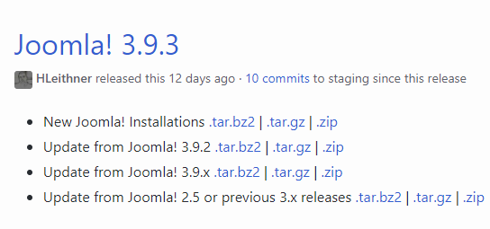
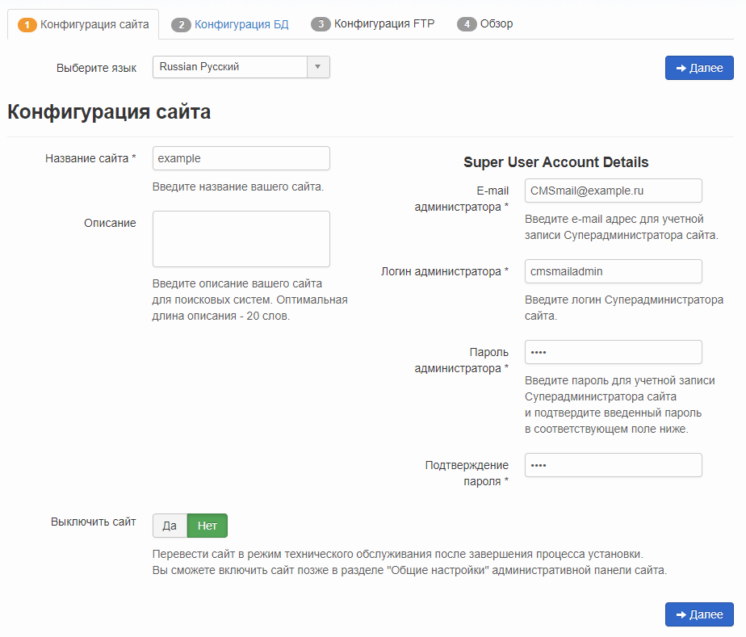
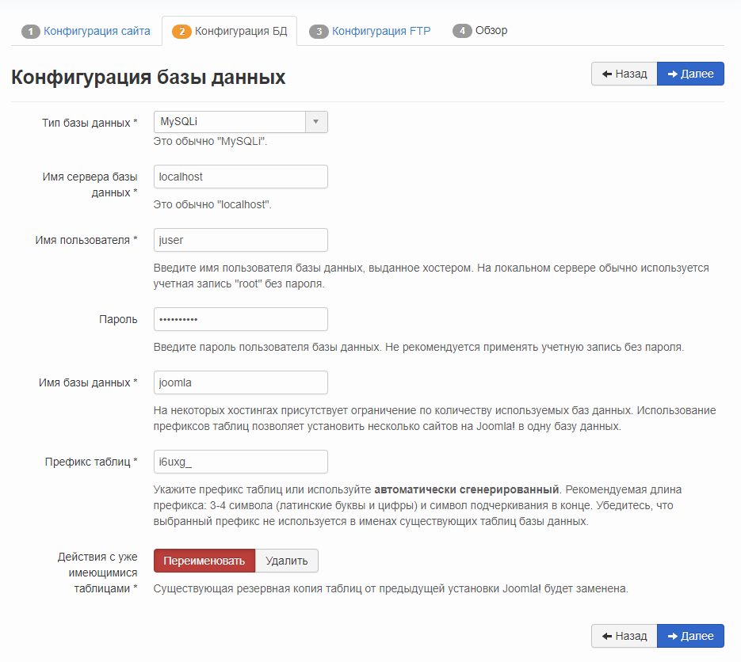
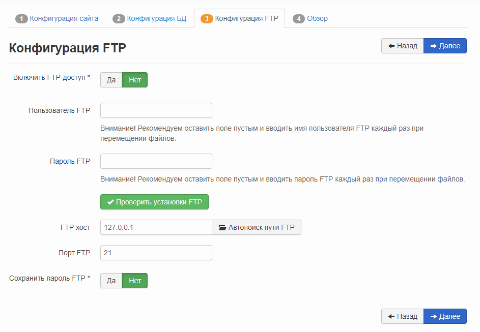
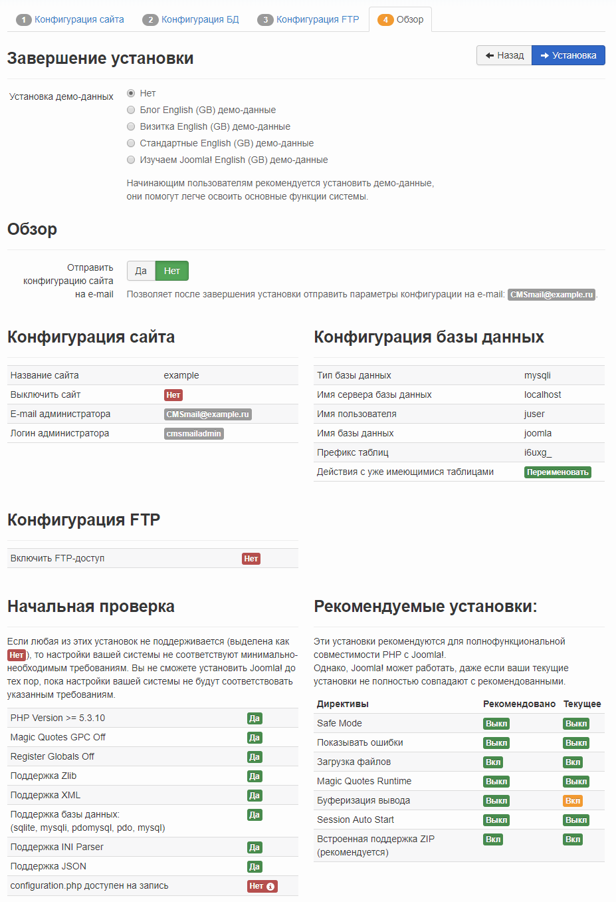
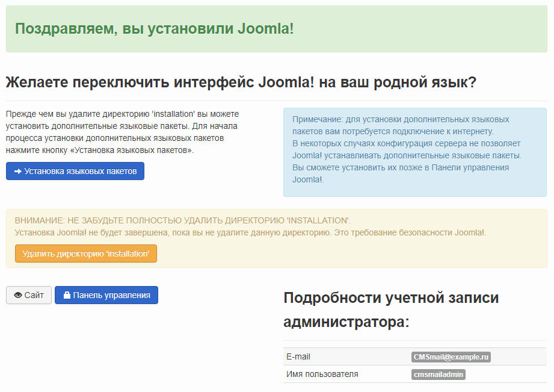
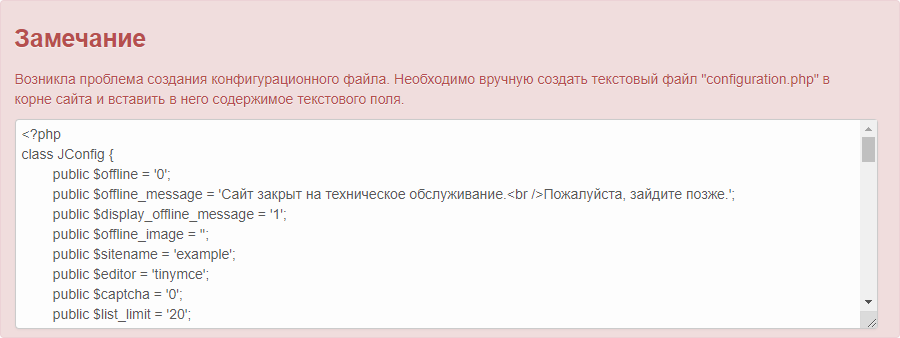

Joomla! is a content management system (CMS) written in PHP and JavaScript and using the MySQL DBMS as a database storage. Joomla! offers native bootstrap, multilingual environment, many different extension modules, as well as high security. Joomla! distributed under the GNU/GPL license and can be used free of charge.

## Requirements

- Operating system CentOS version 7.6.
- A user with access to the sudo command.
- Installed LAMP stack.

If you don't already have the LAMP stack installed:

- You can get a ready-made LAMP stack in the cloud [as a configured virtual machine](https://mcs.mail.ru/app/services/marketplace/) on Ubuntu 18.04 and [install Joomla! on it](https://mcs.mail.ru/help/joomla-on-linux/joomla-ubuntu-18). When registering, you get a free bonus account, which is enough to test the server for several days.
- You can install the LAMP stack yourself. To learn how to install the LAMP stack on CentOS 7.6, [read here](https://mcs.mail.ru/help/lamp-on-linux/lamp-centos-7-6).

## MySQL database setup

To get started with Joomla!, you need to create and set up a dedicated MySQL database. For this:

1. Open a terminal window.
2. To switch to the MySQL shell, run the command:

```
sudo mysql -u root -p
```

Use root authentication, which is exclusive to MySQL.

3. Create a database for Joomla! using the command:

```
CREATE DATABASE database_name;
```

For example:

```
CREATE DATABASE joomla;
```

<warn>

**Attention**

Each MySQL DBMS command must be followed by a semicolon.

</warn>

4. Create a user with full access rights to the created database and assign a password to it using the command:

```
CREATE USER username@localhost IDENTIFIED BY 'password';
```

For example:

```
CREATE USER [juser@localhost](mailto:juser@localhost) IDENTIFIED BY 'mypassword';
```

5. Grant the user the necessary privileges to create and modify database tables by running the command:

```
GRANT ALL PRIVILEGES ON dbasename.\* TO username@localhost;
```

For example:

```
GRANT ALL PRIVILEGES ON joomla.\* TO [juser@localhost](mailto:juser@localhost);
```

6. Update the granting of privileges to database tables by running the command:

```
FLUSH PRIVILEGES;
```

7. Exit the MySQL shell by running the command:

```
exit
```

## Preparing to install Joomla!

Before installing Joomla!:

1. Go to [website](https://github.com/joomla/joomla-cms/releases) and note the latest Joomla! version number:



2. Open a terminal window.
3. Change to your home directory by running the command:

```
cd ~
```

4. Create a temporary directory `tempJL` by running the command:

```
mkdir tempJL
```

5. Change to the created directory by running the command:

```
cd ~/tempJL
```

6. Download the latest version of Joomla! by running the command:

```
wget https://github.com/joomla/joomla-cms/releases/download/<version number>/Joomla_<version number>-Stable-Full_Package.tar.gz
For example: wget [https://github.com/joomla/joomla-cms/releases/download/3.9.3/Joomla_3.9.3-Stable-Full_Package.tar.gz](https://github.com/joomla/joomla -cms/releases/download/3.9.3/Joomla_3.9.3-Stable-Full_Package.tar.gz)
```

7. Create the `Joomla` folder by running the command:

```
sudo mkdir /var/www/html/joomla
```

8. Unpack and move the files from the current directory to the `/var/www/html/Joomla` directory by running the command:

```
sudo tar -xvzf Joomla_<version number>-Stable-Full_Package.tar.gz -C /var/www/html/joomla
```

For example:

```
sudo tar -xvzf Joomla_3.9.3-Stable-Full_Package.tar.gz -C /var/www/html/joomla
```

9. Remove the temporary directory `tempJL` by running the command:

```
rm -Rf ~/tempJL
```

10. Change the owner of directories and files in the root directory of the web server using the command:

```
sudo chown -R username:apache /var/www/html/
```

where `username` is the name of the sudo user, `apache` is the name of the group
For example:

```
sudo chown -R apache:apache /var/www/html/joomla
```

<info>

**Note**

To avoid Apache web server errors when running scripts, use the default apache username and the default apache group name.

</info>

11. If you need to grant access to the web server root directory files to another user, include this user in the apache group using the command:

```
sudo usermod -a -G apache username
```

For example:

```
sudo usermod -a -G apache user
```

12. Настройте права доступа к файлам и папкам, выполнив команду:

```
sudo chmod -R 755 /var/www/
```

13. Перезагрузите веб-сервер Apache, выполнив команду:

```
sudo systemctl restart httpd.service
```

## Установка Joomla!

Для установки Joomla! в адресной строке веб-браузера укажите:

```
http://<внешний IP-адрес веб-сервера>/joomla
```

Нажмите клавишу **Enter**. В результате будет запущен мастер установки Joomla!, следуйте его указаниям:

1.  На странице **Конфигурация сайта** укажите название сайта, информацию для учетной записи администратора и нажмите кнопку **Далее**:

****

2.  На странице **Конфигурация базы данных** укажите настройки базы данных и нажмите кнопку **Далее**:

<info>

**Примечание**

В настройках базы данных укажите имя пользователя базы данных, пароль и имя базы данных, которые вы выбрали при настройке СУБД MySQL.

</info>

****

3.  При необходимости на странице **Конфигурация FTP** настройте параметры доступа к сайту для протокола FTP и нажмите кнопку **Далее**:

****

4.  На последней странице проверьте выбранные параметры Joomla!, при необходимости отправьте их по электронной почте и нажмите кнопку **Установка**:

****

5.  Когда Joomla! будет установлена, отобразится страница с соответствующей информацией:

****

6.  Если отобразилось сообщение о проблеме создания конфигурационного файла:

****

Выполните следующее:

- Скопируйте код, находящийся в окне сообщения, в буфер.
- Откройте окно терминала.
- Создайте файл `configuration.php`, выполнив команду:

```
sudo nano /var/www/html/joomla/configuration.php
```

- В файл `configuration.php` вставьте код из буфера.
- Сохраните изменения, используя сочетание клавиш CTRL+O.
- Завершите редактирование, используя сочетание клавиш CTRL+X.

7.  Чтобы завершить установку Joomla!, удалите директорию `Installation`. Для этого откройте окно терминала и выполните команду:

```
sudo rm -rf /var/www/html/joomla/installation/
```

8.  Для перехода на главную страницу вашего сайта нажмите кнопку **Сайт**:

****
