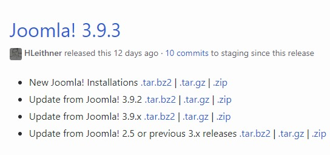
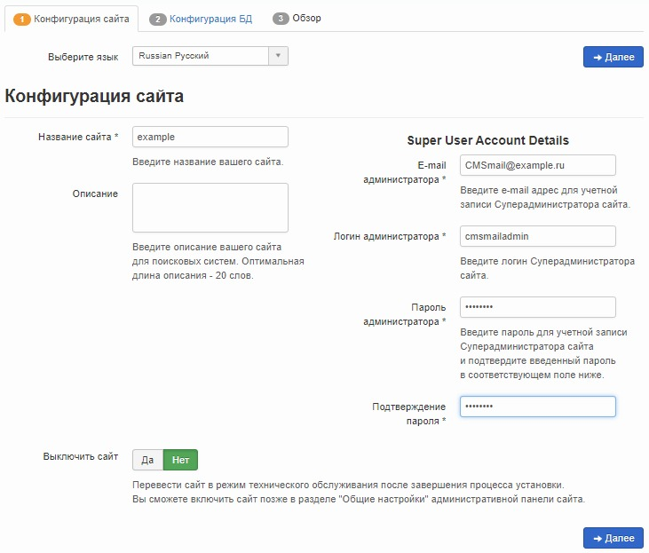
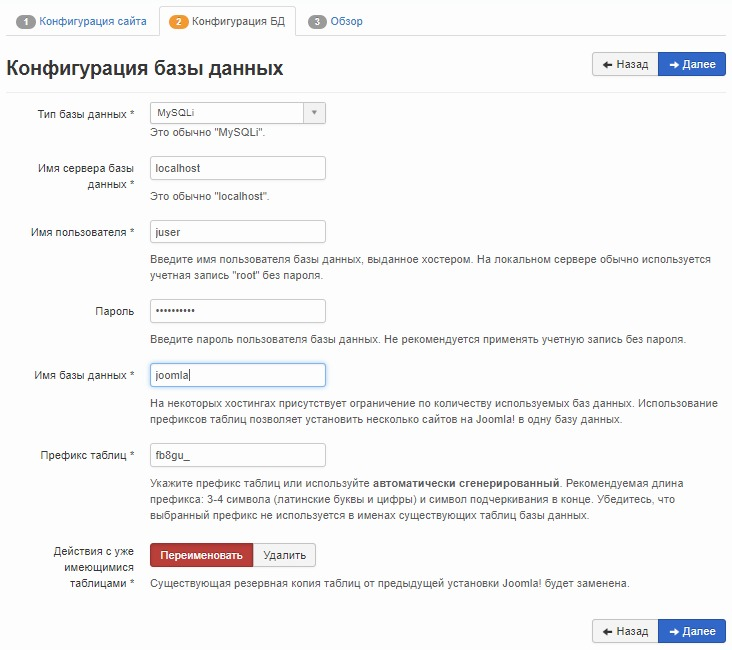
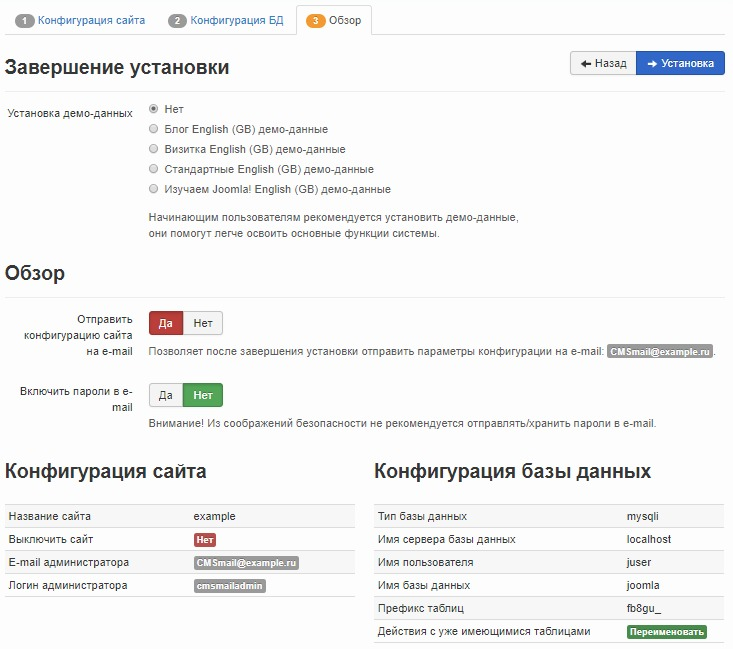
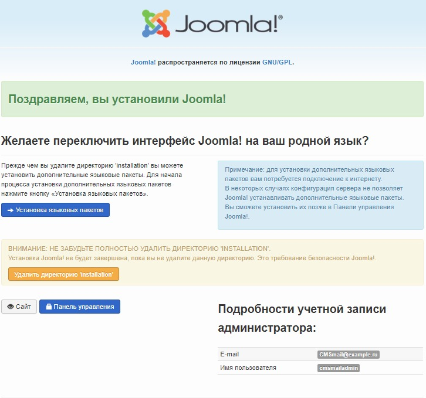
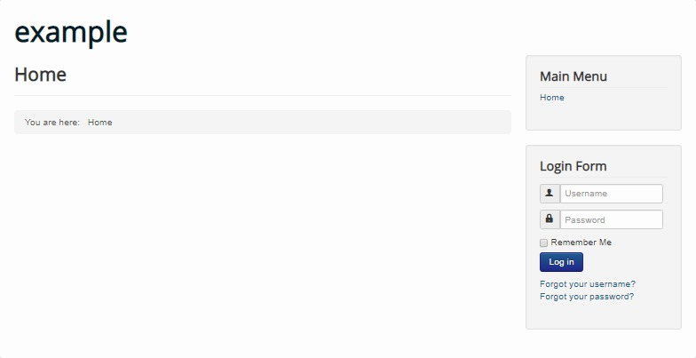

Joomla! - система управления содержимым (CMS), написанная на языках PHP и JavaScript и использующая в качестве хранилища базы данных СУБД MySQL. Joomla! предлагает нативный bootstrap, мультиязычную среду, множество всевозможных модулей расширений, а также высокую безопасность. Joomla! распространяется по лицензии GNU/GPL и может использоваться бесплатно.

## Требования

- Операционная система openSUSE версии 42.3.
- Пользователь с доступом к команде sudo.
- Установленный стек LAMP.

Если у вас еще не установлен стек LAMP:

- Вы можете получить готовый стек LAMP в облаке [в виде настроенной виртуальной машины](https://mcs.mail.ru/app/services/marketplace/) на Ubuntu 18.04 и [установить Joomla! на нем](https://mcs.mail.ru/help/joomla-on-linux/joomla-ubuntu-18). При регистрации вы получаете бесплатный бонусный счет, которого хватает, чтобы тестировать сервер несколько дней.
- Вы можете установить стек LAMP самостоятельно. О том, как установить стек LAMP на OpenSUSE 42.3, [читайте тут](https://mcs.mail.ru/help/lamp-on-linux/lamp-opensuse-42).

## Настройка СУБД MySQL (mariadb)

Чтобы начать работу с Joomla!, необходимо создать и настроить выделенную базу данных MySQL. Для этого:

1.  Откройте окно терминала.
2.  Для перехода в оболочку MySQL (mariadb) выполните команду:

```
sudo mysql -u root -p 
```

Используйте аутентификацию учетной записи root, которая относится исключительно к СУБД MySQL.

3.  Создайте базу данных для Joomla!, используя команду:

```
CREATE DATABASE имя_базы;
Например: CREATE DATABASE joomla;
```

**Внимание**

После каждой команды СУБД MySQL должна ставиться точка с запятой.

4.  Создайте пользователя с правами полного доступа к созданной базе данных и назначьте ему пароль, используя команду:

```
CREATE USER имя_пользователя@localhost IDENTIFIED BY 'пароль';
Например: CREATE USER [juser@localhost](mailto:juser@localhost) IDENTIFIED BY 'mypassword';
```

5.  Предоставьте пользователю необходимые привилегии для создания и изменения таблиц базы данных, выполнив команду:

```
GRANT ALL PRIVILEGES ON  имя_базы.\* TO имя_пользователя@localhost;
Например: GRANT ALL PRIVILEGES ON joomla.\* TO [juser@localhost](mailto:juser@localhost);
```

6.  Актуализируйте предоставление привилегий к таблицам базы данных, выполнив команду:

```
FLUSH PRIVILEGES;
```

7.  Выйдите из оболочки MySQL, выполнив команду:

```
exit
```

## Подготовка к установке Joomla!

Перед установкой Joomla!:

1.  Перейдите на сайт [https://github.com/joomla/joomla-cms/releases](https://github.com/joomla/joomla-cms/releases) и запомните номер последней версии Joomla!

****

2.  Откройте окно терминала.
3.  В брандмауэре ОС откройте сервису apache доступ к порту 80. Для этого измените конфигурацию брандмауэра:

- Откройте файл SUSEfirewall2 для редактирования, выполнив команду:

```
sudo nano /etc/sysconfig/SuSEfirewall2

```

- В файле SUSEfirewall2 найдите строку:

```
FW_CONFIGURATIONS_EXT=""

```

и замените ее на строку:

```
FW_CONFIGURATIONS_EXT="apache2"

```

- Сохраните изменения, используя сочетание клавиш CTRL+O, и завершите редактирование, используя сочетание клавиш CTRL+X.

4.  Перезагрузите брандмауэр SUSEfirewall2, выполнив команду:

```
sudo systemctl restart SUSEfirewall2

```

5.  Установите дополнительные пакеты PHP, выполнив команду:

```
sudo zypper install php7-bz2 php7-curl php7-gd php7-gettext php7-mbstring php7-openssl php7-zip pwgen php7-zlib

```

6.  Перейдите в домашний каталог, выполнив команду:

```
cd ~
```

7.  Создайте временный каталог tempJL, выполнив команду:

```
mkdir tempJL
```

8.  Перейдите в созданный каталог, выполнив команду:

```
cd ~/tempJL
```

9.  Скачайте последнюю версию Joomla!, выполнив команду:

```
wget https://github.com/joomla/joomla-cms/releases/download/<номер версии>/Joomla_<номер версии>-Stable-Full_Package.tar.gz
Например: wget [https://github.com/joomla/joomla-cms/releases/download/3.9.3/Joomla_3.9.3-Stable-Full_Package.tar.gz](https://github.com/joomla/joomla-cms/releases/download/3.9.3/Joomla_3.9.3-Stable-Full_Package.tar.gz)
```

10. Создайте папку /var/www/html/joomla, выполнив команду:

```
sudo mkdir /var/www/html/joomla
```

11. Распакуйте и переместите файлы из текущего каталога в каталог /var/www/html/Joomla, выполнив команду:

```
sudo tar -xvzf Joomla_<номер версии>-Stable-Full_Package.tar.gz -C /var/www/html/joomla
Например: sudo tar -xvzf Joomla_3.9.3-Stable-Full_Package.tar.gz -C /var/www/html/joomla
```

12. Удалите временный каталог tempJL, выполнив команду:

```
rm -Rf ~/tempJL
```

13. Сделайте пользователя wwwrun, от имени которого запускается сервис apache, владельцем корневого каталога, используя команду:

```
sudo chmod -R 775 /srv/www/htdocs/

```

14. Чтобы настроить Joomla!, создайте конфигурационный файл /etc/apache2/conf.d/joomla.conf, выполнив команду:

```
sudo nano /etc/apache2/conf.d/joomla.conf

```

15. В файл /etc/apache2/conf.d/joomla.conf добавьте следующие строки:

```
<VirtualHost \*:80>
DirectoryIndex index.php
DocumentRoot /srv/www/htdocs/joomla
ServerName <внешний IP-адрес вашего веб-сервера>
<Directory /srv/www/htdocs/joomla>
Options FollowSymLinks
AllowOverride All
Require all granted
</Directory>
</VirtualHost>
```

Сохраните изменения, используя сочетания клавиш CTRL+O, и завершите редактирование, используя сочетание клавиш CTRL+X.

16. Перезагрузите веб-сервер Apache, выполнив команду:

```
sudo systemctl restart apache2

```

## Установка Joomla!

Для установки Joomla! в адресной строке веб-браузера укажите:

```
http://<внешний IP-адрес веб-сервера>/joomla
```

Нажмите клавишу **Enter**. В результате будет запущен мастер установки Joomla!, следуйте его указаниям:

1.  На странице **Конфигурация сайта** укажите название сайта, информацию для учетной записи администратора и нажмите кнопку **Далее**:

****

2.  На странице **Конфигурация базы данных** укажите настройки базы данных и нажмите кнопку **Далее**:

****

**Примечани**.

В настройках базы данных укажите имя пользователя базы данных, пароль и имя базы данных, которые вы выбрали при настройке СУБД MySQL.

3.  На последней странице проверьте выбранные параметры Joomla!, при необходимости отправьте их по электронной почте и нажмите кнопку **Установка**:

****

4.  Когда Joomla! будет установлена, отобразится страница с соответствующей информацией:

****

5.  Чтобы завершить установку Joomla!, удалите директорию Installation. Для этого нажмите кнопку **Удалить директорию Installation**.

6.  Для перехода на главную страницу вашего сайта нажмите кнопку **Сайт**.

****

**Обратная связь**

Возникли проблемы или остались вопросы? [Напишите нам, мы будем рады вам помочь](https://mcs.mail.ru/help/contact-us).
