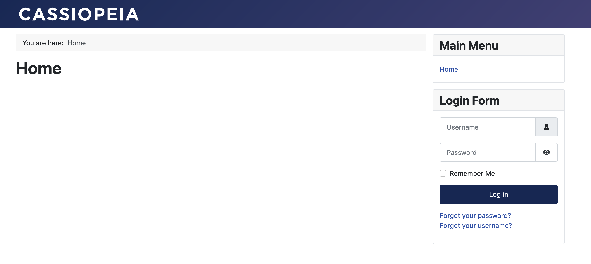

[Joomla!](https://www.joomla.org) is a content management system (CMS) written in PHP and JavaScript languages and using MySQL DBMS as a database storage.

This instruction will help you deploy CMS Joomla version 4.3.4 in the Almalinux 9 operating system in VK Cloud, as well as configure a DNS record for domain name access. MySQL 8.0 Single configuration is used as a DBMS.

## 1. Preparatory steps

1. [Register](/en/additionals/start/get-started/account-registration#registration_in_the_personal_account) at VK Cloud personal account.
1. [Confirm](/en/additionals/start/get-started/account-registration#account_confirmation) your account.
1. [Create](/en/networks/vnet/operations/manage-net#creating_a_network) `network1` network with internet access and a subnet with the address `10.0.0.0/24`.
1. [Create VM](/en/base/iaas/instructions/vm/vm-create):

   - name: `Almalinux_9_Joomla`;
   - operating system: Almalinux 9;
   - network: `network1` with subnet `10.0.0.0/24`;
   - assign a public IP address. The example will use `87.239.105.44`;
   - security groups (firewall settings): `default`, `ssh+www`.

1. [Create DB instance](/en/dbs/dbaas/instructions/create):

   - name: `MySQL-7313`;
   - DBMS: MySQL 8.0;
   - configuration type: Single;
   - network: `network1`;
   - DB name: `MySQL-7313`;
   - DB username: `user`;
   - DB password: `AN0r25e0ae4d626p`;

   In the example, the internal IP of the created instance: `10.0.0.7`.

1. [Create](/en/networks/dns/publicdns#creating_a_zone) DNS zone.

   <warn>

   Make sure that the DNS zone is delegated successfully and the NS records are configured correctly: the zone must have the status **NS records are configured correctly**.

   </warn>

1. [Create](/en/networks/dns/publicdns#adding_resource_records) an record in the selected zone:

   - record type: `A`;
   - name: for example, `site-joomla.example.vk.cloud`;
   - IP address: external VM address `87.239.105.44`.

1. (Optional) Check the name resolution to the IP address using the command `nslookup site-joomla.example.vk.cloud`. Output upon successful operation:

   ```bash
   Non-authoritative answer:
   Name:   site-joomla.example.vk.cloud
   Address: 87.239.105.44
   ```

## 2. Install Joomla! on VM

1. [Connect](/en/base/iaas/instructions/vm/vm-connect/vm-connect-nix) to the `Almalinux_9_Joomla` VM.
1. Update the packages to the current version and reboot the VM using the commands:

   ```bash
   sudo dnf update -y
   sudo systemctl reboot
   ```

1. Download the necessary repositories by sequentially executing the commands:

   ```bash
   sudo dnf install https://dl.fedoraproject.org/pub/epel/epel-release-latest-9.noarch.rpm -y
   sudo dnf install https://rpms.remirepo.net/enterprise/remi-release-9.rpm -y
   sudo dnf module enable php:remi-8.2 -y
   sudo dnf install wget httpd php php-mysqlnd php-gd php-xml php-mbstring php-intl php-pecl-zip -y
   ```

1. Launch the httpd daemon:

   ```bash
   sudo systemctl enable httpd.service --now
   ```

1. Download the Joomla CMS repository! and deploy it in the `joomla` subdirectory on the running web server:

   ```bash
   wget https://github.com/joomla/joomla-cms/releases/download/4.3.4/Joomla_4.3.4-Stable-Full_Package.tar.gz
   sudo mkdir -p /var/www/html/joomla
   sudo tar xzf Joomla_4.3.4-Stable-Full_Package.tar.gz -C /var/www/html/joomla/
   sudo chown -R apache:apache /var/www/html/joomla
   ```

1. Set the SELinux parameters for the correct operation of the web server:

   ```bash
   sudo setsebool -P httpd_enable_cgi on
   sudo setsebool -P httpd_unified on
   sudo setsebool -P httpd_builtin_scripting on
   sudo setsebool -P httpd_can_network_connect on
   ```

1. In the browser, enter the VM's public IP address with `/joomla`. In the current instruction it is `87.239.105.44/joomla`.
1. In the installation wizard, specify the English language and the name of the site — `site-joomla.example.vk.cloud`.
1. At the “Account Settings” step, specify the CMS administrator credentials.
1. At the “Database Parameters” step of the database, specify the parameters `MySQL-7313`:

   - **Database type**: **MySQL (PDO)**.
   - **Hostname**: `10.0.0.7`.
   - **Database username**: `user`.
   - **Password of the database user**: `AN0r25e0ae4d626p`.
   - **Database name**: `MySQL-7313`.

1. (Optional) Create or delete a file in the directory `/var/www/html/joomla/installation`: the file name and its location will be displayed in the pop-up window of the installation wizard.

## 3. Check the functionality of Joomla!

In the browser, go to `http://site-joomla.example.vk.cloud/joomla/`. Upon successful installation, the CMS Joomla! home page will open.



## Delete unused resources

Deployed virtual resources are charged. If you don't need them anymore:

- [Delete](/en/base/iaas/instructions/vm/vm-manage#deleting_a_vm) `Almalinux_9_Joomla` VM.
- [Delete](/en/dbs/dbaas/instructions/delete) `MySQL-7313` instance.
- If necessary, [delete](/en/networks/vnet/operations/manage-floating-ip#removing_floating_ip_address_from_the_project) `87.239.105.44` floating IP address.
- [Delete](/en/networks/dns/publicdns#deleting_resource_records) `site-joomla.example.vk.cloud` DNS record.
