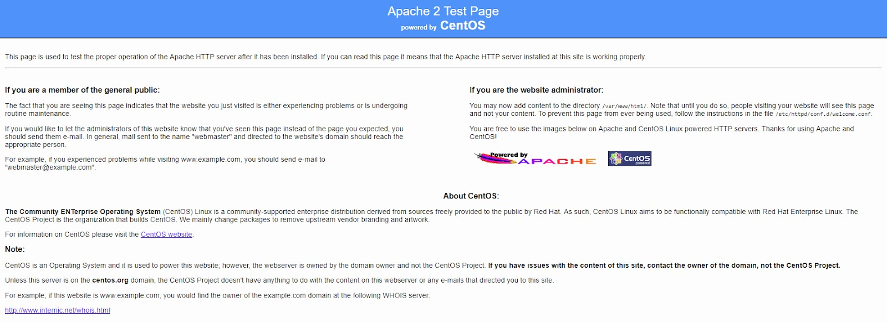
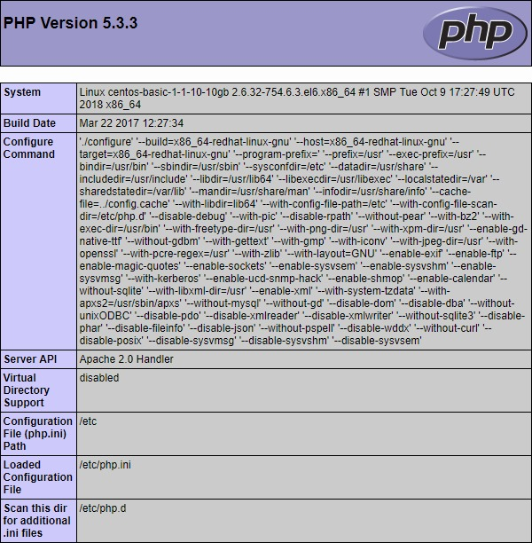

This article describes the installation of the LAMP stack on a Linux operating system - CentOS 6.9.

The LAMP stack includes the Linux operating system, the Apache web server, the MySQL database management system, and a server-side scripting language for processing PHP dynamic content. All this is necessary to support dynamic sites and web applications.

## **How ​​to save time installing a LAMP stack**

You can get a ready-made LAMP stack on Ubuntu 18.04 as a [configured VK Cloud virtual machine](https://mcs.mail.ru/app/services/marketplace/). When registering, you get a free bonus account, which is enough to test the server for several days.

To learn more about LAMP in the app store, go to [Help Center](https://mcs.mail.ru/help/quick-start/-lamp-stack-apachephp).

#### Requirements

- Operating system CentOS 6.9.
- A user with access to the sudo command.

## Preparing to install the LAMP stack

Before installing the LAMP stack, do the following:

1. Open a terminal window.
2. Update the system by running the command:

```
sudo yum update -y
```

Wait for the system update to complete.

3. Install the wget console utility by running the command:

```
sudo yum install wget -y
```

4. Install the nano text editor by running the command:

```
sudo yum install nano -y
```

## Installing and configuring the Apache web server

To install and perform initial configuration of the Apache web server:

1. Open a terminal window.

2. Install the Apache web server by running the command:

```
sudo yum install httpd -y
```

3. Start the Apache web server as a service by running the command:

```
sudo service httpd start
```

4. Open the Apache configuration file by running the command:

```
sudo nano /etc/httpd/conf/httpd.conf
```

5. In this file, find the line:

```
#ServerName www.example.com:80
```

and replace it with the line:

```
ServerName <web server external IP address>:80
```

Save your changes using the keyboard shortcut CTRL+O and finish editing using the keyboard shortcut CTRL+X.

6. Since CentOS 6.9 blocks port 80 by default, which is required for the site to work, open this port by running the command:

```
sudo iptables -I INPUT -p tcp --dport 80 -j ACCEPT

```

7. To prevent this rule from changing after rebooting the operating system, run the command:

```
sudo service iptables save

```

8. Restart the Apache web server by running the command:

```
sudo service httpd restart

```

9. To start the Apache web server as a service automatically when the operating system is restarted, run the command:

```
sudo chkconfig httpd on

```

10. To test the web server, launch a web browser and enter the web server's IP address in the address bar.

If the installation of the Apache web server was successful, you will see a web server test page similar to the following:

****

## MySQL database installation

To install and configure MySQL DBMS:

1. Open a terminal window.

2. Install the MySQL DBMS server by running the command:

```
sudo yum install mysql server -y
```

3. Start MySQL as a service by running the command:

```
sudo service mysqld start

```

4. To automatically start MySQL as a service when the operating system is restarted, run the command:

```
sudo chkconfig mysqld on

```

5. To make changes to the MySQL DBMS server configuration, use the command:

```
sudo mysql_secure_installation
```

This command runs the script to improve the security of the MySQL DBMS server. To set up security:

- Specify a password for the root account.

<warn>

**Attention**

It is recommended that you provide a strong password that is at least 8 characters long and includes at least one uppercase letter, one lowercase letter, one number, and one special character.

</warn>

The root user in this case refers exclusively to the MySQL DBMS and is not a CentOS OS account.

- If necessary, remove anonymous (anonymous) accounts that are created during installation of MySQL DBMS:
  - Answer Y(es) to remove anonymous accounts.
  - Answer N(o) if deleting anonymous accounts is not required.

These accounts are for database testing purposes only and can be deleted in most cases.

- If necessary, prohibit granting remote access to MySQL databases for the root account:
  - Answer Y(es) to disable remote access.
  - Answer N(o) to enable remote access.
- If necessary, delete the test base (Test):
  - Answer Y(es) to remove the base Test.
  - Answer N(o) if you don't want to remove the Test base.

This database is created during installation of the MySQL DBMS server and is intended for testing purposes. Removing the Test database does not affect the operation of the system.

- In response to a request to make changes to the MySQL DBMS and reload table access privileges:
  - Answer Y(es) to make changes and reboot.
  - Answer N(o) if changes and reboot are not required.

## Install PHP

To install PHP:

1. Open a terminal window.
2. Install PHP by running the command:

```
sudo yum install php php-mysql php-devel php-gd php-pecl-memcache php-pspell php-snmp php-xmlrpc php-xml -y

```

3. Restart the Apache web server by running the command:

```
sudo service httpd restart

```

4. Make sure Apache web server renders PHP scripts correctly. For this:

- Create an info.php file by running the command:

```
sudo nano /var/www/html/info.php
```

- In the file info.php put the text:

```
<?php
phpinfo();
?>
```

- Save your changes using the keyboard shortcut CTRL+O.
- Finish editing using the keyboard shortcut CTRL+X.
- In the address bar of the browser, add the line to the web server address:

```
/info.php
```

As a result, the following page should be displayed:

****

<warn>

**Attention**

For security purposes, after checking the system, it is recommended to delete the info.php file by running the command:

```
sudo rm /var/www/html/info.php
```

</warn>
