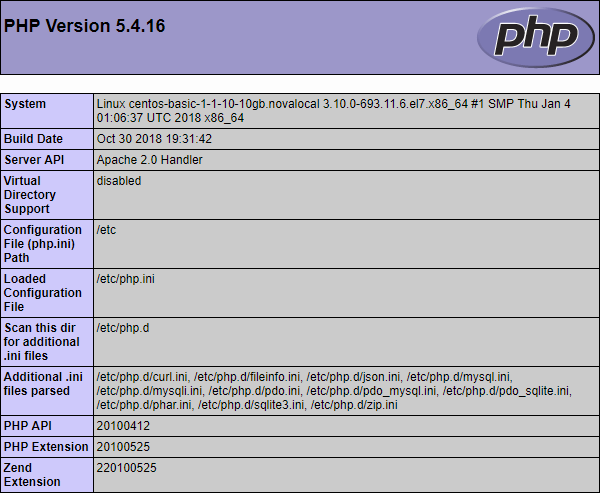

This article describes the installation of the LAMP stack on the operating system of the Linux family - CentOS 7.4

The LAMP stack includes the Linux operating system, the Apache web server, the MySQL database management system, and a server-side scripting language for processing PHP dynamic content. All this is necessary to support dynamic sites and web applications.

## How to save time installing a LAMP stack

You can get a ready-made LAMP stack on Ubuntu 18.04 as a [configured VK Cloud virtual machine](https://mcs.mail.ru/app/services/marketplace/). When registering, you get a free bonus account, which is enough to test the server for several days.

To learn more about LAMP in the app store, go to [Help Center](https://mcs.mail.ru/help/quick-start/-lamp-stack-apachephp).

#### Requirements

- Operating system CentOS 7.4
- User with access to the sudo command

## Preparing to install the LAMP stack

Before installing the LAMP stack, do the following:

1. Open a terminal window
2. Update the system by running the command:

```
sudo yum update -y
```

Wait for the system update to complete

3. Install the wget console utility by running the command:

```
sudo yum install wget -y
```

4. Install the nano text editor by running the command:

```
sudo yum install nano -y
```

## Installing and configuring the Apache web server

To install and perform initial configuration of the Apache web server:

1. Open a terminal window

2. Install the Apache web server by running the command:

```
sudo yum install httpd -y
```

3. Start the Apache web server as a service by running the command:

```
sudo systemctl start httpd.service
```

4. To start the Apache web server as a service automatically when the operating system is restarted, run the command:

```
sudo systemctl enable httpd.service
```

5. To check the configuration of the Apache web server, run the command:

```
apachectl configtest
```

If there are no errors, the following line will be displayed:

```
Syntax OK
```

6. To check the operation of the web server, launch a web browser and enter the IP address of the web server in the address bar

If the installation and configuration of the Apache web server is successful, the following web server default page will be displayed:


## MySQL database installation

To install and configure MySQL DBMS:

1. Open a terminal window

2. Download the MySQL DBMS installation package by running the command:

```
wget http://repo.mysql.com/mysql-community-release-el7-5.noarch.rpm
```

3. Add the MySQL DBMS package to the CentOS OS repository by running the command:

```
sudo rpm -ivh mysql-community-release-el7-5.noarch.rpm
```

4. Install the MySQL DBMS server by running the command:

```
sudo yum install mysql server -y
```

5. Start MySQL as a service by running the command:

```
sudo systemctl start mysqld.service
```

6. To automatically start MySQL as a service when the operating system is restarted, run the command:

```
sudo systemctl enable mysqld.service
```

7. To make changes to the MySQL DBMS server configuration, use the command:

```
sudo mysql_secure_installation
```

This command runs the script to improve the security of the MySQL DBMS server. To set up security:

- Specify a password for the root account

<warn>

**Attention**

Рекомендуется указывать надежный пароль, который содержит не менее 8 символов, включающих по крайней мере одну заглавную букву, одну строчную букву, одну цифру и один специальный символ

</warn>

Пользователь root в данном случае относится исключительно к СУБД MySQL и не является учетной записью ОС CentOS

- При необходимости удалите анонимные (anonymous) учетные записи, которые создаются при установке СУБД MySQL
  - Ответьте Y(es) для удаления анонимных учетных записей
  - Ответьте N(o), если удаление анонимных учетных записей не требуется

Данные учетные записи предназначены только для тестирования БД и в большинстве случаев могут быть удалены

- При необходимости запретите предоставление удаленного доступа к базам СУБД MySQL для учетной записи root:
  - Ответьте Y(es) для отключения возможности удаленного доступа
  - Ответьте N(o), для разрешения удаленного доступа
- При необходимости удалите тестовую базу (Test)
  - Ответьте Y(es) для удаления базы Test
  - Ответьте N(o), если удаление базы Test не требуется

Данная база создается при установке сервера СУБД MySQL и предназначена для тестирования. Удаление базы Test не влияет на работу системы

- В ответ на запрос на внесение изменений в СУБД MySQL и перезагрузку привилегий доступа к таблицам:
  - Ответьте Y(es) для внесения изменений и перезагрузки
  - Ответьте N(o), если внесение изменений и перезагрузка не требуются

## Установка PHP

Для установки PHP:

1.  Откройте окно терминала
2.  Установите PHP, выполнив команду:

```
sudo yum install php php-mysql php-gd php-xml -y
```

3.  Перезагрузите веб-сервер Apache, выполнив команду:

```
sudo systemctl restart httpd.service
```

4.  Убедитесь, что веб-сервер Apache корректно отображает скрипты PHP. Для этого:

- Создайте файл info.php, выполнив команду:

```
sudo nano /var/www/html/info.php
```

- В файл info.php поместите текст:

```
<?php
    phpinfo();
?>
```

- Сохраните внесенные изменения, используя сочетание клавиш CTRL+O
- Завершите редактирование, используя сочетание клавиш CTRL+X
- В адресной строке браузера к адресу веб-сервера добавьте строку:

```
/info.php
```

В результате должна отобразиться примерно следующая страница:



<warn>

**Внимание**

В целях безопасности после проверки системы рекомендуется удалить файл info.php, выполнив команду:

```
sudo rm /var/www/html/info.php
```

</warn>

## **Обратная связь**

Возникли проблемы или остались вопросы? [Напишите нам, мы будем рады вам помочь](https://mcs.mail.ru/help/contact-us)!
