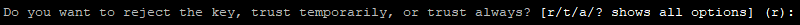
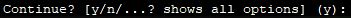
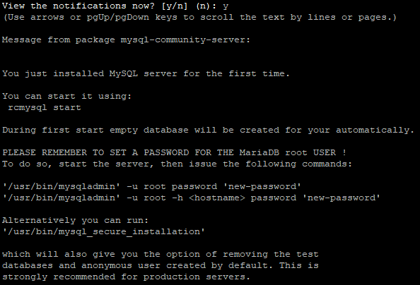
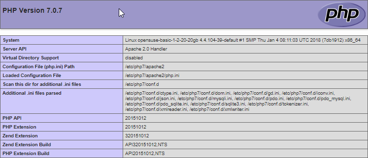

This article describes how to install a LAMP stack on a Linux operating system - openSUSE 42.3.

The LAMP stack includes the Linux operating system, the Apache web server, the MySQL database management system, and a server-side scripting language for processing PHP dynamic content. All this is necessary to support dynamic sites and web applications.

## How to save time installing a LAMP stack

You can get a ready-made LAMP stack on Ubuntu 18.04 as a [configured VK Cloud virtual machine](https://mcs.mail.ru/app/services/marketplace/). When registering, you get a free bonus account, which is enough to test the server for several days.

To learn more about LAMP in the app store, go to [Help Center](/en/additionals/mp/mp-apps/mp-lamp-stack).

#### Requirements

- Operating system openSUSE version 42.3.
- A user with access to the sudo command.

## Preparing to install the LAMP stack

Before installing the LAMP stack:

1. Open a terminal window.
2. Update the repository and installation packages by running the command:

```
sudo zipper update
```

During the execution of this command, enter an additional argument that is responsible for the trust method for the signed security key:



- If for some reason you want to reject this key and cancel the update, enter **r**.
- If you trust this key only for the duration of the current update, enter **t**.
- If this key will always be used when updating the repository or installation packages, enter **a** (in most cases, this option is preferred).

To start the update, enter **y**:



3. Install the Nano text editor by running the command:

```
sudo zypper install nano
```

To install the editor, enter **y**.

## Installing and configuring the Apache web server

To install and perform initial configuration of the Apache web server:

1. Open a terminal window.
2. Install the Apache web server by running the command:

```
sudo zypper install apache2
```

To install a web server, enter **y**.

3. Start the Apache web server as a service by running the command:

```
sudo systemctl start apache2
```

4. To start the Apache web server as a service automatically when the operating system is restarted, run the command:

```
sudo systemctl enable apache2
```

5. To check the configuration of the Apache web server, run the command:

```
sudo apachectl configtest
```

If there are no errors, the following line will be displayed:

```
Syntax OK
```

6. To test access to the Apache web server:

- Create an index.html file by running the command:

```
sudo nano /srv/www/htdocs/index.html
```

- In the index.html file, add the following lines:

```
<html>
<body>
<h1>Test access</h1>
</body>
</html>
```

- Save changes to the file using the keyboard shortcut CTRL+O.
- Finish editing using the keyboard shortcut CTRL+X.
- Launch a web browser and enter the public IP address of the Apache web server in the address bar.

If the installation of the Apache web server was successful, a page containing the following line will open:


## Install MySQL DBMS (mariadb)

To install and configure MySQL DBMS:

1. Open a terminal window.
2. Install the MySQL server by running the command:

```
sudo zypper install mariadb mariadb-client mariadb-tools
```

To install the MySQL server, enter **y**.

3. To view help information, when the MySQL server installation is complete, type **y**:



4. Start MySQL as a service by running the command:

```
sudo systemctl start mysql.service
```

5. To automatically start MySQL as a service when the operating system is restarted, run the command:

```
sudo systemctl enable mysql.service
```

6. To make changes to the MySQL DBMS server configuration, use the command:

```
sudo mysql_secure_installation
```

This command runs the script to improve the security of the MySQL DBMS server. To set up security:

- Specify a password for the root account.

<warn>

**Attention**

It is recommended that you provide a strong password that is at least 8 characters long and includes at least one uppercase letter, one lowercase letter, one number, and one special character.

</warn>

The root user in this case refers exclusively to the MySQL DBMS and is not an OS account.

- If necessary, remove anonymous (anonymous) accounts that are created during installation of MySQL DBMS:
  - Answer Y(es) to remove anonymous accounts.
  - Answer N(o) if deleting anonymous accounts is not required.

These accounts are for database testing purposes only and can be deleted in most cases.

- If necessary, prohibit granting remote access to MySQL databases for the root account:
  - Answer Y(es) to disable remote access.
  - Answer N(o) to enable remote access.
- If necessary, delete the test base (Test):
  - Answer Y(es) to remove the base Test.
  - Answer N(o) if you don't want to remove the Test base.

This database is created during installation of the MySQL DBMS server and is intended for testing purposes. Removing the Test database does not affect the operation of the system.

- In response to a request to make changes to the MySQL DBMS and reload table access privileges:
  - Answer Y(es) to make changes and reboot.
  - Answer N(o) if changes and reboot are not required.

## Install PHP

To install PHP:

1. Open a terminal window.
2. Install PHP by running the command:

```
sudo zypper install php7 php7-mysql apache2-mod_php7
```

To install PHP, enter **y**.

3. Activate the PHP module by running the command:

```
sudo a2enmod php7
```

4. Restart the Apache web server by running the command:

```
sudo systemctl restart apache2
```

5. Make sure the Apache web server renders PHP scripts correctly. For this:

- Create an info.php file by running the command:

```
sudo nano /srv/www/htdocs/info.php
```

- In the file info.php put the text:

```
<?php
phpinfo();
?>
```

- Save your changes using the keyboard shortcut CTRL+O.
- Finish editing using the keyboard shortcut CTRL+X.
- In the address bar of the browser, add the line to the web server address:

```
/info.php
```

As a result, the following page should be displayed:



<warn>

**Attention**

For security purposes, after checking the system, it is recommended to delete the info.php file by running the command:

```
sudo rm /srv/www/htdocs/info.php
```

</warn>
