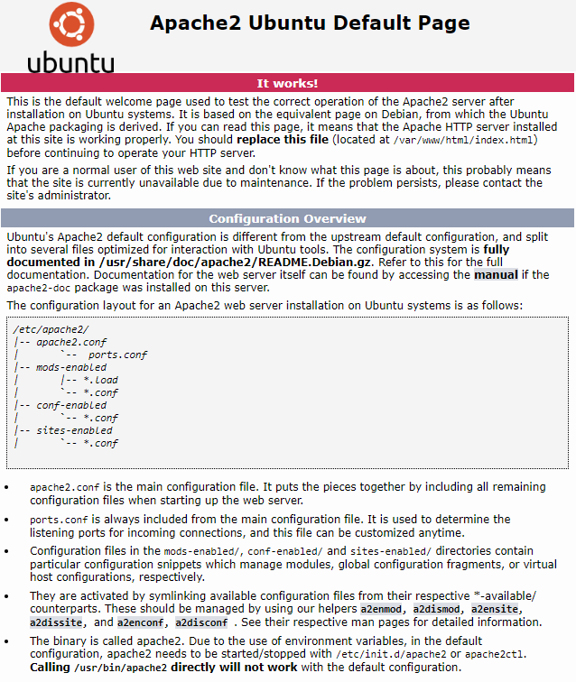
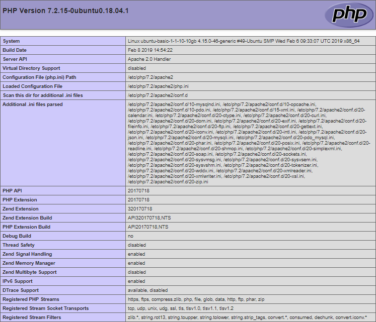

This article describes how to install a LAMP stack on a Linux operating system - Ubuntu 18.04.

The LAMP stack includes the Linux operating system, the Apache web server, the MySQL database management system, and a server-side scripting language for processing PHP dynamic content. All this is necessary to support dynamic sites and web applications.

## How to save time installing a LAMP stack

You can get a ready-made LAMP stack on Ubuntu 18.04 as a [configured VK Cloud virtual machine](https://mcs.mail.ru/app/services/marketplace/). When registering, you get a free bonus account, which is enough to test the server for several days.

To learn more about LAMP in the app store, go to [Help Center](/en/additionals/mp/mp-apps/mp-lamp-stack).

#### Requirements

- Operating system Ubuntu version 18.04.
- A user with access to the sudo command.

## Installing and configuring the Apache web server

To install and perform initial configuration of the Apache web server:

1. Open a terminal window.
2. Update the lists of installation packages to the latest versions by running the command:
    ```
    sudo apt-get update
    ```
3. Install the latest version of the Apache web server and additional modules by running the command:

    ```
    sudo apt install apache2 apache2-utils
    ```

    Agree to install the Apache web server by answering Y(es).

4. Open the apache2.conf configuration file for editing by running the command:
    ```
    sudo nano /etc/apache2/apache2.conf
    ```
5. In the apache2.conf file:
    - At the end, add the line ServerName <web server's external IP address>.
    - Save your changes using the keyboard shortcut CTRL+O.
    - Finish editing using the keyboard shortcut CTRL+X.
6. To check the configuration and current state of the Apache web server, run the command:

    ```
    sudo apache2ctl configtest
    ```

    If there are no errors, the following line will be displayed:

    ```
    Syntax OK
    ```

7. To apply the changes, restart the Apache web server by running the command:
    ```
    sudo systemctl restart apache2
    ```
8. To test the operation of the web server, launch a web browser and enter the IP address of the web server in the address bar.

If the installation and configuration of the Apache web server is successful, the following web server default page will be displayed:



## MySQL database installation

To install and configure MySQL DBMS:

1. Open a terminal window.
2. Install the MySQL DBMS server by running the command:

    ```
    sudo apt-get install mysql-server
    ```

    Agree with the installation of the MySQL DBMS server by answering Y(es).

3. To make changes to the MySQL DBMS server configuration, use the command:

```
sudo mysql_secure_installation
```

This command runs the script to improve the security of the MySQL DBMS server. To set up security:

- Enter the password for the root account, which was set at the beginning of the installation of the MySQL DBMS server.
- If necessary, run the password validation plugin (VALIDATE PASSWORD PLUGIN):

- Answer Y(es) to enable the validation plugin.
- Answer N(o) if password validation is not required.

<info>

**Note**

The password validation plugin allows you to apply security criteria to MySQL DBMS account passwords. All passwords that do not meet certain security criteria are considered insecure. This can lead to errors when working with software packages that have access to the MySQL DBMS account configuration.

</info>

There are three levels of password strength available for the password validation plugin:

0 - simple (low) security level requires using at least 8 letters in the password;

1 - medium (medium) level of security requires the use of at least 8 characters in the password, which must include numbers, letters in upper and lower case, as well as special characters;

2 - high (strong) level of reliability requires the use of at least 8 characters in the password, which must include numbers, uppercase and lowercase letters, special characters, and also prohibits the use of common words as a password that can be selected with a high probability from a dictionary .

- If necessary, change the current root account password:

- Answer Y(es) to change the current password.
- Answer N(o) if password change is not required.

By default, no password is set. It is recommended to use a strong password.

<warn>

**Attention**

The root user in this case refers exclusively to the MySQL DBMS and is not an Ubuntu OS account.

</warn>
- If necessary, remove anonymous (anonymous) accounts that are created during installation of MySQL DBMS:

- Answer Y(es) to remove anonymous accounts.
- Answer N(o) if deleting anonymous accounts is not required.

These accounts are for database testing purposes only and can be deleted in most cases.

- If necessary, disable remote access to the MySQL DBMS for the root account:
  - Answer Y(es) to disable remote access.
  - Answer N(o) to allow remote access.
- If necessary, delete the test base (Test):
  - Answer Y(es) to remove the base Test.
  - Answer N(o) if you don't want to remove the Test base.

This database is created during installation of the MySQL DBMS server and is intended for testing purposes. Removing the Test database does not affect the operation of the system.

- In response to a request to make changes to the MySQL DBMS and reload table access privileges:
  - Answer Y(es) to make changes and reboot.
  - Answer N(o) if changes and reboot are not required.

## Install PHP and additional packages

To install PHP and additional packages that may be required to run and set up WordPress:

1. Open a terminal window.
2. To install PHP along with additional packages, use the command:

    ```
    sudo apt-get install php libapache2-mod-php php-cli php-intl php-mysql php-curl php-gd php-soap php-xml php-zip php-readline php-opcache php-json


    ```

Answer Y(es) to install.

3. Make sure the Apache web server renders PHP scripts correctly. For this:

- Create an info.php file by running the command:

```
sudo nano /var/www/html/info.php
```

- In the file info.php put the text:

```
<?php
    phpinfo();
?>
```

- Save your changes using the keyboard shortcut CTRL+O.
- Finish editing using the keyboard shortcut CTRL+X.
- In the address bar of the browser, add the line to the web server address:

```
/info.php
```

As a result, the following page should be displayed:



<warn>

**Attention**

For security purposes, after checking the system, it is recommended to delete the info.php file by running the command:

```
sudo rm /var/www/html/info.php
```

</warn>
