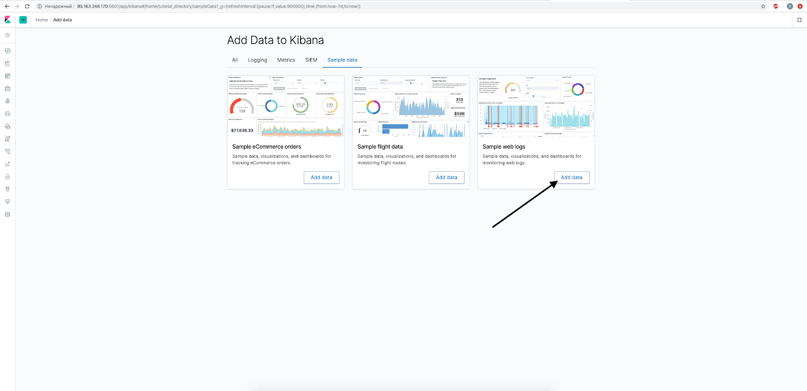
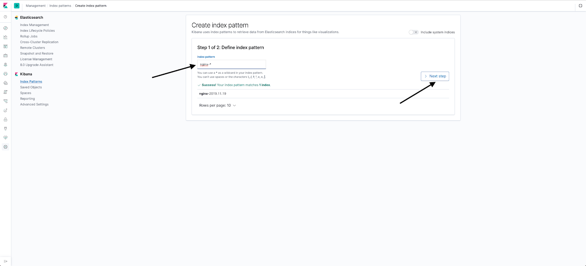
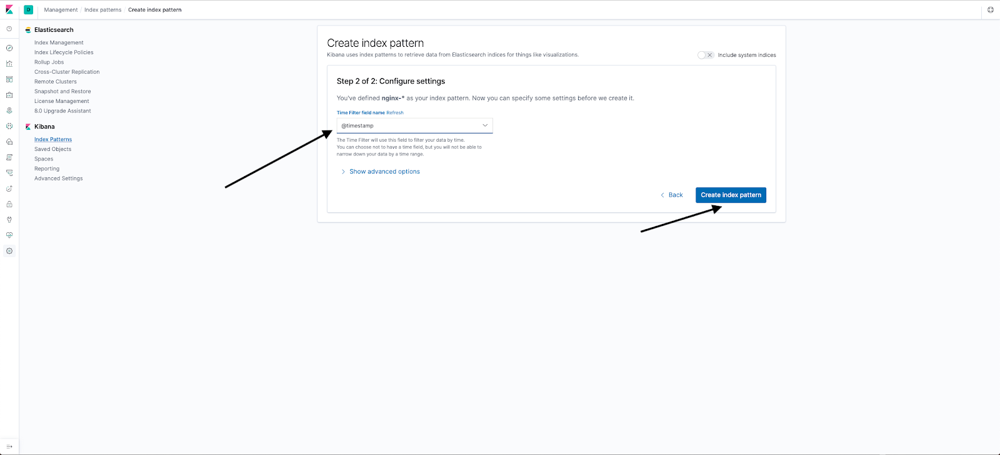
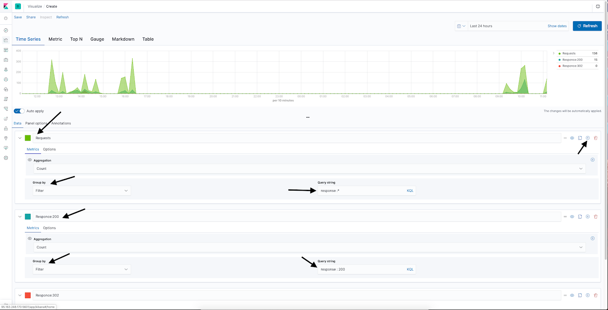

## Hardware configuration

This scenario requires an installed and configured server for ELK on Ubuntu 18.04 LTS x86_64.

<warn>

**Attention!**

If you use other servers and hardware, some script steps may differ from those described below.

</warn>

## Scheme of work

****

The ELK stack consists of three components:

- Elasticsearch — an engine for storing, indexing and processing data in a shared storage, as well as for full-text data search.
- Logstash — a utility for collecting, filtering, aggregating, changing and then redirecting the source data to the final storage.
- Kibana — a web interface for viewing and analyzing data from the repository.

## Installing Elasticsearch, Logstash and Kibana

1. Login to the Ubuntu server as root.
2. Import the Elasticsearch repository key:

```
root@ubuntu-basic-1-1-10gb:~# wget -qO - https://artifacts.elastic.co/GPG-KEY-elasticsearch | sudo apt key add -
OK
```

3. Install apt-transport-https:

```
root@ubuntu-basic-1-1-10gb:~# apt-get install apt-transport-https
```

4. Add a repository:

```
root@ubuntu-basic-1-1-10gb:~# echo "deb https://artifacts.elastic.co/packages/7.x/apt stable main" | sudo tee -a /etc/apt/sources.list.d/elastic-7.x.list
deb https://artifacts.elastic.co/packages/7.x/apt stable main
```

5. Install Elasticsearch:

```
root@ubuntu-basic-1-1-10gb:~# apt-get update && apt-get install elasticsearch
```

6. Install Kibana:

```
root@ubuntu-basic-1-1-10gb:~# apt-get install kibana
```

7. Install OpenJDK for Logstash to work:

```
root@ubuntu-basic-1-1-10gb:~# apt-get install openjdk-8-jre
```

8. Install Logstash:

```
root@ubuntu-basic-1-1-10gb:~# apt-get install logstash

```

## Setting up Elasticsearch

Elasticsearch is configured using three configuration files:

- **elasticsearch.yml — main configuration file;**
- **jvm.options — file for configuring a Java machine to run Elasticsearch;**
- **log4j2.properties — file to configure Elasticsearch logging.**

**jvm.options**

The most important thing in this file is the setting of the memory allocated for the JVM (Heap Size). For Elasticsearch, this parameter directly affects how large data arrays it can process. Heap Size is determined by a couple of parameters:

- Xms — initial value;
- Xmx — maximum value.

The default Heap Size is 1 GB. If the amount of memory on the server allows, increase this value ([more about Heap Size](https://www.elastic.co/guide/en/elasticsearch/reference/current/heap-size.html)). To do this, find the lines:

```
Xms1g
Xmx1g
```

and replace them, for example, with the lines:

```
Xms4g
xmx4g
```

**log4j2.properties**

For convenience, you can change appender.rolling.policies.size.size, which specifies the size of the log at which rotation is performed (default is 128 MB). More about logging [see here](https://www.elastic.co/guide/en/elasticsearch/reference/current/logging.html).

**elasticsearch.yml**

Customize:

- `node.name: elasticsearch` — specify the name of the node;
- `network.host: 127.0.0.1` — set to listen only to localhost.

Start elasticsearch:

```
root@ubuntu-basic-1-1-10gb:~# systemctl start elasticsearch.service
```

If you specify too large a Heap Size value, the launch will fail. In this case, the following will be in the logs:

```
root@ubuntu-basic-1-1-10gb:~# systemctl start elasticsearch.service
Job for elasticsearch.service failed because the control process exited with error code.
See "systemctl status elasticsearch.service" and "journalctl -xe" for details.
root@ubuntu-basic-1-1-10gb:~# journalctl -xe
-- Unit elasticsearch.service has run starting up.
Nov 12 12:48:12 ubuntu-basic-1-1-10gb elasticsearch[29841]: Exception in thread "main" java.lang.RuntimeException: starting java failed with [1]
Nov 12 12:48:12 ubuntu-basic-1-1-10gb elasticsearch[29841]: output:
Nov 12 12:48:12 ubuntu-basic-1-1-10gb elasticsearch[29841]: #
Nov 12 12:48:12 ubuntu-basic-1-1-10gb elasticsearch[29841]: # There is insufficient memory for the Java Runtime Environment to continue.
Nov 12 12:48:12 ubuntu-basic-1-1-10gb elasticsearch[29841]: # Native memory allocation (mmap) failed to map 986513408 bytes for committing reserved memory.
Nov 12 12:48:12 ubuntu-basic-1-1-10gb elasticsearch[29841]: # An error report file with more information is saved as:
Nov 12 12:48:12 ubuntu-basic-1-1-10gb elasticsearch[29841]: # /var/log/elasticsearch/hs_err_pid29900.log
```

If successful, add Elasticsearch to the list of processes to start automatically:
```
root@ubuntu-basic-1-1-10gb:~# systemctl enable elasticsearch.service
Synchronizing state of elasticsearch.service with SysV service script with /lib/systemd/systemd-sysv-install.
Executing: /lib/systemd/systemd-sysv-install enable elasticsearch
Created symlink /etc/systemd/system/multi-user.target.wants/elasticsearch.service → /usr/lib/systemd/system/elasticsearch.service.
```

Verify that Elasticsearch is responding:

```
root@ubuntu-basic-1-1-10gb:~# curl http://localhost:9200
{
"name" : "ubuntu-basic-1-1-10gb",
"cluster_name" : "elasticsearch",
"cluster_uuid" : "ZGDKK_5dQXaAOr75OQGw3g",
"version" : {
"number" : "7.4.2",
"build_flavor" : "default",
"build_type" : "deb",
"build_hash" : "2f90bbf7b93631e52bafb59b3b049cb44ec25e96",
"build_date" : "2019-10-28T20:40:44.881551Z",
"build_snapshot" : false,
"lucene_version" : "8.2.0",
"minimum_wire_compatibility_version" : "6.8.0",
"minimum_index_compatibility_version" : "6.0.0-beta1"
},
"tagline" : "You Know, for Search"
}
```

## Kibana setup

By default, the Kibana configuration file /etc/kibana/kibana.yml contains all the necessary settings. The only setting you need to change is server.host: "localhost". By default, Kibana is only available locally. To access Kibana remotely, replace “localhost” with the external IP address of the server where Kibana is installed. Also, if Elasticsearch is not on the same host as Kibana, change the elasticsearch.hosts setting: ["[http://localhost:9200](http://localhost:9200/)"].

1. Start Kibana:

```
root@ubuntu-basic-1-1-10gb:/etc/kibana# systemctl start kibana.service
```

2. Add Kibana to the list of applications that start automatically:

```
root@ubuntu-basic-1-1-10gb:/etc/kibana# systemctl enable kibana.service
Synchronizing state of kibana.service with SysV service script with /lib/systemd/systemd-sysv-install.
Executing: /lib/systemd/systemd-sysv-install enable kibana
```

3. In a browser, navigate to http://<ip address of the kibana server>:5601.

If Kibana is running, the following will be displayed:


## Configuring Kibana and Elasticsearch Security

By default, Elasticsearch and Kibana are fully accessible to everyone. Access can be restricted in one of the following ways:

- Use Nginx as a reverse proxy with authorization and access control.
- Use the built-in elasticsearch mechanism xpack.security (for details see [here](https://www.elastic.co/guide/en/elasticsearch/reference/7.4/configuring-security.html) or [here](https ://www.elastic.co/guide/en/kibana/current/using-kibana-with-security.html)).

Consider the most popular first method.

1. Install Nginx:

```
root@ubuntu-basic-1-1-10gb:~# apt-get install nginx
```

2. Make sure that in the configuration file /etc/elasticsearch/elasticsearch.yml the network.host parameter is set to 127.0.0.1 or localhost. If necessary, make this configuration and restart the elasticsearch daemon:

```
root@ubuntu-basic-1-1-10gb:~# cat /etc/elasticsearch/elasticsearch.yml | grep network.host
network.host: 127.0.0.1
root@ubuntu-basic-1-1-10gb:~# systemctl restart elasticsearch.service
```

3. Make sure that the server.host parameter in the configuration file /etc/kibana/kibana.yml is set to 127.0.0.1 or localhost. If necessary, make this configuration and restart the kibana daemon:

```
root@ubuntu-basic-1-1-10gb:~# cat /etc/kibana/kibana.yml | grep server.host
server.host: "127.0.0.1"
# When this setting's value is true Kibana uses the hostname specified in the server.host
root@ubuntu-basic-1-1-10gb:~# systemctl restart kibana.service
```

4. Make sure Elasticsearh and Kibana are using interface 127.0.0.1:

```
root@ubuntu-basic-1-1-10gb:~# netstat -tulpn | grep9200
tcp6 0 0 127.0.0.1:9200 :::\* LISTEN 10512/java
root@ubuntu-basic-1-1-10gb:~# netstat -tulpn | grep 5601
tcp 0 0 127.0.0.1:5601 0.0.0.0:\* LISTEN 11029/node
```

5. In /etc/nginx/sites-available create a kibana.conf file and add the following to it:

```
server {
listen <external IP address of the server with Kibana and Nginx>:5601;
server_name kibana;
error_log /var/log/nginx/kibana.error.log;
access_log /var/log/nginx/kibana.access.log;

location / {
auth_basic "Restricted Access";
auth_basic_user_file /etc/nginx/htpasswd;
rewrite ^/(.\*) /$1 break;
proxy_ignore_client_abort on;
proxy_pass http://localhost:5601;
proxy_set_header X-Real-IP $remote_addr;
proxy_set_header X-Forwarded-For $proxy_add_x_forwarded_for;
proxy_set_header Host $http_host;
}
}
```

6. Specify the username (USER) and password (PASSWORD):

```
root@ubuntu-basic-1-1-10gb:/etc/nginx# printf "USER:$(openssl passwd -crypt PASSWORD)\n" >> /etc/nginx/htpasswd
```

7. To enable the site, create a symlink to the /etc/nginx/sites-enabled folder:

```
root@ubuntu-basic-1-1-10gb:~# ln -s /etc/nginx/sites-available/kibana.conf /etc/nginx/sites-enabled/kibana.conf
```

8. Start Nginx:

```
root@ubuntu-basic-1-1-10gb:~# systemctl start nginx
```

9. In a browser, navigate to http://<kibana server IP address>:5601. In the window that opens, enter your login and password to access the Kibana web interface.

Similarly configure Nginx as a reverse proxy for Elasticsearh (port 9200) and Logstash (typically port 5044).

To get familiar with Kibana, you can use the test dataset:

[](https://hb.bizmrg.com/help-images/logging/Kibana_Dashboard_2.png)

[](https://hb.bizmrg.com/help-images/logging/Kibana_Dashboard_3.png)

## Install Filebeat

Beats is part of the Elasticsearch infrastructure, the so-called Data Shippers (data providers). These are lightweight agents that take data from various sources and transform it for transmission to Elasticsearch. The functionality of Beats partially duplicates Logstash, but Beats is lighter, easier to set up, works faster and does not require the Java stack to be installed. Typically, the nodes where the logs are generated have the appropriate Beats agents installed, which transfer the logs to Logstash. Logstash aggregates, transforms logs and passes them to Elasticsearch. There are many different Beats, the standard set includes the following agents:

- Filebeat — collection of logs from various log files.
- Packetbeat — collection of network statistics.
- Winlogbeat — collection of logs on the Windows platform.
- Metricbeat — collection of various metrics.
- Heartbeat — collection of data on infrastructure availability.
- Auditbeat — collection of system audit data.
- Functionbeat — data collection from Serverless projects (AWS Lambda).
- Journalbeat — collection of Journald logs.

The most common agent is Filebeat, we use it to collect Nginx logs.

1. Install Filebeat:

```
root@ubuntu-basic-1-1-10gb:~# apt-get install filebeat
```

2. Allow Nginx log processing:

```
root@ubuntu-basic-1-1-10gb:~# mv /etc/filebeat/modules.d/nginx.yml.disabled /etc/filebeat/modules.d/nginx.yml
```

If the logs are in a non-standard location, or only part of the logs needs to be processed, uncomment and fill in the var.paths variables in the /etc/filebeat/modules.d/nginx.yml file.

In the example below, we will collect and analyze logs for accessing the Kibana service. When configuring Nginx, we specified that access logs would be stored in the /var/log/nginx/kibana.access.log and /var/log/nginx/kibana.error.log files.

3. Make the /etc/filebeat/modules.d/nginx.yml file look like this:

```
# Module: nginx
# Docs: https://www.elastic.co/guide/en/beats/filebeat/7.4/filebeat-module-nginx.html
-module: nginx
# Access logs
access:
enabled: true

# Set custom paths for the log files. if left empty,
# Filebeat will choose the paths depending on your OS.
var paths:
- /var/log/nginx/kibana.access.log

# Error logs
error:
enabled: true

# Set custom paths for the log files. if left empty,
# Filebeat will choose the paths depending on your OS.
var paths:
- /var/log/nginx/kibana.error.log
```

4. In the /etc/filebeat/filebeat.yml file, edit the setup.kibana section:

```
setup.kibana:
  host: "<IP address of server with Kibana>:5601"
  username: "login"
  password: "password"
```

<info>

**Note**

Login and password are required for Filebeat access to Kibana in order to load typical dashboards for known datasets.

</info>

5. The logs will be sent to Logstash, so comment out the output.elasticsearch section and specify the IP address of the server hosting Logstash in the output.logstash section:

```
#-------------------------- Elasticsearch output --------------------- ---------
#output.elasticsearch:
# Array of hosts to connect to.
# hosts: ["localhost:9200"]

# Optional protocol and basic auth credentials.
#protocol: "https"
#username: "elastic"
#password: "changeme"

#---------------------- Logstash output ------------------ -------------
output.logstash:
# The Logstash hosts
hosts: ["<logstash server IP address>:5044"]

# Optional SSL. By default is off.
# List of root certificates for HTTPS server verifications
#ssl.certificate_authorities: ["/etc/pki/root/ca.pem"]

# Certificate for SSL client authentication
#ssl.certificate: "/etc/pki/client/cert.pem"

# Client Certificate Key
  #ssl.key: "/etc/pki/client/cert.key"
```

6. Make sure there are no errors in the configuration file:

```
root@ubuntu-basic-1-1-10gb:/etc/filebeat# filebeat test config -c /etc/filebeat/filebeat.yml
config OK
```

Before starting Filebeat, configure Logstash to accept logs.

## Setting up Logstash

The Logstash configuration file generally consists of three sections:

- input — description of the destination of the logs.
- filter — transformation of logs.
- output — description of the destination of the converted logs.

1. Create a file /etc/logstash/conf.d/input-beats.conf containing the port number on which Beats (in particular, Filebeat) sends its logs:

```
input {
beat {
port => 5044
}
}
```

2. Create the /etc/logstash/conf.d/output-elasticsearch.conf file and specify that logs should be sent to Elasticsearch at localhost and indexes should be named in the nginx-<date> format (that is, a new index will be created every day , which is convenient for analysis):

```
output {
elasticsearch {
hosts => [ "localhost:9200" ]
manage_template => false
index => "nginx-%{+YYYY.MM.dd}"
}
}
```

3. Create a file /etc/logstash/conf.d/filter-nginx.conf with the following content:

```
filter {
if [event][dataset] == ​​"nginx.access" {
grok {
match => [ "message" , "%{IPORHOST:clientip} %{USER:ident} %{USER:auth} \[%{HTTPDATE:timestamp}\] \"(?:%{WORD:verb} %{ NOTSPACE:request}(?: HTTP/%{NUMBER:httpversion})?|%{DATA:rawrequest})\" %{NUMBER:response} (?:%{NUMBER:bytes}|-) %{QS:referrer } %{QS:user_agent}"]
overwrite => [ "message" ]
}
mutate {
convert => ["response", "integer"]
convert => ["bytes", "integer"]
convert => ["responsetime", "float"]
}
geoip {
source => "clientip"
target => "geoip"
add_tag ​​=> ["nginx-geoip"]
}
date {
match => [ "timestamp" , "dd/MMM/YYYY:HH:mm:ss Z" ]
remove_field => [ "timestamp" ]
}

useragent {
source => "user_agent"
}
}
}
```
Filebeat, which will send Nginx logs to Logstash, writes the entire Nginx log line in the message field. Therefore, this field needs to be parsed into variables that can be worked with in Elasticsearch. This parsing is done in the grok section of the NGINX ACCESS LOG format.

In the mutate section, you can change the data storage format (for example, so that the bytes field from the log is stored as a number, not as a string).

In the geoip section, geolocation fields are added to the log by the request IP address.

The date section is used to parse the query date field from the log and convert it to pass it to Elasticsearch.

The useragent section fills in the fields according to the field from the log. Note that the agent field is usually used in these tutorials. This field will not work with Filebeat + Logstash as it is intended to be used when writing directly from Filebeat to Elasticsearh. When used in Logstash, an error will be thrown:

```
[2019-11-19T09:55:46,254][ERROR][logstash.filters.useragent][main] Uknown error while parsing user agent data {:exception=>#<TypeError: cannot convert instance of class org.jruby.RubyHash to class java.lang.String>, :field=>"agent", :event=>#<LogStash::Event:0x1b16bb2>}
```

For the same reason, you don't need to use the %{COMBINEDAPACHELOG} macro in the grok match section.

To track errors in Logstash, enable debugging. To do this, add the following line to the output section:

```
stdout { codec => rubydebug }
```

As a result, the output to the Elasticsearch database will be duplicated by the output to the console/syslog. It is also useful to use the [Grok Debugger](https://grokdebug.herokuapp.com/) to test grok match expressions.

4. Launch Logstash and add it to the list of applications to start automatically:

```
root@ubuntu-basic-1-1-10gb:~# systemctl start logstash
root@ubuntu-basic-1-1-10gb:~# systemctl enable logstash
Created symlink /etc/systemd/system/multi-user.target.wants/logstash.service → /etc/systemd/system/logstash.service.
```

5. Make sure the service has started:

```
root@ubuntu-basic-1-1-10gb:~# netstat -tulpn | grep5044
tcp6 0 0 :::5044 :::\* LISTEN 18857/java
```

6. Test Filebeat:

```
root@ubuntu-basic-1-1-10gb:~# service filebeat start
```

## Set up Kibana Templates

After starting Filebeat, Kibana access logs go to Logstash, then to Elasticsearch. To view these logs, Kibana needs to configure templates.

1. Go to Kibana, click the gear in the left menu, select Kibana > Index Patterns and click Create Index Pattern.

[](https://hb.bizmrg.com/help-images/logging/Template-1.png)

2. To select all entries, enter nginx-\* in the Index pattern field and click Next step.

[](https://hb.bizmrg.com/help-images/logging/Template-2.png)

3. To use timestamps from log files, select @timestamp in the Time Filter field name and click Create index pattern.

[](https://hb.bizmrg.com/help-images/logging/Template-3.png)

An index pattern will be created.

[](https://hb.bizmrg.com/help-images/logging/Template-4.png)

To see the logs that got into Elasticsearch, go to Discover.

## Set up Kibana Visualizations

The dashboard in Kibana is made up of visualizations. A visualization is a kind of graph built on specific queries from Elasticsearch.

Let's build the first visualization - top 10 clients.

1. Select Visualizations from the left menu and click the Create new visualization button.

[](https://hb.bizmrg.com/help-images/logging/Visualisation_1.png)

2. Select Vertical bar.


3. Select the nginx-\* template.


4. Add an X axis.

[](https://hb.bizmrg.com/help-images/logging/Visualisation-4.png)

5. Enter data:

- Aggregation: Terms — returns the specified number of top values.
- Field: clientip.keyword — select a client by IP address.
- Size: 10 — 10 top values.
- Custom Label: Top 10 clients — the name of the visualization.

[](https://hb.bizmrg.com/help-images/logging/Visualisation-5.png)

6. Run the query and save the visualization.

[](https://hb.bizmrg.com/help-images/logging/Visualisation-6.png)

As a result, the visualization shows the top 10 IP addresses from which requests were made.

Let's build a second visualization - a pie chart showing the top 5 countries from which users contacted.

1. Select Visualizations from the left menu and click the Create new visualization button.
2. Select Pie.
3. Select the nginx-\* template.
4. Add an X axis.
5. To display data in slices, select Add bucket / Split slices.

[](https://hb.bizmrg.com/help-images/logging/Visualisation_21.png)

1. Enter the following data:

- Aggregation: Terms — select the top data value.
- Field: geoip.country_code2.keyword — two-letter country code.
- Size:5 — select top 5.
- Custom label: Top 5 countries — chart title.

[](https://hb.bizmrg.com/help-images/logging/Visualisation_22.png)

9. Run the query and save the visualization.

[](https://hb.bizmrg.com/help-images/logging/Visualisation_23.png)

The graph will display the top 5 countries from which there was access.

Let's build the third visualization - a graph of the number of requests, divided by response codes.

1. Select Visualizations from the left menu and click the Create new visualization button.
2. Select TSVB.
3. Select the nginx-\* template.
4. To get all server response codes (that is, all requests sent to the server), in the window that appears, enter Requests in the name, select group by filter, and specify response:\* in the query string.
5. To add a second line to the chart, .
6. To get a sample of the number of server responses "200 OK" per unit of time on the second chart, click "+", select a different color, specify Responce:200 in the title, response:200 in the query string.
7. Click "+" and add the 302 response code in the same way. Then save the visualization.

[](https://hb.bizmrg.com/help-images/logging/Visualisation_32.png)

## Kibana Dashboard setup

Kibana Dashboard is a set of visualizations.

1. Click Dashboards, then Create New Dashboard.

[](https://hb.bizmrg.com/help-images/logging/Dashboard_1.png)

2. On the top menu, click Add.

[](https://hb.bizmrg.com/help-images/logging/Dashboard_2.png)

3. In the window that opens, select the visualizations you created.

[](https://hb.bizmrg.com/help-images/logging/Dashboard_3.png)

4. Reorder and resize the visualizations as needed, then click Save.

[](https://hb.bizmrg.com/help-images/logging/Dashboard_4.png)

## Feedback

Any problems or questions? [Write to us, we will be happy](https://mcs.mail.ru/help/contact-us).
