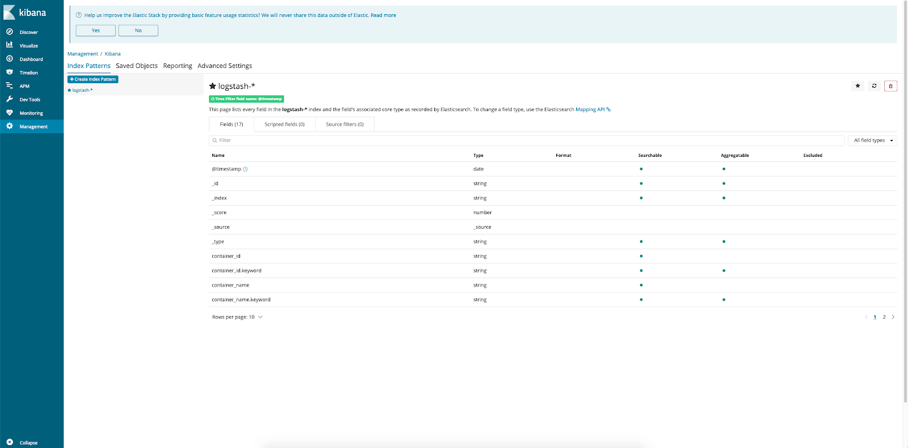
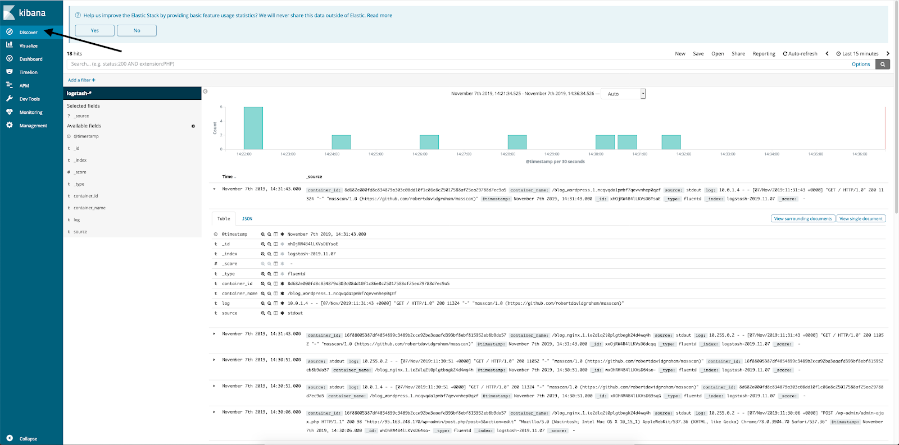

## Hardware configuration

To run this monitoring scenario, install and configure servers using the following hardware:

- Docker on Ubuntu 18.04 LTS x86_64.
- Elasticsearch and Kibana on Ubuntu 18.04 LTS x86_64.

<warn>

**Attention**

Elasticsearch and Kibana must be installed as [application in VK Cloud](https://mcs.mail.ru/app/services/marketplace/setup/elk_single_instance/).

If you use other servers and hardware, some script steps may differ from those described below.

</warn>

## Scheme of work

****

**Docker Swarm** is Docker in cluster mode. A cluster can consist of one node or several nodes. For this scenario, one node is enough.

**Fluentd** is a software package responsible for collecting, transforming logs and transferring them for storage. Logstash, a standard component of the ELK stack, has similar functions. However, Fluentd has more options for transferring logs for storage (claimed [more than 40 data outputs] (https://www.fluentd.org/dataoutputs)), as well as higher speed and low resource requirements (when consuming RAM about 40 megabytes processed 13,000 lines per second). Fluentd is currently used and supported by major companies such as Atlassian, Microsoft, and Amazon. Part of the Fluentd project is Fluent-bit, a lightweight log collector/transformer (details [read here](https://logz.io/blog/fluentd-vs-fluent-bit/)). In addition, Fluentd, along with projects such as Kubernetes and Prometheus (for details [read here] (https://www.cncf.io/projects/))), is supported by CNCF (Cloud Native Computing Foundation).

To run a script:

- From the ELK stack, we use only Elasticsearch to store the logs that Fluentd will transmit, and Kibana to display them.
- In the Docker Swarm cluster, we will deploy a simple application from several containers, set up the collection of logs from them, as well as the transfer and visualization of logs to ELK. Let's deploy a Wordpress blog as a test application. To directly pass logs to the Fluentd daemon, we use the Fluentd log driver. By default, logs are written to files that can be read by the Fluent-bit daemon, which reduces the chance of logs being lost, since a copy of them is stored in a file. However, using the log driver is more standard practice for Docker Swarm/k8s clusters.

## Installing and configuring Docker Swarm

1. Login to the Docker node as root.
2. Install packages:

```
root@ubuntu-basic-1-1-10gb:~# apt-get install -y apt-transport-https ca-certificates curl gnupg-agent software-properties-common
```

3. Add the Docker repository key:

```
root@ubuntu-basic-1-1-10gb:~# curl -fsSL https://download.docker.com/linux/ubuntu/gpg | apt key add-
OK
```

4. Add the Docker repository:

```
root@ubuntu-basic-1-1-10gb:~# add-apt-repository \
> "deb [arch=amd64] https://download.docker.com/linux/ubuntu\
> $(lsb_release -cs) \
> stable"
```

5. Install Docker:

```
root@ubuntu-basic-1-1-10gb:~# apt-get update && apt-get install -y docker-ce docker-ce-cli containerd.io
```

6. Initialize the cluster:

```
root@ubuntu-basic-1-1-10gb:~# docker swarm init
```

## Run Wordpress in a container

1. Create a directory /root/wordpress and place the following docker-compose.yml file there:

```
version: '3'

networks:
frontend:
backend:

volumes:
db_data: {}
wordpress_data: {}

services:
db:
image:mysql:5.7
volumes:
-db_data:/var/lib/mysql
environment:
MYSQL_RANDOM_ROOT_PASSWORD: '1'
MYSQL_DATABASE: wordpress
MYSQL_USER: wordpress
MYSQL_PASSWORD: wordpressPASS
networks:
- backend
logging:
driver: "fluentd"
options:
fluentd-async-connect: "true"
tag: "mysql"

wordpress:
depends_on:
-db
image:wordpress:latest
volumes:
- wordpress_data:/var/www/html/wp-content
environment:
WORDPRESS_DB_HOST:db:3306
WORDPRESS_DB_USER: wordpress
WORDPRESS_DB_PASSWORD: wordpressPASS
WORDPRESS_DB_NAME: wordpress
networks:
- front end
- backend
logging:
driver: "fluentd"
options:
fluentd-async-connect: "true"
tag: "wordpress"

nginx:
depends_on:
- wordpress
-db
image:nginx:latest
volumes:
- ./nginx.conf:/etc/nginx/nginx.conf
ports:
- 80:80
networks:
- front end
logging:
driver: "fluentd"
options:
fluentd-async-connect: "true"
tag: "nginx"


```
<warn>

**Attention**

change wordpressPASS to a random password.

</warn>

For each container, the Fluentd log driver is described, the background connection to the Fluentd collector is indicated, and additional tags are affixed for further processing (if necessary).

2. Place the nginx.conf configuration file in the /root/wordpress directory:

```
events {

}

http {
client_max_body_size 20m;
proxy_cache_path /etc/nginx/cache keys_zone=one:32m max_size=64m;
server {
server_name_default;
listen 80;
proxy_cache one;
location / {
proxy_pass http://wordpress:80;
proxy_set_header Host $http_host;
proxy_set_header X-Forwarded-Host $http_host;
proxy_set_header X-Real-IP $remote_addr;
proxy_set_header X-Forwarded-For $proxy_add_x_forwarded_for;
proxy_set_header X-Forwarded-Proto $scheme;
}
}
}
```

3. Run containers:

```
root@ubuntu-basic-1-1-10gb:~# docker stack deploy -c /root/wordpress/docker-compose.yml blog
Creating network blog_backend
Creating network blog_frontend
Creating service blog_wordpress
Creating service blog_nginx
Creating service blog_db
```

4. Make sure everything started successfully:

```
root@ubuntu-basic-1-1-10gb:~# docker service ls
ID . NAME . . . . . MODE . . . REPLICAS .
12jo1tmdr8ni 1/1 mysql:5.7
rbdwd7oar6nv . . blog_nginx . . . replicated . . 1/1 . . nginx:latest . . \*:80->80/tcp
oejvg6xgzcwj . . blog_wordpress . . replicated . . 1/1 . . . wordpress:latest
```

5. In the address bar of the browser, enter the IP address of the server and finish setting up Wordpress:

[](https://hb.bizmrg.com/help-images/logging/wordpress_install_final.png)

The result is a system consisting of three containers: a MySQL database, Nginx as a frontend proxy, and an Apache/Modphp container for running the Wordpress codebase. Each container will have its own logs, which we will add for collection and processing.

## Install Fluentd

<info>

**Note**

The Fluentd version being used is td-agent 3.5.1-0.

</info>

1. Install fluentd:

```
root@ubuntu-basic-1-1-10gb:~# curl -L https://toolbelt.treasuredata.com/sh/install-ubuntu-bionic-td-agent3.sh | sh
```

2. Add fluentd to startup:

```
root@ubuntu-basic-1-1-10gb:~# systemctl enable td-agent
Synchronizing state of td-agent.service with SysV service script with /lib/systemd/systemd-sysv-install.
Executing: /lib/systemd/systemd-sysv-install enable td-agent
```

## Fluentd configuration options

The fluentd configuration file is located in the /etc/td-agent/td-agent.conf folder. It consists of several sections, consider them.

**Source section** \- contains a description of the source of the logs. The Docker Fluentd log driver sends logs to tcp://localhost:24224 by default. Let's describe the source section for receiving logs:

```
<source>
@type forward
port 24224
</source>
```

@type forward means the fluentd protocol that runs over a TCP connection and is used by Docker to send logs to the Fluentd daemon.

**Data output section in elasticsearch:**
```
<match \*\*>
@type elasticsearch
host <IP_ADDRESS_OF_ELK>
port 9200
logstash_format true
</match>
```

In <IP_ADDRESS_OF_ELK>, specify the DNS name or IP address of the Elasticsearch server.

Such a configuration file is the minimum for sending logs to Elasticsearh, but fluentd's capabilities are not limited to this. It has extensive filtering, parsing and data formatting capabilities.

A typical example of filtering is setting up a selection by regexp:

```
<filter foo.bar>
@type grep
<regexp>
key message
pattern /cool/
</regexp>
<regexp>
key hostname
pattern /^web\d+\.example\.com$/
</regexp>
<exclude>
key message
pattern /uncool/
</exclude>
</filter>
```

This example will select records from the stream that contain the word cool in the message field, the hostname field, for example, www123.example.com, and do not contain the word uncool in the tag field. The following data will be verified:

```
{"message":"It's cool outside today", "hostname":"web001.example.com"}
{"message":"That's not cool", "hostname":"web1337.example.com"}
```

The following are not:

```
{"message":"I am cool but you are uncool", "hostname":"db001.example.com"}
{"hostname":"web001.example.com"}
{"message":"It's cool outside today"}
```

This example is taken from the [fluentd manual](https://docs.fluentd.org/filter/grep). Another good example of using a filter is [adding geodata](https://docs.fluentd.org/filter/geoip).

Parsers are designed to parse logs of a standard structure (for example, Nginx logs). Parsers are specified in the source section:

```
<source>
@typetail
path /path/to/input/file
<parse>
@type nginx
keep_time_key true
</parse>
</source>
```

This is a typical example of parsing Nginx logs. Data formatting is used to change the format or structure of output data and is described in the output section.

The possibilities of fluentd are very wide, their description is beyond the scope of this article. To learn more about fluentd, see the [documentation](https://docs.fluentd.org/).

## View logs

When entering Elasticsearch, the logs will be added to the logstash-YYYY-MM-DD index. If you need more complex processing of logs, you can send the logs not directly to Elasticsearch, but to Logstash, and parse and arrange them there.

To view logs:

1. In a browser, go to the Kibana web console, then click on the Management / Index patterns link.

[](https://hb.bizmrg.com/help-images/logging/Kibana1.png)

2. In the Index Pattern input window, enter logstash-\* and click Next Step.

[](https://hb.bizmrg.com/help-images/logging/Kibana2.png)

3. In the Time filter field name window, select @timestamp and click Create index pattern:

[](https://hb.bizmrg.com/help-images/logging/Kibana3.png)

4. Index pattern created.

[](https://hb.bizmrg.com/help-images/logging/Kibana4.png)

5. Go to Discover, select an index. There will be container logs:

[](https://hb.bizmrg.com/help-images/logging/Kibana5.png)

Next, try creating a couple of test posts in Wordpress and look in Kibana for changes in the logs.

## Feedback**

Any problems or questions? [Write to us, we will be happy](https://mcs.mail.ru/help/contact-us).
