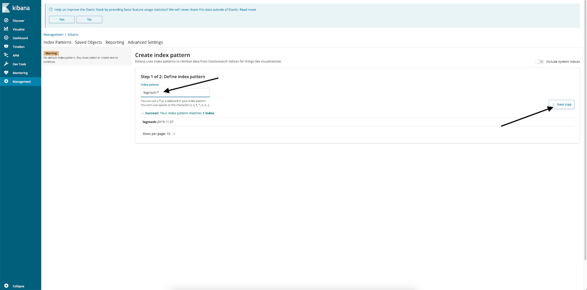

Конфигурация оборудования
-------------------------

Чтобы выполнить данный сценарий мониторинга, установите и настройте серверы c использованием следующего оборудования: 

*   Docker на ОС Ubuntu 18.04 LTS x86_64.
*   Elasticsearch и Kibana на ОС Ubuntu 18.04 LTS x86_64.

**Внимание**

Elasticsearch и Kibana необходимо установить как [приложение в VK CS](https://mcs.mail.ru/app/services/marketplace/setup/elk_single_instance/).

При использовании других серверов и оборудования некоторые шаги сценария могут отличаться от описанных ниже.

Схема работы
------------

****

**Docker Swarm** - это Docker в кластерном режиме. Кластер может состоять из одной ноды или нескольких нод. Для данного сценария достаточно одной ноды.

**Fluentd** - это программный комплекс, отвечающий за сбор, трансформацию логов и их передачу для хранения. Схожие функции имеет Logstash - стандартный компонент стека ELK. Однако Fluentd обладает более широкими возможностями по передаче логов для хранения (заявлено [более 40 data outputs](https://www.fluentd.org/dataoutputs)), а также более высокой скоростью работы и малой требовательностью к ресурсам (при потреблении оперативной памяти около 40 мегабайт обрабатывается 13 000 строк в секунду). В настоящий момент Fluentd используют и поддерживают такие крупные компании, как Atlassian, Microsoft и Amazon. Частью проекта Fluentd является Fluent-bit - легковесный коллектор/трансформатор логов (подробно [читай тут](https://logz.io/blog/fluentd-vs-fluent-bit/)). Кроме того, Fluentd наравне с такими проектами как Kubernetes и Prometheus (подробно [читай тут](https://www.cncf.io/projects/))) поддерживается компанией CNCF (Cloud Native Computing Foundation).

Для выполнения сценария:

*   Из стека ELK используем только Elasticsearсh для хранения логов, которые будет передавать Fluentd, и Kibana для их отображения.
*   В кластере Docker Swarm развернем простое приложение из нескольких контейнеров, настроим сбор логов из них, а также передачу и визуализацию логов в ELK. В качестве тестового приложения развернем блог Wordpress. Для прямой передачи логов в демон Fluentd используем лог-драйвер Fluentd. По умолчанию логи пишутся в файлы, которые можно читать демоном Fluent-bit, в результате чего снижается вероятность утери логов, так как их копия хранится в файле. Однако использование лог-драйвера является более стандартной практикой для кластеров Docker Swarm/k8s.

Установка и настройка Docker Swarm
----------------------------------

1.  Выполните логин на нодe Docker с правами суперпользователя.
    
2.  Установите пакеты:
    

```
root@ubuntu-basic-1-1-10gb:~# apt-get install -y apt-transport-https ca-certificates curl gnupg-agent software-properties-common
```

3.  Добавьте ключ репозитория Docker:
    

```
root@ubuntu-basic-1-1-10gb:~# curl -fsSL https://download.docker.com/linux/ubuntu/gpg | apt-key add -
OK
```

4.  Добавьте репозиторий Docker:
    

```
root@ubuntu-basic-1-1-10gb:~# add-apt-repository \
>    "deb [arch=amd64] https://download.docker.com/linux/ubuntu \
>    $(lsb_release -cs) \
>    stable"
```

5.  Установите Docker:
    

```
root@ubuntu-basic-1-1-10gb:~# apt-get update && apt-get install -y docker-ce docker-ce-cli containerd.io
```

6.  Выполните инициализацию кластера:
    

```
root@ubuntu-basic-1-1-10gb:~# docker swarm init
```

Запуск Wordpress в контейнере
-----------------------------

1.  Создайте директорию /root/wordpress и положите туда файл docker-compose.yml следующего содержания:
    

```
version: '3'

networks:
   frontend:
   backend:

volumes:
     db_data: {}
     wordpress_data: {}

services:
    db:
      image: mysql:5.7
      volumes:
        - db_data:/var/lib/mysql
      environment:
        MYSQL_RANDOM_ROOT_PASSWORD: '1'
        MYSQL_DATABASE: wordpress
        MYSQL_USER: wordpress
        MYSQL_PASSWORD: wordpressPASS
      networks:
        - backend
      logging:
        driver: "fluentd"
        options: 
          fluentd-async-connect: "true"
          tag: "mysql"

    wordpress:
      depends_on:
        - db
      image: wordpress:latest
      volumes:
        - wordpress_data:/var/www/html/wp-content
      environment:
        WORDPRESS_DB_HOST: db:3306
        WORDPRESS_DB_USER: wordpress
        WORDPRESS_DB_PASSWORD: wordpressPASS
        WORDPRESS_DB_NAME: wordpress
      networks:
        - frontend
        - backend
      logging:
        driver: "fluentd"
        options: 
          fluentd-async-connect: "true"
          tag: "wordpress"

    nginx:
      depends_on:
        - wordpress
        - db
      image: nginx:latest
      volumes:
        - ./nginx.conf:/etc/nginx/nginx.conf
      ports:
        - 80:80
      networks:
       - frontend
      logging:
        driver: "fluentd"
        options: 
          fluentd-async-connect: "true"
          tag: "nginx"


```

**Внимание**

wordpressPASS смените на случайный пароль. 

Для каждого контейнера описан лог-драйвер Fluentd, указано подключение в фоне к коллектору Fluentd, и проставлены дополнительные теги для дальнейшей обработки (если она необходима).

2.  В директорию /root/wordpress поместите конфигурационный файл nginx.conf:
    

```
events {
 
 }
 
 http {
    client_max_body_size 20m;
    proxy_cache_path /etc/nginx/cache keys_zone=one:32m max_size=64m;
    server {
      server_name _default;
      listen 80;
      proxy_cache one;
      location / {
        proxy_pass http://wordpress:80;
         proxy_set_header Host $http_host;
         proxy_set_header X-Forwarded-Host $http_host;
         proxy_set_header X-Real-IP $remote_addr;
         proxy_set_header X-Forwarded-For $proxy_add_x_forwarded_for;
         proxy_set_header X-Forwarded-Proto $scheme;
       }
    }
 }
```

3.  Запустите контейнеры:
    

```
root@ubuntu-basic-1-1-10gb:~# docker stack deploy -c /root/wordpress/docker-compose.yml blog
Creating network blog_backend
Creating network blog_frontend
Creating service blog_wordpress
Creating service blog_nginx
Creating service blog_db
```

4.  Убедитесь, что все запустилось успешно:
    

```
root@ubuntu-basic-1-1-10gb:~# docker service ls
ID                  NAME                MODE                REPLICAS            IMAGE               PORTS
12jo1tmdr8ni        blog_db             replicated          1/1                 mysql:5.7           
rbdwd7oar6nv        blog_nginx          replicated          1/1                 nginx:latest        \*:80->80/tcp
oejvg6xgzcwj        blog_wordpress      replicated          1/1                 wordpress:latest  
```

5.  В адресной строке браузера введите IP-адрес сервера и закончите настройку Wordpress:

[](https://hb.bizmrg.com/help-images/logging/wordpress_install_final.png)

В результате получится система, состоящая из трех контейнеров: БД MySQL, Nginx в качестве frontend proxy и контейнер с Apache/Modphp для работы кодовой базы Wordpress. У каждого контейнера будут свои логи, которые мы добавим для сбора и обработки.

Установка Fluentd
-----------------

**Примечание**

Используемая версия Fluentd - td-agent 3.5.1-0. 

1.  Установите fluentd:
    

```
root@ubuntu-basic-1-1-10gb:~# curl -L https://toolbelt.treasuredata.com/sh/install-ubuntu-bionic-td-agent3.sh | sh
```

2.  Добавьте fluentd в автозагрузку:
    

```
root@ubuntu-basic-1-1-10gb:~# systemctl enable td-agent
Synchronizing state of td-agent.service with SysV service script with /lib/systemd/systemd-sysv-install.
Executing: /lib/systemd/systemd-sysv-install enable td-agent
```

Возможности конфигурирования Fluentd
------------------------------------

Конфигурационный файл fluentd расположен в папке /etc/td-agent/td-agent.conf. Он состоит из нескольких секций, рассмотрим их.

**Секция sourcе** \- содержит описание источника логов. Лог-драйвер Docker Fluentd по умолчанию отправляет логи по адресу tcp://localhost:24224. Опишем секцию source для приема логов:

```
<source>
@type forward
port 24224
</source> 
```

@type forward - означает fluentd-протокол, который запускается поверх TCP-соединения и который используется Docker для отправки логов демону Fluentd.

**Секция вывода данных в elasticsearch:**

```
<match \*\*>
@type elasticsearch
host <IP_ADDRESS_OF_ELK>
port 9200
logstash_format true
</match>
```

В <IP_ADDRESS_OF_ELK> укажите DNS-имя или IP-адрес сервера Elasticsearch.

Такой конфигурационный файл является минимальным для отправки логов в Elasticsearh, но этим не ограничиваются возможности fluentd. Он имеет широкие возможности фильтрации, парсинга и форматирования данных. 

Типовой пример фильтрации - настройка выборки по regexp:

```
<filter foo.bar>
@type grep
<regexp>
key message
pattern /cool/
</regexp>
<regexp>
key hostname
pattern /^web\d+\.example\.com$/
</regexp>
<exclude>
key message
pattern /uncool/
</exclude>
</filter>
```

В этом примере из потока будут выбраны записи, содержащие в поле message слово cool, в поле hostname, например, www123.example.com, и не содержащие слова uncool в поле tag. Следующие данные пройдут проверку:

```
{"message":"It's cool outside today", "hostname":"web001.example.com"}
{"message":"That's not cool", "hostname":"web1337.example.com"}
```

А следующие нет:

```
{"message":"I am cool but you are uncool", "hostname":"db001.example.com"}
{"hostname":"web001.example.com"}
{"message":"It's cool outside today"}
```

Этот пример взят из [руководства fluentd](https://docs.fluentd.org/filter/grep). Также наглядным примером использования фильтра является [добавление геоданных](https://docs.fluentd.org/filter/geoip).

Парсеры предназначены для разбора логов стандартной структуры (например, логов Nginx). Парсеры задаются в секции source:

```
<source>
@type tail
path /path/to/input/file
<parse>
@type nginx
keep_time_key true
</parse>
</source>
```

Это типовой пример разбора логов Nginx. Форматирование данных применяется для изменения формата или структуры выводимых данных и описывается в секции вывода. 

Возможности fluentd очень широки, их описание выходит за границы формата данной статьи. Чтобы подробнее изучить возможности fluentd, см. [документацию](https://docs.fluentd.org/).

Просмотр логов
--------------

При попадании в Elasticsearch логи будут складываться в индекс logstash-YYYY-MM-DD. Если необходима более сложная обработка логов, можно отправлять логи не напрямую в Elasticsearch, а в Logstash, и уже там разбирать и раскладывать.

Для просмотра логов:

1.  В браузере перейдите в веб-консоль Kibana, затем щелкните ссылку Management / Index patterns.
    

[](https://hb.bizmrg.com/help-images/logging/Kibana1.png)

2.  В окне ввода Index Pattern введите logstash-\* и нажмите Next Step.
    

[](https://hb.bizmrg.com/help-images/logging/Kibana2.png)

3.  В окне Time filter field name выберите  @timestamp и нажмите Create index pattern:
    

[](https://hb.bizmrg.com/help-images/logging/Kibana3.png)

4.  Index pattern создан.
    

[](https://hb.bizmrg.com/help-images/logging/Kibana4.png)

5.  Перейдите в Discover, выберите индекс. Там будут логи контейнеров:
    

[](https://hb.bizmrg.com/help-images/logging/Kibana5.png)

Далее попробуйте создать в Wordpress пару тестовых постов и посмотреть в Kibana на изменение логов.

**Обратная связь**

Возникли проблемы или остались вопросы? [Напишите нам, мы будем рады](https://mcs.mail.ru/help/contact-us) 

###  [](https://mcs.mail.ru/help/contact-us)