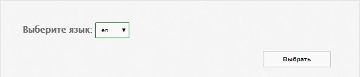
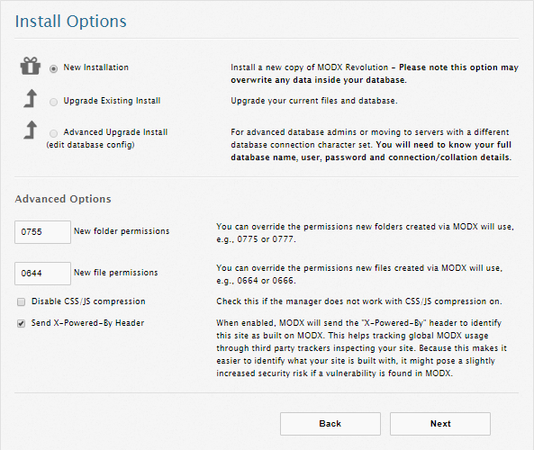
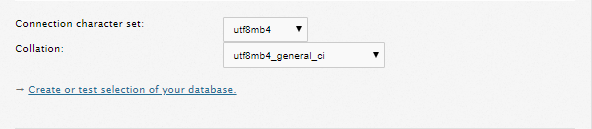
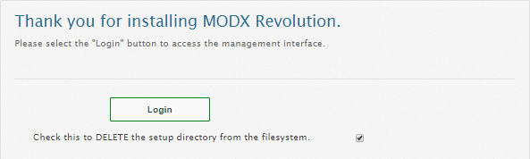
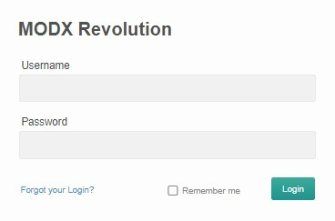
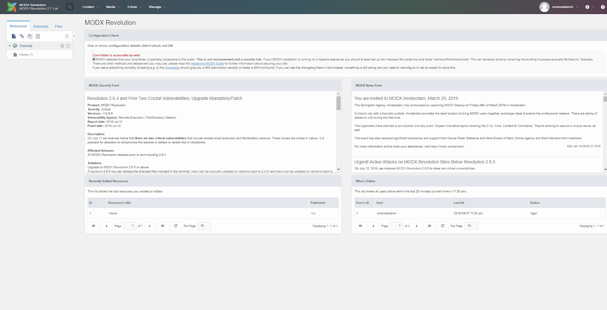
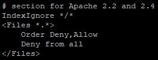

ModX is an open source content management system. ModX is designed to create, edit and manage website content.

## Requirements

- Operating system CentOS version 7.4.
- A user with access to the sudo command.
- Installed LAMP stack.

If you don't already have the LAMP stack installed:

- You can get a ready-made LAMP stack in the cloud [as a configured virtual machine](https://mcs.mail.ru/app/services/marketplace/) on Ubuntu 18.04 and [install ModX on it](https://mcs .mail.ru/help/modx-linux/modx-ubuntu-18). When registering, you get a free bonus account, which is enough to test the server for several days.
- You can install the LAMP stack yourself. To learn how to install the LAMP stack on CentOS 7.4, [read here](https://mcs.mail.ru/help/lamp-on-linux/lamp-centos-7-4).

## MySQL database setup

To get started with ModX, you need to create and configure a dedicated MySQL database. For this:

1. Open a terminal window.
2. To switch to the MySQL shell, run the command:

```
sudo mysql -u root -p
```

Use the root account authentication, which is specific to the MySQL database.

3. Create a new database for ModX using the command:

```
CREATE DATABASE database_name;
For example: CREATE DATABASE modxdb;
```

<warn>

**Attention**

Each MySQL DBMS command must be followed by a semicolon.

</warn>

4. Create a user with full access rights to the created database and assign a password to it using the command:

```
CREATE USER username@localhost IDENTIFIED BY 'password';
```

For example:

```
CREATE USER mxuser@localhost IDENTIFIED BY 'mypassword';
```

5. Grant the user the privileges required to create and modify database tables by running the command:

```
GRANT ALL PRIVILEGES ON dbasename.\* TO username@localhost;
```

For example:

```
GRANT ALL PRIVILEGES ON modxdb.\* TO mxuser@localhost;
```

6. Update the granting of privileges to database tables by running the command:

```
FLUSH PRIVILEGES;
```

7. Exit the MySQL shell by running the command:

```
exit
```

## Preparing to install ModX

Before installing ModX:

1. Go to [https://modx.com/download](https://modx.com/download) and note the ModX version number:


2. Open a terminal window.
3. Install the ZIP archiver by running the command:

```
sudo yum install unzip -y

```

4. Install additional PHP packages by running the command:

```
sudo yum install php-common php-mbstring php-xmlrpc php-ldap php-sqlite3 php-pdo -y

```

5. Change to your home directory by running the command:

```
cd ~
```

6. Create a temporary directory tempMX by running the command:

```
mkdir tempMX
```

7. Change to the tempMX directory by running the command:

```
cd ~/tempMX
```

8. Download the ModX archive by running the command:

```
wget https://modx.s3.amazonaws.com/releases/<version>/modx-<version>.zip
For example: wget https://modx.s3.amazonaws.com/releases/2.7.1/modx-2.7.1-p1.zip
```

9. Unpack the ModX archive by running the command:

```
sudo unzip modx-<version>.zip
For example: sudo unzip modx-2.7.1-pl.zip
```

10. Move the files from the current directory to the /var/www/html/modx directory by running the command:

```
sudo cp -r modx-<version> /var/www/html/modx
For example: sudo cp -r modx-2.7.1-pl /var/www/html/modx
```

11. Remove the tempMX temporary directory by running the command:

```
sudo rm -Rf ~/tempMX
```

12. Change the owner of directories and files in the root directory of the web server using the command:

```
sudo chown -R username:apache /var/www/html/modx
where username is the sudo username, www-data is the group name
For example: sudo chown -R apache:apache /var/www/html/modx
```

<warn>

**Attention**

To avoid Apache web server errors when running scripts, use the default apache username and the default apache group name.

</warn>

13. If you need to grant access to the files of the web server root directory to another user, include this user in the www-data group using the command:

```
sudo usermod -a -G www-data username
```

For example:

```
sudo usermod -a -G apache mxuser
```

14. Set the permissions for files and folders in the root directory using the command:

```
sudo chmod -R 775 /var/www/html/modx
```

15. Allow the httpd service to write to the modx web directory by running the command:

```
sudo chcon -R -t httpd_sys_rw_content_t /var/www/html/modx

```

16. Open the configuration file httpd.conf for editing by running the command:

```
sudo nano /etc/httpd/conf/httpd.conf

```

17. In the httpd.conf file:

- Find the line:

```
DocumentRoot "/var/www/html"
```

and replace it with the line:

```
DocumentRoot "/var/www/html/modx"

```

- Find the section:

****

In this section, replace the line **AllowOverride None** with the line **AllowOverride All**.

Save your changes using the keyboard shortcut CTRL+O and finish editing using the keyboard shortcut CTRL+X.

18. Restart the Apache web server by running the command:

```
sudo systemctl restart httpd.service
```

## Install ModX

To install ModX in the address bar of a web browser, type:

```
http://<your web server's external IP address>/setup
```

As a result, the ModX installation wizard will be launched, follow its instructions:

1. Select the installation language:



It is recommended to select English - **en**

2. Click the **Next** button:


3. Select installation options and click **Next**:



4. Configure the database:


Use the database username, password, and database name that you specified when setting up the MySQL DB. Other options are recommended to be left at their default values.

5. Check your MySQL database connection settings. Upon successful verification, the following line will be displayed:

```
Connecting to database server: Success!
```

6. Select connection encoding:



It is recommended to use the parameters given in the example. Upon successful creation or selection from the database, the following line will be displayed:

```
Database check: Success!
```

7. Specify the data for creating a ModX administrator account and click the **Next** button:


8. Make sure that all verification options have the status **OK** and click the **Install** button:


9. If the ModX installation was successful, the installation report page will open. Review any messages or warnings that occurred during the installation process. Click the **Next** button to complete the installation:


10. To authenticate and get started, click the **Login** button:

****

11. Enter the username and password you provided when creating the ModX administrator account:

****

This will open the main ModX page:



12. To increase the security of ModX, do the following:

- Open a terminal window.
- Change to the ModX root directory by running the command:

```
cd /var/www/html/modx/core

```

- Rename the ht.access file by running the command:

```
sudo mv ht.access .htaccess

```

- Open the .htaccess file for editing by running the command:

```
sudo nano .htaccess
```

- In the .htaccess file, find the **IndexIgnore** parameter and replace it with the lines:



Save your changes using the keyboard shortcut CTRL+O and finish editing using the keyboard shortcut CTRL+X.

13. Restart the Apache web server by running the command:

```
sudo systemctl restart httpd.service
```

## **Feedback**

Any problems or questions? [Write to us, we will be happy to help you](https://mcs.mail.ru/help/contact-us).
