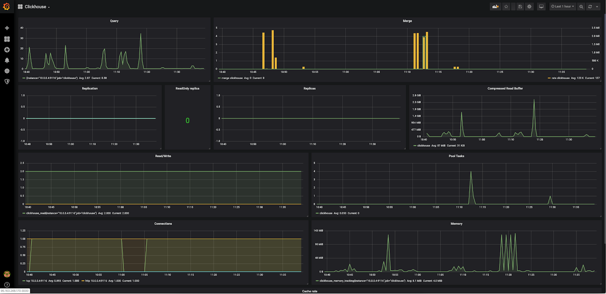

## Hardware configuration

To run this monitoring scenario, install and configure servers using the following hardware:

- Prometheus 2.13 on Ubuntu 18.04 LTS x86_64.
- Grafana 6.4.2 on Ubuntu 18.04 LTS x86_64.
- Clickhouse 19.15.3.6 on Ubuntu 18.04 LTS x86_64.

<warn>

**Attention**

When using servers and hardware of other versions, some steps of the script may differ from those described below.

</warn>

## Scheme of work

****

To monitor Clickhouse parameters and collect metrics, Prometheus uses an exporter that queries the Clickhouse server and sends data to the Prometheus server. Data is visualized in Grafana using Dashboard.

## Install clickhouse_exporter

1. Log in to the Clickhouse server with superuser rights.
2. Since the exporter does not exist in binary form, install the packages to build it:

```
root@clickhouse:~# apt-get -y install git golang

```

3. Create a prometheus user and a prometheus group to run clickhouse_exporter as:

```
root@clickhouse:~# groupadd --system prometheus
root@clickhouse:~# useradd --system -g prometheus -s /bin/false prometheus

```

4. Download exporter:

```
root@clickhouse:~# go get github.com/percona-lab/clickhouse_exporter

```

5. Compile the exporter:

```
root@clickhouse:~# go build github.com/percona-lab/clickhouse_exporter

```

6. Move the exporter to the /usr/local/bin folder:

```
root@clickhouse:~# mv ./clickhouse_exporter /usr/local/bin

```

7. Change the owner to prometheus:

```
root@clickhouse:~# chown -R prometheus:prometheus /usr/local/bin/clickhouse_exporter

```

8. Create a monitoring user on the Clickhouse server. To do this, create a file /etc/clickhouse-server/users.d/web.xml with the following content:

```
<yandex>
<users>
<web>
<password>web</password>
<networks incl="networks" replace="replace">
<ip>::1</ip>
<ip>127.0.0.1</ip>
</networks>
<profile>readonly</profile>
<quota>default</quota>
<allow_databases>
<database>test</database>
</allow_databases>
</web>
</users>
</yandex>

```

<info>

**Note**

This configuration file describes the Clickhouse user with login web and password web, with read-only access to the test database and with permission to connect only from localhost. This is necessary for monitoring.

</info>

9. Start the Clickhouse server:

```
root@clickhouse:~# systemctl restart clickhouse-server

```

10. Script to start the clickhouse_exporter systemd service. To do this, create a file /etc/systemd/system/clickhouse_exporter.service with the following content:

    ```
    [unit]
    Description=Prometheus Clickhouse Exporter
    After=network.target

    [Service]
    Type=simple
    Restart=always
    User=prometheus
    Group=prometheus
    Environment=CLICKHOUSE_USER=web
    Environment=CLICKHOUSE_PASSWORD=web
    ExecStart=/usr/local/bin/clickhouse_exporter
    [Install]
    WantedBy=multi-user.target

    ```

<warn>

**Attention**

The address and port (9116) used by clickhouse_exporter must be accessible from the Prometheus server. If the port is not available, you may need to change the firewall settings on the server with clickhouse_exporter.

</warn>

11. Run clickhouse_exporter:

```
root@clickhouse:~# systemctl daemon-reload
root@clickhouse:~# systemctl start clickhouse_exporter.service
root@clickhouse:~# systemctl enable clickhouse_exporter.service
Created symlink /etc/systemd/system/multi-user.target.wants/clickhouse_exporter.service → /etc/systemd/system/clickhouse_exporter.service.

```

12. Make sure the service has started:

```
root@clickhouse:~# systemctl status clickhouse_exporter.service
● clickhouse_exporter.service - Prometheus Clickhouse Exporter
Loaded: loaded (/etc/systemd/system/clickhouse_exporter.service; disabled; vendor preset: enabled)
Active: active (running) since Thu 2019-10-24 06:26:17 UTC; 8s ago
Main PID: 10421 (clickhouse_expo)
Tasks: 5 (limit: 1151)
CGroup: /system.slice/clickhouse_exporter.service
└─10421 /usr/local/bin/clickhouse_exporter

Oct 24 06:26:17 clickhouse systemd[1]: Started Prometheus Clickhouse Exporter.
Oct 24 06:26:17 clickhouse clickhouse_exporter[10421]: time="2019-10-24T06:26:17Z" level=info msg="Error scraping clickhouse: Error scraping clickhouse url http://localhost:812
Oct 24 06:26:17 clickhouse clickhouse_exporter[10421]: "file=exporter.go line=292
Oct 24 06:26:17 clickhouse clickhouse_exporter[10421]: time="2019-10-24T06:26:17Z" level=info msg="Starting Server: :9116" file="clickhouse_exporter.go" line=34

```

## Setting up the Prometheus server to receive Clickhouse_exporter data

1. Login to the Prometheus node.
2. In the /opt/prometheus/prometheus.yml file, add the clickhouse_exporter section to the scrape_configs section:

```
scrape_configs:
- job_name: clickhouse
static_configs:
- targets: ['<IP address and port of the clickhouse_exporter server>']
labels:
alias: clickhouse

```

3. Restart the Prometheus service:

```
root@prometheus:~# systemctl reload prometheus.service

```

## Setting up Grafana

To visualize the received data, install the appropriate Dashboard (for example, [basic](https://grafana.com/grafana/dashboards/882) ).

After installing and configuring receiving data from the Prometheus server, something like the following will be displayed:

**[](https://hb.bizmrg.com/help-images/monitoring-with-prometheus/clickhouse-exporter/Grafana1.png)**

## Create test load

To see how the graphs change when the Clickhouse server is loaded, let's create a load .

For this:

1. Install the appropriate package:

```
root@clickhouse:~# apt-get -y install clickhouse-test

```

2. Run tests:

```
root@clickhouse:~# cd /usr/share/clickhouse-test/performance
root@clickhouse:/usr/share/clickhouse-test/performance# clickhouse performance-test --user default --password 'default user password'
2019.10.24 08:03:11.856560 <Information> PerformanceTestSuite: Trying to find test scenario files in the current folder...
2019.10.24 08:03:11.857526 <Information>PerformanceTestSuite: Found 82 input files
2019.10.24 08:03:11.863838 <Information>PerformanceTestSuite: Preparing test configurations
2019.10.24 08:03:12.092390 <Information>PerformanceTestSuite: Test configurations prepared
2019.10.24 08:03:12.092833 <Information>PerformanceTestSuite: Config for test 'IPv4' parsed
2019.10.24 08:03:12.092992 <Information> PerformanceTestSuite: Preconditions for test 'IPv4' are fullfilled
2019.10.24 08:03:12.093084 <Information> PerformanceTestSuite: Preparing for run, have 15 create and fill queries
2019.10.24 08:03:12.093166 <Information> PerformanceTest: Executing create or fill query "CREATE TABLE IF NOT EXISTS ips_v4(ip String) ENGINE = MergeTree() PARTITION BY tuple() ORDER BY tuple()"
...

```

<info>

**Note**

All tests take a long time to complete.

</info>

As a result of the test load, graphics in Grafana change:

**[](https://hb.bizmrg.com/help-images/monitoring-with-prometheus/clickhouse-exporter/Grafana_performance.png)**

## Remove clickhouse_exporter

To remove clickhouse_exporter:

1. Remove Dashboard from Grafana.
2. Remove the section - job_name: clickhouse from the prometheus configuration file.
3. On the server with clickhouse_exporter run the commands:

```
root@clickhouse:~# systemctl stop clickhouse_exporter.service
root@clickhouse:~# systemctl disable clickhouse_exporter.service
Removed /etc/systemd/system/multi-user.target.wants/clickhouse_exporter.service.
root@clickhouse:~# rm /etc/systemd/system/clickhouse_exporter.service
root@clickhouse:~# systemctl daemon-reload
root@clickhouse:~# rm -f /usr/local/bin/clickhouse_exporter
root@clickhouse:~# userdel prometheus
root@clickhouse:~# groupdel prometheus

```

## **Feedback**

Any problems or questions? [Write to us, we will be happy](https://mcs.mail.ru/help/contact-us)
