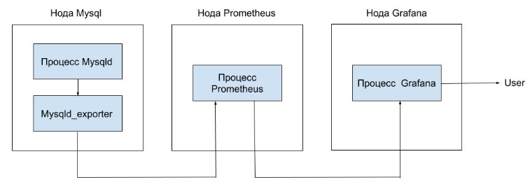
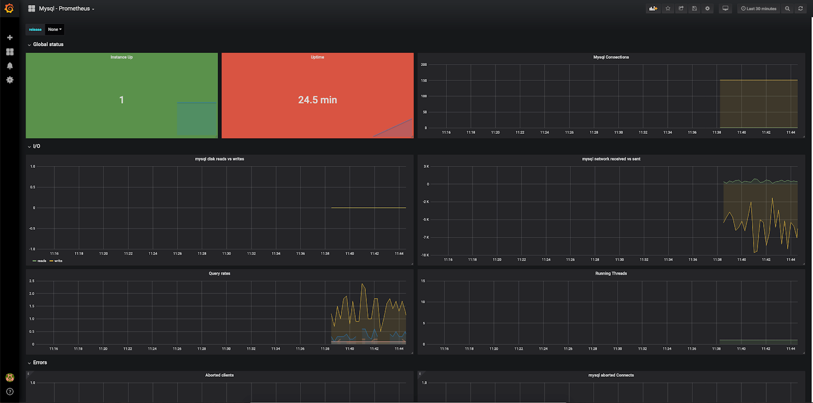
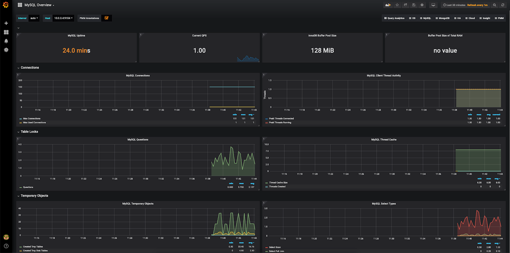
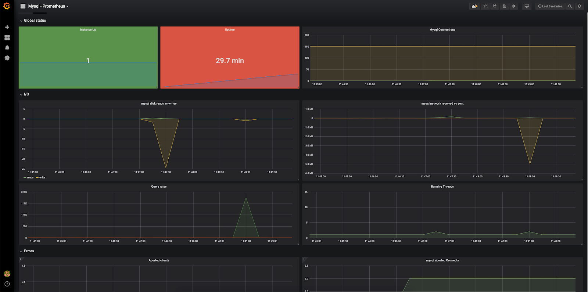

## Hardware configuration

To run this monitoring scenario, install and configure servers using the following hardware:

- Prometheus 2.13 on Ubuntu 18.04 LTS x86_64.
- Grafana 6.4.2 on Ubuntu 18.04 LTS x86_64.
- MySQL 5.7 on Ubuntu 18.04 LTS x86_64.

<warn>

**Attention**

When using servers and hardware of other versions, some steps of the script may differ from those described below.

</warn>

## Scheme of work



To monitor MySQL parameters and collect metrics, Prometheus uses an exporter that queries the MySQL server and sends data to the Prometheus server. Data can be visualized in Grafana using Dashboard.

## Install mysqld_exporter

1. Log in to the MySQL server with superuser rights.
2. Specify the current version of the exporter:

```
root@mysql:~# export VERSION="<version>"
```

<info>

**Note**

The current version of mysqld_exporter can be [find and downloaded here](https://prometheus.io/download/#mysqld_exporter).

</info>

3. Create a prometheus user and a prometheus group under which you will run mysqld_exporter:

```
root@mysql:~# groupadd --system prometheus
root@mysql:~# useradd --system -g prometheus -s /bin/false prometheus
```

4. Download the mysqld_exporter archive and extract it to the /tmp folder:

```
root@mysql:~# wget https://github.com/prometheus/mysqld_exporter/releases/download/v$VERSION/mysqld_exporter-$VERSION.linux-amd64.tar.gz -O - | tar -xzv -C /tmp
```

5. Copy the contents of the unpacked archive to the /usr/local/bin folder:

```
root@mysql:~# cp /tmp/mysqld_exporter-$VERSION.linux-amd64/mysqld_exporter /usr/local/bin
```

6. Delete the contents of the unpacked archive from the /tmp folder:

    ```
    root@mysql:~# rm -rf /tmp/mysqld_exporter-$VERSION.linux-amd64
    ```

7. Change the owner of mysqld_exporter to prometheus:

    ```
    root@mysql:~# chown -R prometheus:prometheus /usr/local/bin/mysqld_exporter
    ```

8. For mysqld_exporter to work, create a mysql user and give him the appropriate rights:

    ```
    mysql> CREATE USER 'exporter'@'localhost' IDENTIFIED BY '<password>' WITH MAX_USER_CONNECTIONS 3;
    Query OK, 0 rows affected (0.001 sec)

    mysql> GRANT PROCESS, REPLICATION CLIENT, SELECT ON *.* TO 'exporter'@'localhost';
    Query OK, 0 rows affected (0.000 sec)
    ```

<warn>

**Attention**

The WITH MAX_USER_CONNECTIONS 3 option is not supported by some MySQL server versions. If you get an error while creating the user, clear this option and run the command again.

</warn>

9. Create a file containing mysqld_exporter access rules and specify the credentials of the mysql user created on the previous step:

```
root@mysql:~# cat <<EOF>>/usr/local/etc/.mysqld_exporter.cnf
[client]
user=exporter
password=<password>
EOF

root@mysql:~# chown prometheus:prometheus /usr/local/etc/.mysqld_exporter.cnf
```

10. Create a script to start the systemd service mysqld_exporter. To do this, create a file /etc/systemd/system/mysqld_exporter.service with the following content:

```
[unit]
Description=Prometheus MySQL Exporter
After=network.target

[Service]
Type=simple
Restart=always
User=prometheus
Group=prometheus
ExecStart=/usr/local/bin/mysqld_exporter \
--config.my-cnf /usr/local/etc/.mysqld_exporter.cnf\
--collect.global_status \
--collect.info_schema.innodb_metrics \
--collect.auto_increment.columns \
--collect.info_schema.processlist \
--collect.binlog_size \
--collect.info_schema.tablestats \
--collect.global_variables \
--collect.info_schema.query_response_time \
--collect.info_schema.userstats \
--collect.info_schema.tables \
--collect.perf_schema.tablelocks \
--collect.perf_schema.file_events \
--collect.perf_schema.eventswaits \
--collect.perf_schema.indexiowaits \
--collect.perf_schema.tableiowaits \
--collect.slave_status \
--web.listen-address=0.0.0.0:9104

[Install]
WantedBy=multi-user.target
```

<info>

**Notes**

- Parameters starting with collect are responsible for the metrics that will be collected from the MySQL server. A detailed description of the collected metrics [see. here](https://github.com/prometheus/mysqld_exporter).
- The web.listen-address parameter specifies the address and port on which mysqld_exporter will be available (0.0.0.0 means any address on the server). This address and port must be accessible from the Prometheus server. If the port is not available, try changing the firewall settings on the server with mysqld_exporter.

</info>

11. Start mysqld_exporter:

```
root@mysql:~# systemctl daemon-reload
root@mysql:~# systemctl start mysqld_exporter.service
root@mysql:~# systemctl enable mysqld_exporter.service
Created symlink /etc/systemd/system/multi-user.target.wants/mysqld_exporter.service → /etc/systemd/system/mysqld_exporter.service.
```

12. Make sure the service has started:

```
root@mysql:~# systemctl status mysqld_exporter.service
● mysqld_exporter.service - Prometheus MySQL Exporter
Loaded: loaded (/etc/systemd/system/mysqld_exporter.service; enabled; vendor preset: enabled)
Active: active (running) since Tue 2019-10-01 10:26:30 MSK; 40s ago
Main PID: 24617 (mysqld_exporter)
Tasks: 4 (limit: 2359)
Memory: 6.4M
CGroup: /system.slice/mysqld_exporter.service
└─24617 /usr/local/bin/mysqld_exporter/mysqld_exporter --config.my-cnf /usr/local/etc/.mysqld_exporter.cnf --collect.global_status --collect.info_schema.innodb_metrics --collect.auto_increment.columns --collect.info_schema.processlist --collect.binlog_size --colle

Oct 01 10:26:30 mysql mysqld_exporter[24617]: time="2019-10-01T10:26:30+03:00" level=info msg=" --collect.perf_schema.tableiowaits" source="mysqld_exporter.go :273"
Oct 01 10:26:30 mysql mysqld_exporter[24617]: time="2019-10-01T10:26:30+03:00" level=info msg=" --collect.perf_schema.indexiowaits" source="mysqld_exporter.go :273"
Oct 01 10:26:30 mysql mysqld_exporter[24617]: time="2019-10-01T10:26:30+03:00" level=info msg=" --collect.perf_schema.tablelocks" source="mysqld_exporter.go :273"
Oct 01 10:26:30 mysql mysqld_exporter[24617]: time="2019-10-01T10:26:30+03:00" level=info msg=" --collect.info_schema.tablestats" source="mysqld_exporter.go :273"
Oct 01 10:26:30 mysql mysqld_exporter[24617]: time="2019-10-01T10:26:30+03:00" level=info msg=" --collect.perf_schema.file_events" source="mysqld_exporter.go :273"
Oct 01 10:26:30 mysql mysqld_exporter[24617]: time="2019-10-01T10:26:30+03:00" level=info msg=" --collect.info_schema.userstats" source="mysqld_exporter.go :273"
Oct 01 10:26:30 mysql mysqld_exporter[24617]: time="2019-10-01T10:26:30+03:00" level=info msg=" --collect.info_schema.innodb_cmp" source="mysqld_exporter.go :273"
Oct 01 10:26:30 mysql mysqld_exporter[24617]: time="2019-10-01T10:26:30+03:00" level=info msg=" --collect.info_schema.innodb_cmpmem" source="mysqld_exporter.go :273"
Oct 01 10:26:30 mysql mysqld_exporter[24617]: time="2019-10-01T10:26:30+03:00" level=info msg=" --collect.info_schema.query_response_time" source="mysqld_exporter.go :273"
Oct 01 10:26:30 mysql mysqld_exporter[24617]: time="2019-10-01T10:26:30+03:00" level=info msg="Listening on 0.0.0.0:9104" source="mysqld_exporter.go :283"
```

## Set up Prometheus to get mysqld_exporter data

1. Login to the Prometheus node.
2. In the prometheus.yml file for working with mysqld_exporter:
    - In scrape_configs add the following section:

```
scrape_configs:
- job_name: mysql
static_configs:
-targets: ['10.0.0.4:9104']
labels:
alias: mysql

```

- In the targets section, enter the IP address of the MySQL server where mysqld_exporter is installed.

3. Restart the Prometheus service:

```
root@prometheus:~# systemctl reload prometheus.service

```

## Setting up Grafana

To visualize the received data, install the appropriate Dashboard (for example, [Basic Dashboard](https://grafana.com/grafana/dashboards/6239) or [Dashboard Percona](https://grafana.com/grafana/dashboards/7362)) .

After installing and configuring to receive data from the Prometheus server, something like the following will be displayed when using the basic Dashboard:

****

And something like the following when using Dashboard Percona:



## Create test load

To see how the graphs change when the MySQL server is loaded, use the sysbench utility (for examples of use, see [here](https://ruhighload.com/%D0%A2%D0%B5%D1%81%D1%82%D0 %B8%D1%80%D0%BE%D0%B2%D0%B0%D0%BD%D0%B8%D0%B5+%D0%BD%D0%B0%D0%B3%D1%80%D1%83 %D0%B7%D0%BA%D0%B8+mysql) and [here](https://github.com/akopytov/sysbench)).

For this:

1. Install the sysbench utility:

```
root@mysql:~# apt-get install sysbench
```

2. On the MySQL node, run the test suite generation:

```
root@mysql:~# sysbench oltp_read_only --mysql-db=test --mysql-user=root --mysql-password --db-driver=mysql prepare
sysbench 1.0.17 (using bundled LuaJIT 2.1.0-beta2)
Creating table 'sbtest1'...
Inserting 10000 records into 'sbtest1'
Creating a secondary index on 'sbtest1'...
```

3. Run the test:

```
root@mysql:~# sysbench oltp_read_only --mysql-db=test --mysql-user=root --mysql-password --db-driver=mysql run
sysbench 1.0.17 (using bundled LuaJIT 2.1.0-beta2)

Running the test with following options:
Number of threads: 1
Initializing random number generator from current time

Initializing worker threads...

Threads started!

SQL statistics:
queries performed:
read: 109340
write: 0
other: 15620
total: 124960
transactions: 7810 (780.72 per sec.)
queries: 124960 (12491.51 per sec.)
ignored errors: 0 (0.00 per sec.)
reconnects: 0 (0.00 per sec.)

General statistics:
total time: 10.0007s
total number of events: 7810

Latency (ms):
min: 0.59
avg: 1.28
max: 10.28
95th percentile: 2.26
sum: 9979.28

thread fairness:
events (avg/stddev): 7810.0000/0.00
execution time (avg/stddev): 9.9793/0.00
```

As a result of the test load, graphics in Grafana change:

****

## Remove mysql_exporter

To remove mysqld_exporter:

1. Remove Dashboard from Grafana.
2. Remove the section - job_name: mysql from the prometheus configuration file.
3. On the node with mysqld_exporter, run the following commands:

```
root@mysql:~# systemctl stop mysqld_exporter.service
root@mysql:~# systemctl disable mysqld_exporter.service
Removed /etc/systemd/system/multi-user.target.wants/mysqld_exporter.service.
root@mysql:~# rm /etc/systemd/system/mysqld_exporter.service
root@mysql:~# systemctl daemon-reload
root@mysql:~# rm -f /usr/local/bin/mysqld_exporter /usr/local/etc/.mysqld_exporter.cnf
root@mysql:~# userdel prometheus
root@mysql:~# groupdel prometheus
```

4. On the mysql node in the mysql console, delete the user:

```
mysql> drop user 'exporter'@'localhost';
Query OK, 0 rows affected (0.020 sec)

mysql> flush privileges;
Query OK, 0 rows affected (0.007 sec)
```
