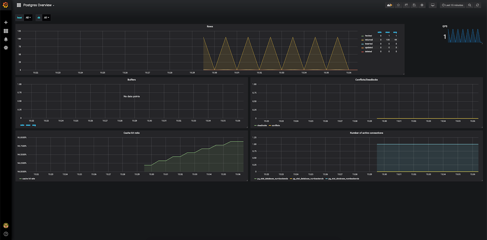
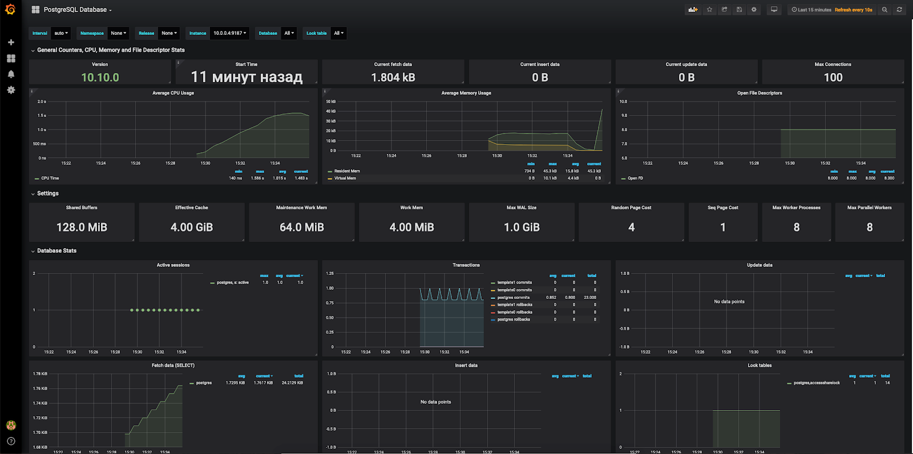
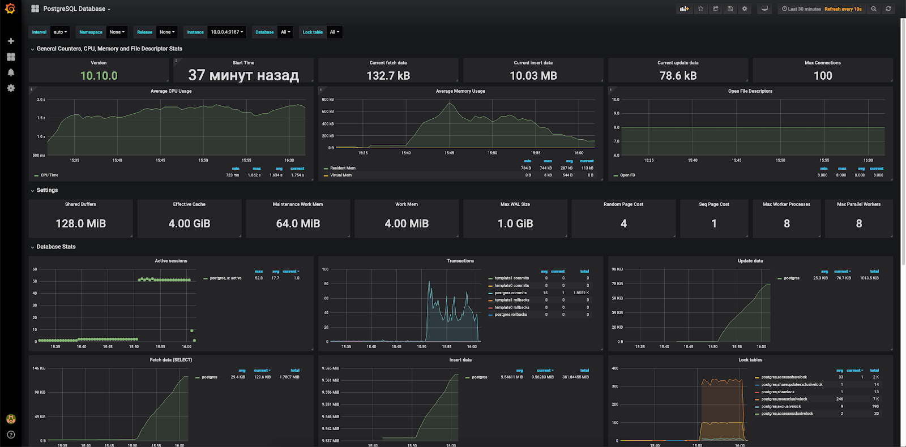

## Hardware configuration

To run this monitoring scenario, install and configure servers using the following hardware:

- Prometheus 2.13 on Ubuntu 18.04 LTS x86_64.
- Grafana 6.4.2 on Ubuntu 18.04 LTS x86_64.
- PostgreSQL 10 on Ubuntu 18.04 LTS x86_64.

<warn>

**Attention**

When using servers and hardware of other versions, some steps of the script may differ from those described below.

</warn>

## Scheme of work


To monitor PostreSQL parameters and collect metrics, Prometheus uses an exporter that queries the PostgreSQL server and sends data to the Prometheus server. Data can be visualized in Grafana using Dashboard.

## Install postgres_exporter

1. Log in to the PostgreSQL server as root.
2. Specify the current version of the exporter:

```
root@postgresql:~# export VERSION="<version>"
```

<info>

**Note**

The current version of postgres_exporter can [find and download here](https://github.com/wrouesnel/postgres_exporter/releases).

</info>

3. Download the postgres_exporter archive and extract it to the /tmp folder:

```
root@postgreql:~# wget https://github.com/wrouesnel/postgres_exporter/releases/download/v$VERSION/postgres_exporter_v$VERSION_linux-amd64.tar.gz -O - | tar -xzv -C /tmp
```

4. Copy the contents of the unpacked archive to the /usr/local/bin folder:

```
root@postgresql:~# cp /tmp/postgres_exporter_v$VERSION_linux-amd64/postgres_exporter /usr/local/bin
```

5. Delete the contents of the unpacked archive from the /tmp folder:

```
root@postgresql:~# rm -rf /tmp/postgres_exporter_v$VERSION_linux-amd64
```

6. Change the owner of postgres_exporter to postgres:

```
root@postgresql:~# chown -R postgres:postgres /usr/local/bin/postgres_exporter
```

7. Create a script to start the systemd service postgres_exporter. To do this, create a file /etc/systemd/system/postgres_exporter.service with the following content:

```
[unit]
Description=Prometheus PostgreSQL Exporter
After=network.target

[Service]
Type=simple
Restart=always
User=postgres
group=postgres
Environment=DATA_SOURCE_NAME="user=postgres host=/var/run/postgresql/ sslmode=disable"
ExecStart=/usr/local/bin/postgres_exporter
[Install]
WantedBy=multi-user.target
```

<info>

**Note**

The Environment parameter describes the passed parameters for accessing the PostgreSQL server. If you are using a non-standard PostgreSQL installation, or if the server and exporter are located on different nodes, [adjust this setting](https://godoc.org/github.com/lib/pq).

</info>

8. Run postgres_exporter:

```
root@postgresql:~# systemctl daemon-reload
root@postgresql:~# systemctl start postgres_exporter.service
root@postgresql:~# systemctl enable postgres_exporter.service
Created symlink /etc/systemd/system/multi-user.target.wants/postgres_exporter.service → /etc/systemd/system/postgres_exporter.service.
```

9. Make sure the service has started:

```
root@postgresql:~# systemctl status postgres_exporter.service
● postgres_exporter.service - Prometheus PostgreSQL Exporter
Loaded: loaded (/etc/systemd/system/postgres_exporter.service; disabled; vendor preset: enabled)
Active: active (running) since Mon 2019-10-07 09:01:26 MSK; 6 minutes ago
Main PID: 4144 (postgres_export)
Tasks: 4 (limit: 2359)
Memory: 4.4M
CGroup: /system.slice/postgres_exporter.service
└─4144 /usr/local/bin/postgres_exporter

Oct 07 09:01:26 postgresql systemd[1]: Started Prometheus PostgreSQL Exporter.
Oct 07 09:01:26 postgresql postgres_exporter[4144]: time="2019-10-07T09:01:26+03:00" level=info msg="Established new database connection to \"/var/run/postgresql/ :5432\"." source="postgres_exporter.go:777"
Oct 07 09:01:26 postgresql postgres_exporter[4144]: time="2019-10-07T09:01:26+03:00" level=info msg="Semantic Version Changed on \"/var/run/postgresql/: 5432\": 0.0.0 -> 11.5.0" source="postgres_exporter.go:1229
Oct 07 09:01:26 postgresql postgres_exporter[4144]: time="2019-10-07T09:01:26+03:00" level=info msg="Starting Server: :9187" source="postgres_exporter.go:1437 "
```
<warn>

**Attention**

By default, postgres_exporter runs on port 9187, which must be available to the Prometheus server. If necessary, configure the firewall accordingly.

</warn>

## Set up Prometheus to get postgres_exporter data

1. Login to the Prometheus node.
2. In the prometheus.yml file for working with postgres_exporter:

- In scrape_configs add the following section:

```
scrape_configs:
- job_name: postgresql
static_configs:
-targets: ['10.0.0.4:9187']
labels:
alias: postgres

```

- In the targets section, enter the IP address of the postgres_exporter server.

3. Restart the Prometheus service:

```
root@prometheus:~# systemctl reload prometheus.service

```

## Setting up Grafana

To visualize the received data, install the appropriate Dashboard (for example, [Dashboard 1](https://grafana.com/grafana/dashboards/455) or [Dashboard 2](https://grafana.com/grafana/dashboards/9628) ) .

After installing and configuring to receive data from the Prometheus server, something like the following will be displayed when using Dashboard 1:



And something like the following when using Dashboard 2:

****

## Create test load

To see how the graphs change when the PostgreSQL server is loaded, use the pgbench utility, which is usually included with the PostgreSQL distribution (for usage examples, see [here](https://wiki.postgresql.org/wiki/Pgbench) and [here] (https://www.8host.com/blog/testirovanie-proizvoditelnosti-upravlyaemoj-bazy-dannyx-postgresql-s-pomoshhyu-pgbench/)) .

For this:

1. On the PostgreSQL server, run the pgbench utility as the postgres user and create a test environment:

```
postgres@postgresql:~pgbench -i -s 100
dropping old tables...
creating tables...
generating data...
100000 of 10000000 tuples (1%) done (elapsed 0.29 s, remaining 28.50 s)
200000 of 10000000 tuples (2%) done (elapsed 0.77 s, remaining 37.91 s)
300000 of 10000000 tuples (3%) done (elapsed 1.13 s, remaining 36.45 s)
...
10000000 of 10000000 tuples (100%) done (elapsed 44.51 s, remaining 0.00 s)
vacuuming...
creating primary keys...
done.


```

2. Run the test:

```
latency average = 1146.629ms
latency stddev = 788.623ms
tps = 43.459191 (including connections establishing)
tps = 43.460132 (excluding connections establishing)postgres@postgresql:~pgbench -c 50 -j 2 -P 60 -T 600
starting vacuum...end.
progress: 60.0 s, 66.9 tps, lat 738.050 ms stddev 486.979
progress: 120.0 s, 51.2 tps, lat 967.935 ms stddev 543.852
progress: 180.0 s, 45.5 tps, lat 1110.148 ms stddev 694.265
progress: 240.0 s, 36.4 tps, lat 1367.563 ms stddev 880.951
progress: 300.0 s, 31.3 tps, lat 1556.174 ms stddev 958.462
progress: 360.0 s, 40.6 tps, lat 1254.119 ms stddev 865.300
progress: 420.0 s, 33.7 tps, lat 1500.918 ms stddev 816.979
progress: 480.0 s, 47.4 tps, lat 1057.629 ms stddev 789.382
progress: 540.0 s, 49.4 tps, lat 1009.890 ms stddev 703.514
progress: 600.0 s, 33.2 tps, lat 1500.623 ms stddev 847.839
transaction type: <builtin: TPC-B (sort of)>
scaling factor: 100
query mode: simple
number of clients: 50
number of threads: 2
duration: 600s
number of transactions actually processed: 26183
```

As a result of the test load, graphics in Grafana change:

****

## Remove postgres_exporter

To remove postgres_exporter:

1. Remove Dashboard from Grafana.

2. Remove the section - job_name: postgresql from the prometheus configuration file.

3. On the server with postres_exporter run the commands:

```
root@postgresql:~# systemctl stop postgres_exporter.service
root@postgresql:~# systemctl disable postgres_exporter.service
Removed /etc/systemd/system/multi-user.target.wants/postgres_exporter.service.
root@postgresql:~# rm /etc/systemd/system/postgres_exporter.service
root@postgresql:~# systemctl daemon-reload
root@postgresql:~# rm -f /usr/local/bin/postgres_exporter
```

## **Feedback**

Any problems or questions? [Write to us, we will be happy to help you](https://mcs.mail.ru/help/contact-us).
