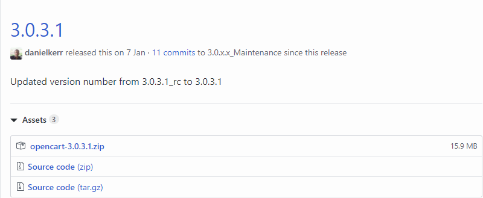
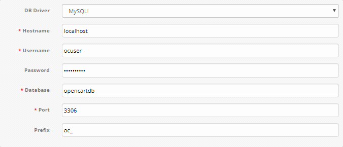
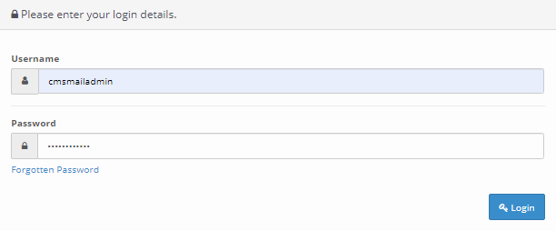
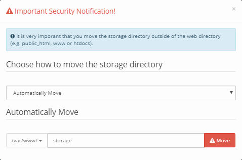
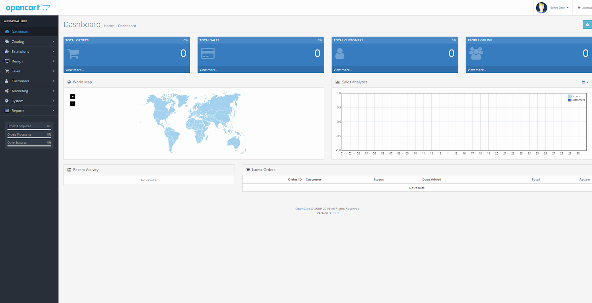

OpenCart is a platform for creating an online store. OpenCart is built on the MVC principle and can be installed on any web server with PHP and MySQL support.

## Requirements

- Operating system Ubuntu version 18.04.
- A user with access to the sudo command.
- Installed LAMP stack.

If you don't already have the LAMP stack installed:

- You can get a ready-made LAMP stack in the cloud [as a configured virtual machine](https://mcs.mail.ru/app/services/marketplace/) on Ubuntu 18.04. When registering, you get a free bonus account, which is enough to test the server for several days.
- You can install the LAMP stack yourself. For information on how to install the LAMP stack on Ubuntu 18.04, [read here](https://mcs.mail.ru/help/lamp-setup/lamp-ubuntu-18).

## Preparing to install OpenCart

Before installing OpenCart:

1. Go to [website](https://github.com/opencart/opencart/releases/) and note the OpenCart version number:



2. Open a terminal window.
3. Install the ZIP archiver by running the command:

```
sudo apt install unzip -y
```

3. Install additional PHP packages by running the command:

```
sudo apt-get install php-common php-mbstring php-xmlrpc -y
```

4. Change to your home directory by running the command:

```
cd ~
```

5. Create a temporary directory tempOC by running the command:

```
mkdir tempOC
```

6. Change to the tempOC directory by running the command:

```
cd ~/tempOC
```

7. Download the OpenCart archive by running the command:

```
https://github.com/opencart/opencart/releases/download/<version>/opencart-<version>.zip
```

For example:

```
wget https://github.com/opencart/opencart/releases/download/3.0.3.1/opencart-3.0.3.1.zip
```

8. Unpack the OpenCart archive by running the command:

```
sudo unzip opencart-<version>.zip
```

For example:

```
sudo unzip opencart-3.0.3.1.zip
```

9. Move the files from the current directory to the /var/www/html/opencart directory by running the command:

```
sudo cp -r upload /var/www/html/opencart
```

10. Remove the tempOC temporary directory by running the command:

```
sudo rm -Rf ~/tempOC
```

11. Rename the opencart/config-dist.php file by running the command:

```
sudo mv /var/www/html/opencart/config-dist.php /var/www/html/opencart/config.php
```

12. Rename the opencart/admin/config-dist.php file by running the command:

```
sudo mv /var/www/html/opencart/admin/config-dist.php /var/www/html/opencart/admin/config.php
```

13. Change the owner of directories and files in the root directory of the web server using the command:

```
sudo chown -R username:www-data /var/www/html/opencart
```

where `username` is the sudo username, `www-data` is the group name
For example:

```
sudo chown -R www-data:www-data /var/www/html/opencart
```

<warn>

**Attention**

To avoid Apache web server errors, use the default username www-data and the default group name www-data when running scripts.

</warn>

14. If you need to grant access to the files of the web server root directory to another user, include this user in the www-data group using the command:

```
sudo usermod -a -G www-data username
```

For example:

```
sudo usermod -a -G www-data ocuser
```

15. Set the permissions for files and folders in the root directory using the command:

```
sudo chmod -R 775 /var/www/html/opencart
```

16. Enable the Apache rewrite module by running the command:

```
sudo a2enmod rewrite
```

17. Restart the Apache web server by running the command:

```
sudo systemctl reload apache2
```

## MySQL database setup

To get started with OpenCart, you need to create and configure a dedicated MySQL database. For this:

1. Open a terminal window.
2. To switch to the MySQL shell, run the command:

```
sudo mysql -u root -p
```

Use the root account authentication, which is specific to the MySQL database.

3. Create a new database for OpenCart using the command:

```
CREATE DATABASE database_name;
```

For example:

```
CREATE DATABASE opencartdb;
```

<warn>

**Attention**

All MySQL commands must be followed by a semicolon.

</warn>

4. Create a user with full access rights to the created database and assign a password to it using the command:

```
CREATE USER username@localhost IDENTIFIED BY 'password';
```

For example:

```
CREATE USER ocuser@localhost IDENTIFIED BY 'mypassword';
```

5. Grant the user the privileges required to create and modify database tables by running the command:

```
GRANT ALL PRIVILEGES ON dbasename.\* TO username@localhost;
```

For example:

```
GRANT ALL PRIVILEGES ON opencartdb.\* TO ocuser@localhost;
```

6. Update the granting of privileges to database tables by running the command:

```
FLUSH PRIVILEGES;
```

7. Exit the MySQL shell by running the command:

```
exit
```

## Install OpenCart

To install OpenCart, enter the following in the address bar of your web browser:

```
http://<your web server's external IP address>/OpenCart
```

As a result, the OpenCart installation wizard will be launched, follow its instructions:

1. Read the license agreement and click the **Continue** button.
2. Check the configuration parameters of OpenCart. Make sure all fields with the **Status** element are highlighted in green and click the **Continue** button.
3. Select a database configuration:



Use the database username, password, and database name that you specified when setting up MySQL<!--[](https://docs.google.com/document/d/1rnpyTW7ZXIRdr5lmsYLyvWH3PcGEitDNetoq2mSyfTM/edit#heading=h.u2usy4a5aptn) -->. Other options are recommended to be left at their default values.

4. Create an OpenCart administrator account:


**Press the button** Continue to start the installation.

5. If the installation of OpenCart was successful, the following page will be displayed:


To get started, click the **Login to your administration** button.

6. Authenticate using the username and password you provided when creating your OpenCart administrator account.<!--[](https://docs.google.com/document/d/1rnpyTW7ZXIRdr5lmsYLyvWH3PcGEitDNetoq2mSyfTM/edit#heading=h.2zc4fulm9yjh ):\*\*-->



7. If you are authenticating for the first time, you will be prompted to move the Storage directory out of the web directory:

****

<warn>

**Attention**

Moving the Storage directory improves data security and does not affect the performance of OpenCart. If there is no need, you can skip this action and simply close the window with a message about moving the Storage directory.

</warn>

To move the Storage directory, we recommend choosing the Manually Move method and doing the following:

- Open a terminal window.
- Move the Storage directory by running the command:

```
sudo mv /var/www/html/opencart/system/storage/ /var/www/storage/
```

- Open the opencart/config.php file for editing by running the command:

```
sudo nano /var/www/html/opencart/config.php
```

- In this file, find the line:

```
define('DIR_STORAGE', DIR_SYSTEM . 'storage/');
```

and replace it with the line:

```
define('DIR_STORAGE', '/var/www/storage/');
```

Then save your changes using the keyboard shortcut CTRL+O and finish editing using the keyboard shortcut CTRL+X.

- Open the opencart/admin/config.php file for editing by running the command:

```
sudo nano /var/www/html/opencart/admin/config.php
```

- In this file, find the line:

```
define('DIR_STORAGE', DIR_SYSTEM . 'storage/');
```

and replace it with the line:

```
define('DIR_STORAGE', '/var/www/storage/');
```

Then save your changes using the keyboard shortcut CTRL+O and finish editing using the keyboard shortcut CTRL+X.

8. Open the Opencart web page, close the information message and refresh the web page by pressing the F5 key.

As a result, the following page should be displayed:



<info>

**Note**

After the installation of OpenCart is completed, delete the directory with the installation files. To do this, open a terminal and run the command:

```
sudo rm -rf /var/www/html/opencart/install
```

</info>
