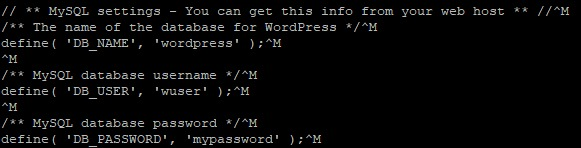
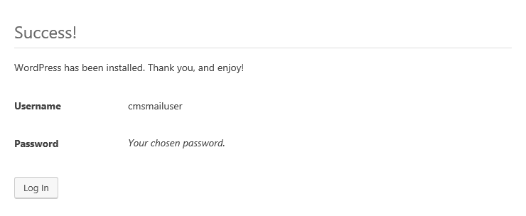

WordPress is the most popular web content management system (CMS). Many plug-ins have been created for this system, its community in the world is very extensive. To work with WordPress, you do not need special knowledge, everything is clear on an intuitive level.

## Requirements

- Operating system FreeBSD version 10.3.
- A user with access to the sudo command.
- Installed FAMP stack.

If you don't already have the FAMP stack installed:

- You can install the FAMP stack yourself. To learn how to install the FAMP stack on FreeBSD 10.3, [read here](https://mcs.mail.ru/help/famp-on-linux/famp-freebsd-10).
- You can get a ready-made LAMP stack in the cloud [as a configured virtual machine](https://mcs.mail.ru/app/services/marketplace/) on Ubuntu 18.04 and [install Wordpress on it](https://mcs .mail.ru/help/wordpress-on-linux/wordpress-ubuntu-18). When registering, you get a free bonus account, which is enough to test the server for several days.

## Configuring the MySQL DBMS (mariadb)

To get started with WordPress, you need to create and configure a dedicated MySQL database (mariadb). For this:

1. Open a terminal window.
2. To switch to the MySQL shell (mariadb), run the command:

```
sudo mysql -u root -p
```

Use the root account authentication, which is specific to the MySQL database.

3. Create a new database for Wordpress using the command:

```
CREATE DATABASE database_name;
```

For example:

```
CREATE DATABASE wordpress;
```

<warn>

**Attention**

All MySQL commands must be followed by a semicolon.

</warn>

4. Create a user with full access rights to the created database and assign a password to it using the command:

```
CREATE USER username@localhost IDENTIFIED BY 'password';
```

For example:

```
CREATE USER wuser@localhost IDENTIFIED BY 'mypassword';
```

5. Grant the user the necessary privileges to create and modify database tables by running the command:

```
GRANT ALL PRIVILEGES ON dbasename.\* TO username@localhost;
```

For example:

```
GRANT ALL PRIVILEGES ON wordpress.\* TO wuser@localhost;
```

6. Update the granting of privileges to database tables by running the command:

```
FLUSH PRIVILEGES;
```

7. Exit the shell by running the command:

```
exit
```

## Preparing to Install WordPress

Before installing WordPress, do the following:

1. Open a terminal window.

2. Change to your home directory by running the command:

```
cd ~
```

3. Create a temporary directory tempWR by running the command:

```
mkdir tempWP
```

4. Change to the tempWR directory by running the command:

```
cd ~/tempWP
```

5. Download the WordPress archive by running the command:

```
curl -O https://wordpress.org/latest.tar.gz
```

6. Unpack and move the files from the current directory to the /usr/local/www/apache24/data/ directory by running the command:

```
sudo tar zxvf ~/tempWP/latest.tar.gz -C /usr/local/www/apache24/data/

```

7. Remove the tempWP temporary directory by running the command:

```
rm -Rf ~/tempWP
```

8. Navigate to the directory with the WordPress configuration files by running the command:

```
cd /usr/local/www/apache24/data/wordpress

```

9. Rename the wp-config-sample.php file by running the command:

```
sudo mv wp-config-sample.php wp-config.php
```

10. Open the wp-config.php file for editing using the command:

```
sudo wp-config.php
```

11. In the wp-config.php file, find the following lines:

****

12. Replace the default values ​​with the values ​​you specified when configuring mariadb

For example:

```
define( 'DB_NAME', 'wordpress' );
define( 'DB_USER', 'wuser' );
define( 'DB_PASSWORD', 'mypassword' );
```

Then save your changes and finish editing.

13. Change the owner of directories and files in the root directory of the web server using the command:

```
sudo chown -R username:www-data /var/www/html/wordpress/
```

where `username` is the username, `www-data` is the group name
For example:

```
sudo chown www:www /usr/local/www/apache24/data**/**
```

<info>

**Note**

To avoid Apache web server errors, use the default www username and www group name when running scripts.

</info>

14. If you need to grant access to the files of the web server root directory to another user, include this user in the www group using the command:

```
sudo usermod -a -G www username
```

For example:

```
sudo usermod -a -G www wuser
```

15. Set the permissions for files and folders in the root directory using the command:

```
sudo chmod -R 775 www:www /usr/local/www/apache24/data/

```

16. Restart the Apache web server by running the command:

```
sudo service apache24 restart

```

## Install WordPress

To install WordPress:

1. In the address bar of the browser, add the line to the external address of the web server:

```
/wordpress/wp-admin/install.php
```

2. On the settings page:

- Choose your WordPress site name and username.
- A strong password will be generated by default. Use this password or enter a new one.

**Attention**

Using a weak password leads to a decrease in the network security of the site, therefore it is recommended to set a weak password only when working in test or demo mode

- Enter your email address.
- If necessary, adjust the visibility of the site for search engines.
- Click the **Install** **WordPress** button:

****

3. After installing Wordpress, log in. To do this, click the **Log In** button, then enter your username and password:

****

****

This will open the WordPress home page:

****

## **Feedback**

Any problems or questions? [Write to us, we will be happy to help you](https://mcs.mail.ru/help/contact-us).
