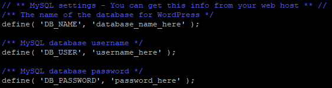
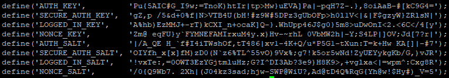
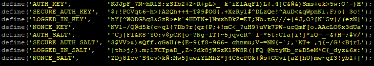
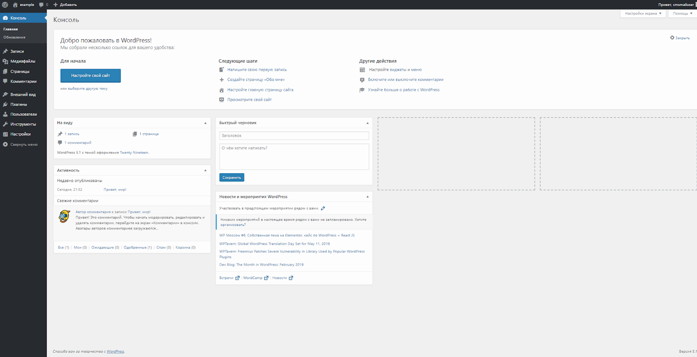

WordPress is the most popular web content management system (CMS). Many plug-ins have been created for this system, its community in the world is very extensive. To work with WordPress, you do not need special knowledge, everything is clear on an intuitive level.

## Requirements

- Operating system Ubuntu version 18.04.
- A user with access to the sudo command.
- Installed LAMP stack.

If you don't already have the LAMP stack installed:

- You can get a ready-made LAMP stack in the cloud [as a configured virtual machine](https://mcs.mail.ru/app/services/marketplace/) on Ubuntu 18.04. When registering, you get a free bonus account, which is enough to test the server for several days.
- You can install the LAMP stack yourself. For information on how to install the LAMP stack on Ubuntu 18.04, [read here](https://mcs.mail.ru/help/lamp-setup/lamp-ubuntu-18).

## Preparing to Install WordPress

Before installing WordPress, do the following:

1. Open a terminal window.
2. Change to your home directory by running the command:

```
cd ~
```

3. Create a temporary directory tempWRC by running the command:

```
mkdir tempWP
```

4. Change to the created directory by running the command:

```
cd ~/tempWP
```

5. Download the WordPress archive by running the command:

```
curl -O [https://wordpress.org/latest.tar.gz](https://wordpress.org/latest.tar.gz)
```

6. Unpack and move the files from the current directory to the /var/www/html/ directory by running the command:

```
sudo tar zxvf ~/tempWP/latest.tar.gz -C /var/www/html
```

7. Remove the tempWRC directory by running the command:

```
rm -Rf ~/tempWP
```

## MySQL database setup

To get started with WordPress, you need to create and set up a dedicated MySQL database. For this:

1. Open a terminal window.
2. To switch to the MySQL shell, run the command:

```
sudo mysql -u root -p
```

Use root authentication, which is exclusive to MySQL.

3. Create a new WordPress database using the command:

```
CREATE DATABASE database_name;
```

For example:

```
CREATE DATABASE wordpress;
```

<warn>

**Attention**

All MySQL commands must be followed by a semicolon.

</warn>

4. Create a user with full access rights to the created database and assign a password to it using the command:

```
CREATE USER username@localhost IDENTIFIED BY 'password';
```

For example:

```
CREATE USER wuser@localhost IDENTIFIED BY 'mypassword';
```

5. Grant the user the necessary privileges to create and modify database tables by running the command:

```
GRANT ALL PRIVILEGES ON dbasename.\* TO username@localhost;
```

For example:
```
GRANT ALL PRIVILEGES ON wordpress.\* TO wuser@localhost;
```

6. Update the granting of privileges to database tables by running the command:

```
FLUSH PRIVILEGES;
```

7. Exit the MySQL shell by running the command:

```
exit
```

## Setting up WordPress configuration files

To set up the WordPress configuration files for the first time:

1. Navigate to the directory with the WordPress configuration files by running the command:

```
cd /var/www/html/wordpress
```

2. Rename the wp-config-sample.php file using the command:

```
mv
```

For example:

```
sudo mv wp-config-sample.php wp-config.php
```

3. Open the wp-config.php file for editing using the command:

```
sudo nano wp-config.php
```

4. In the wp-config.php file, find the following lines:



5. In the wp-config.php file:

- Replace the default values ​​with the values ​​you specified when configuring MySQL (see previous section):

```
For example:
define( 'DB_NAME', 'wordpress' );
define( 'DB_USER', 'wuser' );
define( 'DB_PASSWORD', 'mypassword' );
```

- Save your changes using the keyboard shortcut CTRL+O.
- Finish editing using the keyboard shortcut CTRL+X.

6. Change the owner of directories and files in the root directory of the web server using the command:

```
sudo chown -R username:www-data /var/www/html/wordpress/
```

where `username` is the username, `www-data` is the group name
For example:

```
sudo chown -R www-data:www-data /var/www/html/wordpress/
```

<info>

**Note**

To avoid Apache web server errors, use the default username www-data and the default group name www-data when running scripts.

</info>

7. If you need to grant access to the files of the web server root directory to another user, include this user in the www-data group using the command:

```
sudo usermod -a -G www-data username
```

For example:

```
sudo usermod -a -G www-data wuser
```

8. Set the permissions for files and folders by running the command:

```
sudo chmod -R 755 /var/www
```

9. For WordPress to work securely, you need to get unique key values. To do this, run the command:

```
curl -s https://api.wordpress.org/secret-key/1.1/salt/
```

As a result, information containing key values ​​will be displayed on the screen in the following form:



<warn>

**Attention**

The key values ​​above are given as an example. Next, use the key values ​​that you got as a result of running the curl command.

</warn>

10. Open the wp-config.php file for editing by running the command:

```
sudo nano wp-config.php
```

11. In the wp-config.php file:

- Find the section:

```
define('AUTH_KEY',           'put your unique phrase here');
define('SECURE_AUTH_KEY', 'put your unique phrase here');
define('LOGGED_IN_KEY', 'put your unique phrase here');
define('NONCE_KEY', 'put your unique phrase here');
define('AUTH_SALT', 'put your unique phrase here');
define('SECURE_AUTH_SALT', 'put your unique phrase here');
define('LOGGED_IN_SALT', 'put your unique phrase here');
define('NONCE_SALT',         'put your unique phrase here');
```

- In the appropriate lines, enter the unique key values ​​obtained as a result of the curl command:



- Save your changes using the keyboard shortcut CTRL+O.
- Finish editing using the keyboard shortcut CTRL+X.

12. Restart the Apache web server by running the command:

```
sudo systemctl restart apache2
```

## Install WordPress

To install WordPress:

1. In the address bar of the browser, add the line to the external address of the web server:

```
/wordpress/wp-admin/install.php
```

2. Select the system language and click the **Continue** button:


3. On the settings page:

- Choose your WordPress site name and username.
- A strong password will be generated by default. Use this password or enter a new one.

<warn>

**Attention**

Using a weak password leads to a decrease in the network security of the site, so it is recommended to set a weak password only when working in test or demo mode.

</warn>

- Enter your email address.
- If necessary, adjust the visibility of the site for search engines.
- Click the **Install WordPress** button:


4. Once Wordpress is installed, login:


This will open the WordPress home page:



## **Feedback**

Any problems or questions? [Write to us, we will be happy to help you](https://mcs.mail.ru/help/contact-us).
