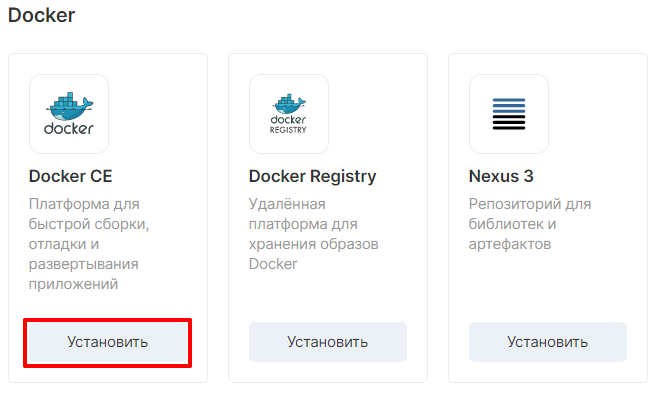
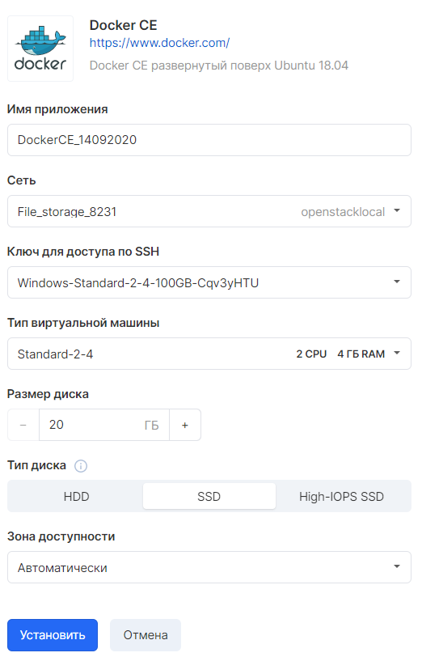
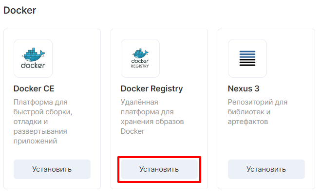
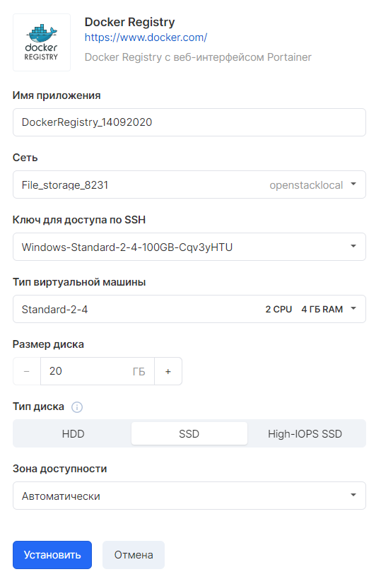
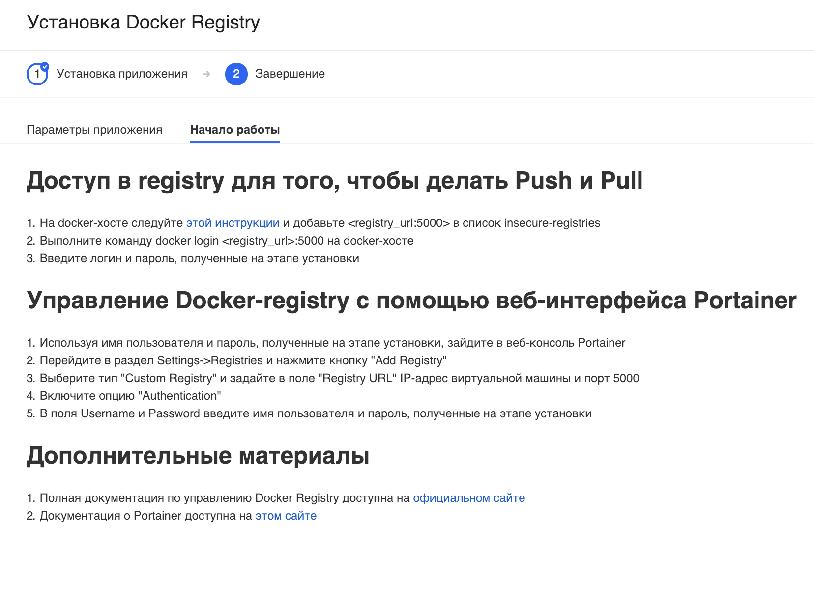
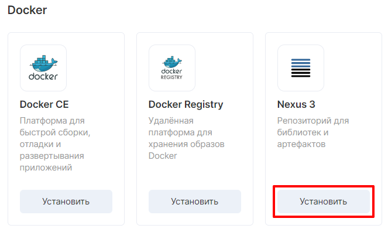
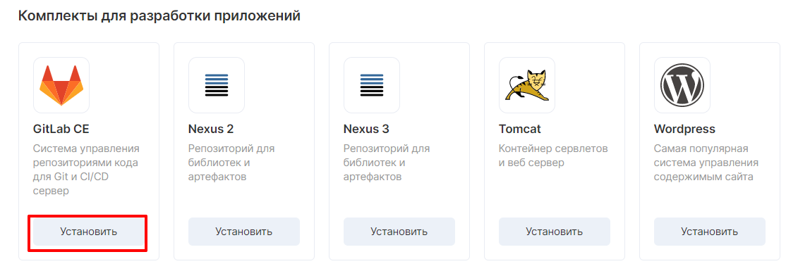
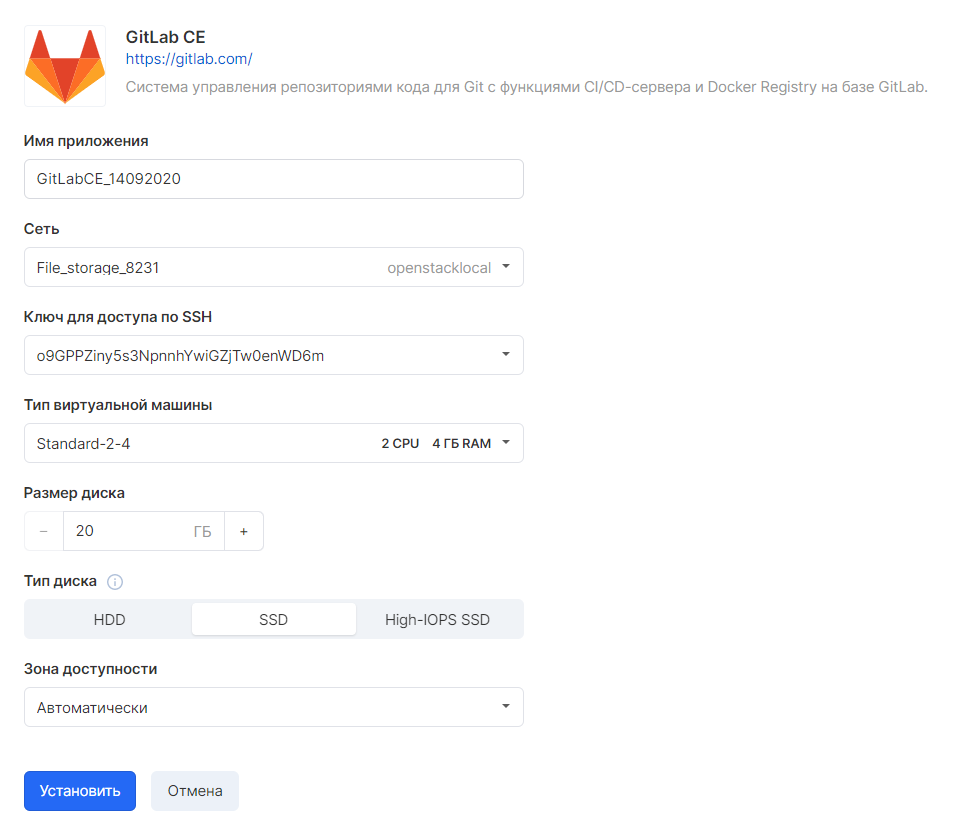

## Docker CE

When you select the appropriate application, the settings window opens:

After selecting the appropriate characteristics, you need to wait a few minutes to install the application.

After installation, an application card will open with connection parameters:

## Docker Registry

After selecting the appropriate application, a window with a choice of parameters will open:

 The application will be installed within a few minutes. Next, a window with VM characteristics will open:

## Nexus

When you select Nexus, a window opens with the necessary parameters:

The application is installed in a few minutes. Next, a window appears with characteristics:

## GitLab CE

Next, at the installation stage, you must specify the application parameters:

At the end of the installation, an application card will appear:

