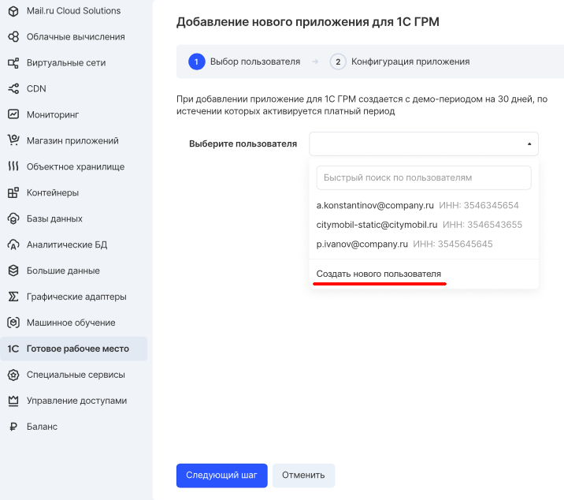
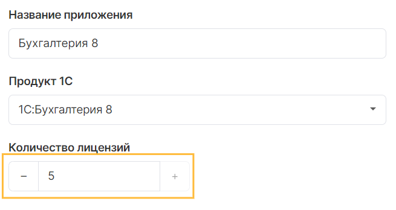
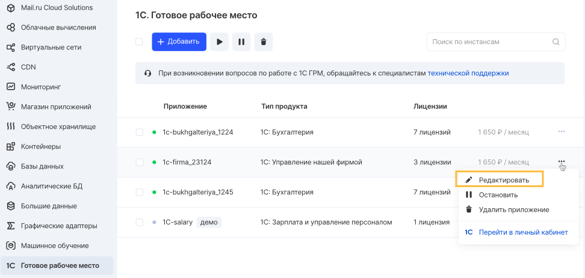

To activate the 1C: GRM service, you must have a registered account and an active project. If necessary, you should confirm the account and activate the phone number, after which the VK CS panel will inform you about the availability of creating an application:

Adding a 1C application consists of several stages, which are accompanied by the application creation wizard.

User
----

The user of the application is a representative of a legal entity who registers the organization in the application.

**Note**

User account data is not entered into the 1C application database and the organization must be registered independently after starting the application.

To create it, at the first step, select the appropriate item "Create a new user":

User creation
-------------

In the wizard for creating a new user, you need to fill in the card with his data:

*   Full Name. Organization contact details
*   Phone. Contact phone of the representative of the organization
*   Email. The current mailing address of the representative to which notifications will be sent
*   INN. Taxpayer identification number

**Attention**

When registering a user, you should pay attention to the filled in data. Once a user has been created, it is impossible to change or delete his data.

The TIN field is subject to verification at the stage of creation using the 1C: Counterparty database. Upon completion of filling in the data of the application creation form, the TIN is verified. If it is filled in incorrectly, the application will not be created; to correct the value of the TIN field, go back to the first stage and specify the correct value.

The registered user will be sent a message to the specified email address containing data for logging in and administering the 1C application.

Licenses
--------

Remote access to the application via the web interface is possible if there is a sufficient number of licenses that grant the user the right to access the created application.

For 1C applications, the maximum value of possible remote access licenses is provided:

*   For file mode: 1 to 5 units
*   For client-server mode: from 6 to 50 units

Licenses are assigned automatically when a user is created in the application.

The number of licenses can be changed in the application control panel up or down, but only within the selected mode. If there is a need to increase licenses over 5 units when using the file mode, you must [contact the technical support of 1C GRM](mailto:support.1c.grm@mcs.mail.ru) with a request to change the type.

**Note**

The change in the number of licenses in the application card occurs instantly, but it may take up to 5 minutes for the changes in the application to take effect.

Application launch
------------------

Once the application has been successfully created, it will appear in the list of applications in the VK CS panel. The application card contains the data entered during creation. It is impossible to change or delete this data.

**Attention**

The application creation process can take up to 15 minutes. At this time, a virtual infrastructure is created and the 1C application is deployed. During this period, activities with the application will be unavailable.

Editing an application
----------------------

Managing installed applications is available in the [section of your personal account](https://mcs.mail.ru/app/services/grm/apps/) in the context menu of each application.

Editing is possible only for the number of licenses that provide remote access to users to the application:

Connect to app
--------------

Remote access to the application for its administration is carried out using user accounts created in the application. Each user created consumes one license assigned to the application in the VK CS panel.

The initial connection for setting up and administering the application can be performed using one license assigned to the User when creating the 1C: Timing application. Connection data is sent to the User's mailing address specified during registration.