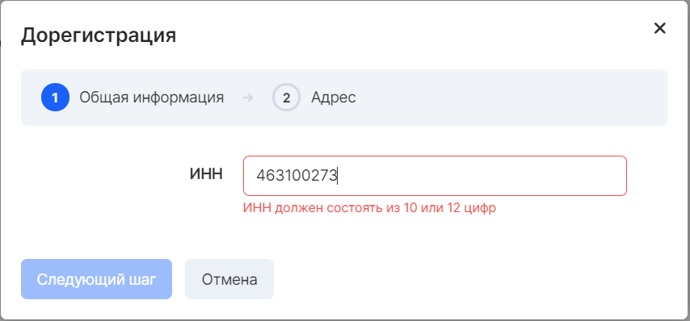
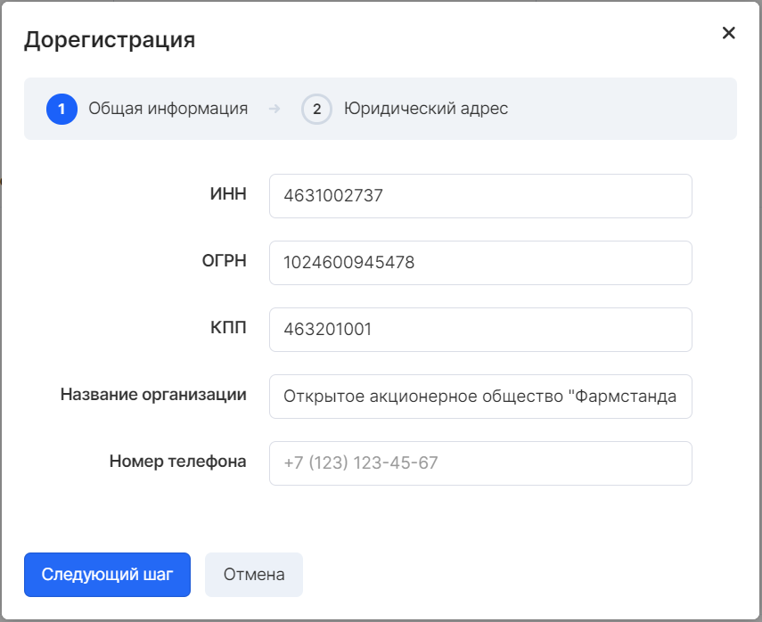
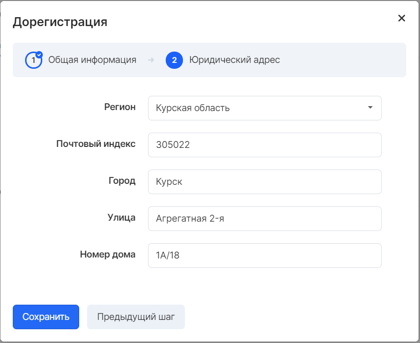

The VK Cloud platform allows you to work with legal entities that are residents of the Russian Federation on the basis of a [Public Offer](https://mcs.mail.ru/help/ru_RU/legal/legal-terms) . This is an offer addressed to an indefinite circle of persons and containing all the additionals conditions of the contract, from which the will of the offeror is seen to conclude an agreement on the conditions specified in the offer with anyone who responds. A person who has performed the necessary actions in order to accept a public offer (for example, who has sent an application for the relevant services) has the right to demand that the offeror fulfill its contractual obligations. ...

If it is necessary to conclude an individual Contract, you should contact [VK Cloud support](https://mcs.mail.ru/docs/contacts) .

## Organization details

After registering and activating services in your personal account, you can edit information about the project and its purpose.

Each project provides for the entry of data of a legal entity.

Filling in this data will allow you to unload the invoice from your personal account, as well as receive closing documents.

To fill in this data, go [to the project settings](https://mcs.mail.ru/app/project/legal/) on the **General Information** tab and click the **Fill** button:

Enter the TIN of the organization, after which the details will be filled in automatically from the updated database of counterparties:

For many organizations, the requisites will be filled in automatically. If this did not happen, enter the rest of the details manually. Fill in your contact phone number and click " **Next Step** ":

 Make sure that all the data is correct and click the " **Save** " button:

## Closing documents

**Attention**

Before making a payment on the invoice, you must make sure that the payment order must contain the project number in the purpose of the payment.

Upon completion of registration, it is possible to receive closing documents for each of the created VK Cloud projects. Sending documents is carried out through Electronic Document Management (EDM). In his absence, the documents will be sent by the Russian Post to the legal address specified in the project settings.

**Note**

For organizations that are not residents of the Russian Federation, the conclusion of an individual Service Agreement is available. Upon conclusion of the Agreement, VK Cloud provides invoices and closing documents.

Detailed information can be obtained by [contacting our support](mailto:sales@mcs.mail.ru) .
