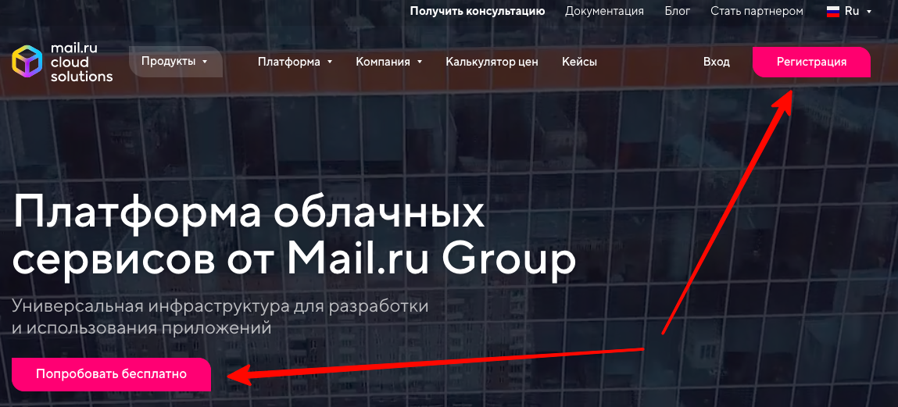
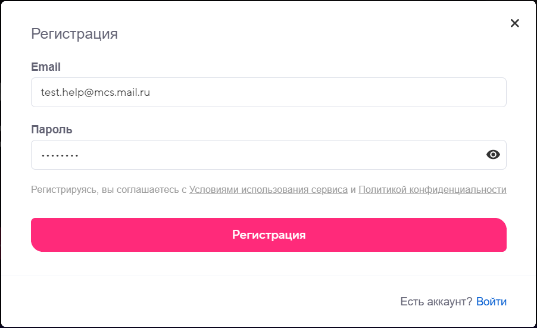
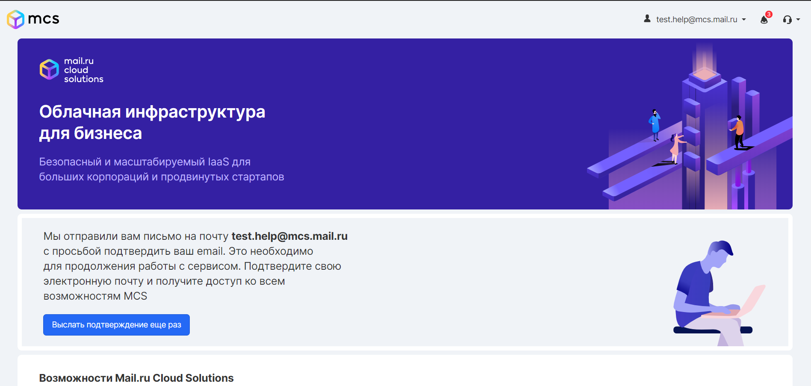
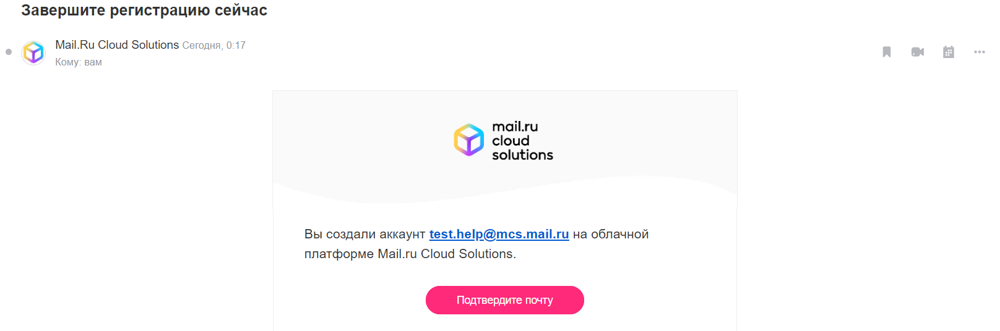
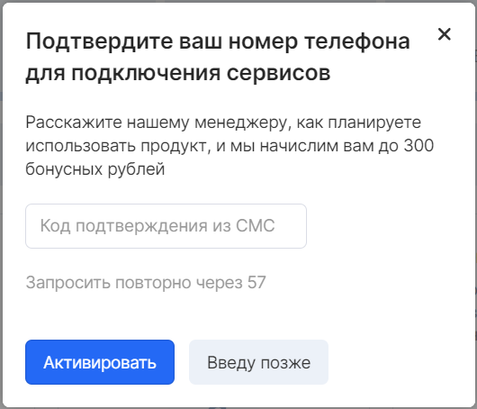
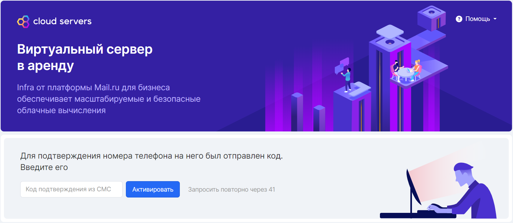
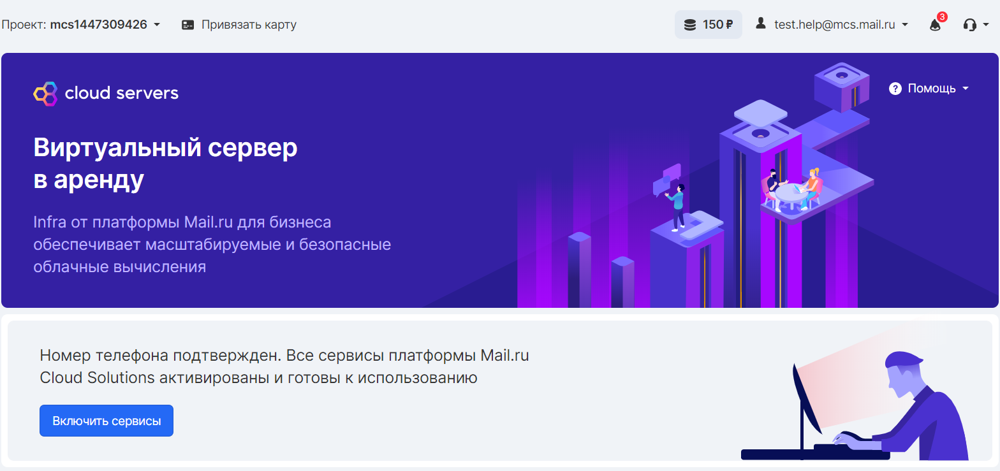
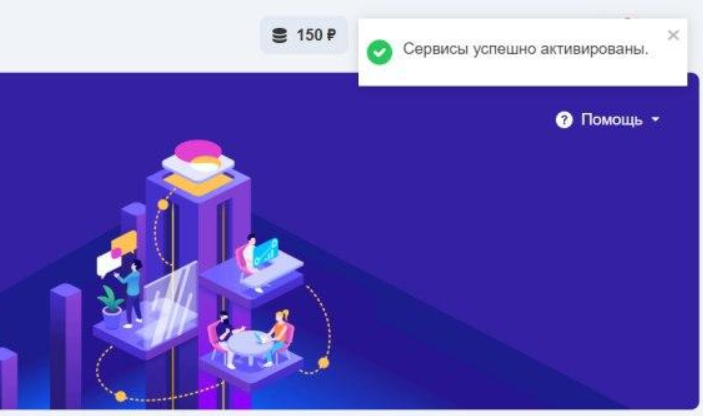

Registration
------------

To register, go to the main page of VK CS services - [https://mcs.mail.ru](https://mcs.mail.ru/) - and click on the "Register" or "Try for free" button:

Enter your login (your valid email) and create a password:

Confirmation
------------

After registration, you will be taken to a confirmation page where you can manage your account settings. To start using VK CS services, you need to confirm your email. A confirmation message will be sent immediately:

Note

If the confirmation message has not been received, try sending it through the VK CS panel again, or go to the "Spam" folder, perhaps it got there in accordance with the filtering rules of the mail service.

The confirmation message looks like this:

When you click on the link, you will be redirected to your personal account, your account will be confirmed. You can see the structure of services in your personal account.

Service activation
------------------

To fully activate the services, you must register and confirm your phone number. The request will be generated automatically after confirmation of the mailbox.

After entering the number, you will be asked for the code from the SMS message.

Attention

One phone number can be registered for one account. If the specified number is already linked to another account, it will not be possible to re-link it to the new account.

If, for any reason, you cannot register a phone number at this stage, registration can be postponed by pressing the "I will enter later" button, then return to this stage when you go to any of the VK CS services in your personal account:

After entering the number, an SMS message will be sent to the specified phone, the confirmation code from which should be entered into the confirmation field.

In case of successful confirmation of the phone number, you will see a message about the possibility of activating the services.

Now you can fully use your account by clicking the **"Enable Services"** button.

Attention

Phone number activation is available only for mobile operators operating in the Russian Federation and having the prefix +7

If this message appears, then all the data is confirmed and the services are ready to use.

