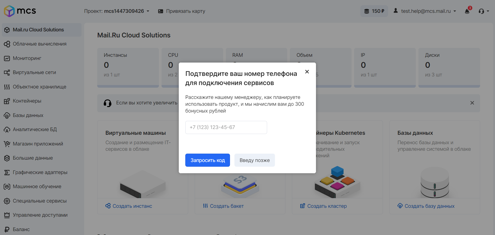
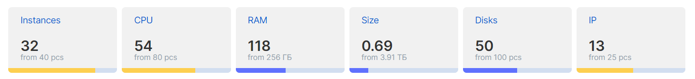

## Bonus points

At the first registration in VK CS and activation of services, 150 points are automatically credited as a bonus for familiarization with the VK CS platform, as well as the services and services provided.

Within a few working days after registering a phone number in your personal account, VK CS employees contact to confirm the phone number, as well as help in obtaining the necessary information about the services.

or

Based on the results of providing information about the tasks that are planned to be solved using the VK CS platform, our colleagues can extend the testing period by adding 300 bonus points.

Note

1 bonus point = 1 ruble.

The decision to extend the testing period is made based on the provision of information on the purposes of using the platform and tasks.

## Starting quotas

When [registering](https://mcs.mail.ru/app/signup/) and connecting services, the following resource quota is allocated:

<table style="width: 63%; margin-right: calc(37%);"><tbody><tr><td style="width: 58.2372%;"><em>Resource</em></td><td style="width: 22.532%;"><em>number</em></td><td style="width: 19.0705%;"><em>Unit</em></td></tr><tr><td style="width: 58.2372%;">Instance</td><td style="width: 22.532%;">1</td><td style="width: 19.0705%;">PC.</td></tr><tr><td style="width: 58.2372%;">CPU</td><td style="width: 22.532%;">2</td><td style="width: 19.0705%;">PC.</td></tr><tr><td style="width: 58.2372%;">RAM</td><td style="width: 22.532%;">2</td><td style="width: 19.0705%;">GB</td></tr><tr><td style="width: 58.2372%;">Disk</td><td style="width: 22.532%;">3</td><td style="width: 19.0705%;">PC.</td></tr><tr><td style="width: 58.2372%;">HDD / SSD disk capacity</td><td style="width: 22.532%;">100</td><td style="width: 19.0705%;">GB</td></tr><tr><td style="width: 58.2372%;">High-iops SSD disk capacity</td><td style="width: 22.532%;">ten</td><td style="width: 19.0705%;">GB</td></tr><tr><td style="width: 58.2372%;">IP address (Floating IP)</td><td style="width: 22.532%;">1</td><td style="width: 19.0705%;">PC.</td></tr><tr><td style="width: 58.2372%;">Router</td><td style="width: 22.532%;">1</td><td style="width: 19.0705%;">PC.</td></tr></tbody></table>

The available resources are displayed in the sections of the respective services and may differ depending on the selected service. An example of a set of quotas for [Cloud Computing](https://mcs.mail.ru/app/services/infra/servers/) :

Note

Not all project quotas are displayed in the personal account. A complete list can be obtained using:

- API - application interface
- CLI - Infrastructure Management Client
