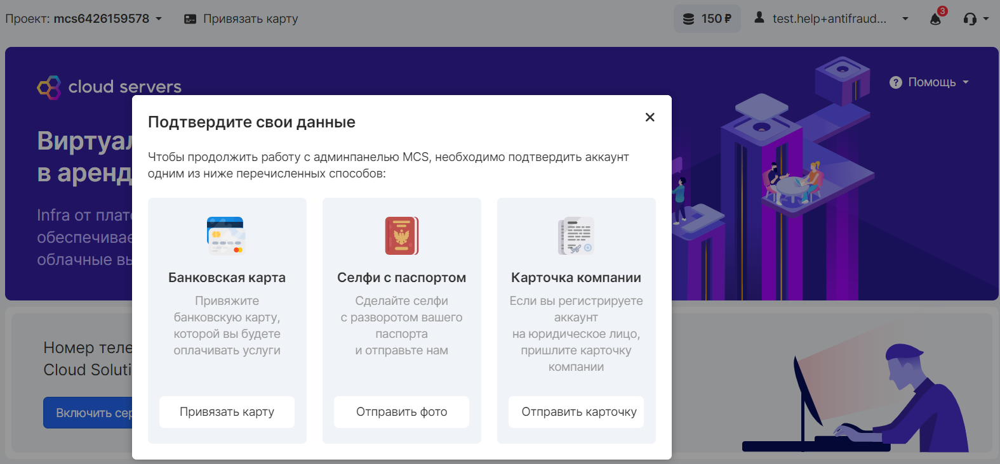
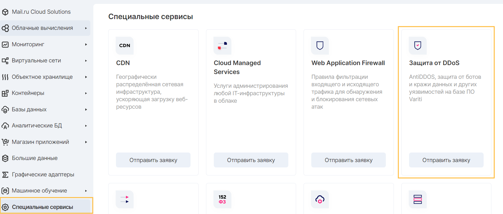

## Antifraud

Antifraud in VK CS is a set of security measures and rules aimed at filtering bot- and auto-registrations of users, as well as preventing potential attacks on the resources of the VK CS platform.

If, after confirming the postal address and phone number in the VK CS panel, when you try to activate services, a notification appears about the need to confirm your data, you should use one of the proposed methods of identity verification:

When you select a method, the corresponding section will open:

- **Linking a bank card** . Link your card and, if necessary, pay for VK CS services.
- **Selfie with a passport** **(only for citizens of the Russian Federation)** . Attach a high-quality photo to your message, which clearly shows your face and your passport details.
- **Company card (for legal entities)** . Attach a file with the details of the organization on whose behalf the registration is being performed. The postal address must, however, indicate the name or other details of the organization.

## Suspicious activity

Users of Internet resources, as well as automated services, have the right to complain about suspicious activity carried out by clients of the VK CS platform. Mechanisms include manual and automatic registration of complaints.

They detect IP addresses with suspicious behavior, for example, if a visitor accesses the same web page at short intervals, fills in the wrong password multiple times, etc.

This behavior is marked as potentially dangerous, then the IP address from which the suspicious activity occurs is added to the gray lists, after which a complaint is sent to the owner of the IP address. If the activity is removed, the IP address is removed from the gray list.

This security feature is globally active on all of our servers and cannot be disabled. Without this feature, the security of the VK CS platform would be low.

The IP addresses allocated to virtual machines belong to the VK CS platform and can be reassigned either by the user himself or by the system when the user releases the IP address assigned to his project. To provide customers with uninterrupted service, technical support responds quickly to such complaints, eliminating activity.

**Attention**

Technical support informs the owner of the project about the complaint at the registered mailing address.

If you are an active user of the services, then technical support will definitely warn you about such a complaint. In the absence of a response for more than 1 day, the IP address can be disconnected from the instance and released from the project.

To avoid encountering a situation of suspicious activity from a virtual machine, you should follow the security rules:

- Do not set simple passwords for accounts
- Do not provide uncontrolled access to your created resources
- Be careful with downloaded and installed software
- Check instances for malware or code

## DDoS protection

DoS ( Denial of Service "denial of service") - a hacker attack on a computer system in order to bring it to failure, that is, the creation of such conditions under which bona fide users of the system will not be able to access the provided system resources (servers), or this access will be difficult. The failure of the attacked system can also be a step towards mastering the system (if in an emergency situation the software gives out any critical information - for example, a version, a part of the program code, etc.).

VK CS provides DDoS protection service. For more detailed information, as well as calculating the cost, you should send a request through your personal account in the "Special Services" section:

The cost of services for "DDoS Protection" services is calculated individually.
