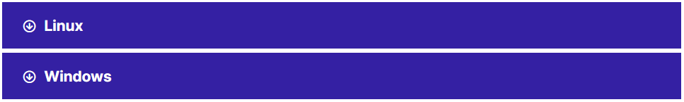

Several typographic conventions are used throughout the VK Cloud documentation.

## Notes

Notes are formatted as follows.

### Note

Commentary with additional information explaining part of the text.

### Important

Information you need to know before proceeding.

### Advice

Optional, but very helpful advice.

### Warning

Critical information about the risk of data loss or security issues.

## Command requests

```
 command
```

Any user, including the root user, can execute commands starting with "$".

```
 # command
```

Commands starting with "#" must be executed by the root user. Alternatively, you can start these commands with the sudo command (if available) to run them.

Each block of code can be copied, and you can also see what language the code is written in.


## Hidden text

In order not to overwhelm the article with information, it can be hidden in blocks of drop-down texts, when selected, information is displayed. Clicking on the corresponding block will display the hidden text.



The VK Cloud support team welcomes requests and additions, as well as bug reports in the Documentation. [Let us know](/en/contacts) and we will make changes.
