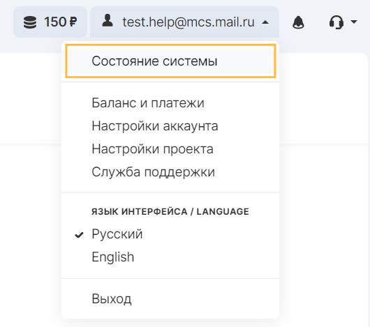
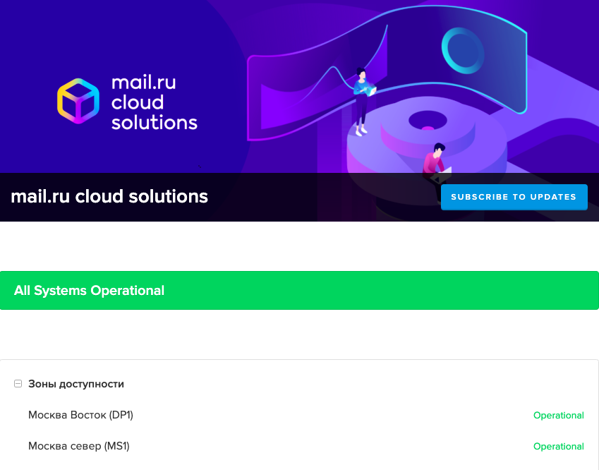

System state is a tool for informing about the current situation in real time. It provides information about statuses and incidents that occur on the VK CS platform. The interface displays information about the following VK CS infrastructure objects:

- Accessibility zones
- Services
- Infrastructure

Access to the interface is carried out from the [personal](https://mcs.mail.ru/app/main/) account in the drop-down menu of the account or via the direct link [https://status.mcs.mail.ru/](https://status.mcs.mail.ru/)

The System Status service page looks like this:

When the service status changes, the changes will be reflected in the interface in real time.
