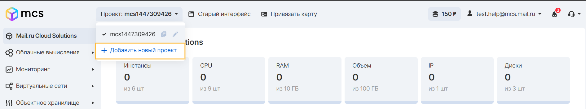
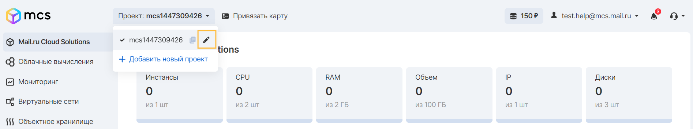
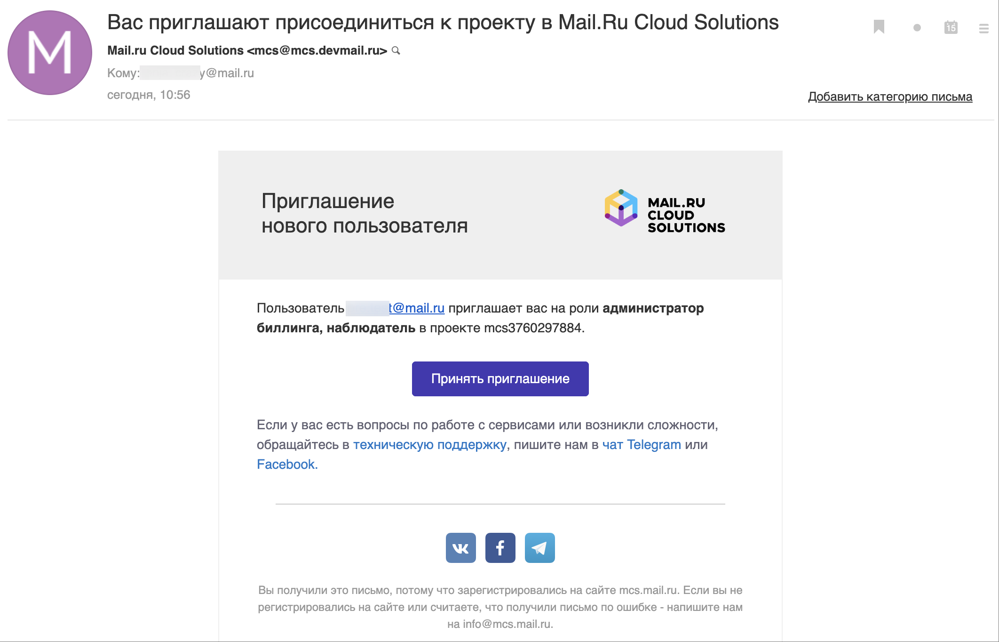
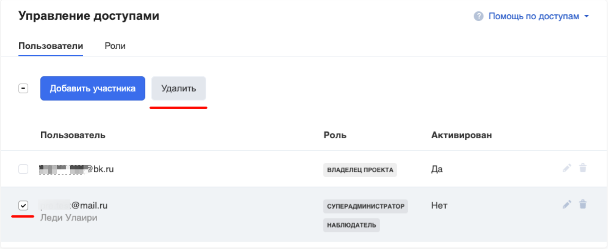
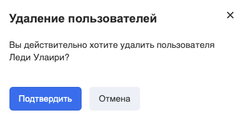

As an administrator, you manage projects, users, and roles. Projects are organizational units in the cloud that you can assign users to. Users can be members of one or more projects. Roles determine what actions users can take. The role assignment is made for the user-project pair.

## Project

A project is a group of one or more users. In Cloud Computing, a project owns virtual machines. In Object Storage, a project owns buckets. Users can be associated with more than one project. Each project and pair of users can have a role associated with it.

You can manage projects, users and roles independently of each other.

During the initial project setup (registration), at least one project, user and his role are defined.

You can assign users to one or more projects, and change or remove the assignment.

## Project creation

Additional projects can be created for the purpose of sharing resources, roles, or other architectural features of the tasks being implemented.

You can create a project in your personal account in the page header. When creating a new project, the current user gets the role of the Project Owner, regardless of his role in the current project:

Note

The name of the project should consist only of lowercase letters of the Latin alphabet and numbers, be from 4 to 60 characters long. The symbols ".", "\_", "-" (except for the first and last characters) are allowed.

## Modifying project data

To rename a project, select your project from the drop-down list in the header of your personal account page, and click on the "Pencil" tool to rename:

Changing the title in the title will change the display name of the project.

Advice

Pay attention to the button next to the "Pencil". It allows you to copy the project name for use in the API, CLI or when submitting a request to technical support.

To change additional information about the project, use the "Project Settings" menu:

In the project settings menu, you can fill in the data of an individual or legal entity, as well as download configuration files to access the VK CS platform through the developer tools (API) and infrastructure management (Terraform).

## Change of owner

If it becomes necessary to change the project owner (for example: complete loss of access to the owner's account), you should [contact technical support](https://mcs.mail.ru/docs/contacts) to change the roles of project participants. In this case, the project must have a second account, the owner of which submits an application.

Change of ownership is made after verification of project data and participant accounts by technical support staff.

Attention

It is recommended to use corporate mailboxes when registering on behalf of a legal entity. This will greatly simplify the verification procedure and will allow you to restore access to the project without the need to contact support.

## Freeze the project

Upon reaching the zero balance, the project resources will be automatically stopped until the project balance is replenished. In this state, API tools for Object Storage are partially available. After replenishing the balance, billing tools will allow you to use the services again, but you will need to manually launch each resource.

This mechanism allows you to prevent the presence of unconscious additional costs on the project, it is especially useful if there is a linked automatic replenishment or post-pay settlement method.

If it is necessary to "freeze" the project, i.e. suspend debiting of funds, then in this case stop all virtual machines and delete resources that fall under automatic billing: disks, buckets, backups, etc. With this approach, you can save some of the resources of your project for a while if you plan to return to using the VK CS platform later. There are no other ways to freeze the project.

## Deleting project data

In the absence of a positive balance recovery, the project resources will be queued for deletion, depending on the availability of payments for the entire period of the project's existence:

- If there were no cash flows in the project, then after 3 days all resources will be deleted;
- If the payment was made, then the resources will be placed in the queue for deletion after 30 days (or upon reaching the balance equal to -1000 rubles) after the services were stopped.

The delete queue is a mechanism for cleaning up resources, in which data from the project and the VK CS platform are deleted irrevocably, without any possibility of their recovery.

## Transferring resources between projects

Within the VK CS platform, there is a limited set of opportunities for transferring resources between projects. It is possible to transfer data from one project to another for Disks.

## Deleting a project

Deleting a project is possible through a [request to technical support](mailto:supprot@mcs.mail.ru) on behalf of the owner of the deleted project. Before deleting a project, you need to make sure that there are no associated automatic payment methods, and that all necessary data has been exported from the project. To execute the request, you must specify the name of the deleted project.

## Roles

In your VK CS personal account, you can add additional project participants who will have access to work with cloud services. When added, the role of the participant is indicated.

## Adding a role

To add, go to the "Access Control" section in the VK CS panel:

Add a participant and enter his details:

- email address;
- name;
- roles in the project.

The contributor you add can have multiple roles in the project. If there are two different roles, mutually exclusive access levels, the permissive role will be applied to perform actions on project objects.

Upon completion of adding a user, the participant will receive an email, which will confirm the actions of adding:

To activate the invitation, follow the link in the letter, create a password and enter your VK CS account with it.

## Role matrix

The VK CS platform supports the differentiation of access rights to project resources based on a role model.

There are six predefined roles available. Below is a list of roles and their corresponding permissions.

List of roles and permissions:

| Operation/Role | Admin.&nbsp;users (user_admin) | Admin. billing | Admin. project | Project owner | Admin. networks | Observer | Admin. internal networks | Admin. network security | Admin. VM | Superadministrator |
|-----------------------------------------------------------------------------------------------------------------------------|----------------------------------------|-----------------|----------------|------------------|-------------|-------------|-------------------------|-----------------------------|-----------|--------------------|
| Adding a user to the project / X* | - | - | X* | - | - | - | - | - | X |
| User Role Assignment | X* | - | - | X* | - | - | - | - | - | X |
| Billing/changing payment details | - | X | X | X | - | - | - | - | - | X |
| Creating / Deleting a VM | - | - | X | X | - | - | - | - | - | X |
| Connecting / disconnecting VMs, PaaS services, shared folders to a virtual network | - | - | X| X | - | - | - | - | - | X |
| VM management (enabling/disabling/mounting images/ rebooting/ changing resources / /access to monitoring and logs) | - | - | X | X | - | - | - | X | X |
| Managing virtual disks (creating/deleting/expanding/mounting/ removing snapshots / migrating)            | - | - | X | X | - | - | - | - | X | X |
| Image Management (adding/ removing VM images) | - | - | X | X | - | - | - | - | - | X |
| Managing shared folders (adding/deleting / resizing)                                               | - | - | X | X | - | - | - | - | - | X |
| Managing access rules for shared folders (add/remove / change)                                   | - | - | X | X | - | - | - | - | - | X |
| Creation modification removal of PaaS services (K8S,DBaaS)                                                                     | - | - | X | X | - | - | - | - | - | X |
| Creating, deleting, modifying, virtual networks. Connecting to a virtual router | - | - | X | X | X | - | X | - | - | X |
| Creating / deleting virtual routers of the project.                                                                           | - | - | X | X | X | - | X | - | - | X |
| Connecting Tenant routers to ext-net | - | - | X | X | X | - | X | - | - | X |
| Managing load balancers and rules in them (adding / removing / adjusting)                              | - | - | X | X | X | - | X | - | - | X |
| Working with the Security Group within the tenant (adding/removing groups/access rules)                                         | - | - | X | X | X | - | - | X | - | X |
| Mapping Security groups to VM interfaces | - | - | X | X | X | - | - | X | - | X |
| VPN Management | - | - | X | X | X | - | - | - | - | X |
| FIP Control | - | - | X | X | X | - | - | - | - | X |
| Managing outgoing traffic filtering rules on external router ports (FWaaS)                              | - | - | - | - | - | - | - | - | - | X** |
| Managing incoming traffic filtering rules on external router ports (FWaaS)                               | - | - | X** | X** | X | - | - | - | -| X** |
| Adding virtual networks to address scope BGP (the operation is necessary for routing virtual networks)                  | - | - | - | - | - | - | - | - | - | X |
| Creating zones and records in public DNS | - | - | X | X | X | - | - | - | - | X |
| View information about all services within the project | - | - | - | X | | X | - | - | - | X |
| View information about all services within the entire WKO cloud | - | - | - | - | | - | - | - | - | - |
`* - the functionality is specific to the public installation. De facto inapplicable to the WKO.`
`** - the FWaaS functionality is in the roadmap, not implemented at the moment.`

## Removing a member

In your personal account, in the "Users" and "Roles" tabs, you can not only add, but also remove members.

Select the desired participant and click Remove, then confirm your choice.

Caution!

If you delete the user on whose behalf the Kubernetes cluster was created, after restarting it, a malfunction will occur. To restore operation, add the user on whose behalf the cluster was created and restart the cluster.
