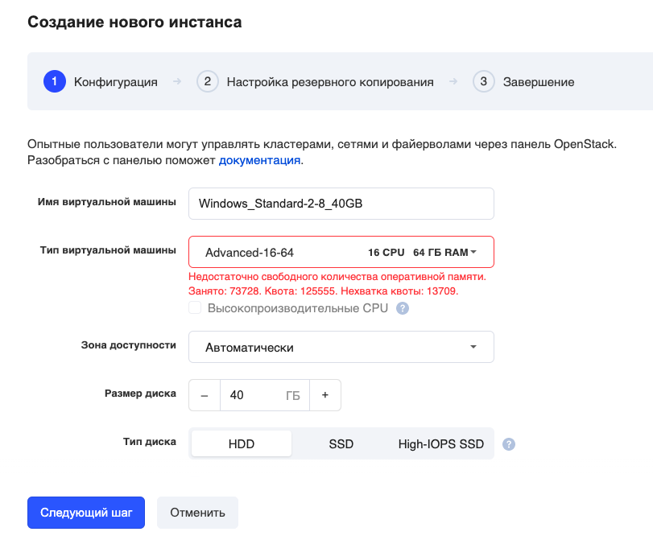
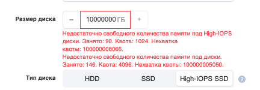
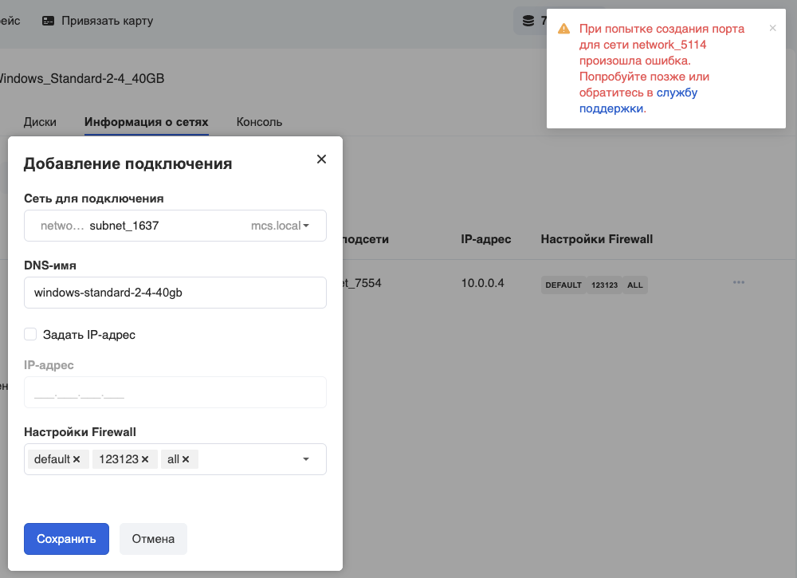
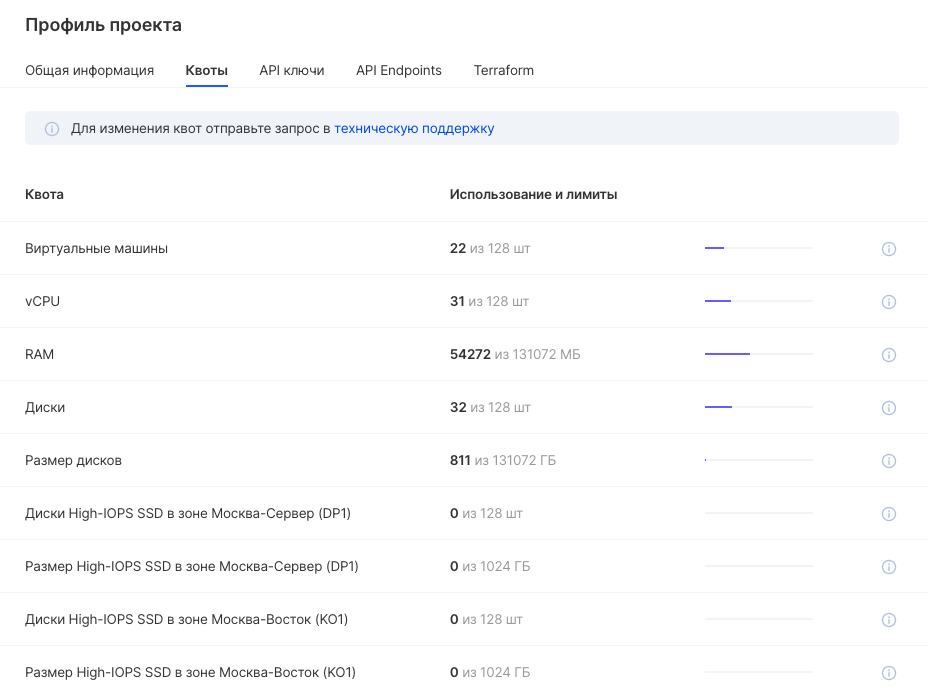

Technical and organizational constraints are necessary to ensure the stability and reliability of the platform. Resource restrictions allow platform clients to seamlessly access VK CS services.

## Quotas

Quotas are organizational restrictions on the operational activity of each project.

Quotas are enforced by granting or booking resources when a request is made, such as when creating a new virtual machine. If the resource cannot be allocated, the request to create the resource is denied. If the backup succeeds, the operation continues until the backup is either converted to use (the operation was successful) or rolled back (the operation failed).

Minimum quotas are assigned to the project when it is created.

There are several types of messages about an insufficient number of quotas in a project:

**When creating a resource in the create request window** :



\* for High-IOPS SSD:



or (for some entities) **when trying to create an entity** :



## Project quotas

The current project quotas can be seen on a separate page. To do this, click on the login in the upper right corner, and select the "Quotas" item in the drop-down menu:


Quotas will be displayed as a graphical information list:



For more information on a specific quota, you can click on the " **i** " icon on the right:


## Base quotas

When a project is created, it is assigned resource quotas that are set by default for all new projects. Each new project does not inherit the available number of quotas from existing projects.

Basic resource quotas are displayed at the top of each service window.

A complete list of quotas in the project can be obtained through the CLI using the command:

```
 openstack quota show
```

or separately for each service:

```
 nova quota-show
cinder quota-show
manila quota-show
neutron quota-show
```

The standard set of quotas is defined as follows:

**Virtual machines**

<table border="0" cellpadding="0" cellspacing="0" style="margin-right: calc(2%); width: 98%;" width="227"><tbody><tr><td height="19" style="text-align: center; background-color: rgb(239, 239, 239); width: 53.1135%;" width="66.07929515418502%">Name</td><td style="text-align: center; background-color: rgb(239, 239, 239); width: 46.7546%;" width="33.92070484581498%">Value</td></tr><tr><td height="19" style="width: 53.1135%;">instances</td><td align="right" style="width: 46.7546%;">6</td></tr><tr><td height="19" style="width: 53.1135%;">cores</td><td align="right" style="width: 46.7546%;">nine</td></tr><tr><td height="19" style="width: 53.1135%;">ram</td><td align="right" style="width: 46.7546%;">10240</td></tr><tr><td height="19" style="width: 53.1135%;">key_pairs</td><td align="right" style="width: 46.7546%;">100</td></tr></tbody></table>

**Discs**

<table border="0" cellpadding="0" cellspacing="0" style="margin-right: calc(2%); width: 98%;" width="227"><tbody><tr><td height="19" style="text-align: center; background-color: rgb(239, 239, 239); width: 54.4063%;" width="66.07929515418502%">Name</td><td style="text-align: center; background-color: rgb(239, 239, 239); width: 45.4618%;" width="33.92070484581498%">Value</td></tr><tr><td height="19" style="width: 54.4063%;">backups</td><td align="right" style="width: 45.4618%;">400</td></tr><tr><td height="19" style="width: 54.4063%;">gigabytes</td><td align="right" style="width: 45.4618%;">100</td></tr><tr><td height="19" style="width: 54.4063%;">gigabytes_dp1-high-iops</td><td align="right" style="width: 45.4618%;">100</td></tr><tr><td height="19" style="width: 54.4063%;">gigabytes_ko1-high-iops</td><td align="right" style="width: 45.4618%;">100</td></tr><tr><td height="19" style="width: 54.4063%;">snapshots</td><td align="right" style="width: 45.4618%;">200</td></tr><tr><td height="19" style="width: 54.4063%;">volumes</td><td align="right" style="width: 45.4618%;">3</td></tr></tbody></table>

**File storage**

<table border="0" cellpadding="0" cellspacing="0" style="margin-right: calc(2%); width: 98%;" width="227"><tbody><tr><td height="19" style="text-align: center; background-color: rgb(239, 239, 239); width: 55.0923%;" width="66.07929515418502%">Name</td><td style="text-align: center; background-color: rgb(239, 239, 239); width: 44.7758%;" width="33.92070484581498%">Value</td></tr><tr><td height="19" style="width: 55.0923%;">gigabytes</td><td align="right" style="width: 44.7758%;">100</td></tr><tr><td height="19" style="width: 55.0923%;">id</td><td style="width: 44.7758%;"><br></td></tr><tr><td height="19" style="width: 55.0923%;">share_networks</td><td align="right" style="width: 44.7758%;">five</td></tr><tr><td height="19" style="width: 55.0923%;">shares</td><td align="right" style="width: 44.7758%;">five</td></tr><tr><td height="19" style="width: 55.0923%;">snapshot_gigabytes</td><td align="right" style="width: 44.7758%;">100</td></tr><tr><td height="19" style="width: 55.0923%;">snapshots</td><td align="right" style="width: 44.7758%;">five</td></tr></tbody></table>

**Networks**

<table border="0" cellpadding="0" cellspacing="0" style="margin-right: calc(2%); width: 98%;" width="227"><tbody><tr><td height="19" style="text-align: center; background-color: rgb(239, 239, 239); width: 56.3852%;" width="66.07929515418502%">Name</td><td style="text-align: center; background-color: rgb(239, 239, 239); width: 43.4829%;" width="33.92070484581498%">Value</td></tr><tr><td height="19" style="width: 56.3852%;">floatingip</td><td align="right" style="width: 43.4829%;">1</td></tr><tr><td height="19" style="width: 56.3852%;">loadbalancer</td><td align="right" style="width: 43.4829%;">3</td></tr><tr><td height="19" style="width: 56.3852%;">network</td><td align="right" style="width: 43.4829%;">ten</td></tr><tr><td height="19" style="width: 56.3852%;">pool</td><td align="right" style="width: 43.4829%;">thirty</td></tr><tr><td height="19" style="width: 56.3852%;">port</td><td align="right" style="width: 43.4829%;">thirty</td></tr><tr><td height="19" style="width: 56.3852%;">router</td><td align="right" style="width: 43.4829%;">3</td></tr><tr><td height="19" style="width: 56.3852%;">security_group</td><td align="right" style="width: 43.4829%;">3</td></tr><tr><td height="19" style="width: 56.3852%;">security_group_rule</td><td align="right" style="width: 43.4829%;">200</td></tr><tr><td height="19" style="width: 56.3852%;">subnet</td><td align="right" style="width: 43.4829%;">ten</td></tr></tbody></table>

## Increase in quotas

**Note**

If you would like to increase the limit or quota above the default limit, please submit a support request.

We will use virtual processor quotas as an example. To request an increase in the virtual CPU quota, you need to decide how many additional virtual CPUs you want to use. Also determine which quotas are required additionally, then create a request [to technical support](mailto:support@mcs.mail.ru) indicating:

- account name
- project number (mcs_pid)
- type of quota
- how much increase is required

## Technical limits

The stability of the VK CS services is ensured by the appointment of technical limits for the platform. These are general limitations due to the VK CS architecture.

The current technical limitations have the following meanings:

**General**

<table style="box-sizing: border-box; outline: 0px; border: 1px solid rgb(221, 221, 221); text-align: left; border-collapse: collapse; width: 98%; color: rgb(51, 51, 51); font-family: &quot;Proxima Nova&quot;, sans-serif; font-size: 15px; font-style: normal; font-variant-ligatures: normal; font-variant-caps: normal; font-weight: 400; letter-spacing: normal; orphans: 2; text-indent: 0px; text-transform: none; white-space: normal; widows: 2; word-spacing: 0px; -webkit-text-stroke-width: 0px; background-color: rgb(255, 255, 255); text-decoration-style: initial; text-decoration-color: initial; margin-right: calc(2%);"><tbody style="box-sizing: border-box; outline: 0px;"><tr><td style="box-sizing: border-box; outline: 0px; border: 1px solid rgb(221, 221, 221); text-align: center; padding: 8px; line-height: 1.42857; vertical-align: top; width: 403.2px; background-color: rgb(239, 239, 239);">Parameter</td><td style="box-sizing: border-box; outline: 0px; border: 1px solid rgb(221, 221, 221); text-align: center; padding: 8px; line-height: 1.42857; vertical-align: top; width: 335.2px; background-color: rgb(239, 239, 239);">Quantity / volume</td></tr><tr style="box-sizing: border-box; outline: 0px;"><td style="box-sizing: border-box; outline: 0px; border: 1px solid rgb(221, 221, 221); text-align: left; padding: 8px; line-height: 1.42857; vertical-align: top; width: 403.2px;">Administrators in the project</td><td colspan="1" style="box-sizing: border-box; outline: 0px; border: 1px solid rgb(221, 221, 221); text-align: left; padding: 8px; line-height: 1.42857; vertical-align: top; width: 335.2px;">50</td></tr><tr style="box-sizing: border-box; outline: 0px;"><td style="box-sizing: border-box; outline: 0px; border: 1px solid rgb(221, 221, 221); text-align: left; padding: 8px; line-height: 1.42857; vertical-align: top; width: 403.2px;">Instances in the project</td><td colspan="1" style="box-sizing: border-box; outline: 0px; border: 1px solid rgb(221, 221, 221); text-align: left; padding: 8px; line-height: 1.42857; vertical-align: top; width: 335.2px;">1000</td></tr><tr style="box-sizing: border-box; outline: 0px;"><td style="box-sizing: border-box; outline: 0px; border: 1px solid rgb(221, 221, 221); text-align: left; padding: 8px; line-height: 1.42857; vertical-align: top; width: 403.2px;">Size of one instance in GB</td><td colspan="1" style="box-sizing: border-box; outline: 0px; border: 1px solid rgb(221, 221, 221); text-align: left; padding: 8px; line-height: 1.42857; vertical-align: top; width: 335.2px;">depends on (Disk) + (RAM)</td></tr><tr><td style="box-sizing: border-box; outline: 0px; border: 1px solid rgb(221, 221, 221); text-align: left; padding: 8px; line-height: 1.42857; vertical-align: top; width: 403.2px;">Created projects in account</td><td style="box-sizing: border-box; outline: 0px; border: 1px solid rgb(221, 221, 221); padding: 8px; line-height: 1.42857; vertical-align: top; width: 335.2px;">fifteen</td></tr><tr style="box-sizing: border-box; outline: 0px;"><td colspan="1" style="box-sizing: border-box; outline: 0px; border: 1px solid rgb(221, 221, 221); text-align: left; padding: 8px; line-height: 1.42857; vertical-align: top; width: 403.2px;"><p style="box-sizing: border-box; outline: 0px;">Instance CPU</p></td><td colspan="1" style="box-sizing: border-box; outline: 0px; border: 1px solid rgb(221, 221, 221); padding: 8px; line-height: 1.42857; vertical-align: top; width: 335.2px;">80 vCPU</td></tr><tr style="box-sizing: border-box; outline: 0px;"><td colspan="1" style="box-sizing: border-box; outline: 0px; border: 1px solid rgb(221, 221, 221); text-align: left; padding: 8px; line-height: 1.42857; vertical-align: top; width: 403.2px;">High-Freq CPU for an instance</td><td colspan="1" style="box-sizing: border-box; outline: 0px; border: 1px solid rgb(221, 221, 221); text-align: left; padding: 8px; line-height: 1.42857; vertical-align: top; width: 335.2px;">40 vCPU</td></tr><tr style="box-sizing: border-box; outline: 0px;"><td colspan="1" style="box-sizing: border-box; outline: 0px; border: 1px solid rgb(221, 221, 221); text-align: left; padding: 8px; line-height: 1.42857; vertical-align: top; width: 403.2px;">Instance GPU</td><td colspan="1" style="box-sizing: border-box; outline: 0px; border: 1px solid rgb(221, 221, 221); text-align: left; padding: 8px; line-height: 1.42857; vertical-align: top; width: 335.2px;">4</td></tr><tr style="box-sizing: border-box; outline: 0px;"><td colspan="1" style="box-sizing: border-box; outline: 0px; border: 1px solid rgb(221, 221, 221); text-align: left; padding: 8px; line-height: 1.42857; vertical-align: top; width: 403.2px;">Instance RAM</td><td colspan="1" style="box-sizing: border-box; outline: 0px; border: 1px solid rgb(221, 221, 221); text-align: left; padding: 8px; line-height: 1.42857; vertical-align: top; width: 335.2px;">1024 GB</td></tr></tbody></table>

**Kubernetes containers**

<table style="box-sizing: border-box; outline: 0px; border: 1px solid rgb(221, 221, 221); text-align: left; border-collapse: collapse; width: 98%; color: rgb(51, 51, 51); font-family: &quot;Proxima Nova&quot;, sans-serif; font-size: 15px; font-style: normal; font-variant-ligatures: normal; font-variant-caps: normal; font-weight: 400; letter-spacing: normal; orphans: 2; text-indent: 0px; text-transform: none; white-space: normal; widows: 2; word-spacing: 0px; -webkit-text-stroke-width: 0px; background-color: rgb(255, 255, 255); text-decoration-style: initial; text-decoration-color: initial; margin-right: calc(2%);"><tbody style="box-sizing: border-box; outline: 0px;"><tr><td style="box-sizing: border-box; outline: 0px; border: 1px solid rgb(221, 221, 221); text-align: center; padding: 8px; line-height: 1.42857; vertical-align: top; width: 403.2px; background-color: rgb(239, 239, 239);">Parameter</td><td style="box-sizing: border-box; outline: 0px; border: 1px solid rgb(221, 221, 221); text-align: center; padding: 8px; line-height: 1.42857; vertical-align: top; width: 335.2px; background-color: rgb(239, 239, 239);">Quantity / volume</td></tr><tr style="box-sizing: border-box; outline: 0px;"><td style="box-sizing: border-box; outline: 0px; border: 1px solid rgb(221, 221, 221); text-align: left; padding: 8px; line-height: 1.42857; vertical-align: top; width: 403.2px;">Nod</td><td colspan="1" style="box-sizing: border-box; outline: 0px; border: 1px solid rgb(221, 221, 221); text-align: left; padding: 8px; line-height: 1.42857; vertical-align: top; width: 335.2px;">100</td></tr><tr style="box-sizing: border-box; outline: 0px;"><td style="box-sizing: border-box; outline: 0px; border: 1px solid rgb(221, 221, 221); text-align: left; padding: 8px; line-height: 1.42857; vertical-align: top; width: 403.2px;">Pod at the node</td><td colspan="1" style="box-sizing: border-box; outline: 0px; border: 1px solid rgb(221, 221, 221); text-align: left; padding: 8px; line-height: 1.42857; vertical-align: top; width: 335.2px;">110</td></tr><tr style="box-sizing: border-box; outline: 0px;"><td colspan="1" style="box-sizing: border-box; outline: 0px; border: 1px solid rgb(221, 221, 221); text-align: left; padding: 8px; line-height: 1.42857; vertical-align: top; width: 403.2px;">Cluster entities</td><td colspan="1" style="box-sizing: border-box; outline: 0px; border: 1px solid rgb(221, 221, 221); text-align: left; padding: 8px; line-height: 1.42857; vertical-align: top; width: 335.2px;">3000</td></tr><tr style="box-sizing: border-box; outline: 0px;"><td style="box-sizing: border-box; outline: 0px; border: 1px solid rgb(221, 221, 221); text-align: left; padding: 8px; line-height: 1.42857; vertical-align: top; width: 403.2px;">Cluster name length k8s and node group</td><td style="box-sizing: border-box; outline: 0px; border: 1px solid rgb(221, 221, 221); text-align: left; padding: 8px; line-height: 1.42857; vertical-align: top; width: 335.2px;">24 characters</td></tr></tbody></table>

**Discs**

<table style="box-sizing: border-box; outline: 0px; border: 1px solid rgb(221, 221, 221); text-align: left; border-collapse: collapse; width: 98%; color: rgb(51, 51, 51); font-family: &quot;Proxima Nova&quot;, sans-serif; font-size: 15px; font-style: normal; font-variant-ligatures: normal; font-variant-caps: normal; font-weight: 400; letter-spacing: normal; orphans: 2; text-indent: 0px; text-transform: none; white-space: normal; widows: 2; word-spacing: 0px; -webkit-text-stroke-width: 0px; background-color: rgb(255, 255, 255); text-decoration-style: initial; text-decoration-color: initial; margin-right: calc(2%);"><tbody style="box-sizing: border-box; outline: 0px;"><tr><td style="box-sizing: border-box; outline: 0px; border: 1px solid rgb(221, 221, 221); text-align: center; padding: 8px; line-height: 1.42857; vertical-align: top; width: 403.2px; background-color: rgb(239, 239, 239);">Parameter</td><td style="box-sizing: border-box; outline: 0px; border: 1px solid rgb(221, 221, 221); text-align: center; padding: 8px; line-height: 1.42857; vertical-align: top; width: 335.2px; background-color: rgb(239, 239, 239);">Quantity / volume</td></tr><tr style="box-sizing: border-box; outline: 0px;"><td style="box-sizing: border-box; outline: 0px; border: 1px solid rgb(221, 221, 221); text-align: left; padding: 8px; line-height: 1.42857; vertical-align: top; width: 403.2px;">Instance disks</td><td colspan="1" style="box-sizing: border-box; outline: 0px; border: 1px solid rgb(221, 221, 221); text-align: left; padding: 8px; line-height: 1.42857; vertical-align: top; width: 335.2px;">28</td></tr><tr style="box-sizing: border-box; outline: 0px;"><td colspan="1" style="box-sizing: border-box; outline: 0px; border: 1px solid rgb(221, 221, 221); text-align: left; padding: 8px; line-height: 1.42857; vertical-align: top; width: 403.2px;">HDD volume</td><td colspan="1" style="box-sizing: border-box; outline: 0px; border: 1px solid rgb(221, 221, 221); text-align: left; padding: 8px; line-height: 1.42857; vertical-align: top; width: 335.2px;">50 TB</td></tr><tr style="box-sizing: border-box; outline: 0px;"><td colspan="1" style="box-sizing: border-box; outline: 0px; border: 1px solid rgb(221, 221, 221); text-align: left; padding: 8px; line-height: 1.42857; vertical-align: top; width: 403.2px;">SSD disk space</td><td colspan="1" style="box-sizing: border-box; outline: 0px; border: 1px solid rgb(221, 221, 221); text-align: left; padding: 8px; line-height: 1.42857; vertical-align: top; width: 335.2px;">10 TB</td></tr><tr style="box-sizing: border-box; outline: 0px;"><td colspan="1" style="box-sizing: border-box; outline: 0px; border: 1px solid rgb(221, 221, 221); text-align: left; padding: 8px; line-height: 1.42857; vertical-align: top; width: 403.2px;">Disk space SSD-HIGH-IOPS</td><td colspan="1" style="box-sizing: border-box; outline: 0px; border: 1px solid rgb(221, 221, 221); text-align: left; padding: 8px; line-height: 1.42857; vertical-align: top; width: 335.2px;">2 TB</td></tr><tr style="box-sizing: border-box; outline: 0px;"><td style="box-sizing: border-box; outline: 0px; border: 1px solid rgb(221, 221, 221); text-align: left; padding: 8px; line-height: 1.42857; vertical-align: top; width: 403.2px;">File storage volume</td><td colspan="1" style="box-sizing: border-box; outline: 0px; border: 1px solid rgb(221, 221, 221); text-align: left; padding: 8px; line-height: 1.42857; vertical-align: top; width: 335.2px;">50 TB</td></tr></tbody></table>

**Net**

<table style="box-sizing: border-box; outline: 0px; border: 1px solid rgb(221, 221, 221); text-align: left; border-collapse: collapse; width: 98%; color: rgb(51, 51, 51); font-family: &quot;Proxima Nova&quot;, sans-serif; font-size: 15px; font-style: normal; font-variant-ligatures: normal; font-variant-caps: normal; font-weight: 400; letter-spacing: normal; orphans: 2; text-indent: 0px; text-transform: none; white-space: normal; widows: 2; word-spacing: 0px; -webkit-text-stroke-width: 0px; background-color: rgb(255, 255, 255); text-decoration-style: initial; text-decoration-color: initial; margin-right: calc(2%);"><tbody style="box-sizing: border-box; outline: 0px;"><tr><td style="box-sizing: border-box; outline: 0px; border: 1px solid rgb(221, 221, 221); text-align: center; padding: 8px; line-height: 1.42857; vertical-align: top; width: 403.2px; background-color: rgb(239, 239, 239);">Parameter</td><td style="box-sizing: border-box; outline: 0px; border: 1px solid rgb(221, 221, 221); text-align: center; padding: 8px; line-height: 1.42857; vertical-align: top; width: 335.2px; background-color: rgb(239, 239, 239);">Quantity / volume</td></tr><tr style="box-sizing: border-box; outline: 0px;"><td colspan="1" style="box-sizing: border-box; outline: 0px; border: 1px solid rgb(221, 221, 221); text-align: left; padding: 8px; line-height: 1.42857; vertical-align: top; width: 403.2px;">Firewall groups</td><td colspan="1" style="box-sizing: border-box; outline: 0px; border: 1px solid rgb(221, 221, 221); text-align: left; padding: 8px; line-height: 1.42857; vertical-align: top; width: 335.2px;">200</td></tr><tr style="box-sizing: border-box; outline: 0px;"><td colspan="1" style="box-sizing: border-box; outline: 0px; border: 1px solid rgb(221, 221, 221); text-align: left; padding: 8px; line-height: 1.42857; vertical-align: top; width: 403.2px;">Firewall rules within a group</td><td colspan="1" style="box-sizing: border-box; outline: 0px; border: 1px solid rgb(221, 221, 221); text-align: left; padding: 8px; line-height: 1.42857; vertical-align: top; width: 335.2px;">50</td></tr><tr style="box-sizing: border-box; outline: 0px;"><td colspan="1" style="box-sizing: border-box; outline: 0px; border: 1px solid rgb(221, 221, 221); text-align: left; padding: 8px; line-height: 1.42857; vertical-align: top; width: 403.2px;">Project networks</td><td colspan="1" style="box-sizing: border-box; outline: 0px; border: 1px solid rgb(221, 221, 221); text-align: left; padding: 8px; line-height: 1.42857; vertical-align: top; width: 335.2px;">ten</td></tr><tr style="box-sizing: border-box; outline: 0px;"><td colspan="1" style="box-sizing: border-box; outline: 0px; border: 1px solid rgb(221, 221, 221); text-align: left; padding: 8px; line-height: 1.42857; vertical-align: top; width: 403.2px;">Network subnets</td><td colspan="1" style="box-sizing: border-box; outline: 0px; border: 1px solid rgb(221, 221, 221); text-align: left; padding: 8px; line-height: 1.42857; vertical-align: top; width: 335.2px;">ten</td></tr><tr style="box-sizing: border-box; outline: 0px;"><td style="box-sizing: border-box; outline: 0px; border: 1px solid rgb(221, 221, 221); text-align: left; padding: 8px; line-height: 1.42857; vertical-align: top; width: 403.2px;">Balancers</td><td colspan="1" style="box-sizing: border-box; outline: 0px; border: 1px solid rgb(221, 221, 221); text-align: left; padding: 8px; line-height: 1.42857; vertical-align: top; width: 335.2px;">ten</td></tr><tr style="box-sizing: border-box; outline: 0px;"><td colspan="1" style="box-sizing: border-box; outline: 0px; border: 1px solid rgb(221, 221, 221); text-align: left; padding: 8px; line-height: 1.42857; vertical-align: top; width: 403.2px;">Balancer rules</td><td colspan="1" style="box-sizing: border-box; outline: 0px; border: 1px solid rgb(221, 221, 221); text-align: left; padding: 8px; line-height: 1.42857; vertical-align: top; width: 335.2px;">100</td></tr></tbody></table>

**Backups**

<table style="box-sizing: border-box; outline: 0px; border: 1px solid rgb(221, 221, 221); text-align: left; border-collapse: collapse; width: 98%; color: rgb(51, 51, 51); font-family: &quot;Proxima Nova&quot;, sans-serif; font-size: 15px; font-style: normal; font-variant-ligatures: normal; font-variant-caps: normal; font-weight: 400; letter-spacing: normal; orphans: 2; text-indent: 0px; text-transform: none; white-space: normal; widows: 2; word-spacing: 0px; -webkit-text-stroke-width: 0px; background-color: rgb(255, 255, 255); text-decoration-style: initial; text-decoration-color: initial; margin-right: calc(2%);"><tbody style="box-sizing: border-box; outline: 0px;"><tr><td style="box-sizing: border-box; outline: 0px; border: 1px solid rgb(221, 221, 221); text-align: center; padding: 8px; line-height: 1.42857; vertical-align: top; width: 403.2px; background-color: rgb(239, 239, 239);">Parameter</td><td style="box-sizing: border-box; outline: 0px; border: 1px solid rgb(221, 221, 221); text-align: center; padding: 8px; line-height: 1.42857; vertical-align: top; width: 335.2px; background-color: rgb(239, 239, 239);">Quantity / volume</td></tr><tr style="box-sizing: border-box; outline: 0px;"><td colspan="1" style="box-sizing: border-box; outline: 0px; border: 1px solid rgb(221, 221, 221); text-align: left; padding: 8px; line-height: 1.42857; vertical-align: top; width: 403.2px;">Autobackup plans</td><td colspan="1" style="box-sizing: border-box; outline: 0px; border: 1px solid rgb(221, 221, 221); text-align: left; padding: 8px; line-height: 1.42857; vertical-align: top; width: 335.2px;">50</td></tr><tr style="box-sizing: border-box; outline: 0px;"><td colspan="1" style="box-sizing: border-box; outline: 0px; border: 1px solid rgb(221, 221, 221); text-align: left; padding: 8px; line-height: 1.42857; vertical-align: top; width: 403.2px;">Number of backups</td><td colspan="1" style="box-sizing: border-box; outline: 0px; border: 1px solid rgb(221, 221, 221); text-align: left; padding: 8px; line-height: 1.42857; vertical-align: top; width: 335.2px;">200</td></tr><tr style="box-sizing: border-box; outline: 0px;"><td colspan="1" style="box-sizing: border-box; outline: 0px; border: 1px solid rgb(221, 221, 221); text-align: left; padding: 8px; line-height: 1.42857; vertical-align: top; width: 403.2px;">Backup size</td><td colspan="1" style="box-sizing: border-box; outline: 0px; border: 1px solid rgb(221, 221, 221); text-align: left; padding: 8px; line-height: 1.42857; vertical-align: top; width: 335.2px;">320 TB</td></tr><tr style="box-sizing: border-box; outline: 0px;"><td colspan="1" style="box-sizing: border-box; outline: 0px; border: 1px solid rgb(221, 221, 221); text-align: left; padding: 8px; line-height: 1.42857; vertical-align: top; width: 403.2px;">Snapshot size</td><td colspan="1" style="box-sizing: border-box; outline: 0px; border: 1px solid rgb(221, 221, 221); text-align: left; padding: 8px; line-height: 1.42857; vertical-align: top; width: 335.2px;">not limited</td></tr></tbody></table>

**S3 buckets**

<table style="box-sizing: border-box; outline: 0px; border: 1px solid rgb(221, 221, 221); text-align: left; border-collapse: collapse; width: 98%; color: rgb(51, 51, 51); font-family: &quot;Proxima Nova&quot;, sans-serif; font-size: 15px; font-style: normal; font-variant-ligatures: normal; font-variant-caps: normal; font-weight: 400; letter-spacing: normal; orphans: 2; text-indent: 0px; text-transform: none; white-space: normal; widows: 2; word-spacing: 0px; -webkit-text-stroke-width: 0px; background-color: rgb(255, 255, 255); text-decoration-style: initial; text-decoration-color: initial; margin-right: calc(2%);"><tbody style="box-sizing: border-box; outline: 0px;"><tr><td style="box-sizing: border-box; outline: 0px; border: 1px solid rgb(221, 221, 221); text-align: center; padding: 8px; line-height: 1.42857; vertical-align: top; width: 208px; background-color: rgb(239, 239, 239);">Parameter</td><td style="box-sizing: border-box; outline: 0px; border: 1px solid rgb(221, 221, 221); text-align: center; padding: 8px; line-height: 1.42857; vertical-align: top; width: 530.4px; background-color: rgb(239, 239, 239);">Quantity / volume</td></tr><tr style="box-sizing: border-box; outline: 0px;"><td style="box-sizing: border-box; outline: 0px; border: 1px solid rgb(221, 221, 221); text-align: left; padding: 8px; line-height: 1.42857; vertical-align: top; width: 208px;">Accounts</td><td style="box-sizing: border-box; outline: 0px; border: 1px solid rgb(221, 221, 221); text-align: left; padding: 8px; line-height: 1.42857; vertical-align: top; width: 530.4px;">25</td></tr><tr style="box-sizing: border-box; outline: 0px;"><td style="box-sizing: border-box; outline: 0px; border: 1px solid rgb(221, 221, 221); text-align: left; padding: 8px; line-height: 1.42857; vertical-align: top; width: 208px;">Buckets</td><td style="box-sizing: border-box; outline: 0px; border: 1px solid rgb(221, 221, 221); text-align: left; padding: 8px; line-height: 1.42857; vertical-align: top; width: 530.4px;">25</td></tr><tr style="box-sizing: border-box; outline: 0px;"><td style="box-sizing: border-box; outline: 0px; border: 1px solid rgb(221, 221, 221); text-align: left; padding: 8px; line-height: 1.42857; vertical-align: top; width: 208px;">Objects in a bucket</td><td style="box-sizing: border-box; outline: 0px; border: 1px solid rgb(221, 221, 221); text-align: left; padding: 8px; line-height: 1.42857; vertical-align: top; width: 530.4px;">over 1.000.000.000</td></tr><tr style="box-sizing: border-box; outline: 0px;"><td colspan="1" style="box-sizing: border-box; outline: 0px; border: 1px solid rgb(221, 221, 221); text-align: left; padding: 8px; line-height: 1.42857; vertical-align: top; width: 208px;">file size</td><td colspan="1" style="box-sizing: border-box; outline: 0px; border: 1px solid rgb(221, 221, 221); text-align: left; padding: 8px; line-height: 1.42857; vertical-align: top; width: 530.4px;">32 GB for regular file, 320 TB for multipart</td></tr><tr style="box-sizing: border-box; outline: 0px;"><td colspan="1" style="box-sizing: border-box; outline: 0px; border: 1px solid rgb(221, 221, 221); text-align: left; padding: 8px; line-height: 1.42857; vertical-align: top; width: 208px;">Bucket size</td><td colspan="1" style="box-sizing: border-box; outline: 0px; border: 1px solid rgb(221, 221, 221); text-align: left; padding: 8px; line-height: 1.42857; vertical-align: top; width: 530.4px;">unlimited</td></tr><tr style="box-sizing: border-box; outline: 0px;"><td style="box-sizing: border-box; outline: 0px; border: 1px solid rgb(221, 221, 221); text-align: left; padding: 8px; line-height: 1.42857; vertical-align: top; background-color: rgb(239, 239, 239); width: 208px;">Rate Limits</td><td style="box-sizing: border-box; outline: 0px; border: 1px solid rgb(221, 221, 221); text-align: left; padding: 8px; line-height: 1.42857; vertical-align: top; width: 530.4px; background-color: rgb(239, 239, 239);"><br style="box-sizing: border-box; outline: 0px;"></td></tr><tr style="box-sizing: border-box; outline: 0px;"><td style="box-sizing: border-box; outline: 0px; border: 1px solid rgb(221, 221, 221); text-align: left; padding: 8px; line-height: 1.42857; vertical-align: top; width: 208px;">Conventional</td><td style="box-sizing: border-box; outline: 0px; border: 1px solid rgb(221, 221, 221); text-align: left; padding: 8px; line-height: 1.42857; vertical-align: top; width: 530.4px;">request / sec: 500, request / day: 10.000.000</td></tr><tr style="box-sizing: border-box; outline: 0px;"><td style="box-sizing: border-box; outline: 0px; border: 1px solid rgb(221, 221, 221); text-align: left; padding: 8px; line-height: 1.42857; vertical-align: top; width: 208px;">Listing Request</td><td style="box-sizing: border-box; outline: 0px; border: 1px solid rgb(221, 221, 221); text-align: left; padding: 8px; line-height: 1.42857; vertical-align: top; width: 530.4px;">request / sec: 15, request / day: 10.000.000</td></tr></tbody></table>
