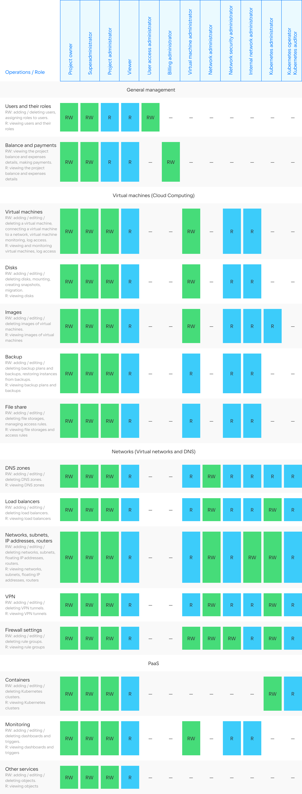

When a user is invited to a [project](../projects), he or she is assigned with a role. The role defines the scope of [permissions](#roles-and-their-permissions--the-full-matrix) available to the user when working with the personal account and with the cloud services.

The same user can be a member of several projects and have different roles in each of them. The same user can be assigned with several roles in one project; in this case, the permissions of all assigned roles are summarized.

You can [view](../../instructions/project-settings/access-manage) the list of project members and their roles on the **Manage access** page of the personal account.

## General project management roles

### Project owner

A user with the widest set of permissions.

A Project owner is a user who created the project or for whom it was created automatically by the platform during the account registration.

There can be only one Project owner in a project. This role cannot be assigned to an existing user or to a member that is being invited.

### Superadministrator

A user with the same permissions as the Project owner, including linking a card and making payments.

Superadministrator is the only role, besides the Project owner, who can [activate services](../../instructions/activation) in the project.

### Project administrator

A user who can create and edit objects in all services.

A Project administrator cannot:

- activate services;
- make payments (can only view the project balance);
- invite members to the project.

### User access administrator

A role intended for [working with project members](../../instructions/project-settings/access-manage) on the access management page.

A User access administrator can invite, delete project members, and change the roles assigned to them.

This role has no access to services and to project balance information.

### Billing administrator

A role intended for project balance management.

A billing administrator can:

- [link](../../../../additionals/billing/operations/add-card) a card to the project, if not linked yet;
- make a [payment](../../../../additionals/billing/operations/payment) or configure balance auto-completion.

This role has no access to services and to the list of project members.

### Viewer

A user who has read access to all project information, including the members list, services, project balance, and expenses details.

A viewer cannot create any objects or edit any settings, except the settings of their account.

## Specialized roles

Each of the roles below is intended for working with one of the platform services only. There roles have permissions:

- in their target service;
- in adjacent services, to an extent that is necessary for working with their target service.

All these roles have no access to the project members list and to project balance information.

For detailed information about the permissions of these roles, see section [Roles and their permissions: the full matrix](#roles-and-their-permissions--the-full-matrix).

All operations available to specialized roles are also available to Project owner, Superadministrator, and Project administrator.

### Virtual machine administrator

A user with this role can perform basic operations in the Cloud computing service.

However, this role has only read permissions for:

- backup plans;
- file storages.

This user can also create and edit rule groups (firewalls) in the Virtual networks service.

### Network administrator

A user with this role can perform a full set of operations in the Virtual networks and DNS services.

### Network security administrator

A user with this role has read access to the Virtual networks and DNS services.

He can create and edit only rule groups (firewalls).

### Internal network administrator

A user with this role:

- has read access to the Virtual networks and DNS services;
- can create and edit virtual networks and subnets, routers;
- can add floating IP addresses to the project.

### Kubernetes administrator, operator, and auditor

For detailed information about the permissions of these roles, see section [Roles for the Containers service and their permissions](#roles-for-the-containers-service-and-their-permissions).

## Roles and their permissions: the full matrix

Permissions are the privileges for viewing (**R** in the table below) or editing (**RW**) of certain objects. An editing permission includes the privilege of creating and deleting an object, and also includes the permission for viewing. A dash (**—**) indicates no access to a service or functionality.

## Roles for the Containers service and their permissions

The following user roles are intended for working with the [Сontainers service](/en/base/k8s):

- Kubernetes administrator,
- Kubernetes operator,
- Kubernetes auditor.

The operations available to Kubernetes administrator are also available to Project owner, Superadministrator, and Project administrator.

For other roles these operations are unavailable.

For Kubernetes clusters of version 1.23 and later, the role of a Kubernetes administrator, operator, or auditor also defines the internal [Kubernetes role](https://kubernetes.io/docs/reference/access-authn-authz/rbac/#user-facing-roles) (`admin`, `edit`, or `view`) assigned to the user.

<info>

Some of the actions below are available only in the certain state of a cluster. For example, installing or deleting an addon is possible only when a cluster is running.

</info>

<!-- prettier-ignore -->
| Operation/Role |  Kubernetes administrator | Kubernetes operator | Kubernetes auditor |
| --------------| --------------------------- | ---------------------- | --------------------- |
| Create a cluster                                            | &#10003;  | —  | —                |
| Delete a cluster                                            | &#10003;  | —  | —                |
| Start a cluster                                             | &#10003;  | &#10003;  | —                |
| Stop a cluster                                              | &#10003;  | &#10003;  | —                |
| Show information about a cluster and node groups         | &#10003;  | &#10003;  | &#10003;                |
| Get kubeconfig                                            | &#10003;  | &#10003;  | &#10003;                |
| Get the secret to access the Kubernetes Dashboard      | &#10003;  | &#10003;  | &#10003;                |
| Update version                                            | &#10003;  | &#10003;  | —                |
| Change the virtual machine type                               | &#10003;  | &#10003;  | —                |
| Change the size of the Prometheus disk                    | &#10003;  | &#10003;  | —                |
| Add a node group                                            | &#10003;  | &#10003;  | —                |
| Delete a node group                                         | &#10003;  | &#10003;  | —                |
| Change scaling settings                                   | &#10003;  | &#10003;  | —     |
| Change Labels and Taints                                  | &#10003;  | &#10003;  | —     |
| Install / delete an addon | &#10003; | &#10003; | — |
<!-- prettier-ignore -->
