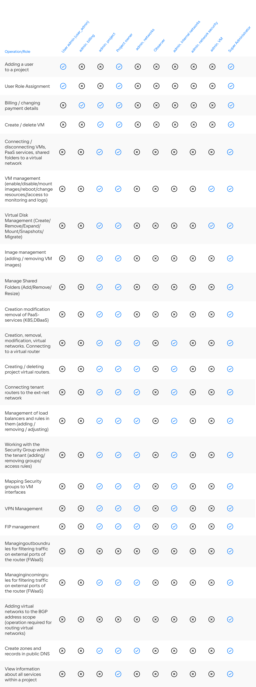

## Roles

In the personal account of VK Cloud, you can add additional project participants who will have access to working with cloud services. When adding, the role of the participant is indicated.

## Role matrix

The VK Cloud platform supports the differentiation of access rights to project resources based on the role model. Following is the list of roles and their respective permission.

List of roles and permissions:

<!-- prettier-ignore
| Operation/Role | User admin (user_admin) | admin. billing | admin. project | Project owner | admin. networks | Observer | admin. internal networks | admin. network security | admin. VM | Super Administrator |
|--|-----------|-----------------|----------|------------|-------------|-------------| ------------------------|---------------------------|-----------|--------------------|
| Adding a user to a project | x | - | - | x | - | - | - | - | - | X |
| User Role Assignment | x | - | - | X | - | - | - | - | - | X |
| Billing / changing payment details | - | X | X | X | - | - | - | - | - | X |
| Create / delete VM | - | - | X | X | - | - | - | - | - | X |
| Connecting / disconnecting VMs, PaaS services, shared folders to a virtual network | - | - | X | X | - | - | - | - | - | X |
| VM management (enable/disable/mount images/reboot/change resources/access to monitoring and logs) | - | - | X | X | - | - | - | - | X | X |
| Virtual Disk Management (Create/Remove/Expand/Mount/Snapshots/Migrate) | - | - | X | X | - | - | - | - | X | X |
| Image management (adding / removing VM images) | - | - | X | X | - | - | - | - | - | X |
| Manage Shared Folders (Add/Remove/Resize) | - | - | X | X | - | - | - | - | - | X |
| Manage access rules for shared folders (add/delete/modify) | - | - | X | X | - | - | - | - | - | X |
| Creation modification removal of PaaS-services (K8S,DBaaS) | - | - | X | X | - | - | - | - | - | X |
| Creation, removal, modification, virtual networks. Connecting to a virtual router | - | - | X| X | X | - | X | - | - | X |
| Creating / deleting project virtual routers. | - | - | X | X | X | - | X | - | - | X |
| Connecting tenant routers to the ext-net network | - | - | X | X | X | - | X | - | - | X |
| Management of load balancers and rules in them (adding / removing / adjusting) | - | - | X | X | X | - | X | - | - | X |
| Working with the Security Group within the tenant (adding/removing groups/access rules) | - | - | X | X | X | - | - | X | - | X |
| Mapping Security groups to VM interfaces | - | - | X | X | X | - | - | X | - | X |
| VPN Management | - | - | X | X | X | - | - | - | - | X |
| FIP management | - | - | X | X | X | - | - | - | - | X |
| Managingoutboundrules for filtering traffic on external ports of the router (FWaaS) | - | - | - | - | - | - | - | - | - | X |
| Managingincomingrules for filtering traffic on external ports of the router (FWaaS) | - | - | X | X | X | - | - | - | - | X |
| Adding virtual networks to the BGP address scope (operation required for routing virtual networks) | - | - | - | - | - | - | - | - | - | X |
| Create zones and records in public DNS | - | - | x | x | x | - | - | - | - | X |
| View information about all services within a project | - | - | - | X |-| X | - | - | - | X |
-->

## Role matrix for container service

In addition to the standard roles, the container service has its own special roles.

The personal account roles assigned to users affect:

- Rights in Kubernetes clusters.

  <info>

  This is true for Kubernetes clusters of version 1.23 and above. Clusters of older versions can be upgraded for the same capabilities.

  </info>

- The availability of cluster operations in the personal account listed in the table below.

<!-- prettier-ignore -->
| Operation/Role | Project owner Project administrator Superadministrator | Kubernetes Administrator | Kubernetes operator | Kubernetes Auditor |
| --------------| --------------------------------------------------------------- | --------------------------- | ---------------------- | --------------------- |
| Create cluster                                            | X  | X  | -  | -                |
| Delete cluster                                            | X  | X  | -  | -                |
| Start cluster                                             | X  | X  | X  | -                |
| Stop cluster                                              | X  | X  | X  | -                |
| Show information about cluster and node groups         | X  | X  | X  | X                |
| Get kubeconfig                                            | X  | X  | X  | X                |
| Get the secret to access the Kubernetes Dashboard      | X  | X  | X  | X                |
| Update version                                            | X  | X  | X  | -                |
| Change virtual machine type                               | X  | X  | X  | -                |
| Change the size of the Prometheus disk                    | X  | X  | X  | -                |
| Add node group                                            | X  | X  | X  | -                |
| Delete node group                                         | X  | X  | X  | -                |
| Change scaling settings                                   | X  | X  | X  | Read only     |
| Change Labels and Taints                                  | X  | X  | X  | Read only     |
<!-- prettier-ignore -->

## Deleting a member

In your personal account in the "Users" and "Roles" tab, you can not only add, but also remove participants.

Select the desired member and click "Remove", then confirm your choice.

<warn>

Deleting the user under which the Kubernetes cluster was created will result in a health issue after the cluster is restarted. To restore the work of the added user, on behalf of which the cluster was created, restart the cluster.

</warn>
