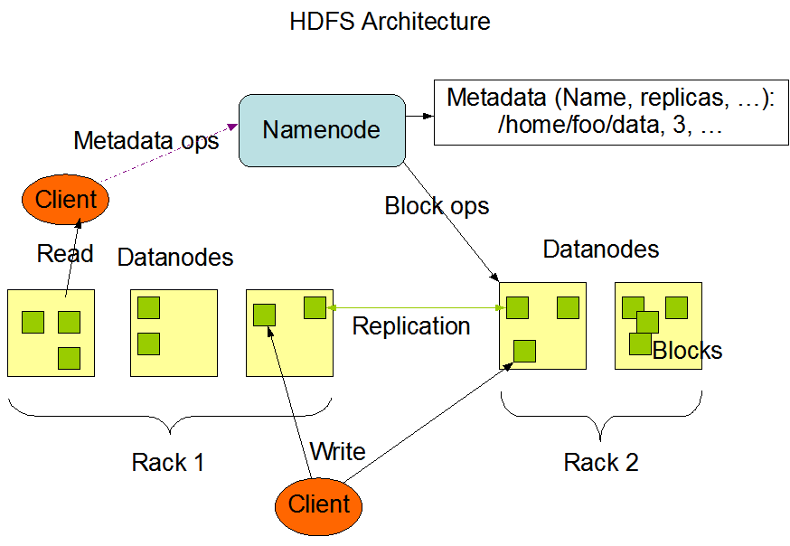
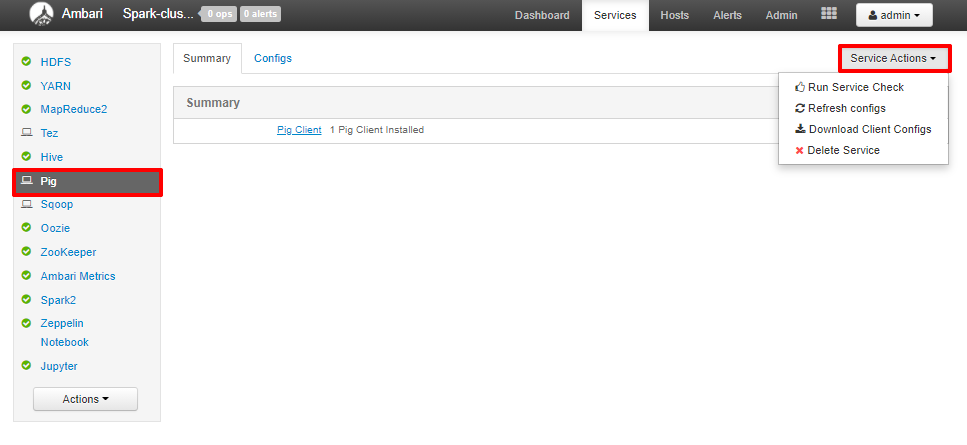
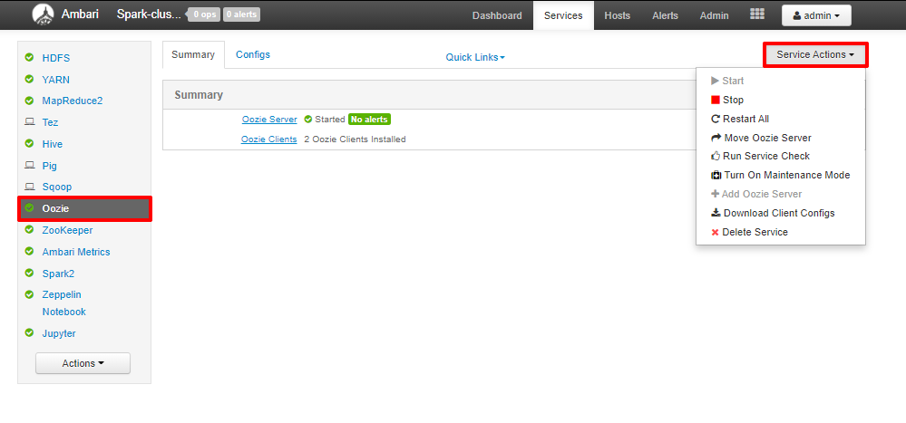

Description
-----------

**Apache Spark** is an open source Big Data framework for distributed batching and streaming of unstructured and semi-structured data, part of the Hadoop project ecosystem.

In contrast to the classic processor from the Hadoop core, which implements the two-tier MapReduce concept with storing intermediate data on drives, Spark works in the resistive computing paradigm, that is, it processes data in RAM, which significantly improves speed for some classes of tasks. In particular, the possibility of multiple access to user data loaded into memory makes the library attractive for machine learning algorithms.

The project provides programming interfaces for the languages Java, Scala, Python, R. Consists of a core and the following extensions:

*   Spark SQL - allows you to execute SQL queries on data
*   Spark Streaming is an add-on for processing streaming data
*   Spark MLib - A set of machine learning libraries
*   GraphX - designed for distributed graph processing

This framework can work both in the Hadoop cluster environment under YARN control, and without the Hadoop core component.

Supports multiple distributed storage systems - HDFS, OpenStack Swift, NoSQL, Cassandra, Amazon S3.

Spark consists of 4 functional modules working within one data cluster and simultaneously distributed horizontally across the entire cluster of computers running Hadoop.

The first SparkSQL module - enables the integration of SQL queries with all elements of the framework. By presenting information in the form of so-called resilient distributed data sets (RDDs), data is quickly and easily accessible through APIs in Python, Scala and Java. In addition, this technology allows you to query data and simultaneously run complex algorithms for their analysis.

The second element, Spark Streaming, is a component that allows the user to stream and stream Scala and Java applications. At the same time, the application will be able to simultaneously work with both data streams and perform batch processing without significant changes in the code. Also, the framework is able to automatically recover data after erroneous actions by the system.

The MLib machine learning library has an excellent integration ability - it can be connected to APIs in the same languages - Scala, Java, Python. Two more key points are the speed of testing and training (the speed is more than 100 times faster than MapReduce) and ease of deployment - the library works on existing computers of the Hadoop cluster with pre-existing data.

The final component is the GraphX API for graphing and graph-parallel computing. One of the important characteristics of the module is flexibility, that is, the ability to work seamlessly with both graphs and data collections.

Overall, Spark has:

*   high speed of work at all levels of the framework - from SQL queries to calculations on graphs and machine learning;
*   multifunctionality;
*   full integration with the Hadoop ecosystem, since Spark is a complete modification of MapReduce. Accordingly, users do not risk features such as unlimited horizontal scalability and the ability to recover even from severe system errors;

Assembly components
-------------------

**HDFS**

This distributed file system is designed to run on standard hardware. HDFS is highly resilient and is designed to be deployed on low-cost hardware. HDFS provides high-performance data access and is suitable for data-intensive applications.

The main architectural goal of HDFS is to detect failures and quickly and automatically recover from them.

Applications running on HDFS need streaming access to their datasets. HDFS is more for batch processing than for interactive use. The emphasis is on high bandwidth data access.

HDFS has a master / slave architecture. An HDFS cluster consists of a single NameNode, the master server that manages the file system namespace and regulates client file access. In addition, there are several DataNodes that manage the storage connected to the nodes. HDFS provides a file system namespace and allows you to store user data in files. Internally, the file is split into one or more blocks, and these blocks are stored in a set of nodes. The NameNode performs file system namespace operations such as opening, closing, renaming files and directories. DataNodes are responsible for serving read and write requests from file system clients. DataNodes also perform block creation, deletion, and replication on the NameNode command.

In the Ambari interface, to manage the HDFS component, open the appropriate tab and open the drop-down menu "Service Actions":

**YARN**

The fundamental idea behind YARN is to separate resource management and job scheduling / monitoring functions into separate daemons. The idea is to have a global ResourseManager (RM) and ApplicationMaster (AM) for each application.

ResourseManager and NodeManager form the data computation structure. ResouresManager has the highest status and allocates resources among all applications in the system. NodeManager is an infrastructure agent for each machine that is responsible for containers, monitors their resource use (processor, memory, disk, network) and reports this to RM.

RM has two main components: Scheduler and ApplicationManager.

The scheduler is responsible for allocating resources among the various running applications, subject to known capacity and queue limits. The scheduler does not monitor or track. The scheduler performs its scheduling function based on the application's resource requirements. Has a pluggable policy that is responsible for dividing cluster resources between different queues.

The ApplicationManager is responsible for accepting submitted jobs, negotiating the container to run a specific ApplicationMaster, and providing a service to restart the ApplicationManager container in case of failure. The ApplicationMaster for each application is responsible for coordinating and scheduling the respective resource containers, tracking their status, and monitoring execution.

To control the YARN component in the Ambari interface, open the appropriate tab and open the drop-down menu "Service Actions":

**MapReduce2**

MapReduce is a software framework for writing applications that process large (multi-terabyte) amounts of data in parallel on large clusters in a reliable and fault-tolerant manner.

MapReduce's job is to split the input dataset into independent blocks that are processed in parallel. The framework sorts the map output, which is then fed into lightweight tasks. As a rule, the input and output of tasks is stored in the file system. The framework takes care of the scheduling of tasks, monitors them and re-executes the outstanding ones.

Typically, compute and storage nodes are the same, that is, the MapReduce infrastructure and HDFS run on the same set of nodes. This configuration allows the platform to efficiently schedule tasks on nodes where data is already present, resulting in very high aggregate cluster throughput.

To control the MapReduce2 component in the Ambari interface, open the appropriate tab and open the "Service Actions" drop-down menu:

**Hive**

Apache Hive is a SQL data access interface for the Hadoop platform. Hive allows you to execute queries, aggregate and analyze data using SQL syntax. For data stored on the HDFS file system, a read access scheme is used that allows you to treat the data as with an ordinary table or database. At the same time, HiveQL queries are in Java command code executed by MapReduce.

Hive queries are written in the HiveQL query language, which is based on the SQL language but does not fully support the SQL-92 standard. At the same time, this language allows programmers to use their own queries when it is inconvenient or inefficient to use logic in HiveQL. HiveQL can be extended with custom scalar functions (UDFs), aggregations (UDAF codes), and table functions (UDTFs).

To control the Hive component in the Ambari interface, open the appropriate tab and open the drop-down menu "Service Actions":

**Pig**

Apache Pig is an abstraction over MapReduce. It is a tool / platform that is used to analyze large datasets, representing them as data streams. Pig is commonly used with Hadoop.

For writing data analysis programs, Pig provides a high-level language known as Pig Latin (a SQL-like language). The language provides various operators with which programmers can develop their own functions for reading, writing, and processing data.

Apache Pig takes a multi-request approach, thus reducing the length of the codes. Ultimately Apache Pig cuts development time by almost 16 times.

Apache Pig provides many built-in operators to support data operations like joins, filters, ordering, and so on. In addition, it also provides nested data types like tuples, bags, and maps that MapReduce lacks.

In the Ambari interface, to control the Pig component, open the appropriate tab and open the drop-down menu "Service Actions":

**Sqoop**

Apache Sqoop is a tool for transferring data between Hadoop and relational databases or mainframes. You can use Sqoop to import data from a relational database management system (RDBMS) such as MySQL or Oracle or mainframes to Hadoop, transform the data to Hadoop MapReduce, and then export the data back to the RDBMS.

Sqoop automates much of this process by relying on a database to describe the schema of the data that will be imported. Sqoop uses MapReduce to import and export data for concurrency and fault tolerance.

Sqoop supports incremental loading of a single table or freeform SQL query, as well as saved jobs that can be run multiple times to import updates made to the database since the last import. Import can also be used to populate tables in Apache Hive or HBase. Export can be used to put data from Hadoop into a relational database.

In the Ambari interface, to control the Sqoop component, open the appropriate tab and open the drop-down menu "Service Actions":

**Oozie**

Apache Oozie is an open source project based on Java ™ technology that makes it easy to create workflows and coordinate tasks. Oozie provides the fundamental possibility of combining several sequentially executed tasks into one logical unit of work. One of the benefits of the Oozie framework is that it is fully integrated with the Apache Hadoop stack and supports Hadoop jobs for Apache MapReduce, Pig, Hive, and Sqoop. It can also be used for system-specific job scheduling, such as Java programs. Oozie enables Hadoop administrators to create sophisticated data transformations that can combine the processing of a variety of individual tasks and even workflows. This capability improves the controllability of complex tasks and makes it easier to repeat these tasks at predetermined intervals.

To control the Oozie component in the Ambari interface, open the appropriate tab and open the drop-down menu "Service Actions":

**ZooKeeper**

Apache Zookeeper is an open source project of the Apache Software Foundation, a coordinator service that provides distributed synchronization of small data (configuration information, namespace) for a group of applications. Zookeeper is a distributed key-value store that guarantees reliable storage of information through synchronous replication between nodes, version control, a queuing mechanism and locks. Due to the use of RAM and scalability, it has high speed.

Architecturally, Zookeeper is organized according to client-server technology, when client applications access one of the nodes combined into an ensemble. Among the ensemble of servers, the main node stands out - Leader, which performs all recording operations and starts automatic recovery in case of failure of any of the connected servers. The rest of the nodes - subscribers or followers, replicate data from the Leader and are used by client applications for reading.

ZooKeeper simulates a virtual tree-like file system of interconnected nodes, which represent a combined concept of file and directory. Each node of this hierarchy can simultaneously store data and have subordinate child nodes.

To control the Zookeeper component in the Ambari interface, open the appropriate tab and open the "Service Actions" drop-down menu:

**AmbariMetrics**

Ambari Metrics System (AMS) - Collects, aggregates and maintains system metrics in clusters managed by Ambari and has 4 components:

*   metrics monitors on each host in the cluster collect system-level metrics and publish them to the Metrics Collector
*   Hadoop Sinks connects to Hadoop components to publish metrics to Metrics Collector
*   Metrics Collector is a daemon that runs on a specific host in a cluster and receives data from registered users, monitors or listeners
*   Grafana is a daemon that runs on a specific host in the cluster and serves up pre-built dashboards to visualize metrics.

In the Ambari interface, to control the Ambari Metrics component, open the appropriate tab and open the "Actions" drop-down menu:

**Zeppelin Notebook**

Apache Zeppelin is an open source, interactive web notebook that supports virtually every stage of working with data in Data Science, from extraction to visualization, including interactive analysis and document sharing. It is integrated with Apache Spark, Hadoop, many relational and NoSQL DBMSs (Cassandra, HBase, Hive, PostgreSQL, Elasticsearch, Google Big Query, Mysql, MariaDB, Redshift), and also supports various programming languages popular in the Big Data field: Python , PySpark, R, Scala, SQL. Such multifunctionality is provided by interpreters - plugins to support a programming language, database or framework.

In terms of working with big data, the built-in integration with Apache Spark deserves a special mention, which gives general contexts (SparkContext and SQLContext), loading jar dependencies from the local file system or maven repository during task execution, as well as the ability to cancel a job and display its progress. Zeppelin also supports Apache Spark REST-API - Livy. Thanks to the Python interpreter, Apache Zeppelin provides all the capabilities of this language focused on Data Science, for example, specialized libraries (Matplotlib, Conda, Pandas, etc.) for big data analytics and visualization. This allows you to automatically build pie, bar and other visual charts to visualize statistics. Zeppelin also allows you to create interactive dashboards with data entry forms that look like web pages to share their URLs for collaboration. For multi-user mode, Zeppelin supports LDAP authentication with access settings.

To control the Zeppelin Notebook component in the Ambari interface, open the appropriate tab and open the drop-down menu "Service Actions":

