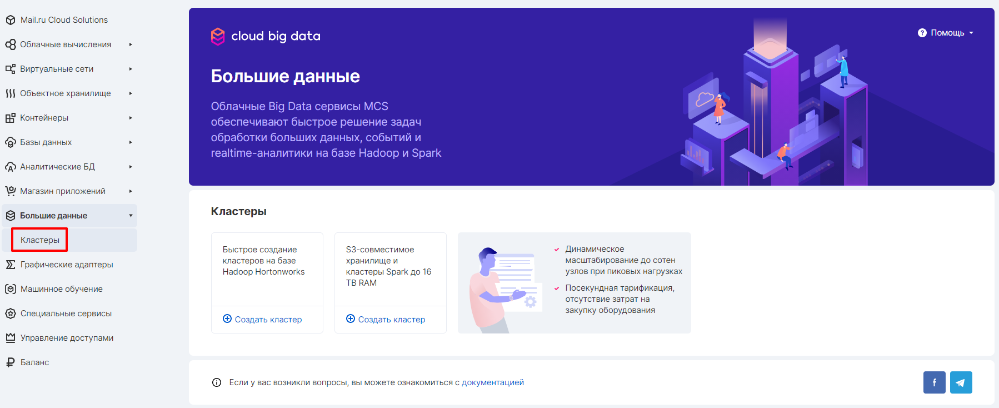
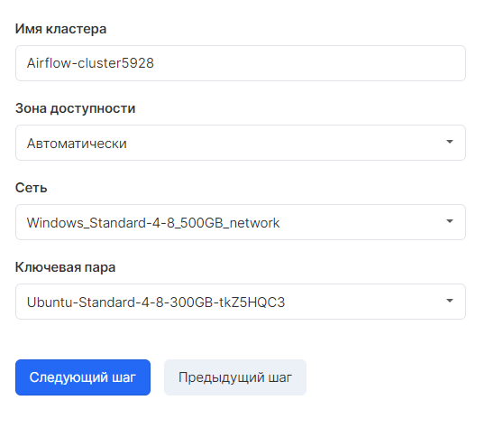

## Cluster creation

The Big Data cluster is created in the web interface of the VK CS control panel.

In the personal account of the VK CS control panel, in the "Big Data" tab, there is a menu for creating a Big Data cluster.

Further, by clicking the "Add cluster" button, a menu will open with the choice of the required configuration and version:

_Airflow_ is a set of libraries for running and monitoring tasks written in Python. Already configured to run tasks on worker nodes, you only need to independently decompose the task code into nodes. Can be installed as a component on Hadoop and Spark clusters.

_DataFlow-HDF-v34 -_ Template based on Hortonworks Data Flow. This cluster manages data streams and performs streaming analytics. After initial installation, control is also carried out via the Ambari console. Component versions:

- Apache NiFi 1.9.0
- NiFi Registry 0.3.0
- Apache MiNiFi Java Agent 0.6.0
- Apache MiNiFi C ++ 0.6.0
- Hortonworks Schema Registry 0.7.0
- Hortonworks Streaming Analytics Manager 0.6.0

_Spark is a_ suite for parallel in-memory big data processing. The template is focused on fast data processing in near real time mode.

_Spark-HDP-v31_ is an extended set of components. Additionally available Spark, Livy2, HBase, Oozie, Sqoop, Jupyter.

At the next stage of creating a cluster, enter a description of the cluster:

_Cluster_ name - the name can contain only lowercase Latin letters, numbers or signs "." and "-". Cyrillic and other symbols cannot be used.

_Availability Zone_ - select the availability zone (we recommend DP1 or MS1)

_Key pair_ - you can select a key pair from the drop-down list or create a new one in the "Computational resources" - "Key pairs" section.

_Network_ - Select a network to create a cluster.

**Attention**

Clustering on ext-net is currently not possible. It is worth using a private network or floating-IP. When using a private network, make sure the network contains at least one router.

Then also specify the parameters of the nodes - head and worker:

After filling in the fields and pressing the "Next" button, an information window appears about the time of cluster creation and access to the Ambari interface.

Initializing the cluster and installing the Hadoop components takes 25-30 minutes.

Approximately 5-8 minutes after the start of the launch, you will be able to access the Ambari interface and track the progress of the installation process.

## Cluster connection

Hadoop and Spark clusters can be accessed via SSH to launch tasks, install additional components.
