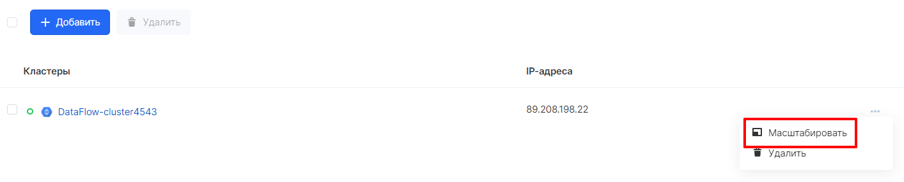
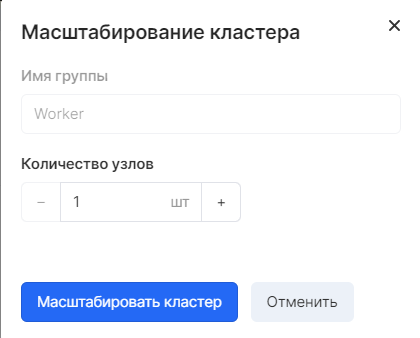
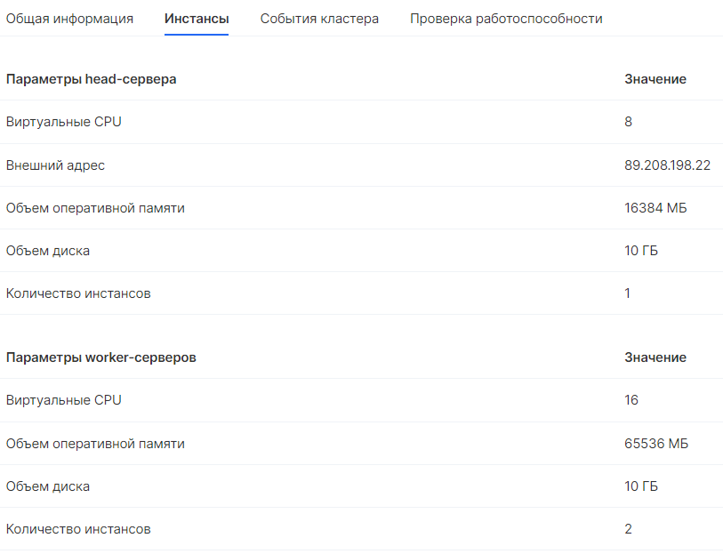

## Cluster scaling

Cluster scaling is done in the VK CS control panel.

In the section "Big Data" - "Clusters" in the menu bar of the selected cluster, select the "Scale" option:

Further, in the window that opens, it becomes possible to increase the number of Worker groups:

As a result, in the section of Big Data clusters, in the "Instances" tab, the number of worker servers will be changed:

