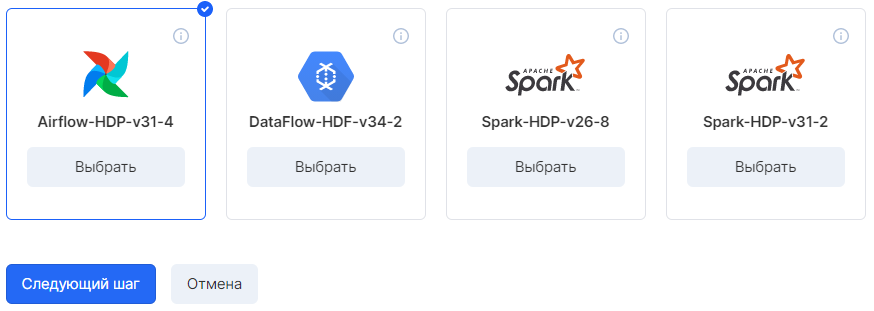
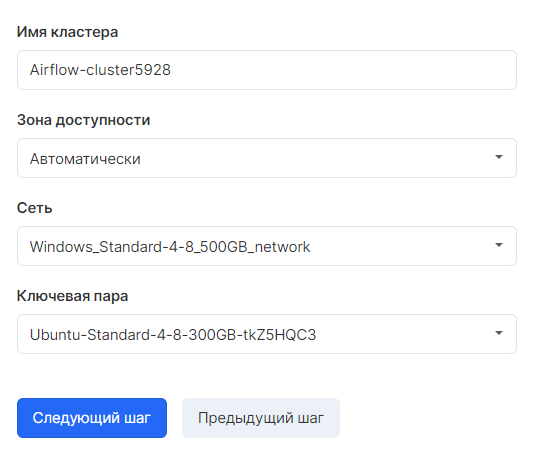
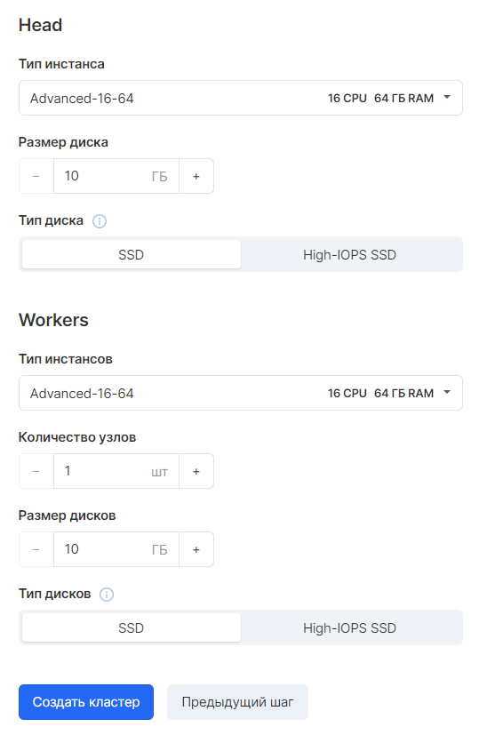
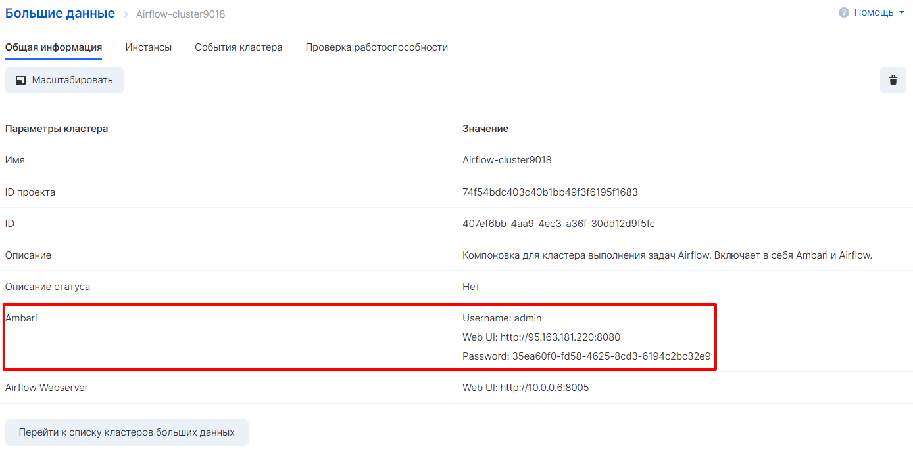
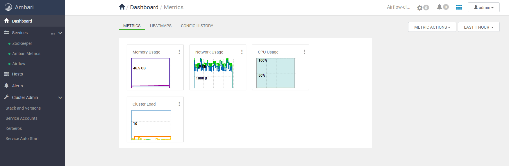

Apache Airflow is an open source workflow management platform.

To create an Airflow cluster, select the appropriate cluster in the "Big Data" section:

Next, select the cluster parameters:

and servers - head and worker:

After creation in the cluster, in the "General information" tab, a link, login and password to the Ambari interface for managing the cluster will be published:

After logging in to the Ambari interface, the cluster and components management will be available:

