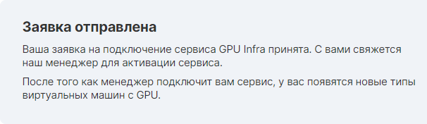

Before using it, you must leave a request. You can do this in your personal account, in the "Graphics adapters" tab by clicking the "enable services" button.

Upon successful application submission, the following message will appear:

Further, after considering the application and conducting the necessary consultations, the manager will connect the service.