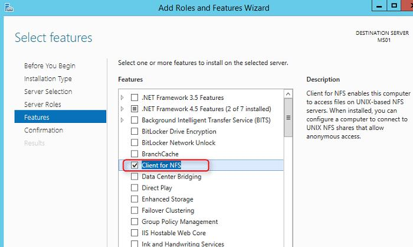
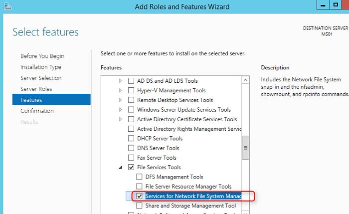
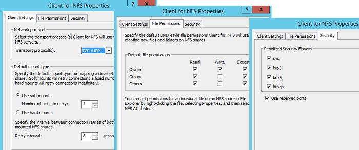
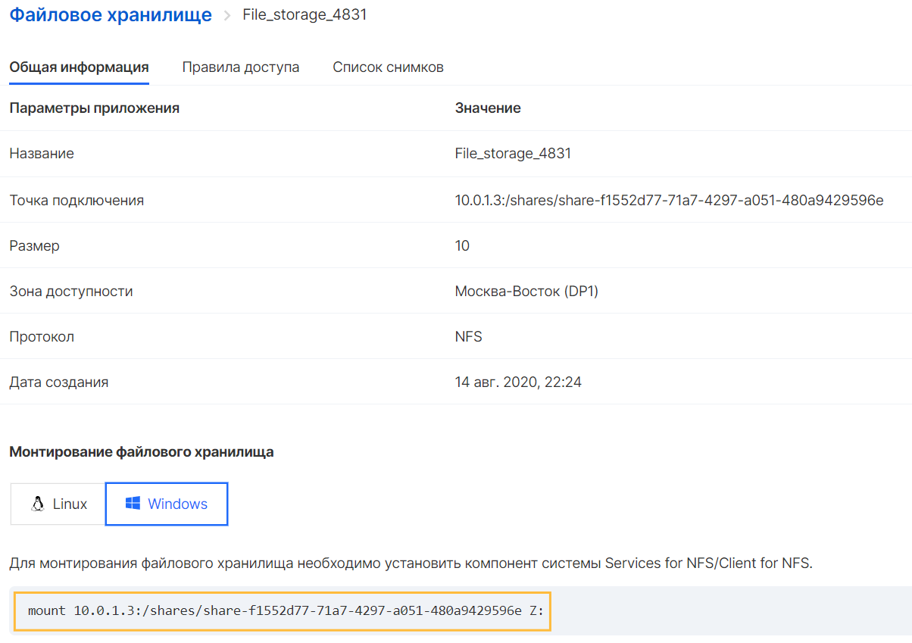
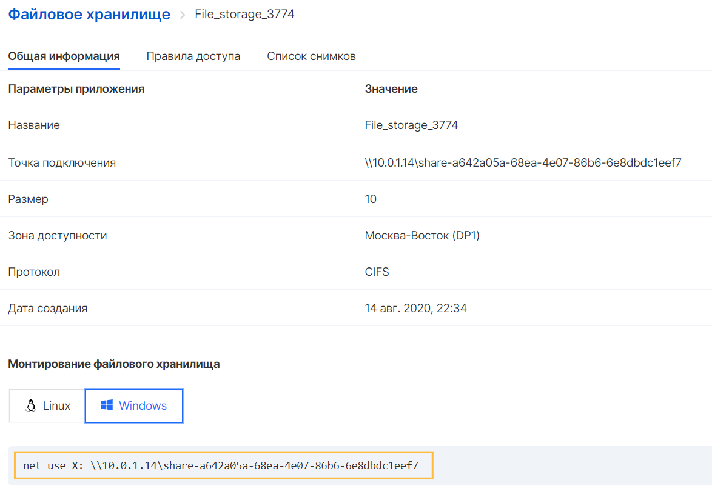
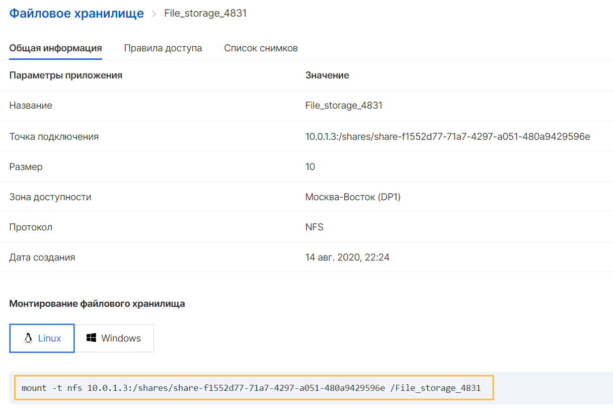
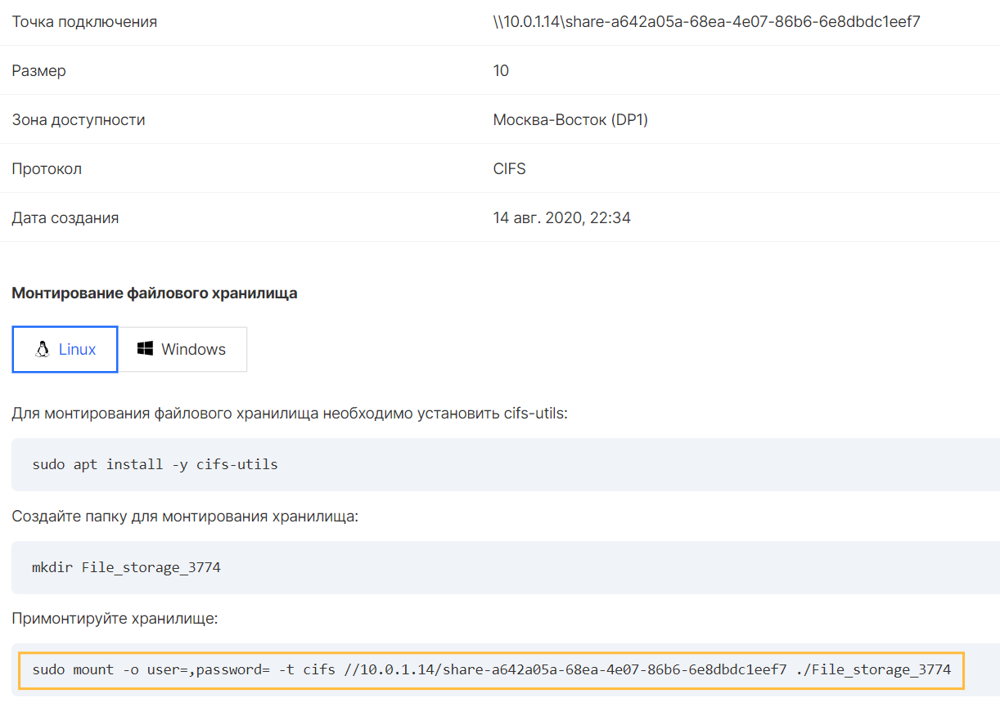

The way to connect File Storage to an instance depends on the operating system and the storage access protocol selected when it was created:

- NFS is a "Network File System" that allows you to transparently exchange files between servers. It is a client / server application that allows you to view files on a virtual server and update them as if they were locally. Using NFS, it is possible to mount all or part of the file system.
- CIFS is the "Common Internet File System" used by operating systems to exchange files. CIFS uses a client-server programming model. The client program requests the server program to access the file or send a message to the program running on the server. The server performs the requested action and returns a response. CIFS is a public or open variant of the Server Message Block (SMB) protocol and uses the TCP / IP protocol. NFS and CIFS are the primary file systems used in NAS.

## Windows

**NFS**

NFS storage in Windows is mounted using a client that is installed additionally.

The NFS client can be installed via the GUI or using Powershell. To install in graphical mode, open the Server Manager console and select the (Features) component called Client for NFS.

 By default, the graphical NFS Management Console is not installed with this component. To fix this, you need to set the Services for Network File System Management Tools option under Remote Server Administration Tools -> Role Administration Tools -> File Services Tools.



All of the above system components can be installed with just one Powershell command:

```
 Install-WindowsFeature NFS-Client, RSAT-NFS-Admin
```

After the installation is complete, launch the Services for Network File System Managemen console and open the Client for NFS properties window.

In the NFS client settings, you can set:

- Transport protocols used - default TCP + UDP
- Mount type for NFS storage: Hard or Soft
- The File Permissions tab specifies the default rights for the created folders and files on the NFS share
- The Security tab specifies the authentication protocols that can be used to authenticate to the NFS server



After configuration and under the administrator account, you can mount the NFS directory using the command described in the properties of the created NFS file storage:



**CIFS**

Since the CIFS protocol is already present in Windows by default, the connection can be made without installing additional components.

To connect, run the command specified in the properties of the created CIFS File Storage:



## Linux

**NFS**

Before starting to mount an NFS share, make sure that the nfs-common package is installed

```
 sudo apt-get install nfs-common
```

After checking or installing the package, it is enough to use the command specified in the properties of the created NFS storage:



**CIFS**

To mount a CIFS file storage, you need to install a set of utilities:

Ubuntu

```
 sudo apt-get install cifs-utils
```

CentOS

```
 yum install cifs-utils
```

After the packages are installed, you need to create a folder to mount the repository:

```
 mkdir <your_File_storage>
```

Then use the mount command available in the properties of the created CIFS repository:
